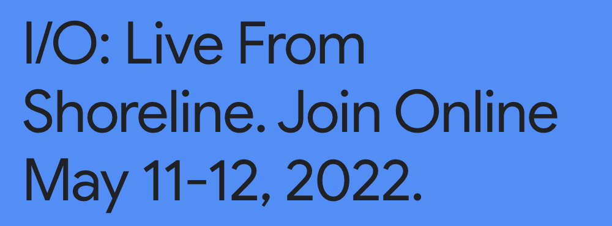
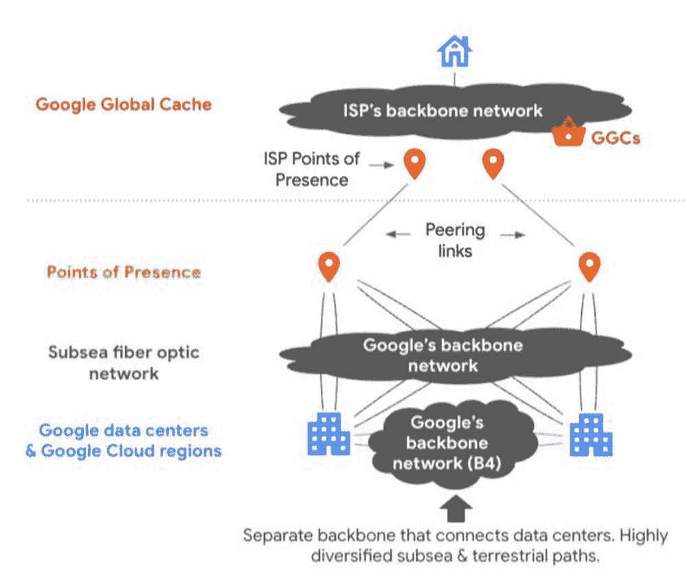
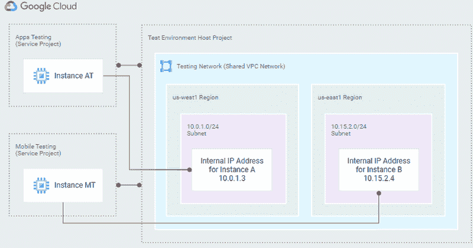
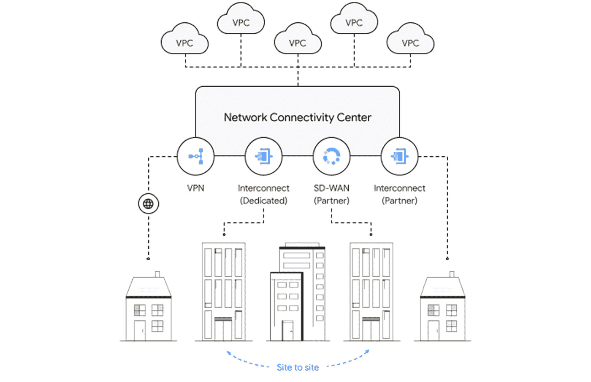
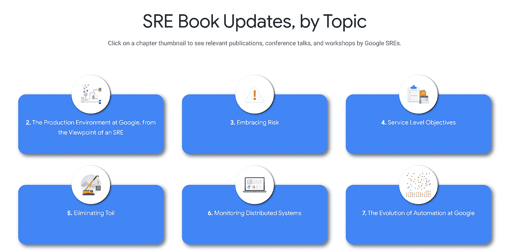
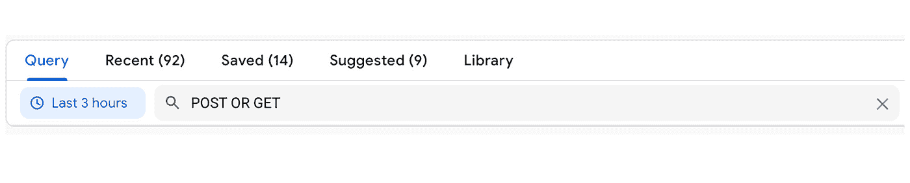
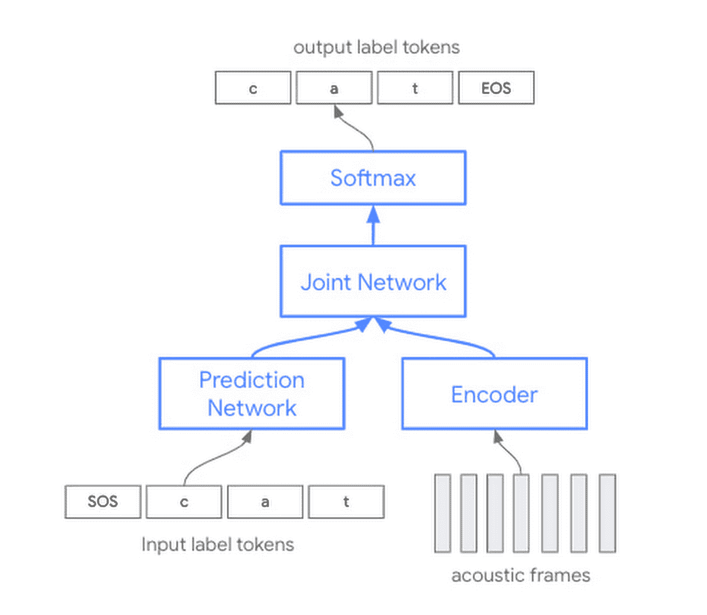
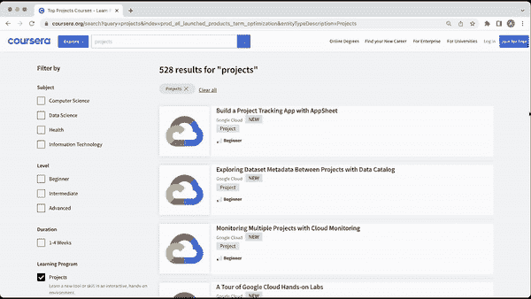
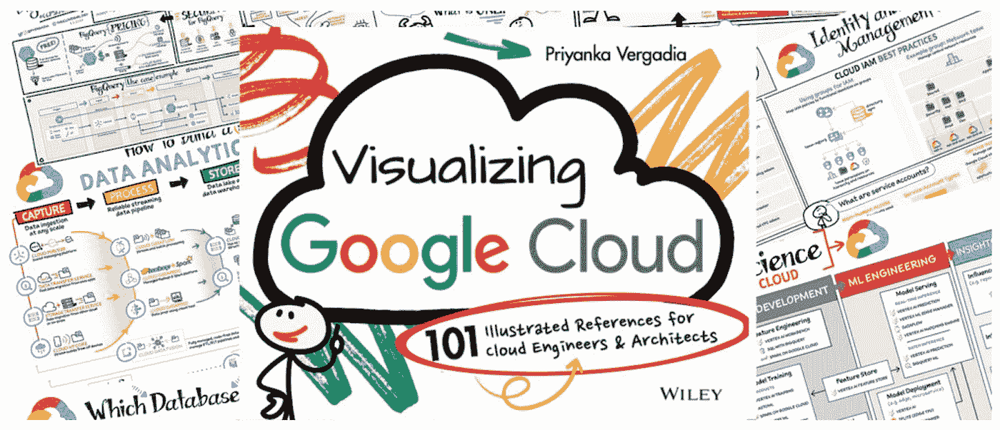

# 谷歌云平台技术金块—2022 年 4 月 16 日至 30 日版

> 原文：<https://medium.com/google-cloud/google-cloud-platform-technology-nuggets-april-16-30-2022-edition-4471bcd01386?source=collection_archive---------1----------------------->

欢迎参加 2022 年 4 月 16 日至 30 日的谷歌云技术金块。

# **会议**

[2022 年，我们的年度开发者大会又回来了。它计划于 2022 年 5 月 11 日至 12 日举行，采用数字格式。涵盖主题演讲、技术会议和研讨会的](https://io.google/2022/)[计划指南](https://io.google/2022/program/)已经发布，将在网络、移动、云等平台上发布。当活动开始时，I/O 在线冒险也将回来，所以今天就注册。一些不同技术的开发者实验室已经开放。

谷歌云也安排了一系列有趣的会议。查看[云轨](https://io.google/2022/program/?q=7e71258b-2ba6-4981-bcb9-6abfe678a99e)。

# **联网**

本周网络版块有几个帖子。

在线内容如何在毫秒内到达用户手中？公司和本地提供商的丰富生态系统使这种全球基础设施成为可能。阅读这篇[文章](https://cloud.google.com/blog/products/infrastructure/google-network-infrastructure-investments?utm_source=ext&utm_medium=partner&utm_campaign=CDR_rom_gcp_gcptechnuggets_feb-a-2022_021622&utm_content=-)，了解谷歌正在进行的投资，以使内容更贴近我们的用户、客户以及我们客户的最终用户，从而让他们享受更好的互联网体验。

下一篇文章与上一篇文章相关，代表了 Google Cloud 在帮助尽可能接近用户交付富媒体体验方面的一个重要里程碑。谷歌[宣布](https://cloud.google.com/blog/products/networking/introducing-media-cdn?utm_source=ext&utm_medium=partner&utm_campaign=CDR_rom_gcp_gcptechnuggets_feb-a-2022_021622&utm_content=-)媒体 CDN——一个现代化的、可扩展的平台，以无与伦比的规模和智能提供身临其境的体验。[媒体 CDN](http://cloud.google.com/media-cdn?utm_source=ext&utm_medium=partner&utm_campaign=CDR_rom_gcp_gcptechnuggets_feb-a-2022_021622&utm_content=-) 包括对 QUIC (HTTP/3)、TLS 1.3 和 BBR 的现成支持，为最后一英里交付进行了优化。例如，当 Chrome 团队推出对 QUIC 的广泛支持时，视频再缓冲时间减少了 9%以上，移动吞吐量增加了 7%以上。

正确设计网络是任何云实施的关键部分。这篇优秀的[文章](https://cloud.google.com/blog/topics/developers-practitioners/10-considerations-help-you-design-cloud-networks?utm_source=ext&utm_medium=partner&utm_campaign=CDR_rom_gcp_gcptechnuggets_feb-a-2022_021622&utm_content=-)列出了从一开始就设计更好的云网络架构的 10 个技巧。这些提示涵盖了从 VPN 与否、互连、IP 地址管理、DNS 等多个领域。这是任何在谷歌云中设计网络的人的关键读物。

最后一篇文章将帮助您了解客户的典型连接使用案例，帮助您为您的环境选择和设置最佳连接选项(站点到云、站点到站点、VPC 到 VPC)。

# **安全**

这是云信息安全官(思科)更新的一年。请查看[最新版](https://cloud.google.com/blog/products/identity-security/cloud-ciso-perspectives-april-2022?utm_source=ext&utm_medium=partner&utm_campaign=CDR_rom_gcp_gcptechnuggets_feb-a-2022_021622&utm_content=-)(4 月 22 日)的《CISO 透视》，在这里您可以找到来自我们云安全团队的最新更新、产品、服务和资源。

敬请关注即将于 2022 年 5 月 17 日至 18 日举行的[谷歌云安全峰会](https://cloudonair.withgoogle.com/events/summit-security-2022)。议程已经公布，将有 4 个方面的会谈:零信任、安全软件供应链(S3C)、勒索软件和新兴威胁以及云治理和主权。该活动在线举行，稍后将提供会议录像。

# **德沃普斯和 SRE**

自谷歌出版第一套 SRE 书籍以来已经有 6 年了，这些书籍在帮助每个人理解 SRE 方面发挥了重要作用，这是一种在您的组织中实施 DevOps 的规定方式。从那以后，在多个 SRE 主题中有很多更新，比如 SLOs、Toil 等等。现在有了一个[全新的页面](https://sre.google/resources/book-update/?utm_source=ext&utm_medium=partner&utm_campaign=CDR_rom_gcp_gcptechnuggets_feb-a-2022_021622&utm_content=-)来捕捉 SRE 书籍主题的更新。如果你喜欢 SRE，一定要收藏这个链接。

请记住，可以从以下网址下载 SRE 书籍:[https://sre.google/books/](https://sre.google/books/)

云日志，特别是日志资源管理器已经引入了一组可靠的功能，可以帮助用户找到他们正在寻找的日志？引入了多种功能，包括几个用户界面调整，以帮助实现这一目标。关键是一个简化的文本搜索，它可以帮助你在你的日志中搜索添加到文本搜索框中的字符串。

查看这篇详细的[博客文章](https://cloud.google.com/blog/products/devops-sre/querying-logs-just-got-easier-in-cloud-logging),它提供了一系列改进日志浏览器使用体验的变化。

我们在上一集的《科技掘金》中提到过这一点，但这里值得重复的是，有一个关注 SRE 的播客，恰如其分地命名为“[谷歌 SRE 产品播报](https://cloud.google.com/blog/products/devops-sre/discover-prodcast-the-site-reliability-engineering-podcast?utm_source=ext&utm_medium=partner&utm_campaign=CDR_rom_gcp_gcptechnuggets_feb-a-2022_021622&utm_content=-)”。这是一个采访式的播客，谷歌的网站可靠性工程师讨论关键的 SRE 概念，并分享他们的经验，建议和强烈的意见。

# **机器学习**

语音技术在当今的应用中继续扮演着越来越重要的角色，并有助于为整个用户体验提供更人性化的方法。体验中至关重要的是语音技术的质量和更高准确度的检测/转录能力，以及对所需语言/地区的支持。谷歌云推出[语音转文本(STT) API](https://cloud.google.com/speech-to-text?utm_source=ext&utm_medium=partner&utm_campaign=CDR_rom_gcp_gcptechnuggets_feb-a-2022_021622&utm_content=-) 已经 5 年了，目前每月处理 10 亿分钟的语音。

谷歌云现在[宣布](https://cloud.google.com/blog/products/ai-machine-learning/google-cloud-updates-speech-api-models-for-improved-accuracy?utm_source=ext&utm_medium=partner&utm_campaign=CDR_rom_gcp_gcptechnuggets_feb-a-2022_021622&utm_content=-)我们最新的 STT API 模型的可用性。这些模型可以帮助提高 STT 支持的 23 种语言和 61 种语言环境的准确性。新的模型架构是 8 年研究的一部分，它用卷积层增强了变压器模型，使其能够捕捉语音信号中的局部和全局信息。

STT API 也以一个新的标识符“最新”引入了这些模型，你应该查看一下[文档](https://cloud.google.com/speech-to-text/docs/languages?utm_source=ext&utm_medium=partner&utm_campaign=CDR_rom_gcp_gcptechnuggets_feb-a-2022_021622&utm_content=-)。

如果你想开始使用 STT API，看看这篇[的博客文章](https://cloud.google.com/blog/products/ai-machine-learning/top-google-cloud-speech-api-codelabs?utm_source=ext&utm_medium=partner&utm_campaign=CDR_rom_gcp_gcptechnuggets_feb-a-2022_021622&utm_content=-)，这篇文章重点介绍了顶级语音代码实验室供你试用:

# **培训和认证**

让你和你的团队熟练使用谷歌云的机会越来越多。以下是最新消息:Coursera 上现在有 500 个谷歌云自定进度实验室。从 2022 年 4 月 28 日至 5 月 29 日的一个月内，精选的最受欢迎的自定进度实验室(称为项目)将免费提供。

学习者可以选择他们喜欢的格式，要求免费获得一个月的顶级谷歌云项目、课程、专业或专业证书。查看[帖子](https://cloud.google.com/blog/topics/training-certifications/how-to-build-job-ready-cloud-skills?utm_source=ext&utm_medium=partner&utm_campaign=CDR_rom_gcp_gcptechnuggets_feb-a-2022_021622&utm_content=-)了解更多详情。

我们的入门级认证测试您在部署和保护应用程序和基础架构、维护企业解决方案以确保其符合性能指标以及监控云中多个项目的运营方面的知识。如果你想开始准备这个认证，请查看我们的指南[如何准备——以及如何获得——谷歌云工程师助理考试](https://cloud.google.com/blog/topics/training-certifications/preparing-for-the-associate-cloud-engineer-certification?utm_source=ext&utm_medium=partner&utm_campaign=CDR_rom_gcp_gcptechnuggets_feb-a-2022_021622&utm_content=-)。

# **让我们来了解一下谷歌云**

Priyanka Vergadia 通过[草图笔记](https://github.com/priyankavergadia/GCPSketchnote)帮助我们了解谷歌云，这在本节中已经多次强调。Priyanka 将它们合并成了一本书，你可以购买，所有的收入都将捐给 T2 的慈善事业，抗击营养不良和支持受教育的权利。阅读[更多](https://cloud.google.com/blog/topics/developers-practitioners/introducing-visualizing-google-cloud-101-illustrated-references-cloud-engineers-and-architects?utm_source=ext&utm_medium=partner&utm_campaign=CDR_rom_gcp_gcptechnuggets_feb-a-2022_021622&utm_content=-)。普里扬卡是许多人的灵感来源，你可以在这里阅读她的旅程。

**保持联系**

对这份时事通讯有任何问题、意见或其他反馈吗？请发送[反馈](https://forms.gle/UAsAS7YLxYSBTNBy9)。

想要关注新的谷歌云产品发布吗？我们有一个方便的页面，您可以将它加入书签→[Google Cloud 的新功能](https://bit.ly/3umz3cA?utm_source=ext&utm_medium=partner&utm_campaign=CDR_rom_gcp_gcptechnuggets_feb-a-2022_021622&utm_content=-)。