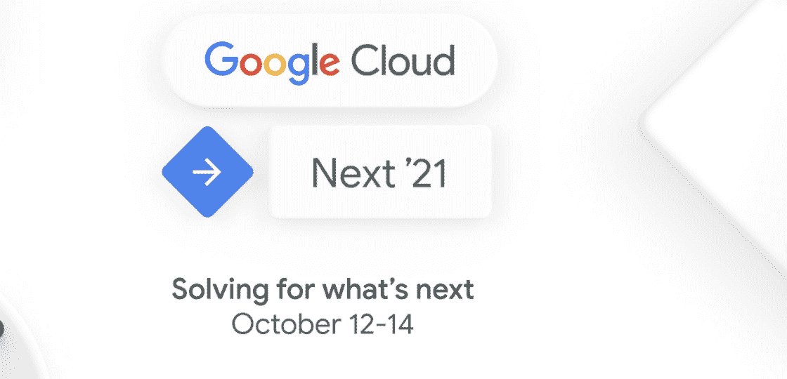
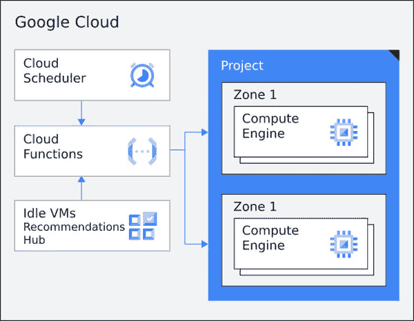
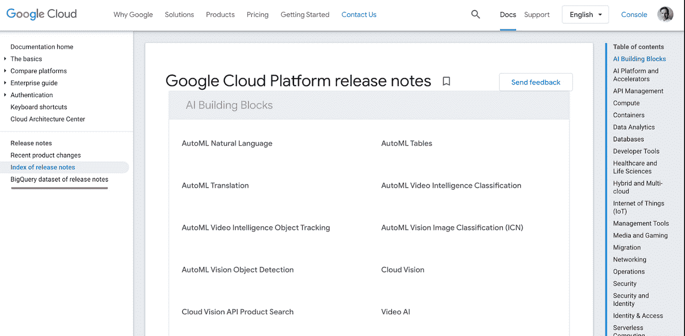
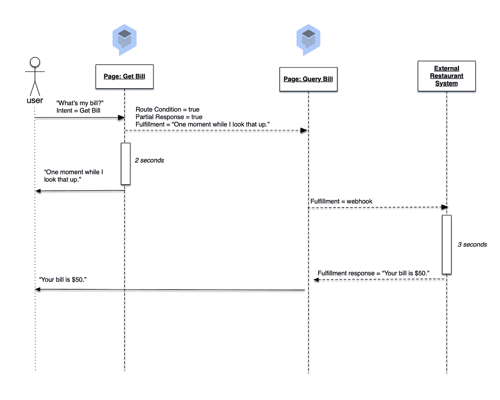
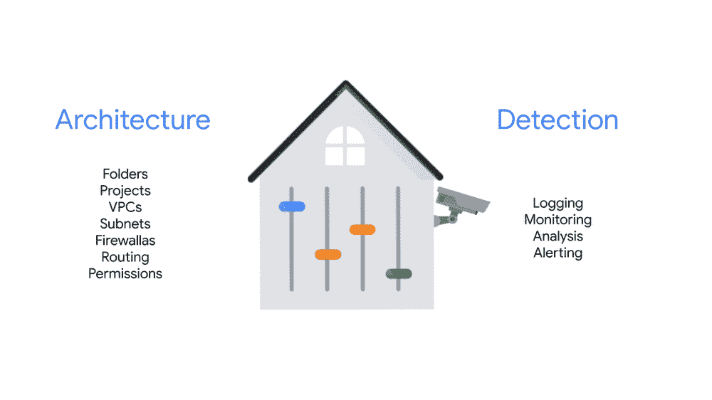
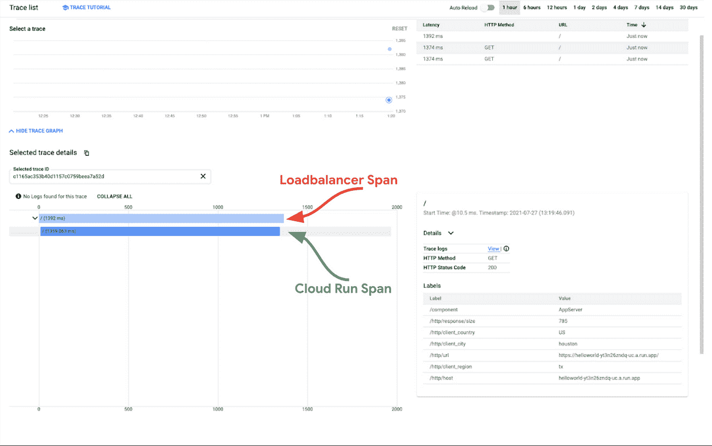
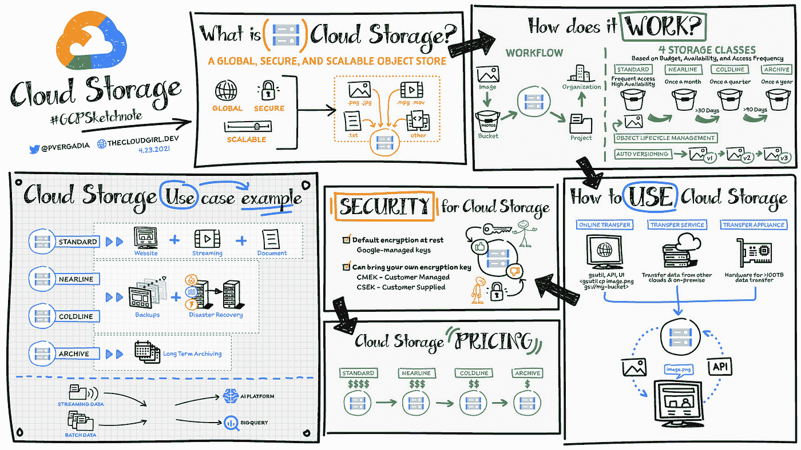
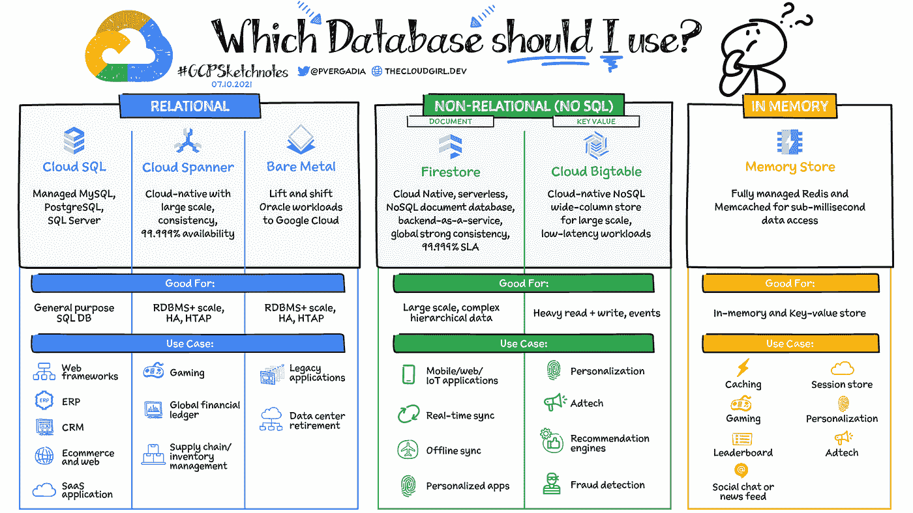

# 谷歌云平台—技术金块，2021 年 8 月 16 日至 31 日版

> 原文：<https://medium.com/google-cloud/google-cloud-platform-technology-nuggets-august-16-31-2021-edition-730ea8df7dfe?source=collection_archive---------1----------------------->

欢迎来到 2021 年 8 月 16 日至 31 日的谷歌云平台-技术掘金版。

友情提醒，Google Cloud Next 的[注册](https://cloud.withgoogle.com/next/register?utm_source=google&utm_medium=blog&utm_campaign=FY21-Q4-global-ES903-onlineevent-er-next-2021&utm_content=blog-next-21-registration&_ga=2.194198697.-545181806.1627628476)将于 10 月 12 日至 14 日开放。

# **基础设施**

对于任何使用云的人来说，我相信你已经要求查看当前成本并尝试优化它。我们最新的指南《通过自动化虚拟机管理实现[成本优化](https://cloud.google.com/architecture/cost-optimization-using-automated-vm-management)，向您介绍多种方法，从基于时间的调度到闲置建议，帮助您启动/停止虚拟机并控制成本。本文有趣的部分是，它将向您介绍多种其他托管服务，如云调度器、云功能等。

如果您正在寻找我们所有服务的成本优化，请查看我们的[面向开发人员和运营商的成本优化指南](https://cloud.google.com/architecture/cost-efficiency-on-google-cloud?hl=en)，该指南可在架构中心获得。它为我们的多种计算产品、存储服务、数据分析等提供了成本优化指南。

# **分析& AI/ML**

Google Datasets 是一个不断增加的数据库集，公众可以利用它来满足他们的分析需求。据最新统计，有超过 200 个公共数据集，包括谷歌趋势、气候数据等等。

一个有趣的发展是，谷歌云平台发行说明现在也可以作为数据集使用，您可以跨版本、安全公告和产品线进行查询。

查看这篇[博客文章](https://cloud.google.com/blog/products/data-analytics/get-the-latest-news-and-best-practices-for-google-cloud-datasets)，它强调了最近发布的一些数据集。

我们的对话式人工智能平台 Dialogflow CX 拥有一系列新功能。一些特别有趣的特性，也是一些客户所要求的，是对 Webhook 目标的私有网络访问和流部分响应的能力。部分响应特性解决了 5 秒钟后从 Webhook 获得超时的情况。它提供了一种优雅的方式来通知用户正在进行的履行过程。看看下面的序列图，它显示了如何在流程的 2 秒钟后显示一条消息“请稍等，我正在查找”,而不是等待 5 秒钟。

在安全性方面的一大胜利是，Dialogflow 现在与[服务目录专用网络访问](https://cloud.google.com/service-directory/docs/private-network-access-overview)集成，因此它可以连接到我们客户的 VPC 网络内部的 webhook 目标。

# **安全**

如果您已经在生产中部署了任何 Google Cloud 项目，您将会体验到从头开始建立一个强大的安全基础的挑战。这篇[博客文章](https://cloud.google.com/blog/topics/developers-practitioners/foundational-best-practices-securing-your-cloud-deployment)详细介绍了在进行 GCP 部署时需要考虑的各种安全控制。如果您要在生产环境中部署应用程序，这是一本必不可少的指南。这是一个详尽的指南，介绍如何设置组织层次结构、资源控制、日志记录、身份验证和授权、计费等。

# **云运营**

作为一名应用程序开发人员，当涉及到应用程序引擎、云运行、云功能等各种可用的托管服务时，您有太多的选择。应用程序性能的一个关键指标通常是延迟，当可能调用多个服务来满足客户请求时，这可能会变得很有挑战性。确定此指标的推荐方法是通过应用程序跟踪。对于上面提到的我们的无服务器产品，当您的请求通过分布式系统的每一层，包括负载平衡器、计算、数据库等时，我们会默认为您的请求建立跟踪。查看关于云跟踪的更多[信息，以及如何使用它来调试您的应用程序性能。](https://cloud.google.com/blog/products/operations/find-serverless-application-performance-issues-easier)

# **奖金**

为了保持突出 GCP 素描笔记的传统，这一版介绍了你需要了解的关于谷歌云存储的所有内容，谷歌云存储是我们存储图像、视频、文本文件和其他文件格式等数据的对象存储。GCS 具有高度的集成性，并且是将多个 GCP 服务连接在一起的核心，因此对这一点的良好理解是在整个 GCP 利用一系列服务的关键。

除了谷歌云存储，在 GCP 上了解更多存储选项怎么样？我们提供从 SQL、NoSQL 到专业数据库的多种服务，可以帮助您解决特定的使用案例。[看看我应该使用哪个数据库？](https://cloud.google.com/blog/topics/developers-practitioners/your-google-cloud-database-options-explained)”。

# 保持联系！

*有问题、意见或其他反馈。一定要把它送过来。*

*想关注新的谷歌云产品发布吗？我们有一个方便的页面，您可以将它加入书签→*[*Google Cloud*](https://bit.ly/3umz3cA)*的新功能。*