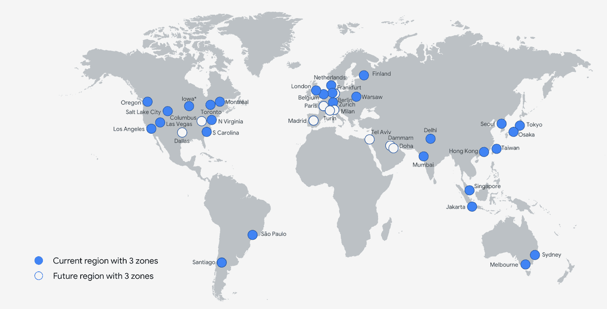
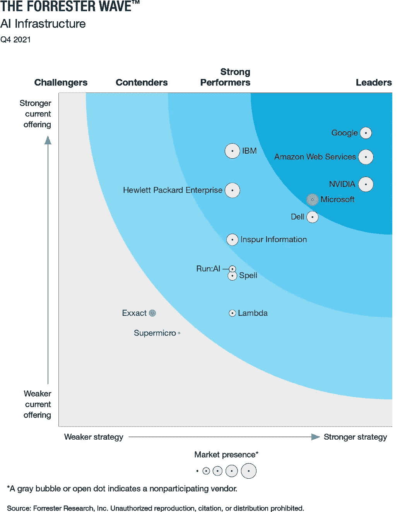
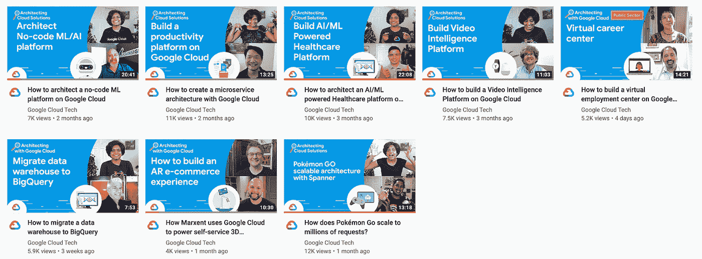
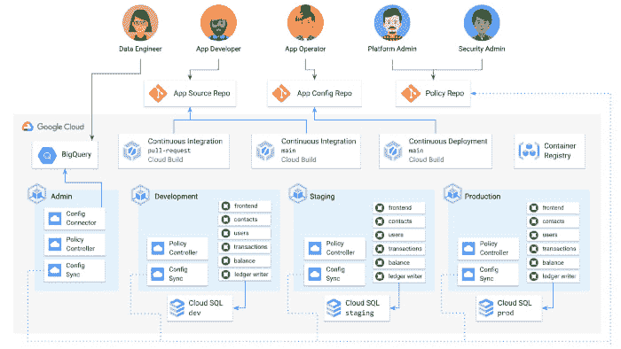
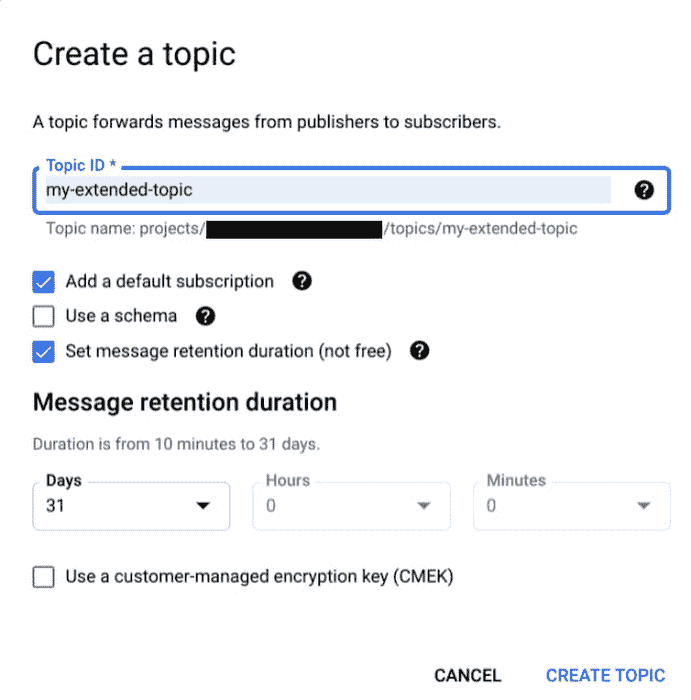
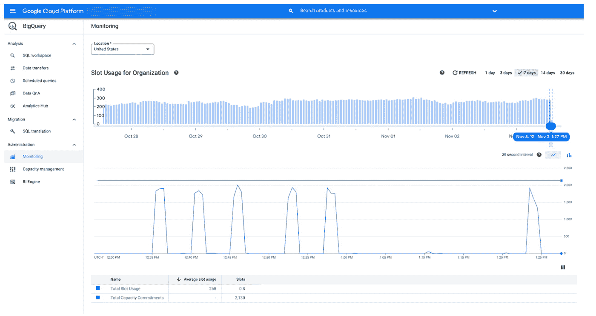
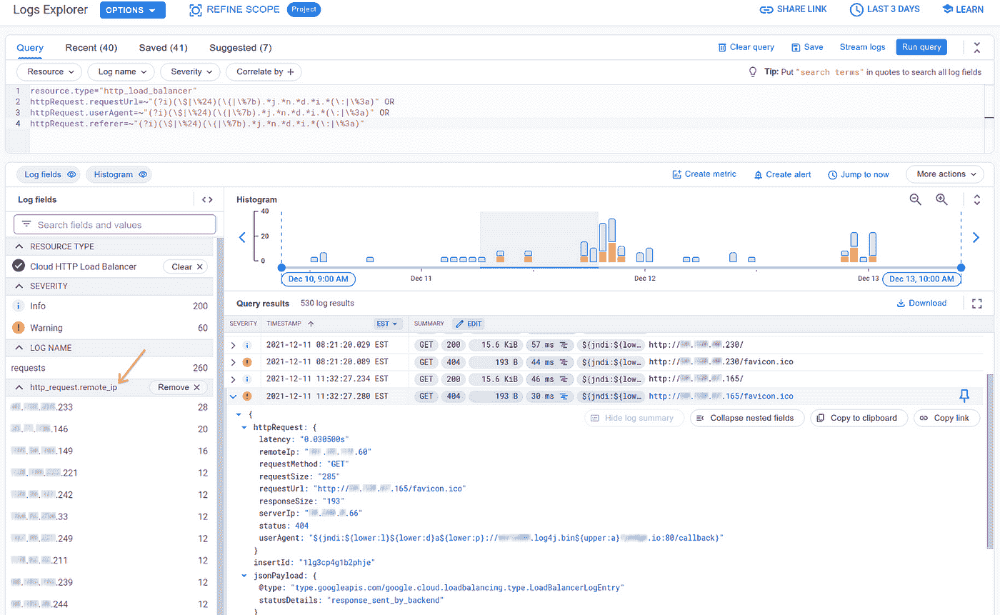
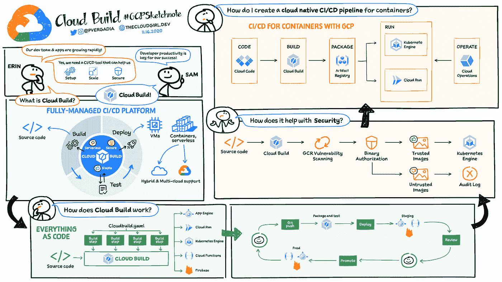

# 谷歌云平台—技术金块—2021 年 12 月 1 日至 15 日版

> 原文：<https://medium.com/google-cloud/google-cloud-platform-technology-nuggets-december-1-15-2021-edition-1f11dd72668a?source=collection_archive---------0----------------------->

欢迎参加 2021 年 12 月 1 日至 15 日的谷歌云平台技术金块。

我们在 2021 年只剩下两周的时间，如果你想提高你的 GCP 技能，[请查看优惠活动](https://cloud.google.com/blog/topics/training-certifications/free-google-cloud-training-to-take-before-2022)在 2022 年 1 月 10 日之前注册，并获得 30 天免费访问云技能提升的机会，其中提供从核心基础设施、Kubernetes 和机器学习等特定课程。

本期时事通讯包含几篇在各自类别中排名前 10 的博客文章，这些文章都发表在官方 Google Cloud 博客网站上。

# **基础设施**

谷歌云在智利圣地亚哥推出了第 29 个地区，并计划于 2022 年在其他多个地区推出。查看这篇[的博客文章](https://cloud.google.com/blog/products/infrastructure/google-cloud-platform-region-updates)，这篇文章概述了基础设施投资和不久的将来的路线图。

在更多的基础设施新闻中，谷歌云在 Forrester Wave，AI 基础设施，Q1 2021 报告中被列为[领导者。](https://cloud.google.com/blog/products/ai-machine-learning/google-cloud-a-leader-in-the-forrester-wave-ai-infrastructure)

现在是年底，有什么更好的方式来结束基础设施领域，2021 年[Google Cloud Blog 排名前 10 的基础设施博客](https://cloud.google.com/blog/products/infrastructure/top-google-cloud-infrastructure-blogs-of-2021)。

# **客户**

我发现阅读案例研究有点枯燥，我更喜欢听客户告诉我们他们的经历，什么对他们有用，什么没用等等。您知道吗，我们有一个谷歌云架构系列，客户可以与我们分享他们如何在谷歌云平台上构建创新解决方案的故事。

查看这个[视频播放列表](https://www.youtube.com/hashtag/architectingwithgooglecloud)，顾客可以在这里分享他们的旅程。

# **集装箱和库伯内特**

谷歌研究员埃里克·布鲁尔(Eric Brewer)一直在推动谷歌建立开创性的服务，并帮助实现这些服务的外部化。Eric 目前监管多个服务，包括 Kubernetes、Istio、Serverless 等。在一个 4 集视频系列中，Eric 讨论了定义云计算未来的四个关键 Kubernetes 和开源见解。

GKE 自动驾驶仪通过优化和安全的默认配置来减轻集群配置的负担，将托管 GKE 产品提升到了一个新的水平。现在，它通过与 Gitlab、Dynatrace、Splunk 等多个技术合作伙伴解决方案合作，更进一步，让您无需修改即可自动运行这些产品。查看[的帖子](https://cloud.google.com/blog/products/containers-kubernetes/partner-devops-and-security-solutions-for-gke-autopilot)，其中引用了完整的集成列表。

您知道，Anthos 配置管理有助于管理不断扩大的 Kubernetes 资源，使您能够为您的 Kubernetes 资源设置和实施一致的配置和策略。如果你想通过[“配置同步”](https://cloud.google.com/blog/products/containers-kubernetes/let-kubernetes-automate-your-configs-and-policies-with-acm) GitOps 方法看到这一点，看看这篇博文。

我们以 Google Cloud 上托管计算产品的[十大帖子来结束这一部分。](https://cloud.google.com/blog/products/containers-kubernetes/top-google-cloud-managed-container-blogs-of-2021)

# **数据分析**

Cloud Pub/Sub 现在允许您将发送到主题的消息保留 31 天，而不是之前的 7 天。如果您想使用这些消息来调试订阅者、将现有消息转换为其他事件信息、重放消息(如果您想的话)等等，这就给了您更多的喘息空间。

随着槽估计器和资源图表的出现，对您的 BigQuery 环境的理解变得更好了。Slot Estimator 是一种交互式容量管理工具，可帮助管理员根据性能估计和优化其 BigQuery 容量，而资源图表允许您监控其插槽使用情况，根据历史消耗管理容量，排除作业性能故障，自我诊断查询，并根据需要采取纠正措施。查看一下[的博客文章](https://cloud.google.com/blog/products/data-analytics/bigquery-administrator-hub-helps-manage-bigquery-at-scale)，它通过例子详细解释了你今天如何使用它们。

# **身份与安全**

随着 log4j 漏洞的发现，世界各地的运营团队度过了忙碌的一周。谷歌网络安全行动小组已经发布了关于这些漏洞以及如何缓解它们的建议。此外，云装甲、安全指挥中心(Premium)也有更新，以帮助管理风险。还建议查看[安全咨询页面](https://cloud.google.com/log4j2-security-advisory)获取更新。

在谈论谷歌云安全时，围绕服务账户的讨论经常出现。建议尽量少使用服务帐户，并为其提供适当的权限以防止攻击。任何组织都希望了解其当前的服务帐户清单，并对其活动、上次使用情况等进行审计。这篇[博客文章](https://cloud.google.com/blog/products/identity-security/three-services-to-investigate-gcp-service-account-usage)深入探讨了这些细节，并帮助你了解如何看待 GCP 的 3 项服务:

*   这个服务帐户可以做什么？(**策略分析器**)
*   此服务帐户最后一次使用是什么时候？(**策略情报**)
*   这个服务帐户最近做了什么？(**云日志**)

# **无服务器应用开发**

希望通过 Google Cloud 无服务器服务(如 Cloud Run、Cloud Functions 等)提高自己的技能吗？参加刚刚启动并持续到 2022 年 2 月的**无服务器黑客马拉松**怎么样。成为第一批试用最新(第二代)版本云功能和附加功能的人之一，挑选并展示您将如何解决黑客马拉松中遇到的无服务器挑战。查看[的博文](https://cloud.google.com/blog/products/serverless/serverless-hackathon)或直接访问[网站](https://easyserverlesshackathon.bemyapp.com/)了解更多信息。

# 让我们来了解一下 GCP

如果你明年的目标是 GCP 认证，你可能会有这样的问题:从哪里开始，如何做好准备，不仅是在考试内容方面，而且在工具方面，以确保你准备好在你的角色中使用它们。这篇[博客文章](https://cloud.google.com/blog/topics/developers-practitioners/how-become-certified-cloud-professional)给出了一个很好的开始路径，首先通过 GCP 技能徽章获得关键技能，然后进入特定的考试，并帮助你理解这些考试涵盖的内容:

*   什么是[谷歌云技能徽章](https://youtu.be/6Ne1T5F7Hv0)？
*   什么是[协理云工程师(ACE)认证](https://youtu.be/brztkrdd_hs)？
*   什么是[专业云架构师(PCA)认证](https://youtu.be/Z0TVbP1Uo-g)？

接下来，我们有一个关于 Google Cloud DevOps 概述的 SketchNote 和[博客文章](https://cloud.google.com/blog/topics/developers-practitioners/devops-and-cicd-google-cloud-explained)，在那里你会得到一个关于 [CI/CD 流程](https://cloud.google.com/docs/ci-cd)的概述，以及在 GCP 有哪些不同的工具可以实现这一点。

既然我们讨论了 CI/CD 主题，不如更进一步，了解一旦您的应用程序投入生产，您如何管理、调试并确保您的应用程序可靠运行。您可以通过云操作套件(以前称为 Stackdriver)来实现这一点。查看[笔记](https://cloud.google.com/blog/topics/developers-practitioners/introduction-google-clouds-operations-suite)了解更多关于云操作的信息。

# 保持联系！

有问题、意见或其他反馈。一定要把它送过来。

*想关注新的谷歌云产品公告吗？我们有一个方便的页面，您可以将它加入书签→* [*谷歌云的新功能*](https://bit.ly/3umz3cA) *。*