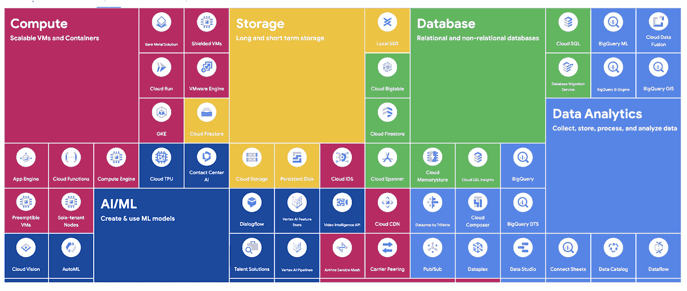

# 谷歌云平台—技术金块—2022 年 2 月 1 日至 15 日版

> 原文：<https://medium.com/google-cloud/google-cloud-platform-technology-nuggets-february-1-15-2022-edition-47395daabb32?source=collection_archive---------0----------------------->

欢迎参加 2022 年 2 月 1 日至 15 日的谷歌云技术金块。

***谷歌云接下来的 22 个日期已经被*** [***宣布***](https://cloud.google.com/blog/topics/google-cloud-next/save-the-date-for-google-cloud-next-october-2022?utm_source=blog&utm_medium=partner&utm_campaign=CDR_rom_gcp_gcptechnuggets_feb-a-2022_021622) ***。在您的日历上标记 2022 年 10 月 11 日至 13 日谷歌云年度最大事件。***

# **4 字以内的谷歌云产品(2022 版)**

谷歌云产品的最新版本已经发布，你一定会喜欢这次介绍的功能。这是一个交互式版本，可以作为一个抽认卡来测试你的知识(对认证有用)，并帮助你快速导航到产品文档，样品和更多。这个产品搜索在[云控制台](https://console.cloud.google.com/products?utm_source=blog&utm_medium=partner&utm_campaign=CDR_rom_gcp_gcptechnuggets_feb-a-2022_021622)中也可以使用，并且有一个 [API](https://bit.ly/GCPCheatsheetAPI?utm_source=blog&utm_medium=partner&utm_campaign=CDR_rom_gcp_gcptechnuggets_feb-a-2022_021622) 可以与之集成。

互动版在这里可以买到，还有一张海报，你也可以[下载](https://github.com/priyankavergadia/google-cloud-4-words#the-google-cloud-developers-cheat-sheet?utm_source=blog&utm_medium=partner&utm_campaign=CDR_rom_gcp_gcptechnuggets_feb-a-2022_021622)并打印出来。查看[博客文章](https://cloud.google.com/blog/topics/developers-practitioners/back-popular-demand-google-cloud-products-4-words-or-less-2022-edition?utm_source=blog&utm_medium=partner&utm_campaign=CDR_rom_gcp_gcptechnuggets_feb-a-2022_021622)了解更多详情。

# **客户**

在本期的客户案例中，我们来看看 Wayfair 基于谷歌数据服务的分析平台的实现。Wayfair 必须满足这样的要求:

*   3000 名工程师，拥有数千万客户。
*   他们通过 16，000 多家供应商合作伙伴为 2000 万件商品提供服务。
*   针对数 Pb 的数据集，每年处理来自人和系统的 10 亿次“分析”数据库查询。

使用谷歌云数据服务后的结果:“我们看到生产中运行时间超过一分钟的分析查询数量减少了 90%以上。”查看[博客文章](https://cloud.google.com/blog/products/data-analytics/how-wayfair-partner-improved-performance-and-optimized-internal-analytics?utm_source=blog&utm_medium=partner&utm_campaign=CDR_rom_gcp_gcptechnuggets_feb-a-2022_021622)了解更多详情。

# **集装箱和库伯内特**

运行 Kubernetes 的工作负载是困难的，GKE 多年来一直在帮助使这变得更容易。挑战之一是以成本优化的方式运行这些工作负载。GKE 在云控制台(预览模式)中提供了成本优化见解，以帮助发现跨集群的优化机会。该功能现已正式发布，您可以看看 [GKE 成本优化视频系列](https://www.youtube.com/playlist?list=PLnYL2C6N76ELkkuqwwOBldzJcuLhhFC7-)来逐步了解这一点。查看[博客文章](https://cloud.google.com/blog/products/containers-kubernetes/gke-cost-optimization-insights-now-ga?utm_source=blog&utm_medium=partner&utm_campaign=CDR_rom_gcp_gcptechnuggets_feb-a-2022_021622)了解更多细节。

在相关的 GKE 新闻中，Anthos 服务网格现在已经可以在 GKE 试点使用，建议您关注[即将到来的 kubectl 授权变更](https://cloud.google.com/blog/products/containers-kubernetes/kubectl-auth-changes-in-gke?utm_source=blog&utm_medium=partner&utm_campaign=CDR_rom_gcp_gcptechnuggets_feb-a-2022_021622)。

# **数据分析**

BigQuery 团队通过宣布对一系列 SQL 特性的支持，展示了对用户友好的 SQL 和 BigQuery 用户的热爱，还有什么比在情人节宣布更好的呢？这些特性包括扩展的数据类型、扩展的 SQL 表达式脚本控制语句、表复制 DDL 和扩展的 INFORMATION_SCHEMA 视图。查看[博客文章](https://cloud.google.com/blog/products/bigquery/bigquery-loves-user-friendly-sql?utm_source=blog&utm_medium=partner&utm_campaign=CDR_rom_gcp_gcptechnuggets_feb-a-2022_021622)了解更多详情。

随着[无服务器 Spark](https://cloud.google.com/dataproc-serverless/docs?utm_source=blog&utm_medium=partner&utm_campaign=CDR_rom_gcp_gcptechnuggets_feb-a-2022_021622) 的全面上市和 BigQuery 内部 Spark 的上市，Google Cloud 对 Apache Spark 的支持得到了[的推动](https://cloud.google.com/blog/products/data-analytics/simplify-data-processing-and-data-science-jobs-with-spark-on-google-cloud?utm_source=blog&utm_medium=partner&utm_campaign=CDR_rom_gcp_gcptechnuggets_feb-a-2022_021622)，允许 BigQuery 用户使用无服务器 Spark 和 BigQuery SQL 进行数据分析。后一个功能可以预览，您可以通过这个[表单](https://docs.google.com/forms/d/e/1FAIpQLSccIXlE5gJNE0dNs6vQvCfrCcSjnoHqaW2lxpoVkAh56KLOwA/viewform)请求同样的功能。

# **AI 和 ML**

[语音转文本 API](https://cloud.google.com/speech-to-text?utm_source=blog&utm_medium=partner&utm_campaign=CDR_rom_gcp_gcptechnuggets_feb-a-2022_021622) 有了一个新的接口，可以看到它集成在谷歌云控制台中。这使得任何人都可以很容易地开始，更好地理解集成，看到结果，并执行快速的模型迭代。[查看谷歌云控制台中的新界面](https://console.cloud.google.com/speech?utm_source=blog&utm_medium=partner&utm_campaign=CDR_rom_gcp_gcptechnuggets_feb-a-2022_021622)。

当使用 Vertex AI 构建 ML 模型时，很可能您的数据在 BigQuery 中。理解 Vertex AI 和 BigQuery 协同工作的各种方式是非常重要的。如果您正在使用 Vertex AI，您可以从 BigQuery 导入模型数据，潜在地访问 BigQuery 中可用的各种公共数据集，并在 Vertex AI 笔记本中使用您的 BigQuery 数据。反过来，您可以将您的批处理结果从 Vertex AI 导出到 BigQuery 进行详细分析，甚至可以通过将其导出到 BigQuery 来理解您的模型测试预测。

查看这篇[博客文章](https://cloud.google.com/blog/products/ai-machine-learning/five-integrations-between-vertex-ai-and-bigquery?utm_source=blog&utm_medium=partner&utm_campaign=CDR_rom_gcp_gcptechnuggets_feb-a-2022_021622)了解更多细节。

在做顶点 AI 模型训练的时候，需要给自己的调试过程增压吗？Vertex AI 训练有一个改进的本地模式，你可以在一个小样本数据集上本地迭代和测试你的工作，而不必等待整个云 VM 生命周期。查看[本地模式文档指南](https://cloud.google.com/vertex-ai/docs/training/containerize-run-code-local?utm_source=blog&utm_medium=partner&utm_campaign=CDR_rom_gcp_gcptechnuggets_feb-a-2022_021622)和[博客文章](https://cloud.google.com/blog/products/ai-machine-learning/debugging-faster-in-vertex-ai-training?utm_source=blog&utm_medium=partner&utm_campaign=CDR_rom_gcp_gcptechnuggets_feb-a-2022_021622)了解更多细节。

最后，如果你喜欢松饼，但正在寻求创造一种新的松饼食谱，那么这篇[博文](https://cloud.google.com/blog/topics/developers-practitioners/celebrating-national-muffin-day-machine-learning?utm_source=blog&utm_medium=partner&utm_campaign=CDR_rom_gcp_gcptechnuggets_feb-a-2022_021622)怎么样，这篇博文讲述了如何使用机器学习来发明你自己的松饼食谱。

# **无服务器应用开发**

第二代[谷歌云功能](https://cloud.google.com/functions?utm_source=blog&utm_medium=partner&utm_campaign=CDR_rom_gcp_gcptechnuggets_feb-a-2022_021622)已经发布，并进行重大更新。它建立在 Cloud Run 和 Eventarc 之上。主要更新包括:

*   更长的请求处理:对于 HTTP 函数，运行您的函数长达 60 分钟，非常适合处理来自云存储或 BigQuery 的大数据流。
*   更大的实例:利用高达 16GB 的 RAM 和 4 个 vCPUs，非常适合更大的内存、计算密集型和更多并行工作负载。
*   并发性:利用单个功能处理多达 1000 个并发请求，最大限度地减少冷启动，并在扩展时降低延迟和成本。
*   最少的情况:提供预热的情况，以减少你的冷启动。
*   流量分割:支持多个版本的函数，分割不同版本之间的流量，并将函数回滚到以前的版本。
*   对 Eventarc 的本机支持，它从直接来源和云审计日志中带来了 90 多个事件源。
*   新的开发人员体验

查看[博客文章](https://cloud.google.com/blog/products/serverless/introducing-the-next-generation-of-cloud-functions?utm_source=blog&utm_medium=partner&utm_campaign=CDR_rom_gcp_gcptechnuggets_feb-a-2022_021622)了解更多详情。来一份[快速启动](https://cloud.google.com/functions/docs/2nd-gen/console-quickstart)怎么样？

在其他无服务器新闻中，云调度器看到了[的关键更新](https://cloud.google.com/blog/products/serverless/cloud-scheduler-now-available-across-23-gcp-regions?utm_source=blog&utm_medium=partner&utm_campaign=CDR_rom_gcp_gcptechnuggets_feb-a-2022_021622)，包括:

*   在 23 个 GCP 地区上市
*   现在，单个项目可以使用多个区域。
*   您可以跨云区域安排作业，以确保跨区域可用性和故障转移场景
*   您不再需要应用程序引擎应用程序来使用云调度程序。

我们以演示如何使用[云工作流](https://cloud.google.com/workflows?utm_source=blog&utm_medium=partner&utm_campaign=CDR_rom_gcp_gcptechnuggets_feb-a-2022_021622)实现关键模式的开发者帖子来结束这一部分。

第一篇博文详细描述了如何使用云工作流实现 [Saga 模式。当一个事务中涉及多个服务时，这种模式非常关键，如果其中一个服务失败，如何执行补偿操作来正确地回滚更改。](https://cloud.google.com/blog/topics/developers-practitioners/implementing-saga-pattern-workflows?utm_source=blog&utm_medium=partner&utm_campaign=CDR_rom_gcp_gcptechnuggets_feb-a-2022_021622)

下一个很有意思。使用计算引擎虚拟机来运行长时间运行的任务/应用程序，但通过云工作流来编排整个过程，如何？看看这篇[博文](https://cloud.google.com/blog/topics/developers-practitioners/long-running-containers-workflows-and-compute-engine?utm_source=blog&utm_medium=partner&utm_campaign=CDR_rom_gcp_gcptechnuggets_feb-a-2022_021622)。

# **让我们来了解一下 GCP**

开始你的谷歌云学习之旅永远不会太晚。整个二月，你都可以报名参加一个基于角色的学习路径。查看[博客文章](https://cloud.google.com/blog/topics/training-certifications/access-role-based-google-cloud-training-free-of-charge?utm_source=blog&utm_medium=partner&utm_campaign=CDR_rom_gcp_gcptechnuggets_feb-a-2022_021622)或选择今天的[学习路径。](https://inthecloud.withgoogle.com/cloud-learning-paths-22/register.html?utm_source=blog&utm_medium=partner&utm_campaign=CDR_rom_gcp_gcptechnuggets_feb-a-2022_021622)

如果你正在寻找运行下一代数字商务平台，如果你想在谷歌云上这样做，你有什么选择？你有 3 个选择:无头商务，建立自己的或在谷歌云上托管开箱即用的解决方案。查看这篇[博客文章](https://cloud.google.com/blog/topics/developers-practitioners/how-build-digital-commerce-platform-google-cloud?utm_source=blog&utm_medium=partner&utm_campaign=CDR_rom_gcp_gcptechnuggets_feb-a-2022_021622)，它提供了这些选项的细节和演练。建议首先观看视频。

# 保持联系！

*有问题、意见或其他反馈。一定要把它送过来。*

*想关注新的谷歌云产品发布吗？查看您应该收藏的这个方便的页面→* [*谷歌云的新功能*](https://bit.ly/3umz3cA) *。*