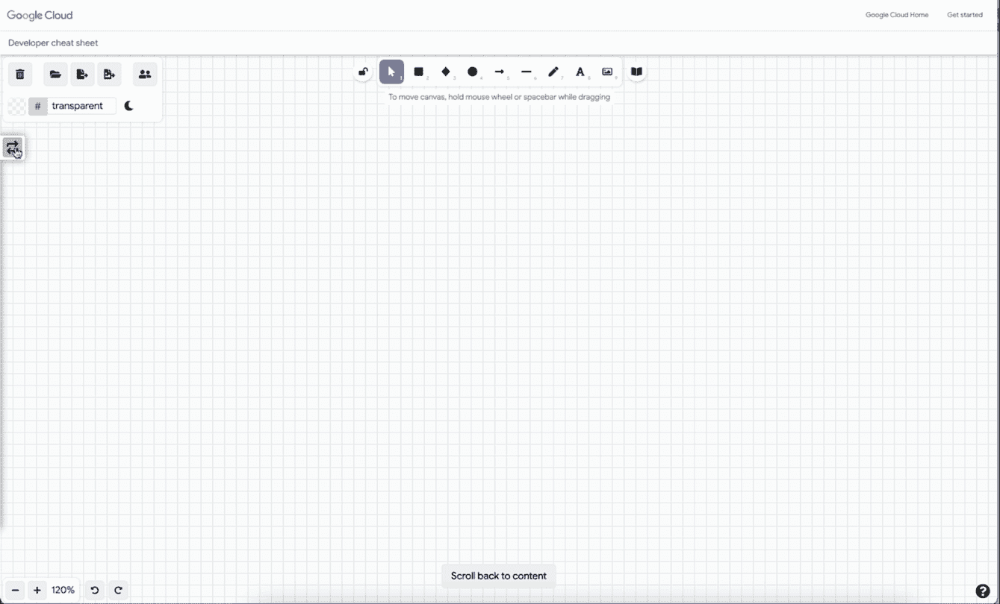
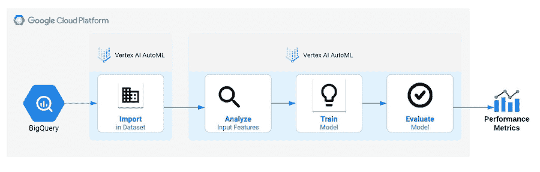
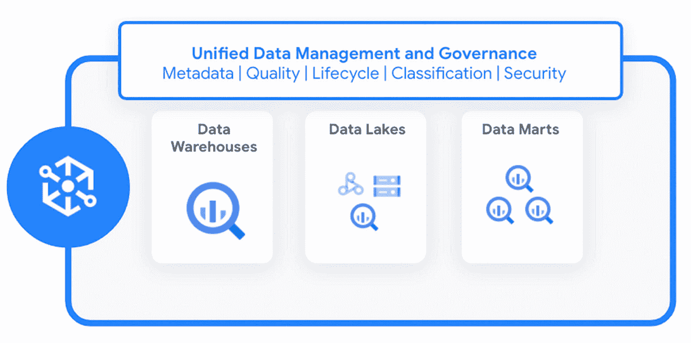
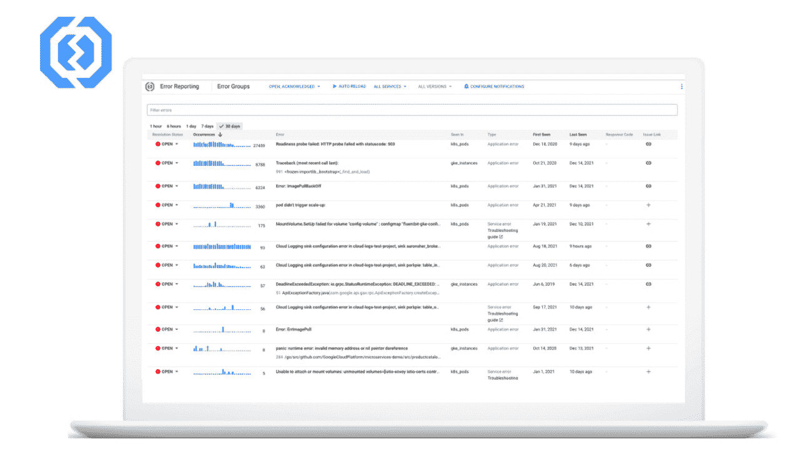

# 谷歌云平台—技术金块—2022 年 2 月 16 日至 28 日版

> 原文：<https://medium.com/google-cloud/google-cloud-platform-technology-nuggets-february-16-15-2022-edition-a47d80c0d934?source=collection_archive---------0----------------------->

欢迎参加 2022 年 2 月 16 日至 28 日的谷歌云技术金块。

## **谷歌云的新用户**

如果你是谷歌云的新手，通常会面临一个挑战:你到底从哪里开始？为了解决这个问题，我们有了这个[的博客帖子](https://cloud.google.com/blog/topics/developers-practitioners/new-google-cloud-start-here?utm_source=blog&utm_medium=partner&utm_campaign=CDR_rom_gcp_gcptechnuggets_feb-a-2022_021622)，提供了一个建议的路径。这篇博文中特别有趣的是一个名为[的常见开发人员用例](https://cloud.google.com/docs/get-started/common-developer-use-cases?utm_source=blog&utm_medium=partner&utm_campaign=CDR_rom_gcp_gcptechnuggets_feb-a-2022_021622)的部分。这是一个很好的资源，因为它分解了典型的用例，从托管静态站点、数据存储、基于容器的应用程序开发等等，您可以映射到您自己的需求，然后了解如何构建一个 Google 云解决方案来解决它。

除了上面的链接，我们还可以看看另外两个资源:

*   一个改进的[文档](https://cloud.google.com/docs/?utm_source=blog&utm_medium=partner&utm_campaign=CDR_rom_gcp_gcptechnuggets_feb-a-2022_021622)页面，可以更容易地找到指南、代码示例、教程和 API 参考。
*   [云架构中心](https://cloud.google.com/architecture?utm_source=blog&utm_medium=partner&utm_campaign=CDR_rom_gcp_gcptechnuggets_feb-a-2022_021622)了解参考架构、图表、设计模式、指南以及在 Google Cloud 上迁移工作负载的最佳实践。

## **从业者的工具**

对于 Google Cloud 的从业者来说， [Google Cloud 架构图表工具](https://googlecloudcheatsheet.withgoogle.com/architecture?utm_source=blog&utm_medium=partner&utm_campaign=CDR_rom_gcp_gcptechnuggets_feb-a-2022_021622)是你应该添加到工具包中的东西。从“图表工具”这个名称的含义来看，这个工具要宽泛得多。正如[博客文章](https://cloud.google.com/blog/topics/developers-practitioners/introducing-google-cloud-architecture-diagramming-tool?utm_source=blog&utm_medium=partner&utm_campaign=CDR_rom_gcp_gcptechnuggets_feb-a-2022_021622)所建议的，你可以从三个方面来看待它的使用:

1.  为您的解决方案创建可以与您的团队共享的体系结构图。它们是宝贵的信息来源。
2.  如果您想在库中可用的几个参考解决方案的基础上构建一个解决方案，您可以选择其中的一个，然后根据您的特定需求对其进行定制。
3.  最强大的是将这个图表部署到 Google Cloud 中。目前可用于一些参考架构，但您可以将此参考架构以图表的形式呈现，并单击一下将其部署到 Google Cloud。

今天就给[工具](https://googlecloudcheatsheet.withgoogle.com/architecture?utm_source=blog&utm_medium=partner&utm_campaign=CDR_rom_gcp_gcptechnuggets_feb-a-2022_021622)一个旋转！

如果您是 Java 企业开发人员，那么您很有可能仍然拥有由 Tomcat 支持的 Java 企业应用程序，Tomcat 是 Java 应用程序的流行 web 服务器/servlet 容器。如果您希望对基于 Tomcat 的应用程序进行现代化，目标是将它们迁移到在 Google Kubernetes 引擎或云上运行的容器化工作负载，请查看一下 [Tomcat 迁移工具](https://cloud.google.com/blog/topics/developers-practitioners/introducing-google-clouds-tomcat-migration-tooling?utm_source=blog&utm_medium=partner&utm_campaign=CDR_rom_gcp_gcptechnuggets_feb-a-2022_021622)的公开预览版，该工具使客户能够将现有的 Tomcat Java 应用程序完全自动化地现代化到容器中，随时可以部署在任何 Kubernetes 集群上。你可以在这里试用[提供的分步指南。](https://github.com/GoogleCloudPlatform/migrate-for-anthos-gke/tree/main/guides/tomcat)

## **客户**

保险业领袖 USAA 希望让无接触索赔成为现实。它与谷歌云合作，帮助实现了以下目标(摘自博文):

*   创建一个将受损车辆的照片映射到零件列表的服务
*   确定这些零件是否应该修理或更换。
*   如果需要维修，该服务还可以预测维修需要多长时间，并考虑当地的劳动力价格。

要了解所有这些是如何结合在一起的，以及在效率方面的初步结果表明了什么，请查看[博客帖子](https://cloud.google.com/blog/products/ai-machine-learning/usaa-and-google-cloud-transform-insurance-operations?utm_source=blog&utm_medium=partner&utm_campaign=CDR_rom_gcp_gcptechnuggets_feb-a-2022_021622)。

## **容器和 Kubernetes**

如果有一部纪录片是你本周应该观看的，那就是 Kubernetes 纪录片，它追溯了 Kubernetes 问世的历史，以及将其作为开源软件发布背后的一些思考过程等等。这是一部精彩的纪录片，帮助你认识 Kubernetes 背后的关键人物。一块明确的手表。

## **数据分析**

Zamak Deghani 首先[提出了](https://martinfowler.com/articles/data-mesh-principles.html)数据网格架构，该架构提出了一种现代数据堆栈，该数据堆栈从单一的数据湖或数据仓库架构转移到分布式的特定于域的架构，该架构实现了自治性和敏捷性，并且仍然提供了跨域治理和监控数据的中央方式。Google Cloud 宣布 [Dataplex](https://cloud.google.com/dataplex?utm_source=blog&utm_medium=partner&utm_campaign=CDR_rom_gcp_gcptechnuggets_feb-a-2022_021622) 正式上市，这是一种智能数据结构，使您能够集中管理、监控和治理跨数据湖、数据仓库和数据集市的数据，并使这些数据能够安全地供各种分析和数据科学工具访问。查看这篇[博客文章](https://cloud.google.com/blog/products/data-analytics/build-a-data-mesh-on-google-cloud-with-dataplex-now-generally-available?utm_source=blog&utm_medium=partner&utm_campaign=CDR_rom_gcp_gcptechnuggets_feb-a-2022_021622)以更好地理解这项服务，并看看如何实现它。

## **机器学习**

PyTorch 是一个开源的机器学习框架，在机器学习从业者中受到了极大的关注。如果你想在谷歌云上使用 PyTorch，请注意它在 Vertex AI 中有一流的支持，这是一个在谷歌云上完全管理的端到端数据科学和机器学习平台。该团队分享了一篇博客文章，链接到一系列博客文章[中的](https://cloud.google.com/blog/topics/developers-practitioners/pytorch-google-cloud-blog-series-recap?utm_source=blog&utm_medium=partner&utm_campaign=CDR_rom_gcp_gcptechnuggets_feb-a-2022_021622)，展示了如何在 Vertex AI 上构建、训练和部署 PyTorch 模型。

MLOps 是一组实践，目标是在生产中可靠而有效地部署和维护 ML 模型。这通常是说起来容易做起来难，并且有多种原因导致模型不能按照预期的方式工作。为了帮助团队成功实施 MLOps 并基于多种客户体验，Google Cloud 为 MLOps 生命周期中的每个流程发布了一套 [MLOps 指南](https://cloud.google.com/blog/products/ai-machine-learning/guidelines-for-developing-quality-ml-solutions?utm_source=blog&utm_medium=partner&utm_campaign=CDR_rom_gcp_gcptechnuggets_feb-a-2022_021622)。该指南涵盖了模型开发、培训管道部署、持续培训、模型部署、模型服务和模型治理。这些指导方针可以从[这里](https://cloud.google.com/resources/mlops-whitepaper?utm_source=blog&utm_medium=partner&utm_campaign=CDR_rom_gcp_gcptechnuggets_feb-a-2022_021622)下载。

## **身份与安全**

请查看我们 2 月份的每月 CISO 透视，其中涵盖了我们的云安全团队本月的最新更新、产品、服务和资源。本月的一些主要更新包括:

*   [对 IAM 条件的云 SQL 支持](https://cloud.google.com/blog/products/databases/cloud-sql-launches-iam-conditions-and-tags?utm_source=blog&utm_medium=partner&utm_campaign=CDR_rom_gcp_gcptechnuggets_feb-a-2022_021622)现已正式发布(GA)。例如，IAM 条件允许您基于各种属性授权操作。例如，您可以将用户访问限制在特定日期和时间，或者将用户操作限制为仅使用特定名称的云 SQL 资源。
*   第一场[Google Cloud Security Talks of 2022](https://cloud.google.com/blog/products/identity-security/cloud-ciso-perspectives-february-2022?utm_source=blog&utm_medium=partner&utm_campaign=CDR_rom_gcp_gcptechnuggets_feb-a-2022_021622)，3 月 9 日的在线直播活动，我们将关注 SecOps 的所有内容，以及跨内部、云和混合环境的威胁检测、调查和响应。

查看 2022 年 2 月的 [CISO 观点](https://cloud.google.com/blog/products/identity-security/cloud-ciso-perspectives-february-2022?utm_source=blog&utm_medium=partner&utm_campaign=CDR_rom_gcp_gcptechnuggets_feb-a-2022_021622)了解更多更新。

## **德沃普斯和 SRE**

[错误报告](https://cloud.google.com/error-reporting/?utm_source=blog&utm_medium=partner&utm_campaign=CDR_rom_gcp_gcptechnuggets_feb-a-2022_021622)自动捕获云日志从以下语言摄取的日志中发现的异常:Go、Java、Node.js、PHP、Python、Ruby 和。NET，聚合它们，然后通知您它们的存在。查看这篇关于如何理解和启用应用程序错误报告的博客文章。

## **无服务器应用开发**

如果你是一家初创公司，你应该如何着手建立自己的技术团队？当您迁移到云时，您不想引入同样的复杂性。此外，这不仅仅是关于计算，甚至是数据服务、运营和其他服务，您需要考虑并看看如何让他们承担重任。Kelsey Hightower 在这篇[博客文章](https://cloud.google.com/blog/topics/startups/think-serverless-tips-for-early-stage-startups?utm_source=blog&utm_medium=partner&utm_campaign=CDR_rom_gcp_gcptechnuggets_feb-a-2022_021622)中讨论了初创公司应该如何看待无服务器和谷歌云提供的各种产品。博客文章还包含一个视频，凯尔西在视频中讨论了他在多个领域的想法，如安全性、云信用等。

谷歌云最近举办了 [Easy as Pie 无服务器黑客马拉松](https://cloud.google.com/blog/products/serverless/serverless-hackathon?utm_source=blog&utm_medium=partner&utm_campaign=CDR_rom_gcp_gcptechnuggets_feb-a-2022_021622)，来自 70 个国家的 1，500 名开发人员踊跃参加，提交了近 100 个项目，涉及卫生、教育、游戏、数据、金融、农业和技术行业等领域。关键不仅仅是使用各种谷歌无服务器产品，如 Cloud Run、Cloud Functions、Cloud Workloads、Eventarc 和其他产品，还要接受关于解决方案构建的指导和指引。查看黑客马拉松中的[顶级赢家](https://cloud.google.com/blog/products/serverless/serverless-hackathon-winners-announced?utm_source=blog&utm_medium=partner&utm_campaign=CDR_rom_gcp_gcptechnuggets_feb-a-2022_021622)。

## **让我们来了解一下 GCP**

当你调用任何 Google Cloud API 时，有没有想过网络接触点是什么？是的，这一切都始于网络连接，这篇[博客文章](https://cloud.google.com/blog/topics/developers-practitioners/your-device-google-cloud-api-networking-basics?utm_source=blog&utm_medium=partner&utm_campaign=CDR_rom_gcp_gcptechnuggets_feb-a-2022_021622)会告诉你更多。

如果你对数据分析感兴趣，谷歌云已经发布了一套数据分析技能，你应该在 2022 年学会。看一看。

## 保持联系！

有问题、意见或其他反馈。一定要把它送过来。

*想关注新的谷歌云产品公告吗？查看您应该收藏的这个方便的页面→* [*谷歌云的新功能*](https://bit.ly/3umz3cA) *。*