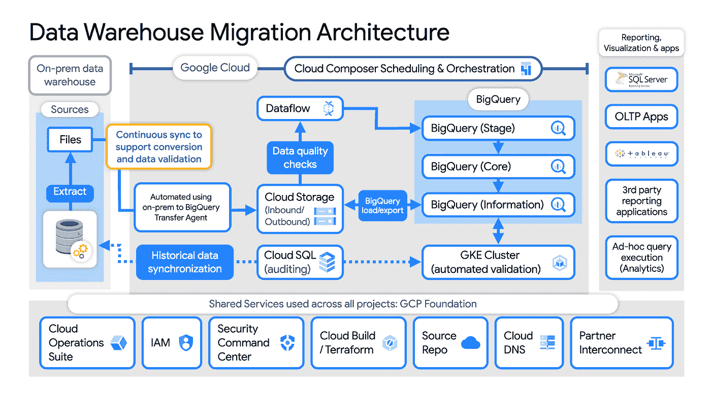

# 谷歌云平台—技术金块—2022 年 1 月 1 日至 15 日版

> 原文：<https://medium.com/google-cloud/google-cloud-platform-technology-nuggets-january-1-15-2022-edition-109f12e498e5?source=collection_archive---------0----------------------->

新年快乐欢迎参加 2022 年 1 月 1 日至 15 日的谷歌云技术金块。

# **下定决心学习 GCP**

如果你在 2022 年的一个决心是学习 GCP，你可以立即开始学习 3 个为你量身定制的学习计划:

1.  [在 2022 年 1 月 31 日前注册](https://cloud.google.com/training/learning-path-offer)，并申请 30 天免费使用 Google Cloud Skills Boost，以完成 Google Cloud 学习入门课程。
2.  [参加 1 月 20 日的](https://cloudonair.withgoogle.com/events/getting-started-cloud-onboard?utm_source=google&utm_medium=blog&utm_campaign=FY22-Q1-northam-ENTD10-onlineevent-er-onboard_getting_started_cloud_fundamentals&utm_content=jan2022)云入门，全面了解谷歌云。
3.  [参加 1 月 27 日的](https://cloudonair.withgoogle.com/events/january-cloud-study-jam?utm_source=google&utm_medium=blog&utm_campaign=FY22-Q1-northam-ENTD11-onlineevent-er-study_jams_create_manage_cloud_resources&utm_content=jan2022) Cloud Study Jam，在这里，谷歌云专家将带你通过谷歌云技能提升中的实践实验室，开始谷歌云学习之路。

更多细节，请查看[博客文章](https://cloud.google.com/blog/topics/training-certifications/start-2022-with-free-training-on-how-to-use-google-cloud)。

如果有一篇文章是我在本期推荐阅读的，那就是标题为[“你是多云工程师吗？在多个云上培养技能的案例"](https://cloud.google.com/blog/topics/hybrid-cloud/the-career-benefits-of-multicloud-fluency)，它为我们每个人考虑在多个云提供商上培养技能提供了案例。这篇文章出色地证明了这一点，它建立了这样一个前提，即多种云已经存在，并建议将一个云提供商作为您的主要技能(深入研究)并选择第二个云提供商平台进行学习(广泛研究)。与大多数文章不同的是，它通过建议所有人都通用的核心主题和概念，可能会考虑专业认证等等，为您提供了可操作的指导。一定要看一看。

# **客户**

名为“构建云解决方案”的系列中的新一集涵盖了独立健康团队，他们[分享了他们对数据仓库迁移策略的见解](https://cloud.google.com/blog/topics/developers-practitioners/how-migrate-premises-data-warehouse-bigquery-google-cloud)以及在数据迁移中需要考虑的事项。

在数据仓库迁移策略中需要注意的关键点是，平台的选择不仅要集成各种数据源，而且要能够随着未来数据量的增加而扩展，并为多个下游应用程序提供数据。

如果你想了解整个**架构云解决方案**系列，请查看这个[视频播放列表](https://www.youtube.com/hashtag/architectingwithgooglecloud)。

# **集装箱和库伯内特**

在我们关于集装箱和 Kubernetes 的故事中，我们来看看 Geotab 的历程，Geotab 是车队管理硬件和软件解决方案的提供商。Geotab 需要在不同的地理位置为其客户提供大规模服务，并具有严格的数据安全性和管辖要求。[帖子](https://cloud.google.com/blog/products/containers-kubernetes/multi-cluster-kubernetes-with-gke-at-geotab)描述了他们在 GCP 上运行所有服务的旅程，特别是 GKE 和多集群 GKE 服务。

# **数据分析**

有一个全新的关于数据治理的 2 部分系列，深入探讨了数据治理是什么、数据治理的流程以及最重要的是，有助于实现数据治理的技术。本系列的第[部分](https://cloud.google.com/blog/products/data-analytics/data-governance-and-operating-model-for-analytics-pt1)已经发布，它涵盖了数据治理的角色、其重要性以及运行有效的数据治理计划所需实施的流程。

# **身份和安全**

当您的应用程序在本地或云中运行时，它们是否更安全？在这场争论中，云无疑有很多优势，但是您总是冒着不能在云中安全地配置应用程序的风险。这毕竟是一项共同的责任。谷歌云以零信任原则、深度防御、顶级安全团队等将安全性放在首位。此外，这篇[文章](https://cloud.google.com/blog/products/identity-security/8-megatrends-drive-cloud-adoption-and-improve-security-for-all)还指出了谷歌云继续采用的 8 个行业大趋势，这些趋势加强了谷歌云在内部部署之外的安全态势。大趋势包括规模经济、共享命运、软件定义的基础设施、主权等等。

继续安全性的话题，董事会如何解决安全性方面的问题？这里有一个由 10 个问题组成的[列表](https://cloud.google.com/blog/products/identity-security/10-questions-to-help-boards-safely-maximize-cloud-opportunities)，可以帮助董事会安全地最大化他们的云机会。

# **无服务器应用开发**

Eventarc 是 GCP 的托管平台，可以帮助你构建事件驱动的架构，让你从谷歌服务、SaaS 和你自己的应用中异步交付事件，使用松散耦合的服务对状态变化做出反应。目标是最终将来自各种服务的多个事件链接起来，并将它们交付到目的地。

Eventarc 已经有了很大的发展，最新的博客文章[已经发布了一些更新。列表顶部是 Eventarc UI，就在主菜单中，这有助于您查看您在系统中配置的各种触发器以及源和目标平台/配置。](https://cloud.google.com/blog/topics/developers-practitioners/introducing-new-eventarc-ui-cloud-run-anthos-destinations)

在最近的更新之前，Eventarc 只有一个目的地，即云运行。Anthos 的 Cloud Run 是目的地列表中的新成员。查看[帖子](https://cloud.google.com/blog/topics/developers-practitioners/introducing-new-eventarc-ui-cloud-run-anthos-destinations)了解更多详情。

# **让我们来了解一下 GCP**

如果您要在 GCP 上构建您的下一个应用程序，您会使用该平台上可用的无服务器服务还是完全托管的服务？如果你仔细阅读，你可能会争论它们之间是否有任何区别？我有时会用这些词来描述同样的能力。正如 Priyanka Vergadia 在[文章](https://cloud.google.com/blog/topics/developers-practitioners/serverless-vs-fully-managed-whats-difference)中所写的，无服务器服务和完全托管服务之间存在一些关键差异，她通过一些 GCP 服务解释了这一点。看一看。

# **2021 年十大职位**

在谷歌云博客上发表了几篇 2021 年前 10 名的博客文章，这些文章发表在不同的类别，如基础设施，数据分析，安全等。我列出了一些帖子，如果你想在谷歌云博客上回顾一些 2021 年的热门故事:

*   [谷歌云托管计算平台:2021 年十大博客文章](https://cloud.google.com/blog/products/containers-kubernetes/top-google-cloud-managed-container-blogs-of-2021)
*   [2021 年从数据分析客户那里获得的前三大洞察](https://cloud.google.com/blog/products/data-analytics/top-trends-in-data-analytics-from-customer-stories)
*   【2021 年谷歌云的顶级人工智能博客文章
*   [一年回顾:谷歌云基础设施的进步](https://cloud.google.com/blog/products/compute/improvements-to-google-cloud-infrastructure-in-2021)
*   [为开发者打造的云— 2021 年回顾](https://cloud.google.com/blog/products/application-development/a-cloud-built-for-developers-2021-year-in-review)
*   [2021 年谷歌云基础设施博客排名](https://cloud.google.com/blog/products/infrastructure/top-google-cloud-infrastructure-blogs-of-2021)

# 保持联系！

*有问题、意见或其他反馈。一定要把它送过来。*

*想关注新的谷歌云产品发布吗？我们有一个方便的页面，您可以将它加入书签→* [*谷歌云的新功能*](https://bit.ly/3umz3cA) *。*