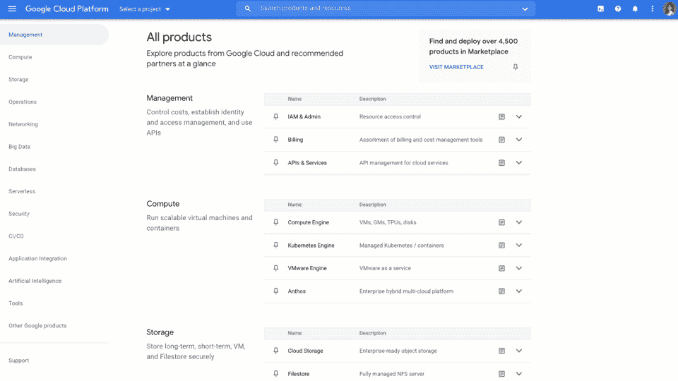
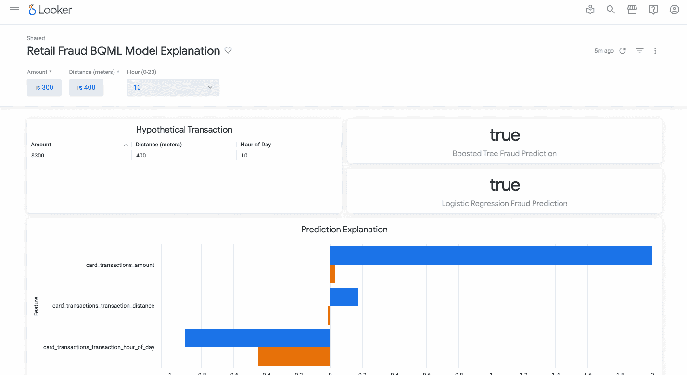

# 谷歌云平台—技术金块—2022 年 1 月 16 日至 31 日版

> 原文：<https://medium.com/google-cloud/google-cloud-platform-technology-nuggets-january-16-31-2022-edition-d9e561f01af7?source=collection_archive---------2----------------------->

欢迎参加 2022 年 1 月 16 日至 31 日的谷歌云技术金块。

# **所有产品页面**

谷歌云控制台尽最大努力保持用户体验足够高效，以帮助你导航到你经常使用的服务。随着服务数量的增加，左上方的主菜单导航有时会令人望而生畏，目前可以通过“锁定”最常用的服务来解决这一问题。随着新的所有产品页面，谷歌控制台控制台更进一步，提供了一个新的顶级菜单，允许您以直观的方式查看产品。每个产品旁边都提供了文档链接和入门指南链接，如果需要，可以选择将其固定。这是一个非常需要的特性，也是一个你应该在你的主机上查看的特性。查看[的博文](https://cloud.google.com/blog/topics/developers-practitioners/find-products-faster-new-all-products-page)了解更多细节。

# **基础设施**

谷歌云推出 Tau VMs，基于 AMD EPYC 7003 处理器，提供业界领先的性价比。一些使用 Tau 虚拟机的谷歌云客户已经看到了显著的性能优势和性价比。请注意，Tau 虚拟机在预定义的配置中可用，在 Spot 虚拟机中也可用。点击查看[上的客户体验。](https://cloud.google.com/blog/products/compute/tau-vm-customers-share-real-world-performance-results)

[Google Cloud VMware Engine](https://cloud.google.com/vmware-engine) 经历了重大更新:支持 NetApp Cloud Volumes 服务，在多伦多提供服务，并扩展到法兰克福和悉尼的第二个区域，VMware Engine 的 60 天单节点非生产环境允许您进行概念验证、合规性认证等。查看[博客文章](https://cloud.google.com/blog/products/infrastructure-modernization/whats-new-in-google-cloud-vmware-engine)，它详细介绍了上述每个更新。

# **客户**

Sabre 不需要任何介绍，它是航空公司、旅游网站、旅行社和酒店等合作伙伴的关键技术提供商。作为其实现技术现代化的 10 年计划的一部分，它一直在寻求各种谷歌云服务，以帮助满足其当前和未来的需求，并牢记用户的期望。这通常归结为确保数据在全球范围内可用并且同步。此外，某些使用案例(如飞行路线)要求向最终用户提供低延迟交付。您可能已经猜到了，[云扳手](https://cloud.google.com/spanner)和[云 Bigtable](https://cloud.google.com/bigtable) 在这里起了关键作用。[阅读 Sabre 实验室首席架构师的文章](https://cloud.google.com/blog/products/databases/sabre-powers-the-travel-industry-with-google-cloud)，了解这些数据库如何满足他们的严格要求。

# **数据库**

如果您一直在使用 Cloud SQL for MySQL，并且一直在努力处理审计日志，那么您现在可以使用新的 [Cloud SQL for MySQL 审计插件](https://cloud.google.com/sql/docs/mysql/db-audit#audit_plugin)，它提供了企业级数据库审计功能。该插件屏蔽了审计日志中的敏感数据，并将它们发送到云日志，在那里您可以查看谁在哪个资源上做了什么。此外，您甚至可以定义日志接收器，将它们发送到 Google 云存储(GCS)。BigQuery 和其他日志管理工具。查看[博客文章](https://cloud.google.com/blog/products/databases/cloud-sql-for-mysql-launches-database-auditing)了解更多详情。

云 Bigtable 经历了一些重大更新:

*   现在正式发布(GA):针对 Bigtable 的自动扩展，可以自动添加或删除容量，以响应应用程序不断变化的需求。
*   每个节点的存储容量增加了一倍。2 倍存储限制，让您以更少的资源存储更多的数据。
*   最近，Bigtable 引入了一个特性，允许在多达 8 个地区部署一个实例，以提供更好的客户体验。一个新特性集群组路由将允许您确定将应用流量路由到哪里，从而避免某些集群忙于服务客户请求。
*   更精细的利用率指标，帮助您了解 CPU 使用情况以及实例资源的使用情况。

查看[博客文章](https://cloud.google.com/blog/products/databases/cloud-bigtable-now-even-easier-to-manage-with-autoscaling)了解更多详情。

# **机器学习**

部署机器学习模型的组织能够理解用于做出推断的一些因素是至关重要的。这在受监管的行业中至关重要，在这些行业中，通常需要审计来了解这些模型所做的决策。[可解释的人工智能](https://cloud.google.com/blog/products/ai-machine-learning/why-you-need-to-explain-machine-learning-models)一直在研究这些模型为什么以及如何做出决策。Google Cloud Vertex AI 提供这些服务来帮助您了解这些决策背后的因素，但如果您是一名公民数据科学家，拥有 SQL 知识，并希望做同样的事情，该怎么办？这篇博客文章详细介绍了如何在 BigQueryML 中使用 SQL 构建机器学习模型，然后使用 Looker 中的“假设场景仪表板”向利益相关者和领域专家解释这些模型预测。

# **作战**

[Google Cloud Deploy](https://cloud.google.com/deploy/) ，一款持续交付(CD)工具现已正式发布。这是一项全面管理、自以为是的持续交付服务，使向 GKE 的持续交付更容易、更快、更可靠。Cloud Deploy 与 GKE 工具系统一起工作，以确保它与 CI 工具集成，支持配置管理并为下游软件交付提供通知。它与 Google Cloud IAM、服务控制、日志记录和内置指标监控相集成。查看[文档](https://cloud.google.com/deploy/docs)和[教程](https://cloud.google.com/deploy/docs/tutorials)。

围绕云操作套件中的工具/服务，还宣布了其他几项功能:

*   将您的警报通知发送到各种通知渠道，然后这些渠道可以发送到您自己的应用程序和/或格式，这一点随着[发布](https://cloud.google.com/blog/products/operations/pub-sub-webook-and-slack-notifications-are-now-available)中的发布/订阅、Webhook 和 Slack 通知渠道而得到了提升，这些渠道现已正式发布。其他渠道，如电子邮件、短信、手机和寻呼机服务(测试版)仍然可用。
*   继续前面的观点，Google Cloud Monitoring 只向受支持的渠道发送警报。客户通常希望将这些警报发送到他们自己的第三方系统。这里有一个[逐步指南](https://cloud.google.com/blog/products/operations/write-and-deploy-cloud-monitoring-alert-notifications-to-third-party-services)，您可以在其中设置一个通用应用程序，将这些警报发送给任何支持通过 webhooks 发送的第三方系统。
*   一组有趣的[解决方案架构](https://cloud.google.com/blog/products/operations/get-better-hybrid-and-multicloud-log-insights)是为一些客户创建的，这些客户必须处理来自混合和多种云应用程序的大量日志，并且必须接近实时并具有有效的成本管理。

[https://cloud . Google . com/blog/products/operations/pub-sub-webook-and-slack-notifications-is-now-available](https://cloud.google.com/blog/products/operations/pub-sub-webook-and-slack-notifications-are-now-available)

[https://cloud . Google . com/blog/products/operations/write-and-deploy-cloud-monitoring-alert-notifications-to-third-party-services](https://cloud.google.com/blog/products/operations/write-and-deploy-cloud-monitoring-alert-notifications-to-third-party-services)

# **App 开发**

如果您正在开发基于 Kubernetes 的应用程序，那么您可能会遇到 Skaffold，这是一个开源工具，可以简化您在开发、部署和测试云原生应用程序方面的开发体验。它还为创建 CI/CD 管道提供了构建块。

如果您有一个包含多个微服务的应用程序，并且您想要为每个微服务进行迭代开发，该怎么办？模块支持最近通过云代码添加到了 Visual Studio 代码中，云代码是 Google Clouds 的 IDE 插件。查看[博客文章](https://cloud.google.com/blog/topics/developers-practitioners/develop-and-debug-kubernetes-microservice-applications-fast-with-google-cloud)中的完整示例，了解如何在您的 IDE 中使用 Skaffold 模块开发和调试一个示例微服务应用程序。

谷歌云平台上最早和最受欢迎的服务之一是一个关键组件:Java Runtime for App Engine 作为开源提供。开源这一关键技术背后的想法是帮助客户了解幕后发生的事情。这也是帮助您在任何地方运行整个 App Engine 环境的第一步:在您的本地开发环境或您自己的数据中心。有趣的是确保未来的运行时基于 Java 编程语言的更新的长期支持版本的转变。

二进制工件在 [Maven 中央存储库](https://repo1.maven.org/maven2/com/google/appengine/)中可用，包括 Javadocs 和源代码。从 Github 上的[库](https://github.com/GoogleCloudPlatform/appengine-java-standard)开始。阅读[的博文](https://cloud.google.com/blog/topics/developers-practitioners/open-sourcing-app-engine-standard-java-runtime)了解更多详情。

# 让我们来了解一下 GCP

在我们的学习部分，我们有两本很棒的指南，分别是关于 Google Cloud 上的[数据科学](https://cloud.google.com/blog/topics/developers-practitioners/intro-data-science-google-cloud)和 Google Cloud 上的[devo PS](/google-cloud/google-cloud-devops-part-1-introduction-to-google-native-devops-process-bfb55be9e3f3)。

Google Cloud 上的数据科学简介是一个坚实的指南，可以帮助您首先理解数据工程中涉及的多个步骤，从摄取、处理、存储、查询和可视化和/或机器学习应用程序。Google Cloud、codelabs、解决方案架构等一系列技术突出了其中的每一个领域。如果您对数据科学感兴趣，这是一个需要添加书签的链接，然后导航到各种工具。

下一个系列是关于 Google Cloud 上的 DevOps，它深入探讨了 DevOps 以及如何在 Google Cloud 上实现它。该系列有一种独特的对话风格，即获取客户需求，然后将其转化为谷歌云服务如何帮助满足这些需求并带来转型。一定要看看:[谷歌云 DevOps 系列](/google-cloud/google-cloud-devops-part-1-introduction-to-google-native-devops-process-bfb55be9e3f3)

## 保持联系！

*有问题、意见或其他反馈。一定要把它送过来。*

*想关注新的谷歌云产品发布吗？查看你应该收藏的这个方便的页面→* [*谷歌云*](https://bit.ly/3umz3cA) *的新功能。*