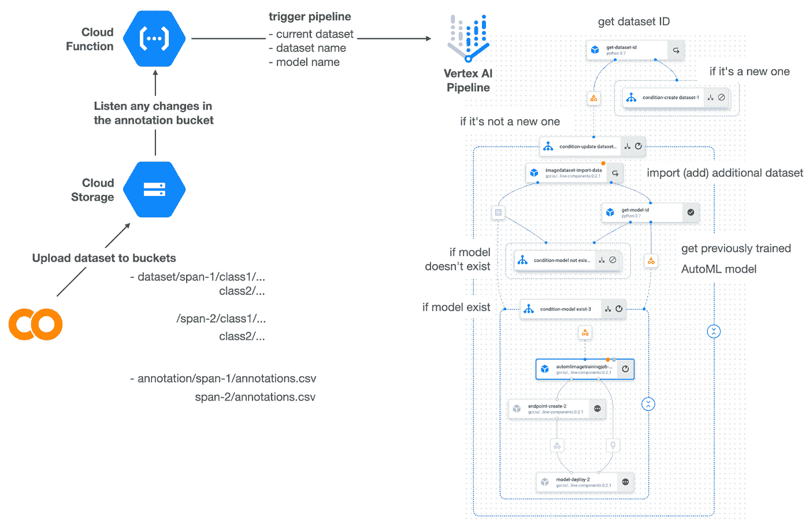

# 谷歌云平台技术掘金| 2022 年 6 月 16 日至 30 日

> 原文：<https://medium.com/google-cloud/google-cloud-platform-technology-nuggets-june-16-30-2022-b47f313b95a9?source=collection_archive---------0----------------------->

欢迎参加 2022 年 6 月 16 日至 30 日的谷歌云技术金块。

## **播客的新区域、主页和新位置**

一个新的谷歌云区域已经在 T2 上线。查看官方的[谷歌云位置页面](https://cloud.google.com/about/locations?utm_source=ext&utm_medium=partner&utm_campaign=CDR_rom_gcp_gcptechnuggets_feb-a-2022_021622&utm_content=-)，了解更多地区信息、各种服务等等。

你知道谷歌云有 3 个播客:谷歌云阅读器播客，Kubernetes 播客和谷歌云平台播客。看看新的[谷歌云播客网站](http://cloud.google.com/podcasts?utm_source=ext&utm_medium=partner&utm_campaign=CDR_rom_gcp_gcptechnuggets_feb-a-2022_021622&utm_content=-)——正如[博客文章](https://cloud.google.com/blog/topics/developers-practitioners/google-clouds-podcasts?utm_source=ext&utm_medium=partner&utm_campaign=CDR_rom_gcp_gcptechnuggets_feb-a-2022_021622&utm_content=-)所说，这是所有谷歌云播客的一站式商店。

谷歌云有了新的主页。访问 Google Cloud 控制台，新的主页(示例如下)就会出现。该页面旨在让您快速获得相关信息，快速访问关键服务的操作，并轻松访问产品页面。查看[博客文章](https://cloud.google.com/blog/topics/developers-practitioners/introducing-new-homepage-google-cloud?utm_source=ext&utm_medium=partner&utm_campaign=CDR_rom_gcp_gcptechnuggets_feb-a-2022_021622&utm_content=-)了解更多详情。

最重要的是，谷歌云平台现在被称为谷歌云，如果你使用的是移动应用程序，这被称为云控制台应用程序。现已更名为谷歌云 app。

## **基础设施**

Spot VMs 是 Google Cloud 更好地利用可用的闲置容量的绝佳方式，对于在标价上获得大幅折扣的客户来说也是如此。人们通常建议，Spot 虚拟机的最佳用途是能够处理抢占的灵活的无状态工作负载。查看这篇[博客文章](https://cloud.google.com/blog/products/compute/google-cloud-spot-vm-use-cases-and-best-practices?utm_source=ext&utm_medium=partner&utm_campaign=CDR_rom_gcp_gcptechnuggets_feb-a-2022_021622&utm_content=-)，其中重点介绍了客户利用 Spot 虚拟机的主要使用案例。这些领域包括媒体渲染、CI/CD 管道、财务建模等等。

## **集装箱和 GKE**

机密 GKE 节点现已全面上市。这是建立在计算引擎机密虚拟机之上的，它对正在使用的虚拟机的内存内容进行加密。GA 版本中增加了两项新功能:混合节点池支持和持久卷。查看[的博客文章](https://cloud.google.com/blog/products/identity-security/announcing-general-availability-of-confidential-gke-nodes?utm_source=ext&utm_medium=partner&utm_campaign=CDR_rom_gcp_gcptechnuggets_feb-a-2022_021622&utm_content=-)了解更多细节。

## **安全**

Cloud Armor 是一项关键服务，用于应对运行在 Google Cloud 上的 Web 应用程序和其他服务的安全威胁。Cloud Armor 在正式发布时发布了新功能(针对每客户端速率限制的新规则、reCAPTCHA Enterprise 的 Bot 管理、基于 ML 的对抗第 7 层攻击的保护)和预览模式中的一些新功能(基于 CRS 33 和基于网络的威胁情报的 WAF 规则)。查看[博客文章](https://cloud.google.com/blog/products/identity-security/announcing-new-cloud-armor-rate-limiting-adaptive-protection-and-bot-defense?utm_source=ext&utm_medium=partner&utm_campaign=CDR_rom_gcp_gcptechnuggets_feb-a-2022_021622&utm_content=-)了解更多详情。

CISO 对 2022 年 6 月的展望是[出](https://cloud.google.com/blog/products/identity-security/cloud-ciso-perspectives-june-2022?utm_source=ext&utm_medium=partner&utm_campaign=CDR_rom_gcp_gcptechnuggets_feb-a-2022_021622&utm_content=-)。该公告涵盖了谷歌在最近的 RSA 会议上讨论的关键话题。该公告还总结了整个谷歌云的安全功能/服务，其中包括机密的 GKE 节点，通过 reCAPTCHA 捕获密码泄漏等。如果你对发送到你邮箱的 CISO 观点感兴趣，请在这里订阅。

## **数据库、分析和机器学习**

对于品牌来说，Twitter 通常是一个很好的信息来源，可以帮助他们了解人们在谈论什么。不仅仅是品牌，即使你想分析一个特定的趋势，比如说“加密”，那么利用 Twitter 上产生的数据也是很好的。

Twitter 发布了详细的分步说明以及样本代码/应用程序，让这项任务(表面有价值的见解)变得更加容易，您可以通过 Google Cloud 项目部署这些代码/应用程序:

*   [用于谷歌云过滤流的 Twitter API 工具包](https://developer.twitter.com/en/docs/tutorials/developer-guide--twitter-api-toolkit-for-google-cloud1)
*   [用于谷歌云最近搜索的 Twitter API 工具包](https://developer.twitter.com/en/docs/tutorials/developer-guide--twitter-api-toolkit-for-google-cloud)

你可以在谷歌云上设置这些应用程序，并在一个小时内过滤推文，了解趋势等。查看[博客文章](https://cloud.google.com/blog/products/data-analytics/twitter-api-toolkit-for-google-cloud?utm_source=ext&utm_medium=partner&utm_campaign=CDR_rom_gcp_gcptechnuggets_feb-a-2022_021622&utm_content=-)了解更多详情。

如果您正在构建机器学习应用程序，您需要计划的两个关键领域是 ML 算法的进步(您应该能够应用正确的/新的算法)和您的机器学习的变化以适应这一过程。如果您还可以构建一个管道来自动完成一系列步骤，那会怎么样？查看[博客文章](https://cloud.google.com/blog/topics/developers-practitioners/mlops-system-automl-and-pipeline-vertex-ai?utm_source=ext&utm_medium=partner&utm_campaign=CDR_rom_gcp_gcptechnuggets_feb-a-2022_021622&utm_content=-)了解如何构建这样一个 MLOps 系统的更多细节。

Cloud SQL for SQL Server 中提供了数据库审计功能。数据库审计允许您监视对 SQL Server 数据库的更改，如数据库创建、数据插入或表删除。查看[博客文章](https://cloud.google.com/blog/products/databases/database-auditing-with-cloud-sql-for-sql-server?utm_source=ext&utm_medium=partner&utm_campaign=CDR_rom_gcp_gcptechnuggets_feb-a-2022_021622&utm_content=-)了解更多详情。

Cloud Spanner 已经发布了 Query Insights，这是一套可视化工具，为开发人员和数据库管理员提供了一种快速诊断 Spanner 上查询性能问题的简单方法。看看这篇[的博客文章](https://cloud.google.com/blog/products/databases/diagnose-query-performance-issues-with-cloud-spanner-query-insights?utm_source=ext&utm_medium=partner&utm_campaign=CDR_rom_gcp_gcptechnuggets_feb-a-2022_021622&utm_content=-)，这篇文章讲述了设置 CPU 利用率警报、识别问题来源(Query Insights 可以帮助你)然后理解原因并修复它的整个过程。

## **云运营**

说到可观测性，普罗米修斯正迅速成为标准。开发人员熟悉 PromQL，其中一个关键要求是使用他们熟悉的查询语言，并可能在其他监控系统中使用，例如 Google Cloud Monitoring。如果您可以在 Google Cloud 自己的交互式监控控制台或 Grafana 中使用 PromQL 并查询 Google Cloud 监控指标，情况会怎样？现在，通过宣布对相同内容的支持，这已经成为可能。查看博客帖子了解更多细节。

## **开发者和从业者**

什么是移动仪表板？你如何使用像 Cloud Run、Firestore 和一些额外的库这样的谷歌云服务来构建一个呢？查看这篇[详细的博客文章](https://cloud.google.com/blog/topics/manufacturing/building-a-mobility-dashboard-with-cloud-run-and-firestore?utm_source=ext&utm_medium=partner&utm_campaign=CDR_rom_gcp_gcptechnuggets_feb-a-2022_021622&utm_content=-)，它构建了一个样本移动仪表板，在地图上实时跟踪车辆。该架构使用:

*   云运行—托管 web 应用程序(仪表板)。
*   streamlit——可视化数据和制作 web 应用程序的库。
*   pydeck 一个用于绘制地理空间数据的库。
*   Firestore —一个全面管理的数据库，可保持您的数据同步。

云运行作业是最近发布的一项功能，它将云运行的适用性应用于许多原本不适合云运行服务的应用程序，这些应用程序必须通过 Web 请求来调用。云运行作业可以在后台运行，非常适合长时间运行的作业、管理任务等。查看这篇[博文](https://cloud.google.com/blog/topics/developers-practitioners/taking-screenshots-web-pages-cloud-run-jobs-workflows-and-eventarc?utm_source=ext&utm_medium=partner&utm_campaign=CDR_rom_gcp_gcptechnuggets_feb-a-2022_021622&utm_content=-)，这篇博文强调了如何利用多种 Google Cloud 无服务器技术，如 Cloud Run Jobs、Workflows 和 EventArc 来截取网页截图。

说到工具，这里有一个有趣的工具:gcpdiag，作为开源发布，它可以帮助检测谷歌云项目中的问题。该工具将运行自动检查，称为规则，并创建一个检测到问题的报告。这些规则可以是对最佳实践、安全问题、常见配置问题等的检查。这个项目可以在 [Github](https://github.com/GoogleCloudPlatform/gcpdiag) 上找到，你也可以对它做出贡献。查看[的博客文章](https://cloud.google.com/blog/topics/developers-practitioners/announcing-gcpdiag-open-source-troubleshooting-tool-google-cloud-platform?utm_source=ext&utm_medium=partner&utm_campaign=CDR_rom_gcp_gcptechnuggets_feb-a-2022_021622&utm_content=-)了解更多细节。

## **让我们来了解一下谷歌云**

保障软件供应链的安全最近受到了极大的关注，这是理所当然的。如果您一直在寻找关于这个主题的介绍，您的最终工件可能被破坏的不同方式，以及 Google Cloud 在保护这个过程方面有什么，请查看这篇文章。

网络是任何云提供商的关键领域。Google Cloud Networking 可能很难理解，因为它提供了大量的服务和灵活性，包括关键的构建模块、连接选项等。查看这个[网络 101 指南](https://cloud.google.com/blog/topics/developers-practitioners/networking-101-gcp-reference-sheet?utm_source=ext&utm_medium=partner&utm_campaign=CDR_rom_gcp_gcptechnuggets_feb-a-2022_021622&utm_content=-)，帮助你导航和理解谷歌云网络。

最后，当 Google Cloud 谈到分层安全时，它指的是什么？你如何看待谷歌云安全及其提供的各种服务？就像上面的网络 101 指南一样，阅读这篇关于谷歌云安全控制的[文章](https://cloud.google.com/blog/topics/developers-practitioners/google-cloud-security-overview?utm_source=ext&utm_medium=partner&utm_campaign=CDR_rom_gcp_gcptechnuggets_feb-a-2022_021622&utm_content=-)。

## **保持联系**

对这份时事通讯有任何问题、意见或其他反馈吗？请发送[反馈](https://forms.gle/UAsAS7YLxYSBTNBy9)。

想要关注新的谷歌云产品发布吗？我们有一个方便的页面，你可以把它加入书签→ [谷歌云的新功能](https://bit.ly/3umz3cA?utm_source=ext&utm_medium=partner&utm_campaign=CDR_rom_gcp_gcptechnuggets_feb-a-2022_021622&utm_content=-)。