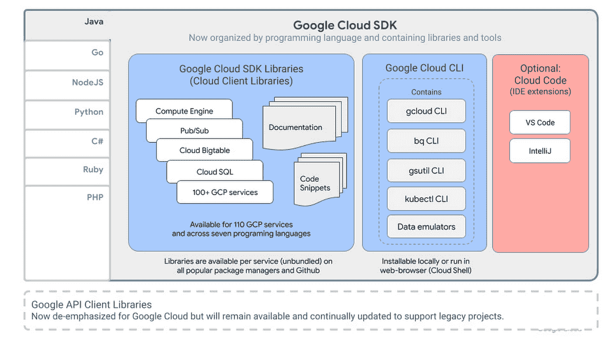
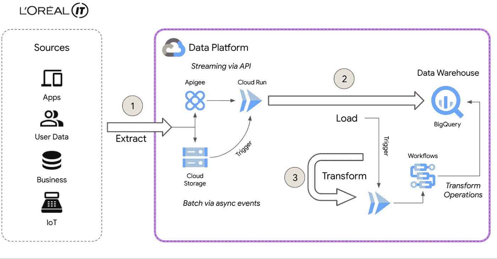
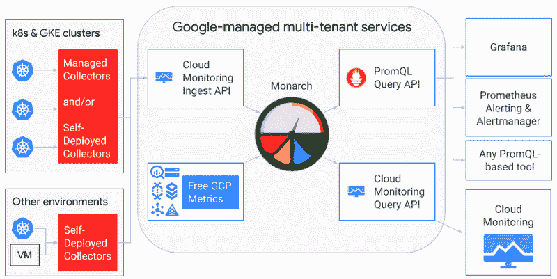
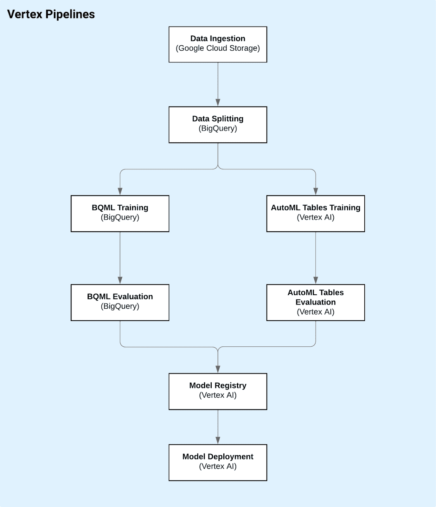
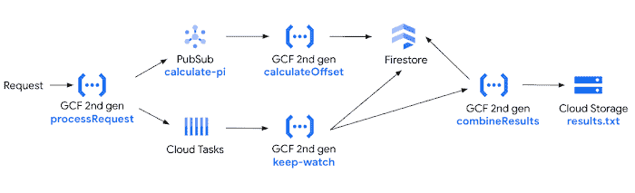

# 谷歌云平台技术金块—2022 年 3 月 1 日至 15 日版

> 原文：<https://medium.com/google-cloud/google-cloud-platform-technology-nuggets-mar-1-15-2022-edition-3f5d0002471d?source=collection_archive---------0----------------------->

欢迎参加 2022 年 3 月 1 日至 15 日的谷歌云技术金块。

# **工具品牌重塑**

如果您对 gcloud CLI 被称为 gCloud SDK 这一事实感到困惑，那么在处理命令行工具(CLI)和 SDK 时，我们会重新命名以分享更一致的信息。

关键点:

*   将我们的一套命令行开发工具(gcloud、bq、gsutil、kubectl 等)重命名为 Google Cloud CLI，以明确这是与我们的任何产品和服务配合使用的命令行界面。
*   我们的云客户端库现在是 Google Cloud SDKs 的一部分。支持的语言有 Java、Go、NodeJS、Python、C#、Ruby 和 PHP。现在，所有新项目都推荐使用这些客户端库。
*   通过围绕语言构建，每个 SDK 现在也有了特定于语言的工具和框架。

更多信息，请查看[的博客文章](https://cloud.google.com/blog/products/application-development/redesigning-the-cloud-sdk-cli-for-easier-development?utm_source=ext&utm_medium=partner&utm_campaign=CDR_rom_gcp_gcptechnuggets_feb-a-2022_021622&utm_content=-)。

# **客户**

一个基于完全托管服务的现代数据平台，其上运行着各种数据集和流程，为各种利益相关方定制数据，看起来会是什么样子？作为领先的美容产品提供商，欧莱雅在构建数据平台时有一些明确的要求。这些要求包括无操作、安全、事件驱动架构等等。该平台需要通过 API 和其他应用程序接收数据，但需要支持数以千计的用户流，为用户管理数据。下面显示的高级架构图基于各种无服务器产品，如 Eventarc、云运行和云功能(第二代)、云工作流等。结果引自文章“BigQuery 中 100TB 的生产数据，每月处理 20TB 的数据。我们有超过 8000 个治理数据集，以及来自多个数据源(如 Salesforce、SAP、Microsoft 和 Google Ads)的 200 万个 BigQuery 表。”

阅读本案例研究的更多。

# **容器和 Kubernetes**

Knative 是一个开源框架，提供了运行无服务器容器的构建模块，现在是云本地计算基金会(CNCF)的一部分。自 2018 年成立以来，Knative 一直由谷歌与 IBM、Red Hat、VMware 和 SAP 密切合作开发，是 Kubernetes 上安装最广泛的无服务器层。查看 [Knative 文档页面](https://knative.dev/docs/)了解更多信息，对于那些对 Kubecon EU 感兴趣的人，有计划举办 [Knative Day](https://events.linuxfoundation.org/knativecon-europe/) 。

# **德沃普斯和 SRE**

Google Managed Prometheus 现在[对每个人都可用](https://cloud.google.com/blog/products/devops-sre/easy-managed-prometheus-metrics-service-for-kubernetes?utm_source=ext&utm_medium=partner&utm_campaign=CDR_rom_gcp_gcptechnuggets_feb-a-2022_021622&utm_content=-)。如果您正在使用自我管理的 Prometheus，并且面临扩展 Prometheus 的挑战，那么这种托管服务是您应该考虑的。正如该架构所示，它基于时序数据库 Monarch，需要注意的一点是，它可以与现有的 Grafana 和 Prometheus Alert Manager 以及其他工具配合使用。

体验这一点的最佳方式之一是在您现有的 GKE 安装中设置托管集合的安装指南，并查看 Google Managed Prometheus 的运行情况。此处有指南[。](https://cloud.google.com/stackdriver/docs/managed-prometheus/setup-managed?utm_source=ext&utm_medium=partner&utm_campaign=CDR_rom_gcp_gcptechnuggets_feb-a-2022_021622&utm_content=-)

# **数据分析**

每个组织都希望成为数据驱动的组织，但是当前围绕现代化的挑战加上现有的技术深度已经减缓了步伐，正如[博客文章所建议的](https://cloud.google.com/blog/products/databases/industry-leading-reliability-global-scale-open-standards-google-cloud-databases?utm_source=ext&utm_medium=partner&utm_campaign=CDR_rom_gcp_gcptechnuggets_feb-a-2022_021622&utm_content=-)。这篇文章很好地总结了谷歌云如何提供既现代又由一流的基础设施、安全性、可扩展性和与其他谷歌云服务的连接性、开源兼容性等支持的数据库。这对于确保您的架构能够经受住几年的考验非常重要。这是一篇很好的复习文章，旨在了解 Google Cloud 上的数据库范围以及最适合它们的特定用例。查看标题为[“用谷歌云让你的数据库成为你的秘密优势”](https://services.google.com/fh/files/misc/guide_to_google_cloud_databases.pdf)的配套 PDF。

[数据治理系列的第 2 部分](https://cloud.google.com/blog/products/data-analytics/data-governance-in-the-cloud-part-2-tools?utm_source=ext&utm_medium=partner&utm_campaign=CDR_rom_gcp_gcptechnuggets_feb-a-2022_021622&utm_content=-)已经发布。这一部分重点介绍 Google Cloud 中用于实现数据治理关键领域的特定工具，其中包括:审计、数据访问控制、发现等。建议您也去看看该系列的第 1 部分[。](https://cloud.google.com/blog/products/data-analytics/data-governance-and-operating-model-for-analytics-pt1?utm_source=ext&utm_medium=partner&utm_campaign=CDR_rom_gcp_gcptechnuggets_feb-a-2022_021622&utm_content=-)

# **机器学习**

人工智能的一个关键挑战，如果不是最大的挑战，是生产人工智能模型。几篇谷歌论文已经写了这方面的内容，一篇有趣的博客文章涵盖了将这些模型应用到生产中的一些最佳实践。这篇文章的重点是顶点人工智能，除了模型开发，它深入到 MLOps 框架的各个方面。这对任何 ML 从业者来说都是一个极好的资源。Github 上提供了这些材料，文章会引导您浏览那里的数据，以及模型的培训、评估和部署。

数字助理现在是在线业务的一个关键部分。然而，保持自己独特的身份对你的品牌来说是很重要的，这一点对于声音来说尤其重要，因为你可以选择的各种声音都是合成的。随着谷歌文本到语音(TTS) API 中自定义语音的发布，你现在可以[使用你的自定义语音](https://cloud.google.com/blog/products/ai-machine-learning/create-custom-voices-with-google-cloud-text-to-speech?utm_source=ext&utm_medium=partner&utm_campaign=CDR_rom_gcp_gcptechnuggets_feb-a-2022_021622&utm_content=-)作为 API 的一部分。您按照指导文档和相关流程检查提交您的音频记录，然后一旦模型经过训练，您就可以在调用过程中引用此模型 id，API 将在文本到语音合成过程中使用特定的自定义语音模型。

# **无服务器应用开发**

如果数学是你感兴趣的领域，你会一直关注 3 月 14 日，这一天是圆周率日。三年前，艾玛·相户爱·Iwao[打破了最多圆周率计算位数的吉尼斯纪录](https://blog.google/products/google-cloud/most-calculated-digits-pi/)(31.4 万亿位)。为了庆祝今年的圆周率日，Emma 和另一位开发者倡导者 Sara Ford 写了一篇博客，描述了他们如何再次尝试这一挑战，但这一次是基于谷歌云无服务器计算技术的新架构。

这是一个很好的例子，说明了第二代云功能的一些变化(更大的实例、更长的运行时间)加上一种新的算法，可以推动无服务器架构所能实现的极限。这篇博文中还隐藏了一个有趣的现象，那就是以前的 API 在 GKE 的移植，以及由此带来的成本节约。请务必阅读[的博文](https://cloud.google.com/blog/topics/developers-practitioners/celebrating-pi-day-cloud-functions?utm_source=ext&utm_medium=partner&utm_campaign=CDR_rom_gcp_gcptechnuggets_feb-a-2022_021622&utm_content=-)。

# **让我们了解一下 GCP**

关于 Anthos 的系列文章越来越好。本系列的最新部分(第 7 部分)涵盖了 [Anthos Marketplace 应用](/google-cloud/google-cloud-anthos-series-part7-6b85c5f7016f)。看看[整个系列](/google-cloud/google-cloud-anthos-series-23b9a35e9179)并为即将到来的几期制作书签。

# 保持联系！

有问题、意见或其他反馈。一定要把它送过来。

*想关注新的谷歌云产品发布吗？查看您应该收藏的这个方便的页面→* [*谷歌云的新功能*](https://bit.ly/3umz3cA) *。*