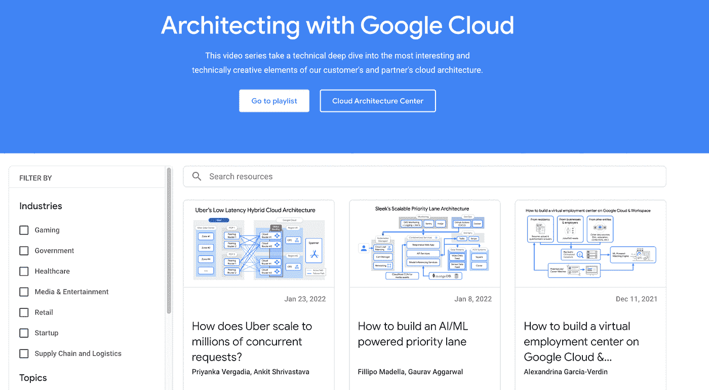
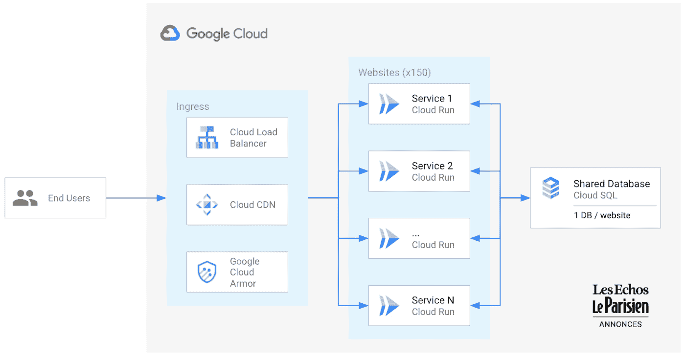
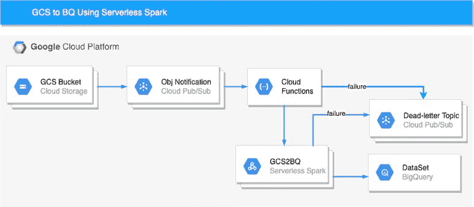
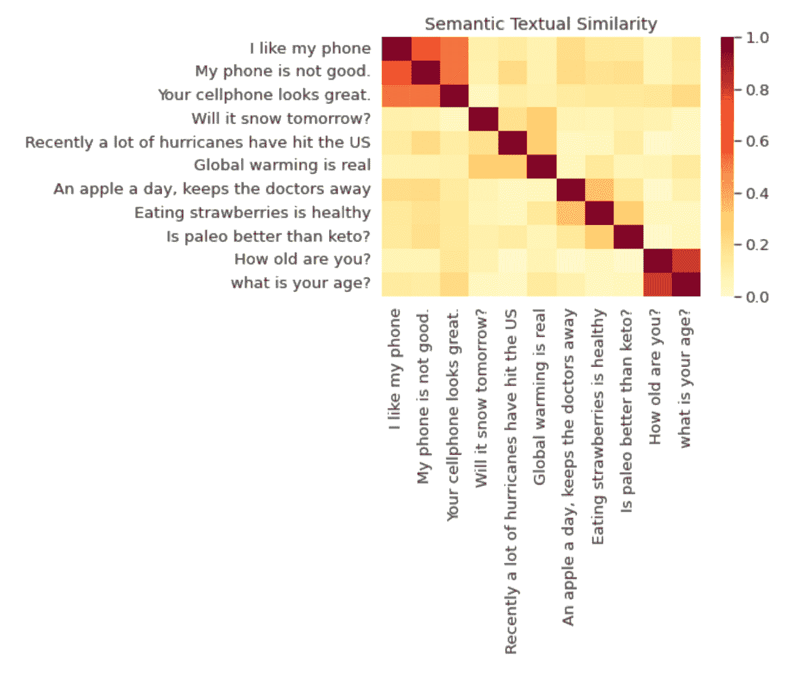
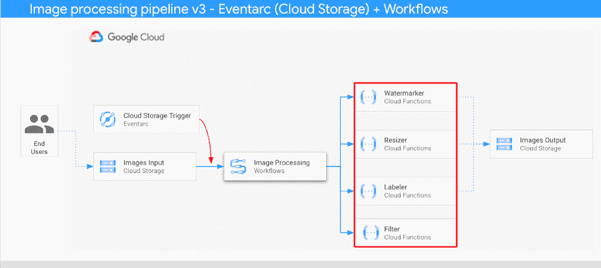
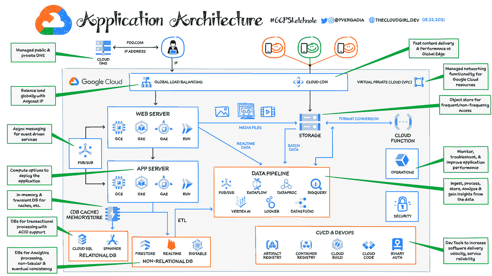
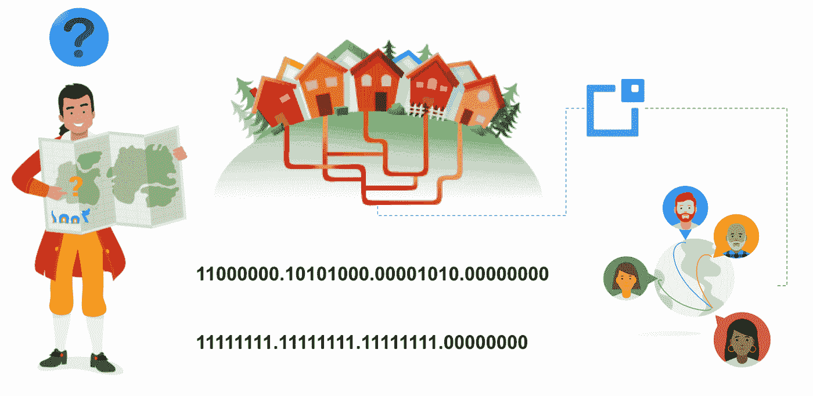
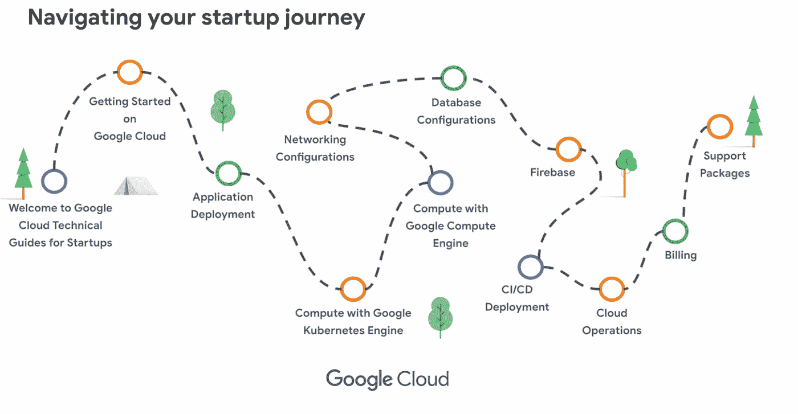

# 谷歌云平台技术金块—2022 年 3 月 16 日至 31 日版

> 原文：<https://medium.com/google-cloud/google-cloud-platform-technology-nuggets-march-16-31-2022-edition-5c908bd4fc09?source=collection_archive---------1----------------------->

欢迎参加 2022 年 3 月 16 日至 31 日的谷歌云技术金块。

# **使用谷歌云进行架构设计**

使用 Google Cloud 架构系列是最受欢迎的系列之一，客户可以在其中讨论他们如何在 Google Cloud 上实现解决方案。[系列现在可以作为播放列表](https://cloud.google.com/blog/topics/developers-practitioners/architecting-google-cloud?utm_source=ext&utm_medium=partner&utm_campaign=CDR_rom_gcp_gcptechnuggets_feb-a-2022_021622&utm_content=-)使用，在那里你可以看到完整的剧集列表。除此之外，还有一个网页提供了全部信息，还有一个链接指向[云架构中心](https://cloud.devsite.corp.google.com/architecture?utm_source=ext&utm_medium=partner&utm_campaign=CDR_rom_gcp_gcptechnuggets_feb-a-2022_021622&utm_content=-)，在那里你可以查看参考架构、最佳实践等等。

# **客户**

这一期的客户故事讨论了 Les Echos 和 Google 如何构建无服务器架构，以取代多年来不断增长且变得难以管理的传统解决方案。Les Echos 有一个中心站点，用于接入多个区域站点，每个站点都有自己的堆栈/解决方案。这变得难以管理，并对可靠性造成压力。现代解决方案对每个站点使用云运行，云负载平衡和云防护在前端保护和扩展服务。

查看[博客文章](https://cloud.google.com/blog/products/serverless/paris-based-news-organization-expands-markets-with-serverless-containers-and-php-cms?utm_source=ext&utm_medium=partner&utm_campaign=CDR_rom_gcp_gcptechnuggets_feb-a-2022_021622&utm_content=-)了解更多详情。

# **安全**

首先，我们有 2022 年 3 月的 [CISO 展望](https://cloud.google.com/blog/products/identity-security/cloud-ciso-perspectives-march-2022?utm_source=ext&utm_medium=partner&utm_campaign=CDR_rom_gcp_gcptechnuggets_feb-a-2022_021622&utm_content=-)。对于刚接触这个领域的人来说，每月一期的《CISO 透视》很好地总结了行业内、谷歌安全团队内、合规性等方面的关键安全问题。

我们 2022 年的第一次谷歌安全会谈最近举行了。主题是威胁检测和响应。你错过了吗？我们在这里为您提供了所有可点播的课程[。](https://cloudonair.withgoogle.com/events/security-talks-march-2022?utm_source=ext&utm_medium=partner&utm_campaign=CDR_rom_gcp_gcptechnuggets_feb-a-2022_021622&utm_content=-)

在使用 AMD 安全加密虚拟化(SEV)的处理器上运行的 N2D 计算引擎类型的机密虚拟机。根据定义，“机密虚拟机可提供高性能，同时使用由硬件生成并单独驻留在处理器中的专用每个虚拟机实例密钥来加密内存。Google 无法访问这些密钥，这些密钥允许客户在处理过程中保护敏感代码和机密数据的安全。机密虚拟机的一个有趣应用来自 Idea Evolver 和阿斯利康，他们必须确保一个具有保密性、隐私性和安全性关键要求的机密医疗应用程序只能由指定用户访问。内存加密是该应用程序的关键要求，他们是机密虚拟机服务的早期采用者。阅读[的博文](https://cloud.google.com/blog/products/identity-security/securing-medical-device-software-with-google-confidential-vm?utm_source=ext&utm_medium=partner&utm_campaign=CDR_rom_gcp_gcptechnuggets_feb-a-2022_021622&utm_content=-)了解更多详情。

# **德沃普斯和 SRE**

可靠性是任何系统和组织的一个关键特征，在他们的旅程早期，努力定义他们的前门系统(客户用户旅程)的可靠性，这些系统依赖于堆栈中下面的系统。看看 Google 开发者拥护者之间的有趣对话,关于如何在不可靠的组件上构建可靠的系统。

在我们最近发布的警报通知中，您现在可以[在您的警报策略](https://cloud.google.com/blog/products/devops-sre/devops-best-practices-add-severity-levels-to-alerts?utm_source=ext&utm_medium=partner&utm_campaign=CDR_rom_gcp_gcptechnuggets_feb-a-2022_021622&utm_content=-)上创建自定义严重性级别，并将此数据包含在您的通知中，以便更有效地与外部系统(Webhook、PagerDuty 等)集成。

# **数据分析**

谷歌云数据峰会将于 4 月 6 日举行。如果您是一名数据从业者，希望了解更多关于 Google 数据产品、路线图、客户等的信息，您一定不想错过这个机会。访问[数据云峰会主页](https://cloudonair.withgoogle.com/events/summit-data-cloud-2022?utm_source=ext&utm_medium=partner&utm_campaign=CDR_rom_gcp_gcptechnuggets_feb-a-2022_021622&utm_content=-)立即注册。

[Dataproc Serverless](https://cloud.google.com/dataproc-serverless/docs?utm_source=ext&utm_medium=partner&utm_campaign=CDR_rom_gcp_gcptechnuggets_feb-a-2022_021622&utm_content=-) 是一个托管服务，允许您运行 Spark batch 工作负载。它支持的工作负载类型有 Pyspark、Spark SQL、Spark R 和 Spark Java/Scala。一篇有趣的博客文章介绍了如何利用 Dataproc Serverless 以及云函数和 Pub/Sub 将文件数据接收到 BigQuery 中。

去年，作为公共数据集计划的一部分，谷歌提供了谷歌趋势公共数据集，允许用户利用谷歌拥有的搜索数据。该数据集现已扩大，将包括美国以外的全球另外 50 个国家的趋势数据。它还将按国家代码和子区域提供每日头条新闻和热门查询。查看[的博客文章](https://cloud.google.com/blog/products/data-analytics/international-google-trends-datasets-in-bigquery?utm_source=ext&utm_medium=partner&utm_campaign=CDR_rom_gcp_gcptechnuggets_feb-a-2022_021622&utm_content=-)，它提供了关于该公告的更多信息，以及如何开始使用 BigQuery 沙盒。

# **机器学习**

随着谷歌云联络中心人工智能平台的[发布，联络中心人工智能得到了推动。通过提供创建端到端呼叫中心解决方案的功能，这有助于将服务提升到一个新的水平。它现在支持软件开发工具包来集成解决方案，支持管理多个渠道，使用 CRM 作为定义客户体验的单一来源，人工智能驱动的路由等等。](https://cloud.google.com/blog/products/ai-machine-learning/google-announces-new-cloud-contact-center-ai-platform?utm_source=ext&utm_medium=partner&utm_campaign=CDR_rom_gcp_gcptechnuggets_feb-a-2022_021622&utm_content=-)

如果你一直在等待很好地掌握矢量嵌入以及如何使用它们，那么看看这篇[博客文章](https://cloud.google.com/blog/topics/developers-practitioners/meet-ais-multitool-vector-embeddings?utm_source=ext&utm_medium=partner&utm_campaign=CDR_rom_gcp_gcptechnuggets_feb-a-2022_021622&utm_content=-)就知道了。这篇文章首先讨论了你可以用嵌入构建什么，它们是什么，它们可以包含什么样的东西。然后，它解释了如何构建您的模型，通过预先训练的模型和构建您自己的定制模型来帮助您推断语义上有意义的嵌入。

# **无服务器应用开发**

对于[的工作流程](https://cloud.google.com/workflows?utm_source=ext&utm_medium=partner&utm_campaign=CDR_rom_gcp_gcptechnuggets_feb-a-2022_021622&utm_content=-)和[事件](https://cloud.google.com/eventarc/docs?utm_source=ext&utm_medium=partner&utm_campaign=CDR_rom_gcp_gcptechnuggets_feb-a-2022_021622&utm_content=-)来说，这是忙碌的一年。现在在预览中可用，您可以为工作流创建 Eventarc 触发器。[博客文章](https://cloud.google.com/blog/topics/developers-practitioners/introducing-eventarc-triggers-workflows?utm_source=ext&utm_medium=partner&utm_campaign=CDR_rom_gcp_gcptechnuggets_feb-a-2022_021622&utm_content=-)详细介绍了该特性的引入如何简化了从 Eventarc 触发器直接触发工作流的能力，而不是中间服务(云运行)。这是一个受欢迎的集成，博客文章中更新的架构清楚地表明了这一点。

在早期的[博客文章](https://cloud.google.com/blog/topics/developers-practitioners/creating-eventarc-triggers-terraform?utm_source=ext&utm_medium=partner&utm_campaign=CDR_rom_gcp_gcptechnuggets_feb-a-2022_021622&utm_content=-)中，您还可以学习如何使用 Terraform 编写 Eventarc 触发器。

# **让我们来了解一下 GCP**

在我们了解 GCP 的部分，我们在这一版有一些资源。首先，是对 Google Cloud 的[介绍，重点是为应用程序设计架构。您将如何着手构建它，以及在计算、存储、数据库、分析等核心领域有哪些服务可以帮助您了解我们的谷歌云服务的更大图景。](https://cloud.google.com/blog/topics/developers-practitioners/introduction-google-cloud?utm_source=ext&utm_medium=partner&utm_campaign=CDR_rom_gcp_gcptechnuggets_feb-a-2022_021622&utm_content=-)

接下来我问一下大家对 Google Cloud 中的 IP 地址和子网划分有没有很好的理解？这篇[文章](https://cloud.google.com/blog/topics/developers-practitioners/ip-addressing-options-google-cloud-networking-basics?utm_source=ext&utm_medium=partner&utm_campaign=CDR_rom_gcp_gcptechnuggets_feb-a-2022_021622&utm_content=-)很好地介绍了这个重要的话题。

最后，你是否在考虑在谷歌云上实现你的创业想法？从小处着手，利用核心服务，然后慢慢地在 Google Cloud 上保护、扩展和运行您的解决方案的最佳方式是什么？这个[视频系列](https://cloud.google.com/blog/topics/startups/google-cloud-technical-guides-for-startups-start?utm_source=ext&utm_medium=partner&utm_campaign=CDR_rom_gcp_gcptechnuggets_feb-a-2022_021622&utm_content=-)很好地介绍了我们的服务，并演示了如何使用这些选项。另外，您还有如下所示的便捷路线图。

**保持联系**

对这份时事通讯有任何问题、意见或其他反馈吗？请发送[反馈](https://forms.gle/UAsAS7YLxYSBTNBy9)。

想要关注新的谷歌云产品发布吗？我们有一个方便的页面，您可以将它加入书签→[Google Cloud](https://bit.ly/3umz3cA?utm_source=ext&utm_medium=partner&utm_campaign=CDR_rom_gcp_gcptechnuggets_feb-a-2022_021622&utm_content=-)的新功能。