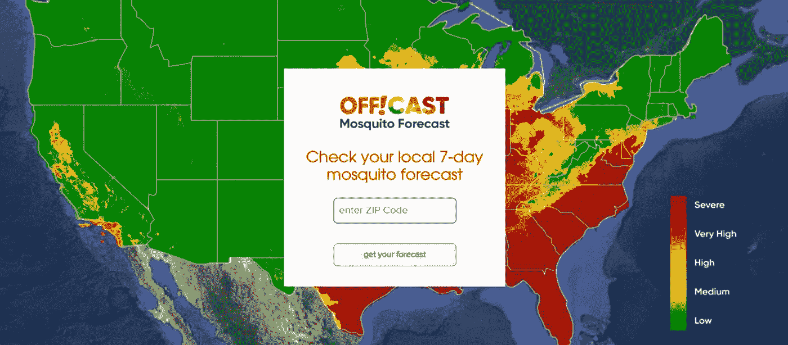

# 谷歌云平台技术金块—2022 年 5 月 1 日至 15 日版

> 原文：<https://medium.com/google-cloud/google-cloud-platform-technology-nuggets-may-1-15-2022-edition-e77e0953e741?source=collection_archive---------0----------------------->

欢迎参加 2022 年 5 月 1 日至 15 日的谷歌云技术金块。

# **会议**

[Google I/O](https://io.google/2022/)’22，我们的年度开发者大会于上周 5 月 11 日至 12 日举行，云轨道见证了越来越多的参与者和一些重要的公告。

所有重要公告、分组技术会议和研讨会现在都可供您查看。查看这篇全面的[博客文章](https://cloud.google.com/blog/products/application-modernization/google-cloud-at-io-2022-news-roundup?utm_source=ext&utm_medium=partner&utm_campaign=CDR_rom_gcp_gcptechnuggets_feb-a-2022_021622&utm_content=-)，它非常详细地介绍了这个问题。

对于从业者，请查看这个有趣的帖子，它在[演示表单](https://cloud.google.com/blog/topics/developers-practitioners/our-io-2022-announcements-demo-form?utm_source=ext&utm_medium=partner&utm_campaign=CDR_rom_gcp_gcptechnuggets_feb-a-2022_021622&utm_content=-)中介绍了云 PA 主题演讲。

# **云峰会**

未来几周将会有多个云峰会，以下是一些值得关注的峰会:

*   安全峰会| 2022 年 5 月 17 日(您的会议指南是[这里是](https://cloud.google.com/blog/products/identity-security/your-guide-to-sessions-at-google-cloud-security-summit-2022?utm_source=ext&utm_medium=partner&utm_campaign=CDR_rom_gcp_gcptechnuggets_feb-a-2022_021622&utm_content=-))
*   创业峰会| 2022 年 6 月 2 日
*   应用 ML 峰会| 2022 年 6 月 9 日
*   可持续发展峰会| 2022 年 6 月 28 日

将[云峰会网站](https://cloud.google.com/blog/topics/events/news-updates-on-the-google-cloud-summit-digital-event-series-2022?utm_source=ext&utm_medium=partner&utm_campaign=CDR_rom_gcp_gcptechnuggets_feb-a-2022_021622&utm_content=-)加入书签，这样你就能随时了解即将到来的峰会的最新动态。这个网站会经常更新。

# **客户**

蚊子是地球上最危险的生物之一，它们导致数百万人感染了它们传播的疾病。s . C . Johnson——一家领先的制药专业公司与谷歌云合作，建立了一个了解蚊子密度的系统。结果脱了！这是一个新的公开的，预测蚊子种群何时何地在全国范围内出现的模型。

该型号目前已在美国地区上市，不久将在巴西和墨西哥上市。看看这篇[博客文章](https://cloud.google.com/blog/products/data-analytics/sc-johnson-forecasts-mosquitoes-with-google-earth-engine?utm_source=ext&utm_medium=partner&utm_campaign=CDR_rom_gcp_gcptechnuggets_feb-a-2022_021622&utm_content=-)，它详细介绍了他们是如何建造它的。

# **安全**

软件供应链安全是一个受到极大关注的领域，并且现在对于确保我们用来构建应用程序工件的依赖关系已经被证明是可以安全集成的是必不可少的。

[开源洞察](https://deps.dev/)项目扫描来自 npm、Go、Maven、PyPI 和 Cargo 生态系统的数百万个开源包，计算它们的依赖图，并用安全建议、许可信息、流行度指标和其他元数据注释这些图。

谷歌云现在已经提供了一个 [BigQuery 数据集](https://console.cloud.google.com/marketplace/product/bigquery-public-data/deps-dev?_ga=2.45147364.-1909587217.1652764787)，在这里你可以探索和分析跨支持的生态系统的开源包的依赖性、咨询、所有权、许可证和其他元数据，以及这些元数据如何随着时间的推移而变化。查看[博客文章](https://cloud.google.com/blog/products/identity-security/announcing-open-source-insights-data-in-bigquery?utm_source=ext&utm_medium=partner&utm_campaign=CDR_rom_gcp_gcptechnuggets_feb-a-2022_021622&utm_content=-)了解更多详情。

# **德沃普斯和 SRE**

当您在组织中采用 SRE 时，一个关键的挑战是建立现实的 SLO。它们可以实现吗？我们知道我们应该设置什么样的值吗？我们应该仅仅依靠历史数据来指导我们吗？有没有一个模型可以用来评估潜在的风险，并了解什么是现实的目标？

看看这篇关于如何通过风险评估框架分析风险的[博文](https://bit.ly/3LLW2GW?utm_source=ext&utm_medium=partner&utm_campaign=CDR_rom_gcp_gcptechnuggets_feb-a-2022_021622&utm_content=-)，该风险评估框架着眼于这些风险将对你的 MTTD、MTTR 等地产生的影响。有一个 [Google 表单模板](https://bit.ly/3Fjshe4?utm_source=ext&utm_medium=partner&utm_campaign=CDR_rom_gcp_gcptechnuggets_feb-a-2022_021622&utm_content=-)供您使用和执行此评估。

# **机器学习**

云 TPU 虚拟机现已正式推出。查看[博客文章](https://cloud.google.com/blog/products/compute/cloud-tpu-vms-are-generally-available?utm_source=ext&utm_medium=partner&utm_campaign=CDR_rom_gcp_gcptechnuggets_feb-a-2022_021622&utm_content=-)，了解更多关于它们的独特之处、发布的附加功能以及 Customer Snap 如何使用它们的详细信息。

在 Google I/O’22 上，Google 宣布了世界上最快、最高效、最可持续的 ML 基础设施中心之一。该中心由云 TPU v4 吊舱提供动力，并在 90%无碳能源的情况下提供这种计算能力。查看[的博文](https://cloud.google.com/blog/products/compute/google-unveils-worlds-largest-publicly-available-ml-cluster?utm_source=ext&utm_medium=partner&utm_campaign=CDR_rom_gcp_gcptechnuggets_feb-a-2022_021622&utm_content=-)了解更多细节。

[谷歌云应用 ML 峰会](https://cloudonair.withgoogle.com/events/summit-applied-ml-2022?utm_source=cgc-blog&utm_medium=blog&utm_campaign=FY22-Q2-global-EXPMKT14-onlineevent-er-applied-ml-summit-2022-main&utm_content=ml_teaser&utm_term=-)将于 6 月 9 日举行。请注册以了解更多关于这些工具的信息，以及客户如何在此基础上构建创新的解决方案。

# **数据库和分析**

在这份新闻简报中，我们在这一领域发布了许多公告。

最近最大的[公告之一](https://cloud.google.com/blog/products/databases/introducing-alloydb-for-postgresql?utm_source=ext&utm_medium=partner&utm_campaign=CDR_rom_gcp_gcptechnuggets_feb-a-2022_021622&utm_content=-)是关于 [AlloyDB for PostgreSQL](https://cloud.google.com/blog/products/databases/introducing-alloydb-for-postgresql?utm_source=ext&utm_medium=partner&utm_campaign=CDR_rom_gcp_gcptechnuggets_feb-a-2022_021622&utm_content=-) 的公告，这是一个完全托管的、PostgreSQL 兼容的数据库服务，为最苛刻的企业数据库工作负载的现代化提供了一个强大的选项。在性能测试中，与标准 PostgreSQL 相比，它在事务性工作负载上的执行速度提高了 4 倍以上，在分析性查询上的执行速度提高了 100 倍。

如果您想尝试一下(AlloyDB for PostgreSQL 在预览版中可用)，请访问[cloud.google.com/alloydb](http://cloud.google.com/alloydb?utm_source=ext&utm_medium=partner&utm_campaign=CDR_rom_gcp_gcptechnuggets_feb-a-2022_021622&utm_content=-)开始创建您的第一个集群。如果你对技术有兴趣，可以看看[的这篇博文](https://cloud.google.com/blog/products/databases/alloydb-for-postgresql-intelligent-scalable-storage?utm_source=ext&utm_medium=partner&utm_campaign=CDR_rom_gcp_gcptechnuggets_feb-a-2022_021622&utm_content=-)，它讨论了它是如何构建的，以及读/写操作的细节等等。

第二个要强调的故事是，如何构建一个[数据分析解决方案来解决食物浪费问题](https://cloud.google.com/blog/products/data-analytics/solving-for-food-waste-with-data-analytics-in-google-cloud?utm_source=ext&utm_medium=partner&utm_campaign=CDR_rom_gcp_gcptechnuggets_feb-a-2022_021622&utm_content=-)。前提是，农产品从农场到商店再到最终消费者手中的过程应该是高效的，并有充足的时间让食物保持新鲜。这是一个复杂的过程，充满了供应链挑战等等。查看一个解决方案，展示如何使用谷歌云数据工程工具，通过在截止日期前销售尽可能多的易腐新鲜食品，最大限度地减少食物浪费，最大限度地提高收入。

在我们的下一个故事中，我们现在有了可用的 BigQuery 远程函数的预览图。远程函数是用户定义的函数(UDF ),允许您使用自己的自定义代码扩展 BigQuery SQL，这些代码在云函数中编写和托管

正如博文中所说的“远程 UDF 接受 BigQuery 的列作为输入，使用云函数对该输入执行操作，并将这些操作的结果作为查询结果中的一个值返回。使用远程函数，您现在可以用 Node.js、Python、Go、Java、NET、Ruby 或 PHP 编写自定义 SQL 函数。这种能力意味着您可以为您的公司个性化 BigQuery，利用相同的管理和权限模型，而不必管理服务器。”

“Google Cloud 上数据库的权威指南”系列继续第二部分，看看 Google Cloud 上可用的不同数据库选项。

如果您错过了关于数据库建模基础的第一部分，也请查看[第 1 部分](https://cloud.google.com/blog/topics/developers-practitioners/definitive-guide-databases-google-cloud-part-1-data-modeling-basics?utm_source=ext&utm_medium=partner&utm_campaign=CDR_rom_gcp_gcptechnuggets_feb-a-2022_021622&utm_content=-)。

# **让我们来了解一下谷歌云**

我们更新了谷歌云创业技术指南系列。该系列针对初创企业，以及它们如何应对三个典型的成长阶段:起步、建设和成长。

Start 系列最近发布了(整个播放列表[在这里](https://bit.ly/3qaK0OM?utm_source=ext&utm_medium=partner&utm_campaign=CDR_rom_gcp_gcptechnuggets_feb-a-2022_021622&utm_content=-)), Build 系列现在已经开始了。

构建系列侧重于优化部署和扩展您的业务。查看谷歌云技术频道的网站和完整播放列表。

# **保持联系**

对这份时事通讯有任何问题、意见或其他反馈吗？请发送[反馈](https://forms.gle/UAsAS7YLxYSBTNBy9)。

想要关注新的谷歌云产品发布吗？我们有一个方便的页面，您可以将它加入书签→[Google Cloud 的新功能](https://bit.ly/3umz3cA?utm_source=ext&utm_medium=partner&utm_campaign=CDR_rom_gcp_gcptechnuggets_feb-a-2022_021622&utm_content=-)。