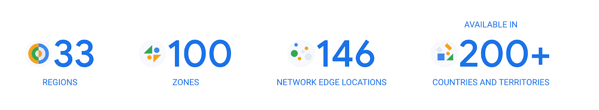
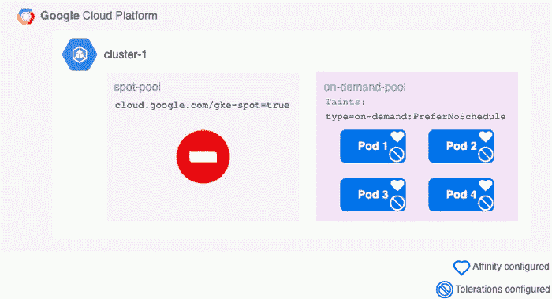
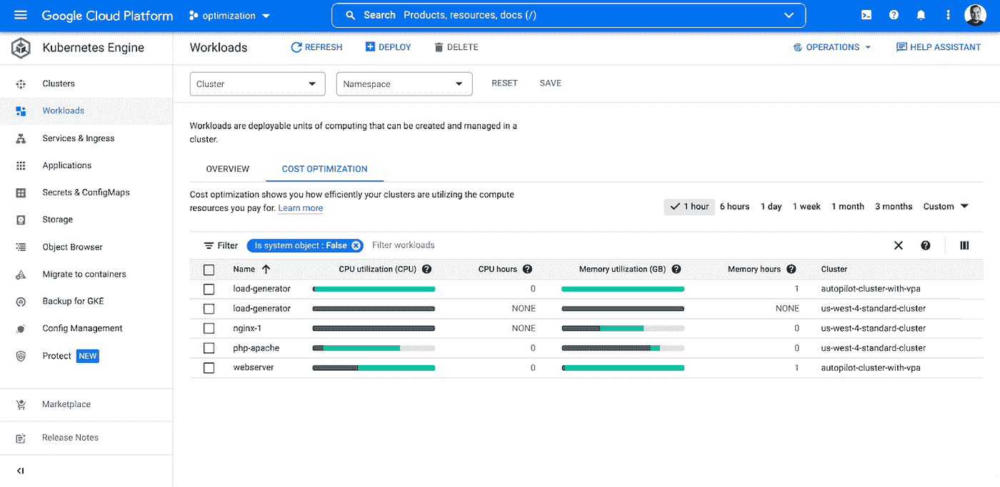
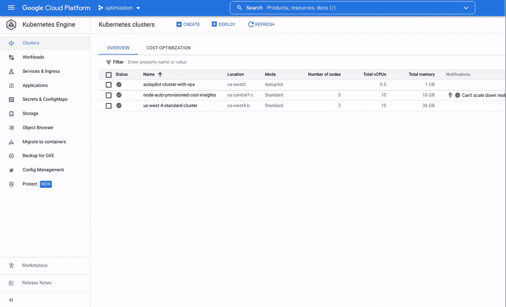
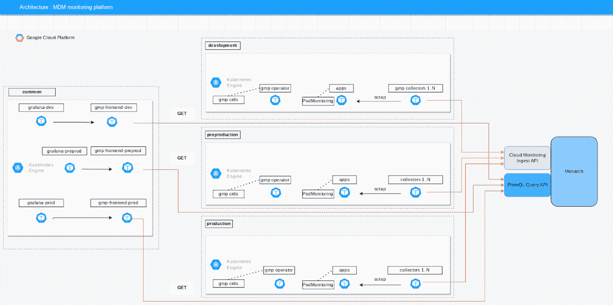
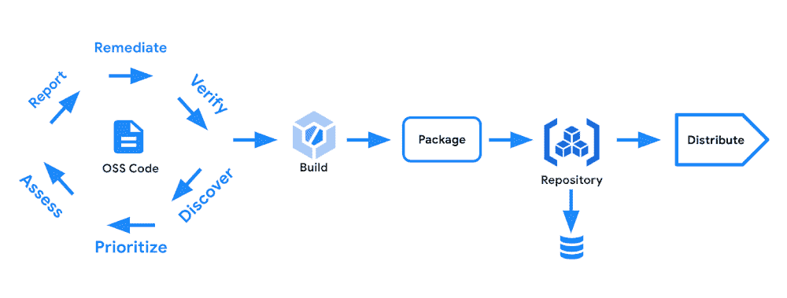
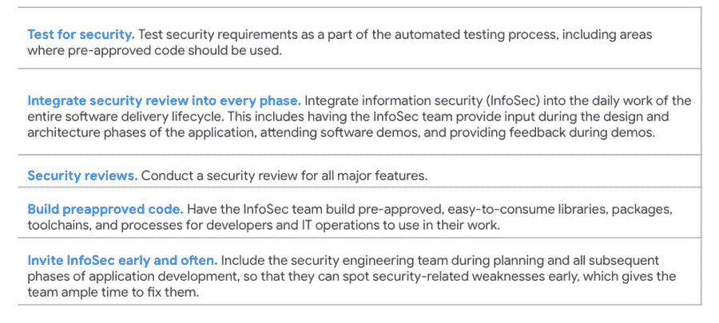
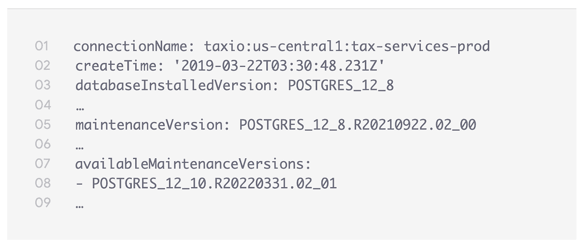
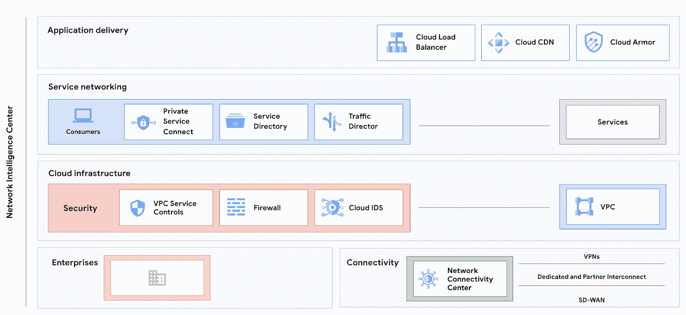
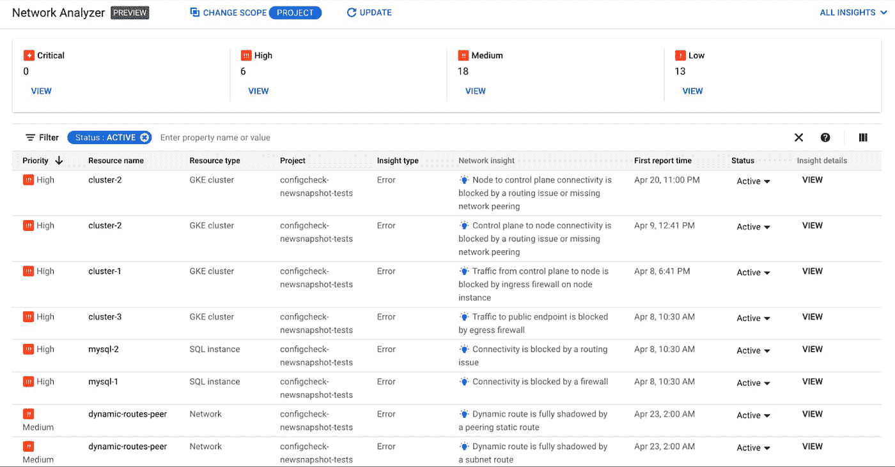

# 谷歌云平台技术金块—2022 年 5 月 16 日至 31 日版

> 原文：<https://medium.com/google-cloud/google-cloud-platform-technology-nuggets-may-16-31-2022-edition-9b8d319d2357?source=collection_archive---------1----------------------->

欢迎参加 2022 年 5 月 16 日至 31 日的谷歌云技术金块。

# **基础设施**

作为基础设施计划的一部分，谷歌云增加了两个新地区:[俄亥俄州哥伦布](https://cloud.google.com/blog/products/infrastructure/new-google-cloud-region-in-columbus-ohio-is-open)和[西班牙马德里](https://cloud.google.com/blog/products/infrastructure/new-google-cloud-region-in-madrid-spain-now-open)。这使得区域数量达到 33 个。

查看官方的 [Google Cloud Locations 页面](https://cloud.google.com/about/locations),了解更多地区信息、各种可用服务等。

现货虚拟机价格比按需虚拟机低 60–91 %,现已正式上市。[博客文章](https://cloud.google.com/blog/products/compute/google-cloud-spot-vms-now-ga)描述了多种工作负载，其中您可以利用 Spot 虚拟机，如 GKE、GKE 自动驾驶 Spot Pods 等。此外，Terraform Google Cloud Provider 也更新了对 Spot VMs 的支持。查看 [Spot VM 文档](https://cloud.google.com/compute/docs/instances/spot)了解更多信息。

查看这篇[文章](https://cloud.google.com/blog/topics/developers-practitioners/running-gke-application-spot-nodes-demand-nodes-fallback)，它给出了如何在 Spot 节点上运行 GKE 应用程序的详细信息，并将按需节点作为后备。

# **集装箱和 GKE**

对于 Kubernetes 集群，您已经设置了资源请求和限制。但是，这些设置是否真正正确地调整了您的集群规模，还是最终导致了过度配置？帮助即将到来，GKE 现在为您提供端到端的工作流程，帮助您发现优化机会，分析特定工作负载的资源请求建议，并根据这些建议采取行动。查看[博客文章](https://cloud.google.com/blog/products/containers-kubernetes/workload-rightsizing-now-available-for-gke)了解详细信息，即使您刚到 GKE 和/或希望优化现有集群，它也能为您提供指导。

虽然我们仍然在优化的话题上，但是如何理解运行您的 GKE 工作负载的成本，并在 Google Cloud console 中正确地这样做。GKE 成本估算器现在可以在控制台中使用。查看[博客文章](https://cloud.google.com/blog/products/containers-kubernetes/introducing-the-new-gke-cost-estimator)了解更多详情。

# **顾客**

在本期的客户故事中，我们将讲述世界之家[为普罗米修斯提供托管服务的历程](https://cloud.google.com/blog/products/devops-sre/maisons-du-monde-improved-their-kubernetes-observability)。旅程从他们转向 Google Kubernetes 引擎开始，他们主持了一个自我管理的 Prometheus 设置。随着规模的增长，他们面临着花费大量时间和精力来维持运营的挑战。这篇博文详细介绍了他们如何转移到 Prometheus 的[托管服务，以及他们必须进行的改变。](https://cloud.google.com/managed-prometheus)

# **安全**

查看[安全综述](https://cloud.google.com/blog/topics/developers-practitioners/security-roundup-stories-and-launches-first-quarter-2022)——2022 年第一季度的故事集。故事包括 GKE 基础——安全基础知识、确保 CI/CD 管道安全、防范拒绝服务和洪水攻击等。

放心开源软件服务是谷歌的新产品，它允许组织轻松地将谷歌使用的相同 OSS 包整合到他们自己的开发人员工作流程中。为了帮助理解这些包所经受的测试和验证的种类，请查看[博客文章](https://cloud.google.com/blog/products/identity-security/introducing-assured-open-source-software-service)。

Assured OSS 预计将于 2022 年第三季度进入预览版。如果有兴趣，请填写这张[表格](https://go.chronicle.security/assured-oss)。

# **德沃普斯和 SRE**

Google Cloud 和 DORA 的 [State of DevOps 报告](https://cloud.google.com/devops#read-dora%E2%80%99s-state-of-devops-reports-and-devops-roi-whitepaper)是持续时间最长的研究项目之一，该项目着眼于组织在质量、规模和速度方面生产软件的最佳实践，同时关注可靠性和安全性。 [2022 年开发运维状况调查现已开始](https://google.qualtrics.com/jfe/form/SV_2aXfK0Zw75lvCl0?source=blog)，无论您的组织规模如何，也无论您已实施的开发运维水平如何，请参与并完成调查。调查截止到 2022 年 7 月 22 日。本次调查的重点是一个越来越重要的领域:安全性，以及组织如何在其安全立场上左移，并在流程的早期引入它。下面举例说明了组织可以做些什么来帮助实现这一点:

查看[的博文](https://cloud.google.com/blog/products/devops-sre/take-the-2022-state-of-devops-survey)了解更多细节，如果你有兴趣阅读 2021 年 DevOps 启动报告，请查看此[链接](https://cloud.google.com/blog/products/devops-sre/announcing-dora-2021-accelerate-state-of-devops-report)。

在其他材料中，DORA 团队发布了 DevOps 企业指南，该指南将为您提供具体的行动计划，以实施使用 Google Cloud 的 DORA research 来启动性能改进的建议。该指南将分阶段发布，目前是第一章，正如[博客帖子](https://cloud.google.com/blog/products/devops-sre/devops-enterprise-guidebook-chapter-1)所述，“第一章的目标是让您的组织更好地了解如何使用 [DORA 的资源](https://cloud.google.com/devops)来衡量您的绩效，并开始您的第一次 DevOps 团队实验。”

Prometheus 的托管服务于今年 3 月正式上市。谷歌云推出了一个新的低成本、高使用率的定价层，专为那些将大量 Kubernetes 指标转移到该服务的客户设计。此外，当前的使用层级定价也有所降低(降低了 25%)。查看[博客文章](https://cloud.google.com/blog/products/devops-sre/managed-service-for-prometheus-offers-new-pricing-tier)了解价格变化。熟悉 Prometheus 的[托管服务的最佳方式之一是通过 Qwiklabs](https://go.qwiklabs.com/Google-Cloud-Workshops-Prometheus) ，该服务在 6 月 15 日之前免费提供。它包含大约 4.5 小时的内容，涵盖迁移、指标收集、分析和成本节约策略。

# **数据库和分析**

[针对 Spanner](https://cloud.google.com/spanner/docs/change-streams/index) 的变更流，允许用户从他们的云 Spanner 数据库中近乎实时地跟踪和流出变更(插入、更新和删除)。这些变更流可用于分析，通过消息传递驱动下游应用程序，甚至用于法规遵从性目的。扳手的更改流现已在 GA 中提供，您可以从这里[开始](https://cloud.google.com/spanner/docs/change-streams/index)。

使用云 SQL 之类的托管服务的好处之一是，它会为您安排定期维护。但是，很可能计划的维护窗口对您不起作用，您希望尽快获得特定的版本。Cloud SQL 现已在 GA 中推出了[自助服务维护](https://cloud.google.com/sql/docs/mysql/self-service-maintenance)，为您提供了这样做的灵活性。查看[博客文章](https://cloud.google.com/blog/products/databases/cloud-sql-launches-self-service-maintenance)了解更多详情。

如果您希望将数据库从内部(物理或 VMware)迁移到 Google Cloud VMware Engine (GCVE ),请查看这篇概述了迁移流程和工具的[博客文章](https://cloud.google.com/blog/products/databases/migrate-databases-to-google-cloud-vmware-engine-gcve)。方法是首先使用 VMware HCX、PlateSpin Migrate 等工具进行提升和转移，如果不可行，则讨论重新平台选项。

# **联网**

当您在多个环境中运行服务时，主要挑战包括以安全可靠的方式连接这些服务、流量管理和安全边界。关键的 Google 云网络解决方案可以帮助您实现这一目标，其中包括:云负载平衡器、混合负载平衡和混合连接，以及私有服务连接。这篇[博客文章](https://cloud.google.com/blog/products/networking/networking-spotlight-2022)深入描述了谷歌云网络堆栈以及如何高效地设计这些网络。

谷歌云网络引入了网络情报中心(NIC)的最新模块:[网络分析器](https://cloud.google.com/network-intelligence-center/docs/network-analyzer/overview)。主要功能包括自动检测由底层网络引起的故障，显示根本原因分析，并建议最佳实践来提高服务的可用性、性能和安全性。开箱即用，它支持持续监控 GCE 和 GKE 网络配置的分析器，包括负载平衡器、混合连接等网络服务，以及与云 SQL 等谷歌服务的连接。它甚至主动监控任何可能导致故障或次优配置的用户推出的配置更改。查看[的博客文章](https://cloud.google.com/blog/products/networking/introducing-network-analyzer-detect-service-and-network-issues)了解更多细节。

# **谷歌云认证**

Google Cloud 认证是组织确保其员工掌握 Google Cloud 正确技能的一个好方法。查看这篇博客文章，它指出了组织由于技能短缺而面临的挑战，以及谷歌云认证是如何帮助弥合这一差距的。下载一份 [IDC 白皮书](https://cloud.google.com/training/value-of-training-idc-paper)，其中强调了认证对您团队的价值。我们将于 6 月 2 日举行[网络研讨会，届时将展示开始认证之旅是多么简单。查看](https://cloudonair.withgoogle.com/events/get-started-google-cloud-training?utm_source=google&utm_medium=blog&utm_campaign=FY22-Q2-global-PMKT72-onlineevent-er-June-learning-cert&utm_content=may2022)[博客文章](https://cloud.google.com/blog/topics/training-certifications/value-of-google-cloud-certifications)了解更多详情。

说到认证，谷歌云也有[技能徽章](https://www.cloudskillsboost.google/catalog?keywords=&locale=&solution%5B%5D=any&role%5B%5D=any&skill-badge%5B%5D=skill-badge&format%5B%5D=any&level%5B%5D=any&duration%5B%5D=any&language%5B%5D=any)，你可以在完成实验/任务时领取。查看[的博客文章](https://cloud.google.com/blog/topics/training-certifications/value-of-google-cloud-skill-badges)，了解技能徽章的价值以及如何从今天开始。

# 保持联系

对这份时事通讯有任何问题、意见或其他反馈吗？请发送[反馈](https://forms.gle/UAsAS7YLxYSBTNBy9)。

想要关注新的谷歌云产品发布吗？我们有一个方便的页面，你可以把它加入书签→ [谷歌云的新功能](https://bit.ly/3umz3cA?utm_source=ext&utm_medium=partner&utm_campaign=CDR_rom_gcp_gcptechnuggets_feb-a-2022_021622&utm_content=-)。