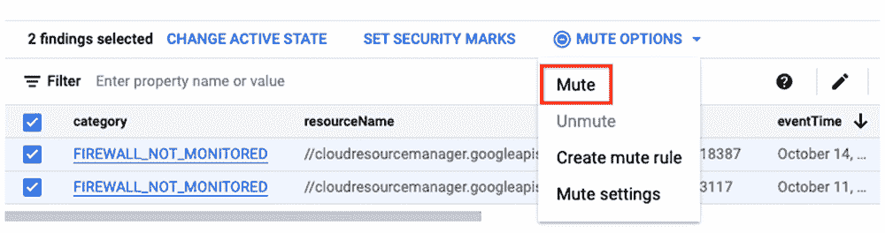
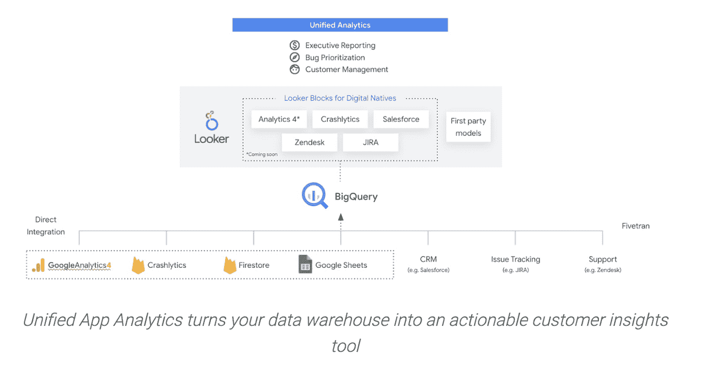
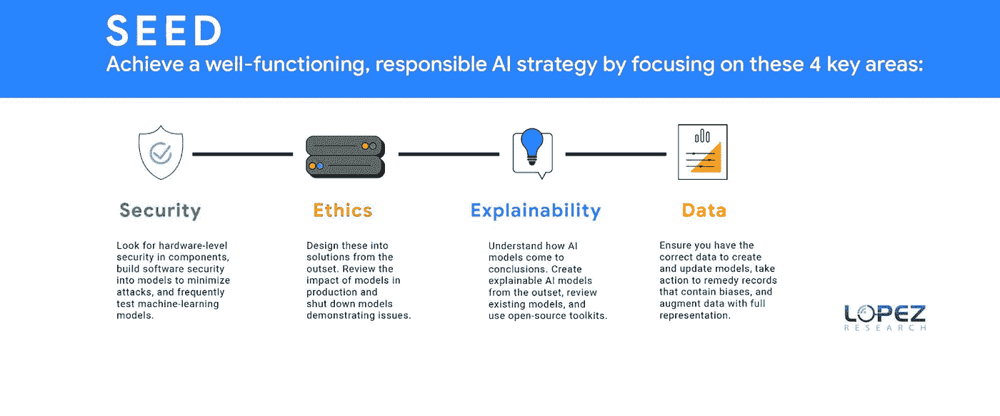
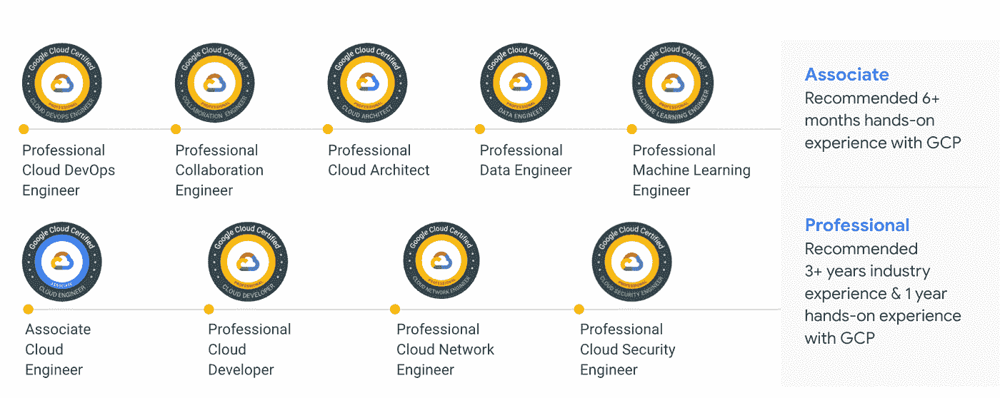
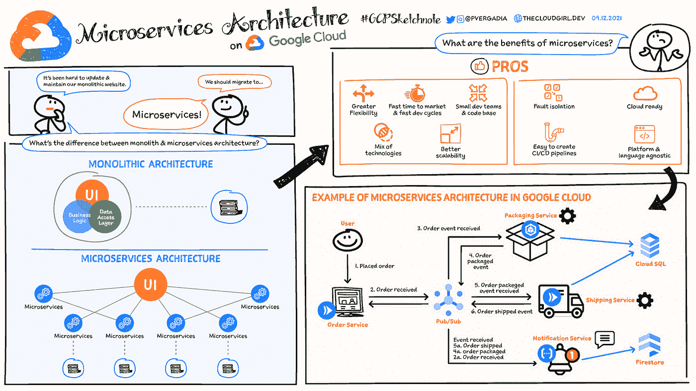
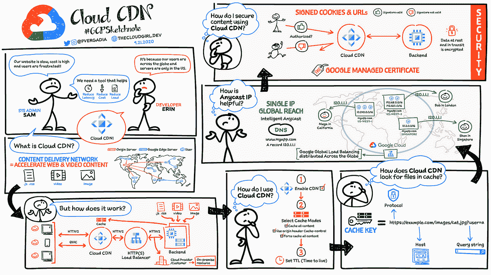

# 谷歌云平台—技术金块—2021 年 11 月 16 日至 30 日版

> 原文：<https://medium.com/google-cloud/google-cloud-platform-technology-nuggets-november-16-30-2021-edition-b764c2168a49?source=collection_archive---------3----------------------->

欢迎参加 2021 年 11 月 16 日至 30 日的谷歌云平台技术金块。

## **混合云与多云**

当今强大计算选项的可用性以及本地化处理的需求使得架构师的思考超越了传统数据中心的局限。边缘计算通常被认为是解决这些架构的一种方式，但边缘计算到底是什么，需要考虑哪些因素，以及目前 Google 云解决方案中有哪些选项可以实现这一点。在由 3 部分组成的边缘计算系列中，我们将详细探讨以下几点:

*   [第一部分](http://mail01.tinyletterapp.com/GCP-Tech-Nuggets/google-cloud-platform-technology-nuggets-november-16-30-2021-edition/20314358-cloud.google.com/blog/topics/hybrid-cloud/edge-plus-cloud-enables-new-kinds-of-enterprise-apps?c=0e8b778a-44af-b6cd-d4bd-49cc6ae6c9bc):边缘计算——过去和现在
*   [第二部分](http://mail01.tinyletterapp.com/GCP-Tech-Nuggets/google-cloud-platform-technology-nuggets-november-16-30-2021-edition/20314362-cloud.google.com/blog/topics/hybrid-cloud/edge-computing-architectural-challenges-and-pitfalls?c=0e8b778a-44af-b6cd-d4bd-49cc6ae6c9bc):为边缘计算设计应用
*   第三部分:谷歌边缘计算云解决方案

## **客户**

黑色星期五的销售是一个很好的指标，表明领先品牌如何让他们的技术基础设施准备好处理这一时期通常会出现的巨大负载。在这一集中，领先的互联网商务基础设施提供商 Shopify 在黑色星期五网络星期一(BFCM)销售期间取得的规模简直令人难以置信。

我引用博客帖子中的话，“每分钟 310 万美元的峰值销售额”，“我们的基础架构中平均每分钟约 30TB 的出站流量”等等。这里的 [Twitter 线程](http://mail01.tinyletterapp.com/GCP-Tech-Nuggets/google-cloud-platform-technology-nuggets-november-16-30-2021-edition/20314370-twitter.com/shopifyeng/status/1465806691543531525?c=0e8b778a-44af-b6cd-d4bd-49cc6ae6c9bc)有一些更有趣的统计数据，看到 MySQL 服务器处理的规模是很有趣的。

阅读这篇[博客文章](http://mail01.tinyletterapp.com/GCP-Tech-Nuggets/google-cloud-platform-technology-nuggets-november-16-30-2021-edition/20314374-cloud.google.com/blog/topics/retail/shopify-and-google-cloud-team-up-for-an-epic-bfcm-weekend?c=0e8b778a-44af-b6cd-d4bd-49cc6ae6c9bc)中的更多内容。

## **身份&安全**

[安全指挥中心(SCC)](http://mail01.tinyletterapp.com/GCP-Tech-Nuggets/google-cloud-platform-technology-nuggets-november-16-30-2021-edition/20314378-cloud.google.com/security-command-center?c=0e8b778a-44af-b6cd-d4bd-49cc6ae6c9bc) 是谷歌云的安全和风险管理平台。它提供对云资产的可见性，发现错误配置和漏洞，检测威胁，并帮助保持符合行业标准和基准。如果您使用 SCC 来扫描您的环境，您会注意到这些发现被报告到数百个项目中。这很可能会导致一些关键的发现没有出现在最上面，并且很可能会导致工具没有达到它的主要目标。

就像我们将警报疲劳作为运营支持中需要解决的问题之一一样，重要的是**隐藏**SCC 的一些发现，而是关注那些重要的发现。您可能希望屏蔽的一些调查结果示例包括非生产环境中的资产、在不包含关键数据的项目中使用客户管理的密钥的建议等。使用 SCC 中的[静音发现，您现在可以设置规则来静音某些发现，同时仍然保留根据需要管理这些设置的控制权。](http://mail01.tinyletterapp.com/GCP-Tech-Nuggets/google-cloud-platform-technology-nuggets-november-16-30-2021-edition/20314382-cloud.google.com/blog/products/identity-security/announcing-mute-findings-capability-security-command-center?c=0e8b778a-44af-b6cd-d4bd-49cc6ae6c9bc)

我们要讨论的下一个主题是关于将更多的现场可靠性工程(SRE)原则引入日常安全运营工作的有趣工作。这项研究特别关注辛劳，这是你为完成任务而做的可重复的手工工作。换句话说，如果你让系统保持工作后的状态，这很可能是一件苦差事。相反，你需要关注的是引入 SRE 的指导原则之一，即减少辛劳。在这篇[博客文章](http://mail01.tinyletterapp.com/GCP-Tech-Nuggets/google-cloud-platform-technology-nuggets-november-16-30-2021-edition/20314386-cloud.google.com/blog/products/identity-security/achieving-autonomic-security-operations-reducing-toil?c=0e8b778a-44af-b6cd-d4bd-49cc6ae6c9bc)中，作者强调了如何以渐进的方式将 SRE 原则引入您的安全运营中心(SOC)团队，这可能会带来多重好处。

继续谈安全问题，[报名参加](http://mail01.tinyletterapp.com/GCP-Tech-Nuggets/google-cloud-platform-technology-nuggets-november-16-30-2021-edition/20314390-cloudonair.withgoogle.com/events/security-talks-december-2021?c=0e8b778a-44af-b6cd-d4bd-49cc6ae6c9bc)12 月 15 日名为[2021 年谷歌云安全会谈](http://mail01.tinyletterapp.com/GCP-Tech-Nuggets/google-cloud-platform-technology-nuggets-november-16-30-2021-edition/20314390-cloudonair.withgoogle.com/events/security-talks-december-2021?c=0e8b778a-44af-b6cd-d4bd-49cc6ae6c9bc)的在线直播活动。来了解对员工、用户和用户数据的零信任方法。

## **数据分析**

谷歌云已经提供了超过 30 种数据分析设计模式，这是一套技术解决方案，可以帮助客户使用可参考的架构、模型和可部署的源代码来启动他们的旅程。这种需求的出现是因为组织仍然努力挖掘各种数据源以获得洞察力，而解决典型领域问题的一套解决方案肯定会有所帮助。

[博客文章](http://mail01.tinyletterapp.com/GCP-Tech-Nuggets/google-cloud-platform-technology-nuggets-november-16-30-2021-edition/20314398-cloud.google.com/blog/products/data-analytics/accelerate-time-to-value-with-google-cloud-design-patterns?c=0e8b778a-44af-b6cd-d4bd-49cc6ae6c9bc)强调了 3 种这样的模式:[异常检测](http://mail01.tinyletterapp.com/GCP-Tech-Nuggets/google-cloud-platform-technology-nuggets-november-16-30-2021-edition/20314402-cloud.google.com/blog/products/data-analytics/using-automated-ml-streaming-architecture-to-find-anomalies?c=0e8b778a-44af-b6cd-d4bd-49cc6ae6c9bc)、[价格优化](http://mail01.tinyletterapp.com/GCP-Tech-Nuggets/google-cloud-platform-technology-nuggets-november-16-30-2021-edition/20314406-cloud.google.com/blog/products/data-analytics/centralize-data-sources-into-bigquery-with-dataprep?c=0e8b778a-44af-b6cd-d4bd-49cc6ae6c9bc)和[统一应用分析](http://mail01.tinyletterapp.com/GCP-Tech-Nuggets/google-cloud-platform-technology-nuggets-november-16-30-2021-edition/20314410-cloud.google.com/blog/topics/developers-practitioners/creating-unified-analytics-platform-digital-natives?c=0e8b778a-44af-b6cd-d4bd-49cc6ae6c9bc)但是你可以在这里明确引用整套。

## **机器学习**

如果你想了解机器学习，并发现很难浏览互联网上的大量材料，我可以推荐一门课程。由 Cassie Kozyrkov 教授的名为**与机器学习交朋友**的 4 部分课程最初是谷歌的内部课程，现在每个人都可以参加。

该课程旨在为您提供有效参与机器学习以解决业务问题所需的工具。它旨在让您正确理解核心机器学习概念和方法，避免机器学习中的常见错误，引导机器学习项目从概念到启动的步骤，并提高您与 ML 专家和非专家沟通的能力。

这是整个教程(几个小时，但值得你花时间):

*   [第 1 部分](http://mail01.tinyletterapp.com/GCP-Tech-Nuggets/google-cloud-platform-technology-nuggets-november-16-30-2021-edition/20314414-bit.ly/mfml_part1?c=0e8b778a-44af-b6cd-d4bd-49cc6ae6c9bc):ML 简介
*   第二部分:机器学习项目的生命
*   [第三部分](http://mail01.tinyletterapp.com/GCP-Tech-Nuggets/google-cloud-platform-technology-nuggets-november-16-30-2021-edition/20314422-bit.ly/mfml_part3?c=0e8b778a-44af-b6cd-d4bd-49cc6ae6c9bc):从原型到生产的 AI
*   [第四部](http://mail01.tinyletterapp.com/GCP-Tech-Nuggets/google-cloud-platform-technology-nuggets-november-16-30-2021-edition/20314426-bit.ly/mfml_part4?c=0e8b778a-44af-b6cd-d4bd-49cc6ae6c9bc):打开黑盒

当谈到人工智能时，向伦理人工智能结果的转移正在成为一个优先事项，以确保模型的结果是公平的。创建一个框架来确保组织能够交付公平的结果需要什么？Lopez Research 给出了一个 4 步流程框架种子(安全性、伦理、可解释性和数据)，以确保:

在[博客文章](http://mail01.tinyletterapp.com/GCP-Tech-Nuggets/google-cloud-platform-technology-nuggets-november-16-30-2021-edition/20314430-cloud.google.com/blog/topics/business-transformation/4-tasks-to-ensure-your-companys-ai-is-ethical?c=0e8b778a-44af-b6cd-d4bd-49cc6ae6c9bc)中阅读更多内容。

## **无服务器应用开发**

首先是[博客文章](http://mail01.tinyletterapp.com/GCP-Tech-Nuggets/google-cloud-platform-technology-nuggets-november-16-30-2021-edition/20314434-cloud.google.com/blog/products/serverless/the-next-big-evolution-in-cloud-computing?c=0e8b778a-44af-b6cd-d4bd-49cc6ae6c9bc)，它着眼于无服务器计算的下一次大发展。众所周知，无服务器计算将会继续存在，而“功能即服务”( FaaS)已经完全改变了开发者对构建现代事件驱动应用的看法。然而，开发人员正在突破他们希望在无服务器架构中适应的工作负载类型的限制，正在寻求定价创新、对开放标准的支持、保护软件供应链等。这篇文章着眼于这种演变，以及云运行如何很好地定位于解决无服务器计算的下一次演变。Cloud Run 是过去两年中最成功的产品之一，被广泛采用。如果你是一个云用户，或者打算了解更多，这是一本必不可少的读物。

继续，关于解决 Google Cloud 中的反模式的无服务器系列将继续新的剧集。增加了两个员额:

*   [Part 4](http://mail01.tinyletterapp.com/GCP-Tech-Nuggets/google-cloud-platform-technology-nuggets-november-16-30-2021-edition/20314438-cloud.google.com/blog/topics/developers-practitioners/microservices-architecture-google-cloud?c=0e8b778a-44af-b6cd-d4bd-49cc6ae6c9bc) :如何在你的 Node.js 云函数中正确处理承诺？
*   [第五部分](http://mail01.tinyletterapp.com/GCP-Tech-Nuggets/google-cloud-platform-technology-nuggets-november-16-30-2021-edition/20314442-cloud.google.com/blog/topics/developers-practitioners/avoiding-gcf-anti-patterns-part-5-how-run-background-processes-correctly-python?c=0e8b778a-44af-b6cd-d4bd-49cc6ae6c9bc):如何在 Python 中正确运行后台进程？

## **让我们了解一下 GCP**

[谷歌云认证](http://mail01.tinyletterapp.com/GCP-Tech-Nuggets/google-cloud-platform-technology-nuggets-november-16-30-2021-edition/20314446-cloud.google.com/certification?c=0e8b778a-44af-b6cd-d4bd-49cc6ae6c9bc)是市场上最受欢迎的认证之一。除了助理级认证之外，还有几种专业级认证。[官方认证页面](http://mail01.tinyletterapp.com/GCP-Tech-Nuggets/google-cloud-platform-technology-nuggets-november-16-30-2021-edition/20314446-cloud.google.com/certification?c=0e8b778a-44af-b6cd-d4bd-49cc6ae6c9bc)可在此处获得，在你应该做哪种认证的道路上导航可能会变得混乱。

查看这篇[博客文章](http://mail01.tinyletterapp.com/GCP-Tech-Nuggets/google-cloud-platform-technology-nuggets-november-16-30-2021-edition/20314450-cloud.google.com/blog/topics/developers-practitioners/get-know-google-cloud-certifications-1-minute?c=0e8b778a-44af-b6cd-d4bd-49cc6ae6c9bc)，这篇文章在一分钟内给出了每个认证的概述。

在本期新闻简报中，我们为您准备了一些草图。

第[条注释](http://mail01.tinyletterapp.com/GCP-Tech-Nuggets/google-cloud-platform-technology-nuggets-november-16-30-2021-edition/20314438-cloud.google.com/blog/topics/developers-practitioners/microservices-architecture-google-cloud?c=0e8b778a-44af-b6cd-d4bd-49cc6ae6c9bc)概述了微服务架构的所有内容。看一看。

[第二注](http://mail01.tinyletterapp.com/GCP-Tech-Nuggets/google-cloud-platform-technology-nuggets-november-16-30-2021-edition/20314454-cloud.google.com/blog/topics/developers-practitioners/what-cloud-cdn-and-how-does-it-work?c=0e8b778a-44af-b6cd-d4bd-49cc6ae6c9bc)涵盖了云 CDN，是怎么回事？

## 保持联系！

*有问题、意见或其他反馈。一定要把它送过来。*

*想关注新的谷歌云产品公告吗？我们有一个方便的页面，您应该将它加入书签→*[*Google Cloud*](https://bit.ly/3umz3cA)*的新功能。*