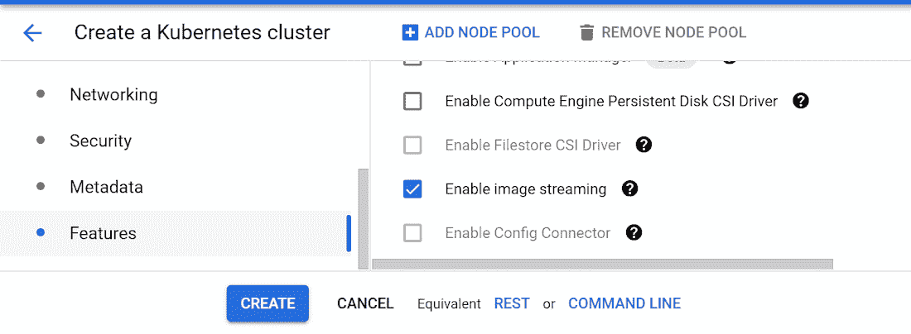
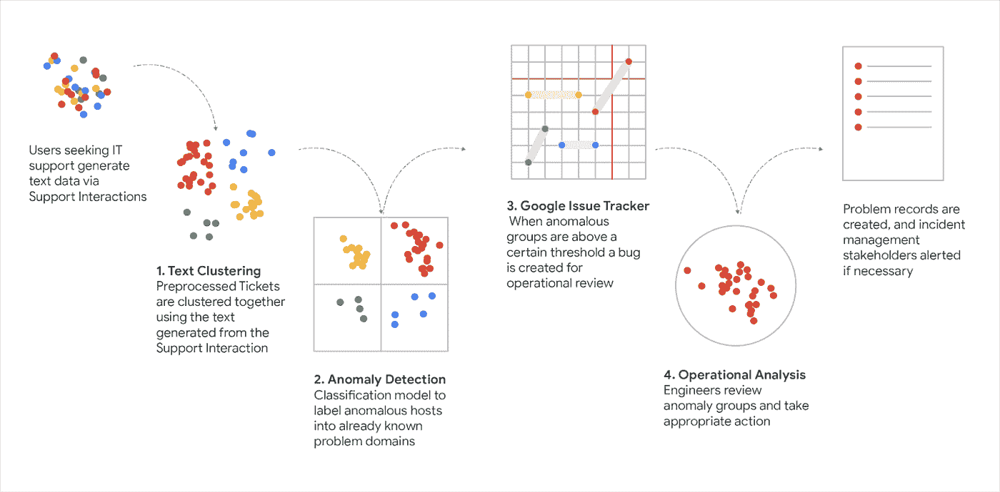
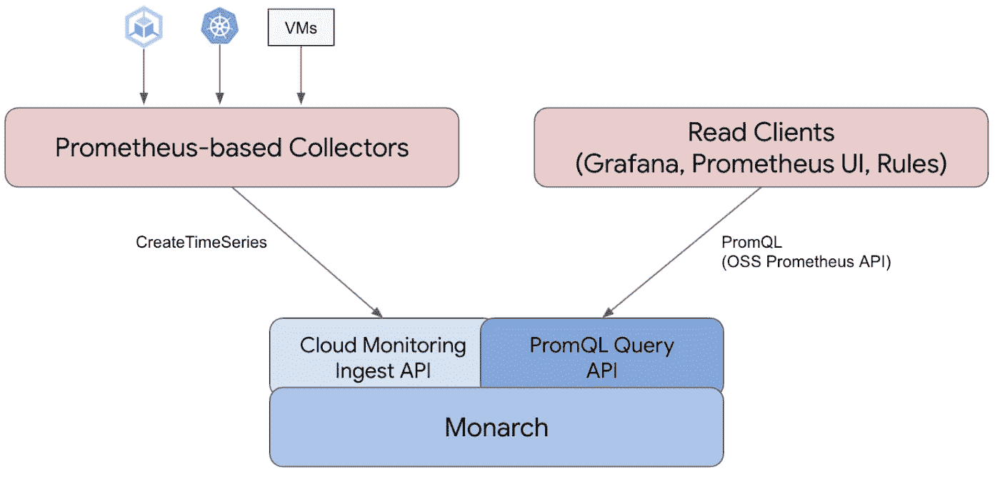
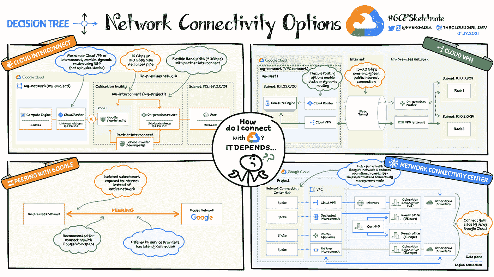

# 谷歌云平台—技术金块—2021 年 11 月 1 日至 15 日版

> 原文：<https://medium.com/google-cloud/google-cloud-platform-technology-nuggets-november-16-31-2021-edition-4d5cd245a538?source=collection_archive---------1----------------------->

欢迎参加 2021 年 11 月 1 日至 15 日的谷歌云平台技术金块。

# **GKE**

在 GKE 已经有了一些关键的更新，并通过这些特性继续推动它成为 Kubernetes 的最佳管理平台。

首先是[容器图像流](https://cloud.google.com/blog/products/containers-kubernetes/introducing-container-image-streaming-in-gke)的概念。当扩展您的应用程序时，在应用程序启动之前，整个容器映像需要完全下载并在节点上可用。容器图像流采取的方式是，应用程序启动并不需要所有的容器图像数据，这意味着对于大图像，它可能会增加启动时间。查看博客帖子了解更多细节。请记住，这个特性适用于[工件注册表](https://cloud.google.com/artifact-registry/)，不适用于[容器注册表](https://cloud.google.com/container-registry)。

接下来是[宣布 GKE 自动驾驶](https://cloud.google.com/blog/products/containers-kubernetes/announcing-spot-pods-for-gke-autopilot)的 Spot Pods。GKE 自动驾驶仪支持 Pod 级别的 SLA，但对于具有容错能力并且能够经受住一些中断的工作负载，您可能不一定需要它。也考虑测试和开发环境。如果情况确实如此，Spot Pods 将这一点带到了下一个极限，谷歌可以抢占(有 25 秒的宽限期)Pod 并将其带走。作为回报，你可以在正常定价的豆荚上获得 60-90%的折扣。这一特性无疑使在 GKE 自动驾驶仪上运行经济高效的工作负载成为现实。Spot Pods 是预览版，从 GKE 版本 1.21.4 开始提供。

# **客户案例**

语言翻译是机器学习中最关键也是最具挑战性的领域之一。谷歌云一直在通过机器学习的各种进步来提供高质量的翻译服务，并将其与功能请求相匹配。文档翻译 API 现已正式发布，它允许翻译多种格式的文档。现在，您可以避免从文档中的文本格式中分离出要翻译的文本的步骤。它可用于 100 多种语言，支持 Docx、PPTx、XLSx 和 PDF 等文档类型，同时保留文档格式。还有许多其他功能，如实时翻译、我们翻译 API 的区域端点，以及礼来公司客户对我们翻译服务的大量使用。查看[博客文章](https://cloud.google.com/blog/products/ai-machine-learning/translation-tools-that-meet-business-needs)了解更多详情。

# **机器学习**

谷歌的 TechStop 团队为整个谷歌提供 it 支持，鉴于过去 1.5 年多的在家工作环境，它不得不应对自身的挑战，以解决其面临的多种 IT 支持请求。帮助处理大量支持请求的关键之一是对收到的请求进行组织/分类，考虑到用户报告问题的各种方式，他们很难为请求创建正确的分类法和分类。通过一种有趣的方法，他们研究了谷歌的垃圾邮件检测多年来如何保护用户免受细微但意义相同的变化的影响。例如，想一想用户报告的 IT 支持票据，它们的意思是相同的，但只是在用词和表达方式上有所不同。

查看[的博客文章](https://cloud.google.com/blog/topics/developers-practitioners/how-spam-detection-taught-us-better-tech-support)，这篇文章强调了围绕密度聚类的各种算法和一套 GCP 工具，他们正在使用这些工具来构建实现这一目标的管道。请关注这篇文章的后续文章，因为整个解决方案将会展示您可以应用自己的定制。

# **云操作**

普罗米修斯的谷歌托管服务现已公开预览。该托管服务保持与开源 Prometheus 产品的兼容性，可以替代您管理的现有 Prometheus 服务。它允许您重复使用您现有的 Prometheus 配置，将您现有的仪表板保留在 Grafana 中，保留您基于 PromQL 的规则& alertsm 部署受管收集器，并且通过其混合+多云功能，您可以监控 Prometheus 可以运行的任何环境。

查看[博客文章](https://cloud.google.com/blog/products/operations/introducing-google-cloud-managed-service-for-prometheus)了解详情。

# **计费**

计费应该很无聊吧？这正是[文章](https://cloud.google.com/blog/topics/developers-practitioners/google-cloud-billing-tutorials-because-surprises-are-home-makeover-shows-not-your-wallet)所说的，因为事实上你不希望每月的云账单有任何惊喜。查看帖子，获取丰富的信息:

*   使用谷歌云了解和分析您的成本
*   付费旅游
*   使用 BigQuery 分析您的云计费数据
*   管理支付方式和设置
*   谷歌云预算之旅

# **无服务器应用开发**

我们关于解决 Google Cloud 中的反模式的无服务器系列将继续新的专题。每个博客都涉及一个我们在支持论坛中多次看到的主题，我们希望强调解决它们的最佳方法，或者换句话说，避免错误的方法。

到目前为止，已经发布了以下博客帖子:

1.[为幂等性设计您的函数](https://cloud.google.com/blog/topics/developers-practitioners/avoiding-gcf-anti-patterns-part-1-how-write-event-driven-cloud-functions-properly-coding-idempotency-mind)

2.[为将来的调用重用云函数实例](https://cloud.google.com/blog/topics/developers-practitioners/avoiding-gcf-anti-patterns-part-2-how-reuse-cloud-function-instances-future-invocations)

3.[从您的函数正确建立出站连接](https://cloud.google.com/blog/topics/developers-practitioners/avoiding-gcf-anti-patterns-part-3-how-establish-outbound-connections-correctly)

4.[如何在你的 Node.js 云函数中正确处理承诺](https://cloud.google.com/blog/topics/developers-practitioners/avoiding-gcf-anti-patterns-part-4-how-handle-promises-correctly-your-nodejs-cloud-function)

# **让我们了解一下 GCP**

我们有一个上一版 sketchnote 的后续 sketch note，在那里我们有一个[关于云网络](https://cloud.google.com/blog/topics/developers-practitioners/google-cloud-networking-overview)的介绍。在本期中，sketchnote 将帮助您了解将您的基础设施连接到 GCP 的几种网络选项。什么时候你会选择一个而不是另一个？需要考虑哪些因素？查看名为[在谷歌云中选择网络连接选项](https://cloud.google.com/blog/topics/developers-practitioners/choosing-network-connectivity-option-google-cloud)的博文和下面的草图。

说到谷歌网络，了解我们不同的[网络服务等级(高级 v/s 标准)](https://cloud.google.com/blog/topics/developers-practitioners/google-cloud-network-service-tiers-overview)以及您何时会选择其中一个？

# 保持联系！

有问题、意见或其他反馈。一定要把它送过来。

*想关注新的谷歌云产品发布吗？我们有一个方便的页面，您应该将它加入书签→*[*Google Cloud 的新功能*](https://bit.ly/3umz3cA) *。*