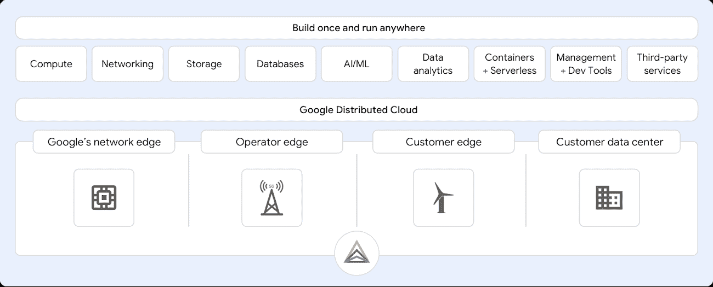
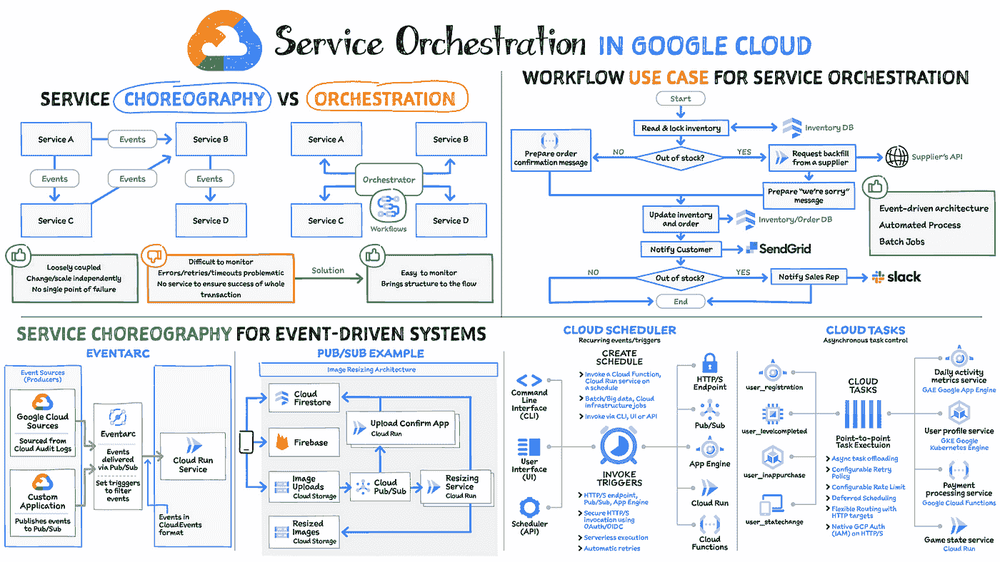

# 谷歌云平台—技术金块—2021 年 10 月 1 日至 15 日版

> 原文：<https://medium.com/google-cloud/google-cloud-platform-technology-nuggets-october-1-15-2021-edition-2fcd0a6b2d05?source=collection_archive---------2----------------------->

欢迎参加 2021 年 10 月 1 日至 15 日的谷歌云技术金块。

我们今年最大的会议， **Google Cloud Next** 于 2021 年 10 月 12 日至 14 日在本周举行，这一期将在 GCP 的各种服务中发布该活动的几个公告。如果您正在寻找可以在方便时观看的主题演讲和会议的完整目录，只需访问[点播目录](https://cloud.withgoogle.com/next/catalog)或使用[“下一步有什么新内容”](https://cloud.google.com/blog/topics/google-cloud-next/whats-new-at-next)跟踪新公告

## **碳足迹**

我们很自豪地承诺到 2030 年[全天候使用无碳能源。除此之外，我们还购买了 100%的可再生能源。](https://sustainability.google/commitments/)

我们将进一步为您提供工具，以了解您在 Google Cloud 上的数字应用足迹。为此，我们发布了[碳足迹](http://cloud.google.com/carbon-footprint)，现在每个 GCP 用户都可以在云控制台中使用，以了解与您的 GCP 项目相关的总碳排放量。

看看[的博客文章](https://cloud.google.com/blog/topics/sustainability/new-tools-to-measure-and-reduce-your-environmental-impact)吧，它也向你提供了如何减少碳足迹的建议。

## **基础设施**

IaaS 是所有服务中的主力，我们在此产品组合中有一系列服务，从计算引擎、我们的网络堆栈等开始。我们编制了一份谷歌 IaaS 脱颖而出的 10 个理由的列表，并尝试比较你对这些理由了解多少？

在 Next’21 上，我们[宣布了](https://cloud.google.com/blog/topics/hybrid-cloud/announcing-google-distributed-cloud-edge-and-hosted) Google 分布式云，这是一个由硬件和软件组成的解决方案组合，可以将我们的基础设施扩展到边缘和数据中心。谷歌分布式云由 Anthos 提供支持。

## **客户**

我们宣布了有史以来第一个[谷歌云客户奖](https://cloud.google.com/blog/topics/customers/announcing-winners-of-google-cloud-customer-awards)，选择这些客户并不是一项简单的创新。Sundar 和 Thomas 在 Google Cloud Next’21 的开幕主题演讲中强调了其中的一些客户。看一看[这里](https://cloud.withgoogle.com/next/hub?_ga=2.112153732.-1818380443.1633428878&_gac=1.128721534.1634283254.CjwKCAjwzaSLBhBJEiwAJSRokt2Nd-Zj3WquM9BebFzGFIiOO2L419WdKO9CIXITX732aVi34uBa8RoCoNQQAvD_BwE#live-now)。

## **云创新者**

谷歌云感谢 GCP 社区、谷歌开发者专家、学生领袖，他们代表 GCP 支持并帮助世界各地的开发者更多地了解 GCP。在 Google Cloud Next’21 上，我们宣布了[Google Cloud Innovators program](https://cloud.google.com/innovators)，这是为使用 Google Cloud 的开发者和技术从业者设计的，欢迎所有人。观看云创新者[视频](https://www.youtube.com/watch?v=rP4FK0XGo38)。

首先，我们已经通过最初的[冠军创新者](http://cloud.google.com/innovators/champions)名单认可了我们在世界各地的一些顶级专家，并且通过该计划，将会有来自 Google Cloud 高管和开发者倡导者的独家邀请，独家路线图演示，以及邀请加入我们新的半年度创新者活动系列的机会

[开始](http://cloud.google.com/innovators)分享和学习之旅。

## **数据公告**

在 2011 年的 Cloud Next 大会上，我们发布了这方面的重要公告。首先，我们在[https://cloud.google.com/data-science](https://cloud.google.com/data-science)为“Google Cloud 上的数据科学”建立了一个新的主页，这是一个提供培训、参考架构和代码实验室以及该领域产品列表解释的一站式平台。

接下来，关于我们的数据云的一些[重要公告包括:](https://cloud.google.com/blog/products/data-analytics/google-cloud-unveils-5-new-data-cloud-capabilities)

*   用于 Cloud Spanner 的 PostgreSQL 接口的预览版，这是我们完全管理的、全球可扩展的关系数据库。如果对此感兴趣，请填写[申请表](https://goo.gle/PostgreSQL-interface)。
*   谷歌云上 [Spark 的全面上市，这是全球首个面向谷歌云数据平台的自动扩展和无服务器 Spark 服务。](https://cloud.google.com/solutions/spark)
*   [BigQuery Omni](https://cloud.withgoogle.com/next/playlists?utm_source=twitter&utm_medium=social&session=510805-198879&utm_source=copylink&utm_medium=social&_ga=2.89496859.-1818380443.1633428878&_gac=1.26799695.1634283254.CjwKCAjwzaSLBhBJEiwAJSRokt2Nd-Zj3WquM9BebFzGFIiOO2L419WdKO9CIXITX732aVi34uBa8RoCoNQQAvD_BwE#mine) 全面上市，允许客户跨谷歌云、AWS 和 Azure 分析数据。
*   推出 [Vertex AI Workbench](https://cloud.google.com/vertex-ai-workbench) ，这是一个统一的用户体验，可以更快地构建和部署 ML 模型。这是一个有趣的版本，因为它不仅提供了受欢迎的 Jupyter 笔记本电脑环境，而且提供了一个全面管理的版本，集成了我们的基础架构(即您的计算配置的灵活性)、我们的数据分析服务(全球规模的数据处理)以及企业期望的安全性。换句话说，我们的数据工程和数据科学环境的集成，让您可以从单个界面摄取和分析数据，并部署和管理 ML 模型。

如果你是一个数据和 ML 爱好者，请查看[数据分析 Next’21 播放列表](https://cloud.withgoogle.com/next/catalog#data-analytics)。

## **无服务器和应用程序开发**

这篇[博客文章](https://cloud.google.com/blog/topics/hybrid-cloud/introducing-anthos-for-vms-and-other-app-modernization-tools)总结了我们最近发布的公告，这些公告旨在让谷歌云上的运营商和开发者更加方便。重点强调如下:

*   我们宣布了流行的开源监控工具 Prometheus 的完全托管产品。[Prometheus 的托管服务](http://cloud.google.com/monitoring)与您现有的 Prometheus 警报、工作流和 Grafana 仪表板兼容。
*   云构建，我们在 GCP 的 CI/CD 服务现在以混合模式提供，即 Google [云构建混合模式](https://cloud.google.com/build/docs/hybrid/overview)。该服务允许您跨云和本地系统进行构建、测试和部署，因此开发人员可以在其环境中获得一致的 CI/CD 工具。
*   想使用熟悉的 SQL 语法来查询日志吗？我们正是通过[日志分析](https://cloud.google.com/logging/docs/log-analytics)做到了这一点。它结合了云日志和大型查询的强大功能，并允许您存储、管理和分析日志数据。
*   工件注册现在不仅支持容器图像，还在一个地方支持[语言特有的工件](https://cloud.google.com/blog/products/application-development/node-python-and-javarepos-are-generally-available)。

对于无服务器的新功能，请不要错过从明年 21 月开始的这个[会议](https://www.youtube.com/watch?v=KYBVjl6reXc&t=1s)，届时您将听到 Google Cloud Functions 和 Google Cloud Run 中宣布的最新功能。

请查看 2011 年的[应用开发播放列表](https://cloud.withgoogle.com/next/catalog#application-development)。

## **让我们来了解一下 GCP**

在本期中，了解 Google Cloud 上的[服务编排。Sketchnote 首先从识别服务编排和编排之间的关键区别开始。](https://cloud.google.com/blog/topics/developers-practitioners/service-orchestration-google-cloud)

然后，它继续强调我们拥有的关键服务，这些服务使得从[云工作流](https://cloud.google.com/workflows)、[事件弧](https://cloud.google.com/eventarc)、[云调度器](https://cloud.google.com/scheduler)和[云任务](https://cloud.google.com/tasks)成为可能。

## 保持联系！

有问题、意见或其他反馈。一定要把它送过来。

想要关注新的谷歌云产品发布吗？我们有一个方便的页面，您应该将它加入书签→ [*谷歌云的新功能*](https://bit.ly/3umz3cA) *。*