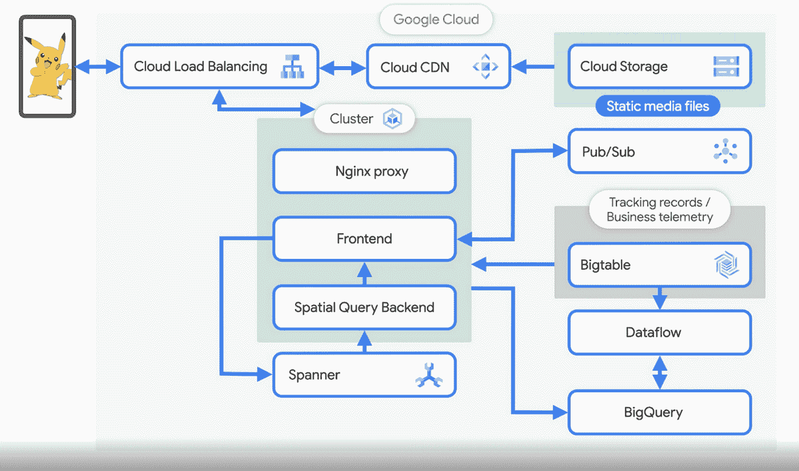
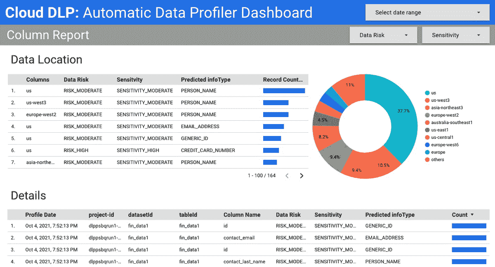
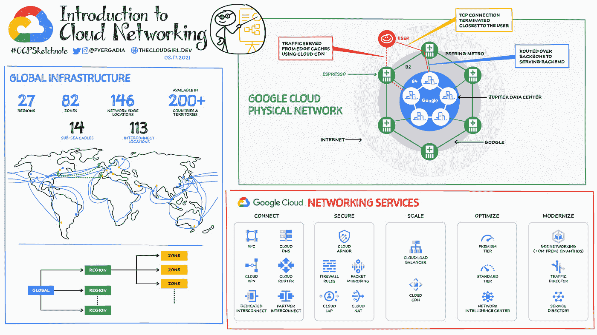

# 谷歌云平台—技术金块—2021 年 10 月 16 日至 31 日版

> 原文：<https://medium.com/google-cloud/google-cloud-platform-technology-nuggets-october-16-31-2021-edition-9cb980f9fcd7?source=collection_archive---------2----------------------->

欢迎参加 2021 年 10 月 16 日至 31 日的谷歌云技术金块。

错过了 Google Cloud Next 2021？不要担心，我们已经为您准备了标题为[“Google Cloud Next 2021:你错过了什么”](https://cloud.google.com/blog/topics/google-cloud-next/what-you-missed-at-google-cloud-next-2021)的文章。

# **基础设施**

在 2011 年的 Google Cloud Next 上，我们宣布了 Spot VMs，这是一个非常经济的计算实例，适用于批处理作业和容错工作负载。如果您熟悉 Google Cloud 上的可抢占虚拟机，可以将 Spot 虚拟机想象成一种新的动态定价模式，提供标价 60-91%的折扣。Spot 虚拟机也可以用在您的 GKE 集群中，通过 gcloud 命令行工具配置 Spot 虚拟机就像标记一样简单:“-provisioning_model=Spot”。

在以下地区，现货虚拟机最高可享受标价 91%的折扣:

查看[博客文章](https://cloud.google.com/blog/products/compute/google-cloud-spot-vm)，其中提供了更多关于 Spot 虚拟机、定价模式和可用性的详细信息。

# **架构框架**

Google 云架构框架，[2.0 版本出来了](https://cloud.google.com/blog/topics/solutions-how-tos/best-practices-for-architecting-google-cloud-workloads)！该架构框架是一组跨越下面给出的 6 个支柱的最佳实践，用于在 Google Cloud 上设计和构建工作负载。

这些最佳实践是我们多年来学习与客户一起在 Google Cloud 上构建解决方案的过程中收集的。每个支柱都进一步细分为特定领域，以帮助您深入了解服务/解决方案和最佳实践，从而安全可靠地构建、部署和运营它。

# **客户**

在本期的客户故事中，开发者倡导者 Priyanka Vergadia 采访了 Niantic Labs 的高级工程经理 James Prompanya，他领导着热门游戏 Pokémon GO 的服务器基础架构团队。游戏使用的几个关键服务是谷歌 Kubernetes 引擎(GKE)和云扳手。[了解更多](https://cloud.google.com/blog/topics/developers-practitioners/how-pok%25C3%25A9mon-go-scales-millions-requests)关于下面给出的解决方案架构以及关于在 Google Cloud 上运行 Pokémon Go 的其他有趣事实。

# **身份&安全**

身份和访问管理(IAM)是在云中安全配置和运行工作负载的最重要方面之一。IAM 服务以及它们的策略、约束和大量的角色，会让任何人都难以理解和正确理解。谷歌云的内容负责人 Forest Brazeal 在文章“[关于谷歌云身份的 9 件我非常喜欢的事情&环境](https://cloud.google.com/blog/products/identity-security/identity-and-environment-in-google-cloud)”中给出了他对谷歌云的看法。

在我们的[10 月 CISO 观点综述](https://cloud.google.com/blog/products/identity-security/cloud-ciso-perspectives-october-2021)中，我们收集了丰富的文章，涉及 3 个关键领域:

*   我们的安全公告和会议与 Google Cloud Next’21 相关。
*   行业观点(看看最近公布的[可信云原则](https://trustedcloudprinciples.com/))。
*   围绕谷歌云平台安全的安全能力的最新更新。

如果你喜欢在谷歌云上安全地运行工作负载，这是一本必不可少的读物。

# 数据

使用谷歌云平台提供的任何数据服务的第一步通常是我们如何将数据摄取到 GCP。在本指南中，我们将了解数据接收所需的规划。如果您是一个希望了解围绕规划、采取第一步和控制将数据放入云中的成本的最佳实践的组织，这就是您的指南。

[云数据防丢失](https://cloud.google.com/dlp) (DLP)现在是[自动](https://cloud.google.com/blog/products/identity-security/automatic-dlp-for-bigquery)。目前，它仅作为 BigQuery 的预览版提供，automatic 代表:自动发现、自动检查、自动分类和自动数据分析。这是谷歌云的[隐形安全](https://www.youtube.com/watch?v=aiIN-PLg1d8&t=141s)愿景的一部分，理解和保护你的数据的能力被设计到平台中。

# **无服务器应用开发**

一个关于解决谷歌云功能中反模式的新系列已经发布。在[的第一篇文章](https://cloud.google.com/blog/topics/developers-practitioners/avoiding-gcf-anti-patterns-part-1-how-write-event-driven-cloud-functions-properly-coding-idempotency-mind)中，您将了解如何编写幂等云函数，包括前台和后台云函数，并解决这一重要问题，以确保在您的 Google 云函数因相同的独特操作被多次调用的情况下，您可以处理该问题，而不会创建不正确或额外的事务。

如果你想了解事件驱动架构(EDA)，并了解各种谷歌服务如何实现这一点，请查看这篇[介绍文章](https://cloud.google.com/blog/products/serverless/learn-about-cloud-functions-events-and-triggers)。

希望将应用部署到云环境中吗？您的工作流程通常由 3 个步骤组成:编写 Docker 文件、构建 Docker 映像，然后使用 deploy 命令。有了对 [Google Cloud Buildpacks](https://github.com/GoogleCloudPlatform/buildpacks) 的支持，您现在只需使用 deploy 命令就可以完全消除前两步。Buildpacks 将检测语言，构建容器映像并为您部署。立即在云运行中试用[基于源代码的部署](https://cloud.google.com/blog/topics/developers-practitioners/trying-out-source-based-deployment-cloud-run)。

# 让我们来了解一下 GCP

在本期中，我们将对谷歌云网络进行概述。我们的网络服务是 GCP 的一个关键优势，包括专用全球网络、多种连接选项、安全周界等等。查看[博客文章](https://cloud.google.com/blog/topics/developers-practitioners/google-cloud-networking-overview)了解更多详情。

要从我们最近的 Google Cloud Next 2021 中寻找会议记录，只需访问[点播目录](https://cloud.withgoogle.com/next/catalog)并在您方便时查看会议。

# 保持联系！

*有问题、意见或其他反馈。一定要把它送过来。*

*想关注新的谷歌云产品发布吗？我们有一个方便的页面，您可以将它加入书签→* [*谷歌云*](https://bit.ly/3umz3cA) *的新功能。*