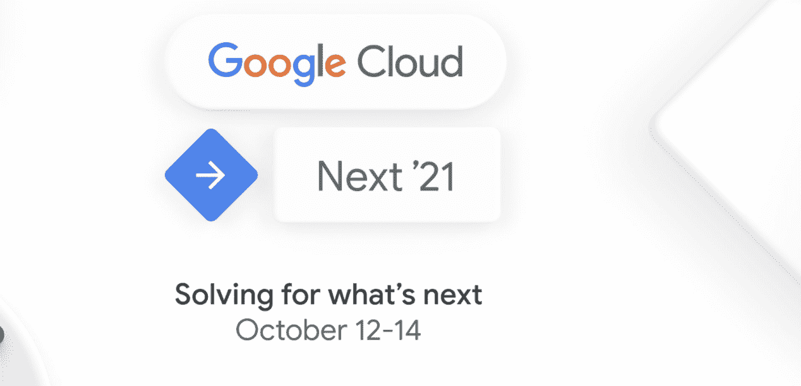
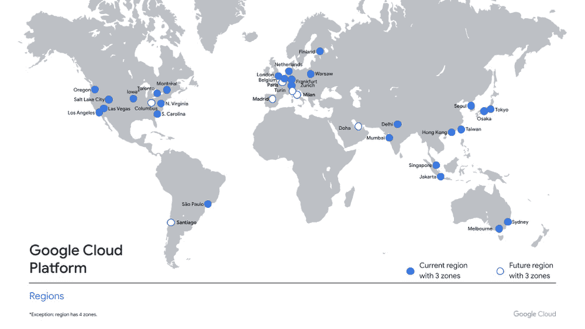
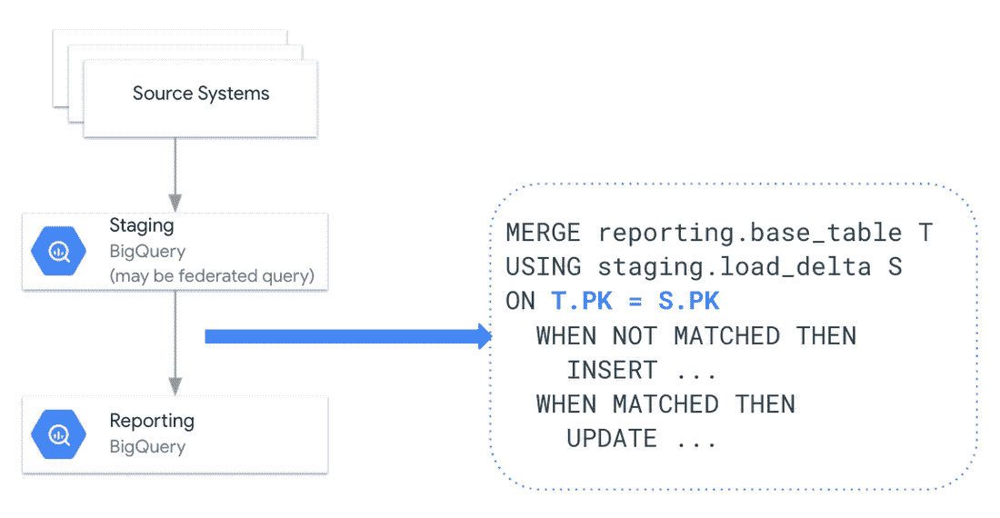
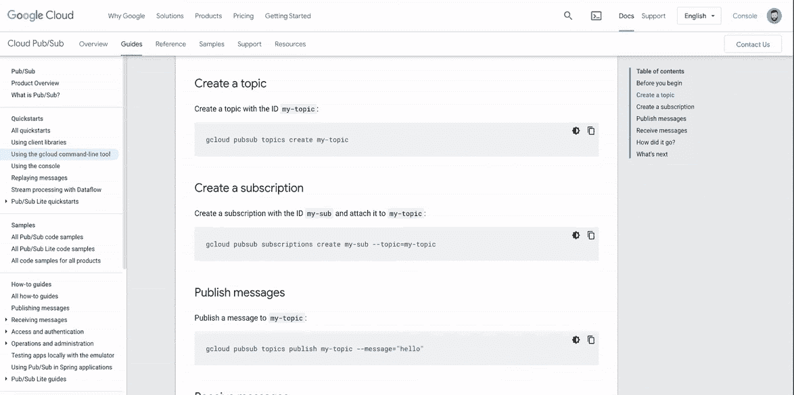
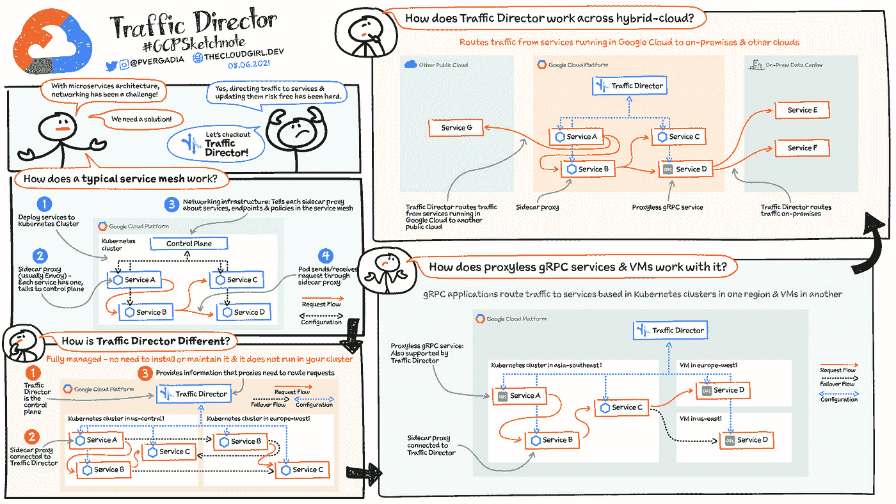

# 谷歌云平台—技术金块—2021 年 9 月 1 日至 15 日版

> 原文：<https://medium.com/google-cloud/google-cloud-platform-technology-nuggets-september-1-15-2021-edition-7ad3bdb68598?source=collection_archive---------1----------------------->

欢迎参加 2021 年 9 月 1 日至 15 日的谷歌云平台-技术掘金。

Google Cloud Next 将于 2021 年 10 月 12 日至 14 日推出。希望你[为它注册了](https://cloud.withgoogle.com/next/register?utm_source=google&utm_medium=blog&utm_campaign=FY21-Q4-global-ES903-onlineevent-er-next-2021&utm_content=blog-next-21-registration&_ga=2.194198697.-545181806.1627628476)？[完整的活动目录现已上线](https://cloud.withgoogle.com/next/catalog?_ga=2.146931319.-1759528332.1631839374#featured?utm_source=google&utm_medium=blog&utm_campaign=FY21-Q4-global-ES903-onlineevent-er-next-2021&utm_content=just-released-next-21-catalog-build-playlist&utm_term=-)，您可以构建自己定制的会议播放列表。

## **基础设施**

多伦多现已推出谷歌云[，这也是我们在加拿大的第二个地区。随着多伦多的上线，我们现在在全球有 28 个地区。您可以点击](https://cloud.google.com/blog/products/infrastructure/google-cloud-toronto-region-now-open)[这里](https://cloud.google.com/about/locations)查看我们各地服务的更多详情。

灾难恢复(DR)对我们的客户来说是一个重要方面，虽然我们有几个解决方案，包括来自合作伙伴的市场解决方案，但在如何将这些解决方案整合在一起，同时满足客户对灾难恢复的要求方面，可能会令人困惑。在这篇[博客文章](https://cloud.google.com/blog/products/storage-data-transfer/dr-in-google-cloud-with-vmware-engine-actifio-and-zerto)中，您可以了解灾难恢复的基本概念，并看到一个虚构的示例，说明具有严格 RTO/RPO 的组织如何利用从 Actifio、Zerto 到 Powerscale 的一系列解决方案。

## **客户案例**

站点可靠性工程(SRE)正在赢得客户的认可，他们希望确保软件开发的灵活性和服务的可靠性之间的平衡。领先的零售商 Lowe's 在采用这些标准方面取得了巨大成功。在一个由两部分组成的系列中，我们讲述了他们如何从每两周发布一次[到每天发布 20 次以上](https://cloud.google.com/blog/products/devops-sre/how-lowes-leverages-google-sre-practices)以及[将他们的平均恢复时间(MTTR)减少了 80%以上](https://cloud.google.com/blog/products/devops-sre/how-lowes-improved-incident-response-processes-with-sre)。

不要忘记访问 [SRE 谷歌云网站](https://cloud.google.com/sre)了解更多关于在云中实施 SRE 最佳实践的信息。

## **分析& AI/ML**

这是数据分析领域的繁忙时期，了解该领域所有公告的方法之一是通过[月度总结](https://cloud.google.com/blog/products/data-analytics/new-stories-and-announcements-from-data-analytics)。上个月发布的内容包括 Google 数据集、发布/订阅消息保留、大型查询中的工作负载管理等等。

我们还发布了一个[详细指南，介绍如何建立一个有效的增量数据摄取管道到大查询](https://cloud.google.com/blog/products/data-analytics/optimizing-your-bigquery-incremental-data-ingestion-pipelines)。当源数据很大时，这特别有用，唯一的方法是考虑设计一种增量方式来实现这一点。

谷歌翻译是一个众所周知的服务和 API，支持超过 100 种语言，内置语言检测。在这篇博文[中，我们分享了使用谷歌翻译来翻译你的网站的 4 个最佳实践。它包括保护对 API 的访问、实现最佳性能的架构优化、设置和监控成本预算以及利用特定领域的自定义术语功能。](https://cloud.google.com/blog/products/ai-machine-learning/four-best-practices-for-translating-your-website)

机器学习工程师负责训练 ML 模型。培训通常不会成功完成。[查看 7 个提示](https://cloud.google.com/blog/products/ai-machine-learning/7-tips-for-trouble-free-ml-model-training)，它们提供了可能出错的地方以及避免这种情况发生的最佳实践。

## **开发者和从业者**

Google Cloud Shell，您在云中的开发机器，是一个优秀的工具，任何拥有 Google 帐户的人都可以使用。云壳自带[命令行工具](https://cloud.google.com/shell/docs/how-cloud-shell-works?shell_enabled=true#tools)和[编程语言 SDK](https://cloud.google.com/shell/docs/how-cloud-shell-works?shell_enabled=true#language_support) 全部为你预装。它经常被用作一个配套工具来测试命令、codelabs 等等。这可能是一个很好的可用性补充，你现在可以直接从 Google Cloud 文档页面运行你的代码样本。不用再换了。查看下面的截屏。

还记得我们的平台即服务(PaaS)产品 App Engine 吗？如果您正在使用支持语言的旧运行时运行传统 App Engine 应用程序，我们将致力于支持它们，但您应该注意到，我们已经启动了一个名为[无服务器迁移站](https://cloud.google.com/blog/topics/developers-practitioners/modernizing-your-serverless-applications)的新系列，帮助您将您的应用程序升级到我们更新的无服务器服务。该系列目前主要关注 Python 和 App Engine。

无服务器浪潮经常让我们思考虚拟机是否还与我们的讨论相关。这是虚拟机支持者和怀疑者之间的一次有趣的对话，有助于理解虚拟机在今天的重要性。

## **奖金**

奖金部分通常为您提供一两项服务，您可以通过简单易懂的方式了解这些服务。这个版本没有什么不同，我们从[流量控制器](https://cloud.google.com/traffic-director)开始，这是我们为服务网格提供的完全管理的流量控制平面。查看[博客文章](https://cloud.google.com/blog/topics/developers-practitioners/traffic-director-explained)了解更多详情。

我们结束了关于大查询管理的系列文章，其中深入探讨了从表、存储内部结构、查询优化等主题。查看这篇[摘要博客文章](https://cloud.google.com/blog/topics/developers-practitioners/bigquery-admin-reference-guide-recap)，它在一页中列出了所有会议。如果您在组织中负责大型查询管理，这是一个非常方便的书签页面。

你也可以查看一篇关于理解云 SQL 的[详细帖子。额外收获:它还有一个草图注释！](https://cloud.google.com/blog/topics/developers-practitioners/what-cloud-sql)

## 保持联系！

*有问题、意见或其他反馈。一定要把它送过来。*

*想关注新的谷歌云产品公告吗？我们有一个方便的页面，您应该将它加入书签→*[*Google Cloud*](https://bit.ly/3umz3cA)*的新功能。*