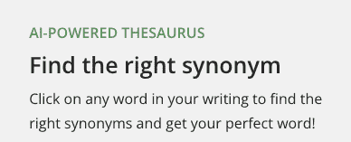
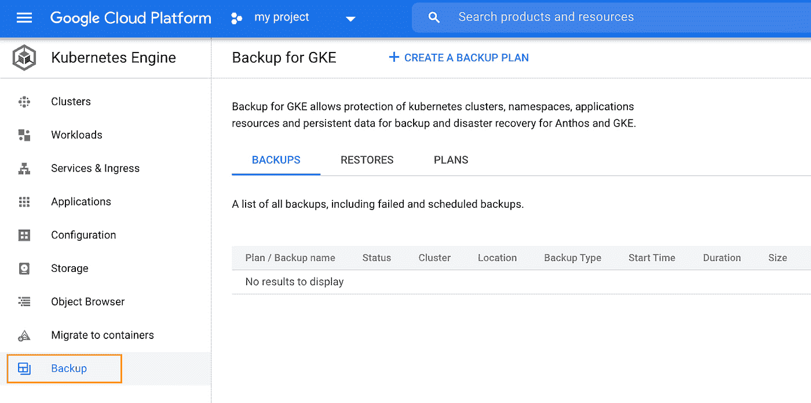
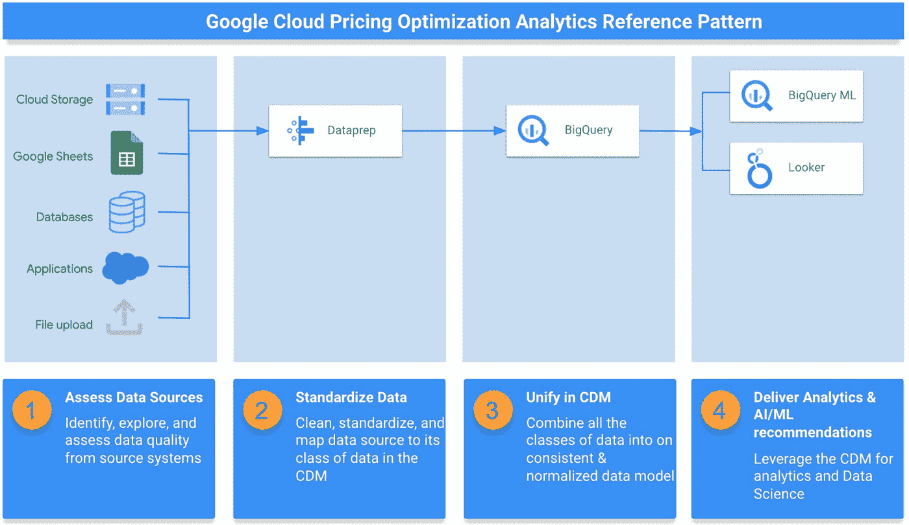
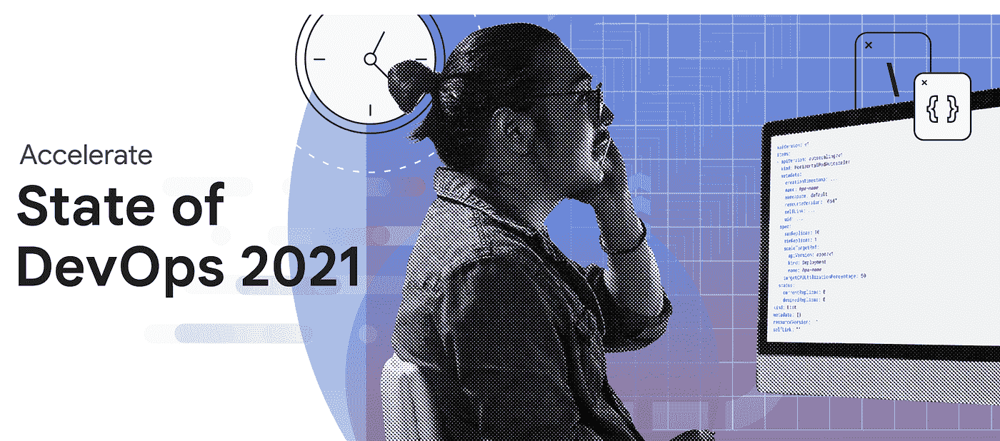
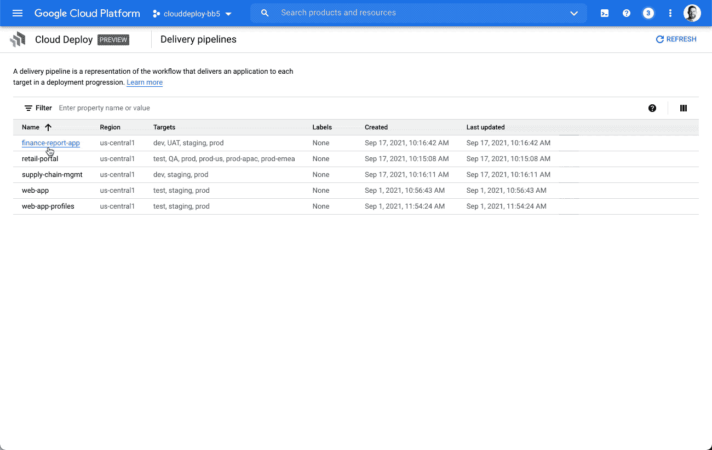
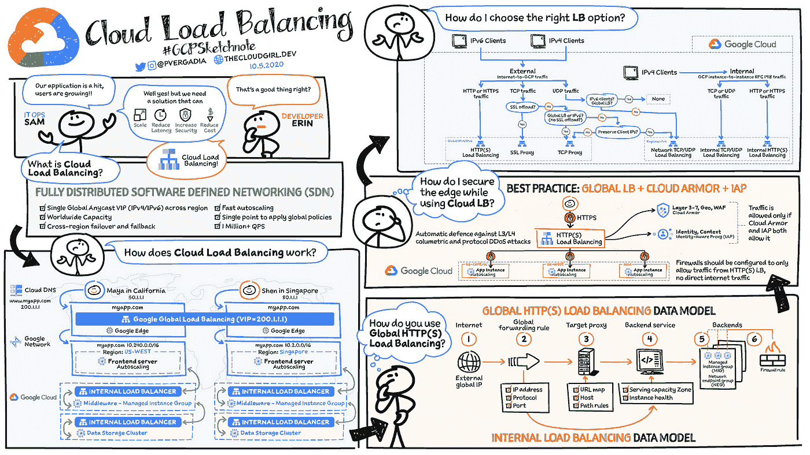
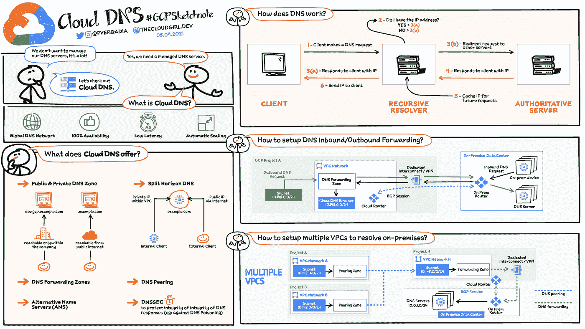

# 谷歌云平台—技术金块—2021 年 9 月 16 日至 30 日版

> 原文：<https://medium.com/google-cloud/google-cloud-platform-technology-nuggets-september-16-30-2021-edition-613e6b6ea5b2?source=collection_archive---------0----------------------->

欢迎来到 2021 年 9 月 16 日至 30 日的谷歌云平台-技术掘金版。

离我们今年最大的会议还有不到两周的时间。 Google Cloud Next 将于 2021 年 10 月 12 日至 14 日推出。希望你已经为它在[注册了](https://cloud.withgoogle.com/next/register?utm_source=google&utm_medium=blog&utm_campaign=FY21-Q4-global-ES903-onlineevent-er-next-2021&utm_content=blog-next-21-registration&_ga=2.194198697.-545181806.1627628476)？[完整的活动目录现已上线](https://cloud.withgoogle.com/next/catalog?_ga=2.146931319.-1759528332.1631839374#featured?utm_source=google&utm_medium=blog&utm_campaign=FY21-Q4-global-ES903-onlineevent-er-next-2021&utm_content=just-released-next-21-catalog-build-playlist&utm_term=-)，您可以构建自己定制的会议播放列表。王从希也出版了下一期的指南。检查一下[出来](https://cloud.google.com/blog/topics/developers-practitioners/stephanie-wongs-guide-googlecloudnext-2021)。

## **基础设施**

N2D 计算引擎机器类型[现在支持](https://cloud.google.com/blog/products/compute/3rd-gen-amd-epyc-comes-to-compute-engine-n2d-machine-famil)最新的第三代 AMD EPYC 处理器。其价格与第二代相同，性价比提高了 30%以上。N2D 虚拟机适用于各种通用工作负载，如 web 服务、应用服务、数据库和企业应用。这些虚拟机目前正在几个谷歌云区域进行预览:美国中部(爱荷华州)、美国东部 1(南卡罗来纳州)、欧洲西部 4(荷兰)和亚洲东南部 1(新加坡)，并将在未来几个月内在全球其他谷歌云区域提供。

我们采用英特尔至强处理器的 N2 虚拟机也获得了[更新](https://cloud.google.com/blog/products/compute/compute-engine-n2-vms-now-available-with-intel-ice-lake)。

如果您想了解我们在网络产品组合中所做的新服务和增强功能的概述，请查看这篇[帖子](https://cloud.google.com/blog/products/networking/expanding-google-cloud-network-infrastructure-and-services)，其中还重点介绍了您可以选择收听的有关网络的 Google Cloud 后续会议。

## **客户案例**

Quillbot 为自然语言处理提供了一个平台，可以帮助用户进行释义、摘要、语法检查等等。它每月有超过 1000 万活跃用户，其复杂而庞大的人工智能模型是对我们基础设施服务的巨大考验。

查看这篇[博客文章](https://cloud.google.com/blog/topics/customers/quillbot-scales-up-to-100x-with-google-cloud)，其中重点介绍了 Qullbot 用来以经济高效的方式构建模型和扩展的一系列计算产品。

## **存储**

我们发布了几个关于云存储和备份的公告。

首先是引入我们的云存储双区域存储桶的两个关键特性。

*   双区域桶的自定义区域选择:这在满足监管或合规性要求甚至应用性能时特别有用。
*   可选的 SLA 支持的 15 分钟恢复点目标(RPO):我们宣布了针对双区域存储桶的 Turbo Replication，它可以在 15 分钟或更短的时间内在区域之间复制 100%的数据，并由服务级别协议提供支持，这是领先的云提供商首创的。

正在为您在 GKE 的有状态工作负载寻找备份解决方案吗？我们现在为你安排了 GKE 的替补*。这是一项新的 GKE 本地服务，使保护基于容器的关键数据变得更加容易。查看这篇[博客文章](https://cloud.google.com/blog/products/storage-data-transfer/google-cloud-launches-backups-for-gke)了解更多信息。*

客户可以选择借助客户管理的加密密钥(CMEK)来保护他们在云存储上的数据。我们最近[宣布了](https://cloud.google.com/blog/products/storage-data-transfer/learn-about-the-latest-cloud-storage-encryption-releases)一系列改进，以提供与云存储和 CMEK 相比更好的性能、更低的成本和更多的功能。

[Eventarc](https://cloud.google.com/eventarc/docs) ，我们的服务支持 GCP 云服务和您自己的应用程序之间的事件，现在提供一个本机[云存储触发器](https://cloud.google.com/eventarc/docs/creating-triggers#cloud-storage)来接收来自云存储桶的事件。查看[博客文章](https://cloud.google.com/blog/topics/developers-practitioners/introducing-new-cloud-storage-trigger-eventarc)。

## **数据分析& AI/ML**

定价优化分析参考模式[已经发布](https://cloud.google.com/blog/products/data-analytics/centralize-data-sources-into-bigquery-with-dataprep)，帮助您在 GCP 上构建一个数据管道，从数据摄取到数据准备、分析，然后是分析驱动的结果。该模式中突出显示的关键服务包括 BigQuery、BigQuery ML、Looker 和 Trifacta DataPrep。它还涵盖了拥有公共数据模型(CDM)的关键概念。

一定要看看我们在[的帖子](https://cloud.google.com/blog/products/data-analytics/building-the-data-engineering-driven-organization)，关于构建由基本原则驱动的数据工程。此外，我们免费提供随后的按需培训的[，以帮助您了解更多关于 BigQuery 的知识。](https://cloud.google.com/blog/topics/training-certifications/free-google-cloud-bigquery-training)

## **DevOps &现场可靠性工程(SRE)**

首先，我们发布了 2021 年多拉州发展报告。正如你所知道的，DORA 是研究组织如何在软件交付方面出类拔萃的时间最长的研究项目。我们 2021 年的报告有一个非常有趣的观察，我们在现有的四个关键点上增加了第五个关键点“可靠性”。我建议预览[这篇博客文章](https://cloud.google.com/blog/products/devops-sre/announcing-dora-2021-accelerate-state-of-devops-report)，它很好地总结了调查结果，并且[下载完整的报告](https://cloud.google.com/devops/state-of-devops/)。

我们有一个全新的服务， [Google Cloud Deploy](https://cloud.google.com/deploy) ，这是一个受管理的、自以为是的持续交付服务，使向 GKE 的持续交付更容易、更快、更可靠。

查看[博客文章](https://cloud.google.com/blog/products/devops-sre/google-cloud-deploy-automates-deploys-to-gke)以了解更多关于 Google Cloud Deploy 的信息。

站点可靠性工程(SRE)是一组实践的处方集，Google 记录了这些实践来帮助组织交付和运行可靠的软件。可靠性是一个关键的支柱，是确保客户对您的软件满意的基本前提，同时，您的开发和运营团队都有一个客观的模型来协作确保可靠性。我们发表了一篇名为“[的有趣博文，你的组织的可靠性思维是什么？](https://cloud.google.com/blog/products/devops-sre/the-five-phases-of-organizational-reliability)”，我们强调“……产品的可靠性是其系统架构、流程、文化以及产品团队或组织的思维方式的属性。换句话说，可靠性应该融入到一个组织的结构中，而不仅仅是强大的设计精神的结果。"

## **让我们了解一下 GCP**

我们有一些 GCP 的草图，你可以用来了解我们的服务。我们从[云负载平衡](https://cloud.google.com/blog/topics/developers-practitioners/what-cloud-load-balancing)开始:

[云 DNS](https://cloud.google.com/blog/topics/developers-practitioners/cloud-dns-explained) 接下来:

我们以 [Cloud Composer](https://cloud.google.com/blog/topics/developers-practitioners/what-cloud-composer) 结束我们的学习部分:

# 保持联系！

*有问题、意见或其他反馈。一定要把它送过来。*

*想关注新的谷歌云产品发布吗？我们有一个方便的页面，您应该将它加入书签→*[*Google Cloud 的新功能*](https://bit.ly/3umz3cA) *。*