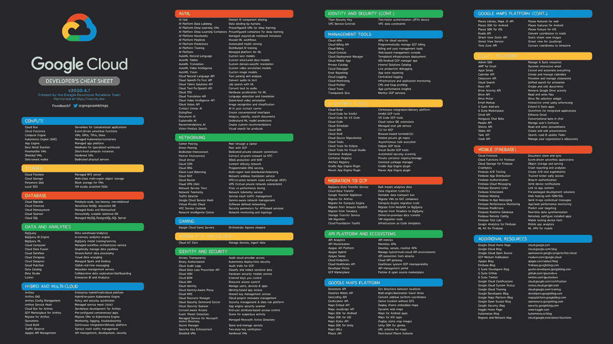

# 所有 200 多种谷歌云产品用不超过 4 个字描述

> 原文：<https://medium.com/google-cloud/google-cloud-products-described-in-4-words-or-less-7776af0552cd?source=collection_archive---------0----------------------->

从[https://github.com/gregsramblings/google-cloud-4-words](https://github.com/gregsramblings/google-cloud-4-words)下载 pdf、文本和高分辨率 png 文件

‪Includes 谷歌云，Firebase，谷歌地图平台，g suite apis

欢迎[看客](https://looker.com/looker-plus-google-cloud)！

还发推文到[https://Twitter . com/gregsramblings/status/1248268470308851712](https://twitter.com/gregsramblings/status/1248268470308851712)

查看我博客上的其他资源—[https://gregsramblings.com](https://gregsramblings.com)

海报(回购中提供手册版本和多种格式)