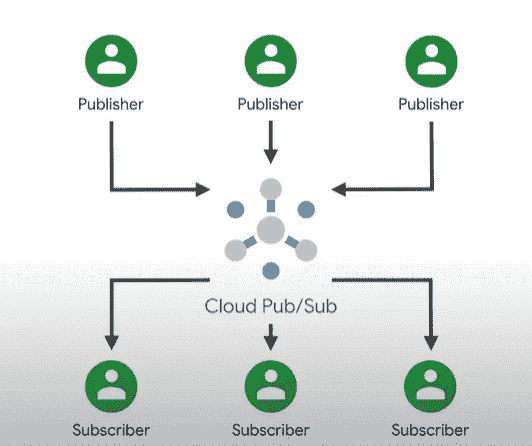

# 谷歌云发布/订阅:一项消息服务

> 原文：<https://medium.com/google-cloud/google-cloud-pub-sub-a-messaging-service-e139e3397dd7?source=collection_archive---------4----------------------->

# *酒馆/Sub*

*Pub/Sub(****Publish/Subscribe****)是一种* ***异步消息服务*** *设计成具有高度可靠性的*****与***的顺序*****

# *****发布/订阅服务中的关键概念*****

****

***发布/订阅模式***

*   *****主题:*** *发布者向其发送消息的命名资源。***
*   *****订阅:*** *一个命名的资源，表示来自单个特定主题的消息流，将被传送到订阅应用程序。***
*   *****消息:*** *发布者发送给主题的数据和(可选)属性的组合，最终被传递给订阅者。***
*   *****消息属性:*** *发布者可以为消息定义的键值对。例如，可以将关键字* `*iana.org/language_tag*` *和值* `*en*` *添加到消息中，以将它们标记为对说英语的订户可读。***
*   *****发布者:*** *创建并向单个或多个主题发送消息的应用。***
*   *****订阅者:*** *订阅单个或多个主题以接收消息的应用程序。***
*   *****【Ack】:****用户成功接收消息后，向发布/订阅发送信号。已确认的消息将从订阅消息队列中删除。***
*   *****推和拉:*** *这两种消息传递方式。订户通过 Pub/Sub* ***将*** *消息推送到订户选择的端点或者通过订户* ***将*** *消息从服务中拉出来接收消息。***

# ***基本* ***通过发布/订阅*** 的消息流**

****

***通过发布/订阅的基本消息流***

***在这个场景中，***

*   **有两个发布者发布关于一个主题的消息。**
*   ***这个话题有两个订阅。第一个订阅有两个订阅者，这意味着消息将在它们之间进行负载平衡，每个订阅者接收一个消息子集。第二个订阅有一个将接收所有消息的订户。***
*   ***消息 A 来自发布者 1，通过订阅 1 发送给订阅者 2，通过订阅 2 发送给订阅者 3。***
*   ***消息 B 来自发布者 2，通过订阅 1 发送给订阅者 1，通过订阅 2 发送给订阅者 3。***

# ***发布/订阅关系的类型***

***发布/订阅由三种类型的*关系 *:***

*****一对多(扇出):*****

****

***一对多***

*****多对一(扇入):*****

****

***多对一***

*****多对多:*****

****

***多对多***

# ***发布/订阅服务的类型***

***发布/订阅包含两个服务:***

*   *****发布/订阅服务:*** *这种消息服务是大多数用户和应用的默认选择。它提供了最高的可靠性和最大的集成集，以及自动容量管理。发布/订阅保证将所有数据同步复制到至少两个区域，并尽最大努力复制到第三个附加区域。***
*   *****Pub/Sub Lite 服务:*** *一个独立但相似的消息服务，以较低的成本构建。与发布/订阅相比，它的可靠性较低。它提供区域或地区性主题存储。Zonal Lite 主题只存储在一个区域中。区域 Lite 主题将数据异步复制到第二个区域。此外，发布/订阅精简版要求您预先调配和管理存储和吞吐量。只有在实现低成本需要一些额外的操作工作和较低的可靠性的应用中，才考虑发布/订阅 Lite。***

## ***功能对照表:发布/订阅与发布/订阅精简版***

****

# ***将发布/订阅与其他谷歌云产品集成***

*****[***数据流***](https://cloud.google.com/dataflow/docs) *，包括数据流**[***模板***](https://cloud.google.com/dataflow/docs/concepts/dataflow-templates)**和* [***SQL 用于将数据从发布/订阅移动到云存储、BigQuery 和其他产品的数据流模板可在谷歌云控制台的发布/订阅和数据流用户界面中获得。与***](https://cloud.google.com/dataflow/docs/samples/join-streaming-data-with-sql)**[***Apache Spark***](https://cloud.google.com/learn/what-is-apache-spark)*集成，特别是管理时与*[***data proc***](https://cloud.google.com/dataproc/docs/concepts/overview)*也可用。运行在****Spark+Data proc****上的集成和处理流水线的可视化组成可以用**[***数据融合***](https://cloud.google.com/data-fusion/docs/concepts/overview) *来完成。***********

*****监控、告警、日志:*** *受监控和日志产品支持。***

*****认证和 IAM:*** *发布/订阅依赖于其他 Google 云产品使用的标准 OAuth 认证，并支持粒度 IAM，支持对单个资源的访问控制。***

*****API:****Pub/Sub 使用标准的* [***gRPC 和 REST 服务 API 技术***](https://cloud.google.com/pubsub/docs/apis) *以及用于几种语言的* [***客户端库***](https://cloud.google.com/pubsub/docs/reference/libraries)**。****

*****触发器、通知和 webhooks:****Pub/Sub 向 web hooks 提供基于推送的消息传递，作为 HTTP POST 请求。您可以使用* [***云功能***](https://cloud.google.com/functions/docs)**或其他无服务器产品实现工作流自动化。****

*****编排:*** *发布/订阅可以声明式地集成为多步无服务器* [***工作流***](https://cloud.google.com/workflows) *。大数据和分析编排经常用* [***云作曲***](https://cloud.google.com/composer/docs) *来完成，它支持发布/订阅触发器。还可以将 Pub/Sub 与* [***应用集成***](https://cloud.google.com/application-integration/docs/overview)***(***[***预览***](https://cloud.google.com/products#product-launch-stages)***)****集成平台即服务(iPaaS)解决方案。应用集成提供了* [***发布/订阅触发器***](https://cloud.google.com/application-integration/docs/configuring-pubsub-trigger) *来触发或启动集成。***

*****集成连接器:*** *这些* [***连接器***](https://cloud.google.com/integration-connectors/docs/about-connectors) *让你连接各种数据源。有了连接器，Google 云服务和第三方业务应用程序都通过透明的标准接口向您的集成开放。***

***如果你想了解更多，你可以参考下面的文件，***

** [## 快速入门:使用 Google 云控制台|云发布/订阅在发布/订阅中发布和接收消息…

### 发送反馈本页向您展示如何使用 Google Cloud 控制台在发布/订阅中执行基本任务。跟随…

cloud.google.com](https://cloud.google.com/pubsub/docs/publish-receive-messages-console)  [## 什么是 Pub/Sub？|云发布/订阅文档|谷歌云

### 要点:了解什么是发布/订阅，为什么企业需要发布/订阅，以及发布/订阅相比于…

cloud.google.com](https://cloud.google.com/pubsub/docs/overview#common_use_cases)  [## 选择发布/订阅或发布/订阅精简版|云发布/订阅文档| Google 云

### 本主题旨在帮助您在发布/订阅和发布/订阅精简版之间进行选择。该主题要求您熟悉…

cloud.google.com](https://cloud.google.com/pubsub/docs/choosing-pubsub-or-lite) 

***谢谢:)*****