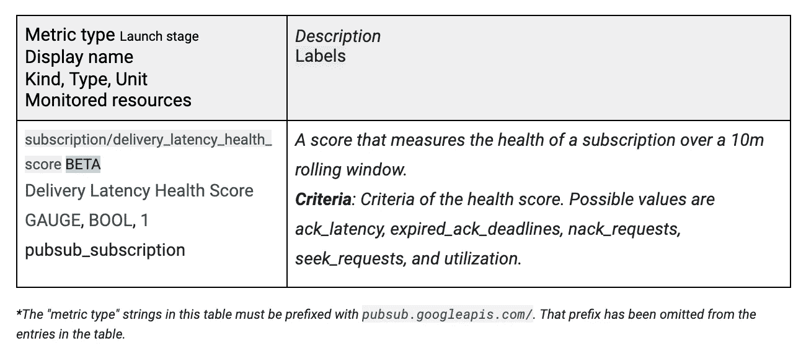
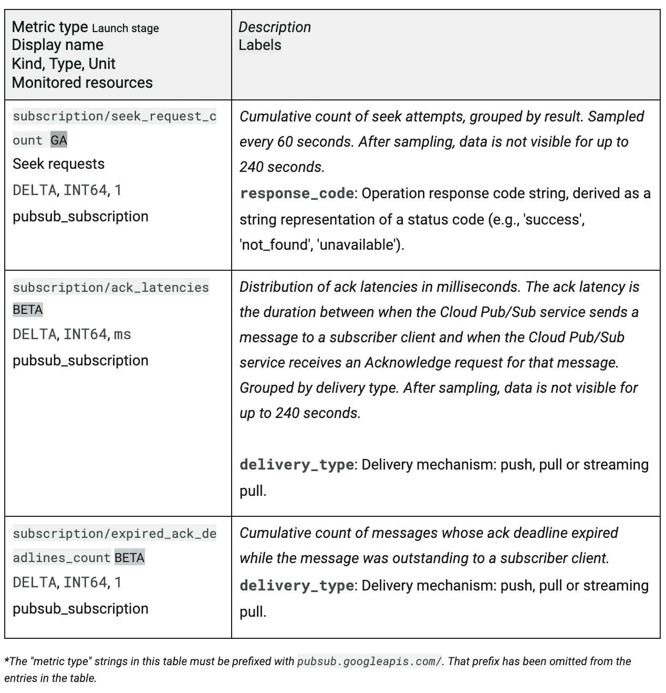

# Google Cloud Pub/Sub:如何监控订阅的运行状况，以获得最佳的端到端延迟

> 原文：<https://medium.com/google-cloud/google-cloud-pub-sub-how-to-monitor-the-health-of-your-subscription-for-optimal-end-to-end-latency-540b868e7929?source=collection_archive---------0----------------------->

发布/订阅提供持久的消息传递，具有高可用性和一致的大规模性能。这项服务建立在一个核心的谷歌基础设施组件上，许多谷歌产品，如广告、搜索和 Gmail，已经依赖了十多年。虽然用户可以信任底层的 Google 基础设施，但是他们可以采取一些额外的措施来确保他们的消息具有一致的低端到端延迟。这篇博文将讨论如何在端到端延迟方面衡量云发布/订阅的“健康状况”。

作为一名 SRE 酒馆/Sub，我和我的同事有责任帮助我们的客户解决性能问题等。我们观察到，具有一致的低端到端延迟的订阅都有一些共同的特征。这些特征如下:

1.  订阅很少甚至没有寻道请求。
2.  几乎没有被拒绝的消息。
3.  几乎没有过期的 ack。
4.  让 99.9%的 ack 延迟少于 30 秒
5.  利用率一直很低。例如，推订阅在任何给定时间都有少于 1000 个未完成的消息，或者拉订阅在任何给定时间都有超过 20 个未完成的 RPC，或者每个流都有低的流拉[利用率。](http://cloud/pubsub/quotas?hl=en#resource_limits)

当具有一致的低端到端延迟时，具有这些特征的订阅被认为是“健康的”。但是，注意，有时候不完全‘健康’是完全合理的。也就是说，有时你需要执行上述动作，并且暂时不“健康”例如，有正当的[理由](https://cloud.google.com/pubsub/docs/replay-overview#seek_use_cases)为什么需要做一个寻道请求，比如从一个意外的客户端错误中恢复或者测试。但不出所料，这一行动将影响端到端延迟。类似地，如果您否定了一条消息，或者在没有确认的情况下让该消息过期，那么发布/订阅将重新传递它。这些操作将再次增加延迟。但是有时你的客户可能想要为一个罕见的暂时异常否定一个消息。注意，让消息过期通常是一种反模式；即既不确认也不否定消息。这样做对延迟有很大影响，因为发布/订阅会等到 [ack_deadline_seconds](https://cloud.google.com/pubsub/docs/reference/rest/v1/projects.subscriptions/create) 周期后再重新传递消息。

因此，如果您的目标是始终保持较低的端到端延迟，您可能希望让您的订阅尽可能处于“健康”状态。

# 交付潜伏期健康评分

为了帮助用户监控他们的订阅的延迟“健康”，我们正在通过[云监控](https://cloud.google.com/monitoring)导出一个新的指标，称为*交付延迟健康分数*指标。当指标在过去 10 分钟内满足给定标准时，该指标为真。标准的可能值是确认等待时间、过期确认截止时间、否定请求、寻道请求或利用率。为了始终获得较低的端到端延迟，订阅在大多数时间应该是真实的。



您可能希望根据此指标为您的订阅分配一个实际分数，这样，当所有标准都正常时，您将获得“分数”5，当其中两个标准不正常时，您将获得“分数”3。您可以通过使用类似下面的 [MQL 查询](https://cloud.google.com/monitoring/mql)在云监控中创建一个图表来轻松实现这一点:

```
fetch pubsub_subscription| metric        'pubsub.googleapis.com/subscription/delivery_latency_health_score'| filter
    resource.project_id == 'YOUR_PROJECT_ID' 
    && (resource.subscription_id == 'YOU_TOPIC')| align next_older(1m)| every 1m| group_by [resource.subscription_id, resource.project_id],  [value_delivery_latency_health_score_count_true: count_true(value.delivery_latency_health_score)]
```

如果您想监视单个标准，只需在 group_by 子句中添加 metric.criteria 即可。

# 其他有用的指标

此外，为了更深入地了解各个标准，用户可以监控以下指标:



在不久的将来，我们将分别导出指标利用率和 nack_request_count。还要记住，利用率标准很复杂，可能会以黑盒的形式出现。我们将在以后的独立博客中详细讨论如何计算利用率标准。

或者，您可以创建一个[警报策略](https://cloud.google.com/monitoring/alerts)，当 delivery_latency_health_score 在您的系统环境中低于某个阈值时将触发该策略。例如，如果您在一个多小时内看到持续得分为 3 或更低的订阅，您可能希望收到警报。或者，如果您对某个特定条件更感兴趣，您可以为该条件设置提醒。例如，当 *ack_latencies* 持续高于某个阈值时，您可以创建一个警报。高 ack 延迟意味着客户端处理消息的时间异常长。这可能意味着客户端存在缺陷或某种资源限制。

如果您有兴趣了解更多关于云发布/订阅可靠性的信息，我建议您阅读 Kir Titievsky 博士撰写的[优秀的三部分可靠性指南](/google-cloud/google-cloud-pub-sub-reliability-user-guide-part-1-publishing-12577b9069fd)。要查看发布/订阅向云监控报告的其他指标，请查看云监控文档中的[指标列表](https://cloud.google.com/monitoring/api/metrics_gcp#gcp-pubsub)。