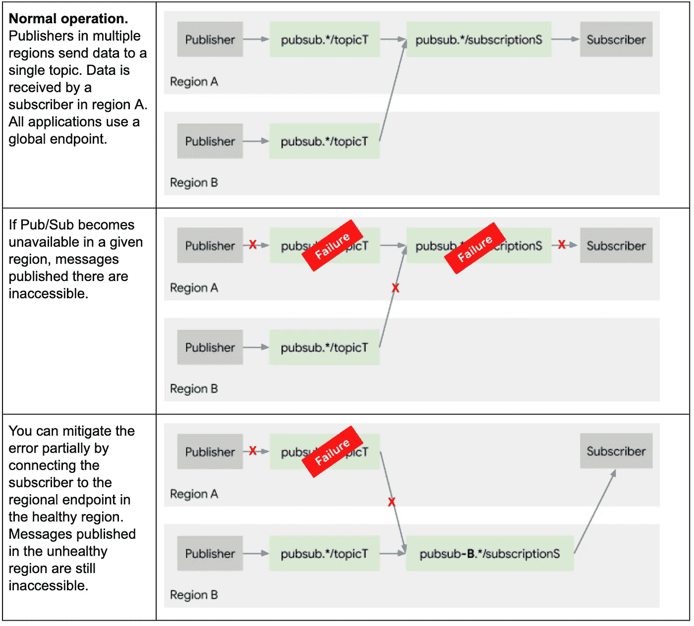
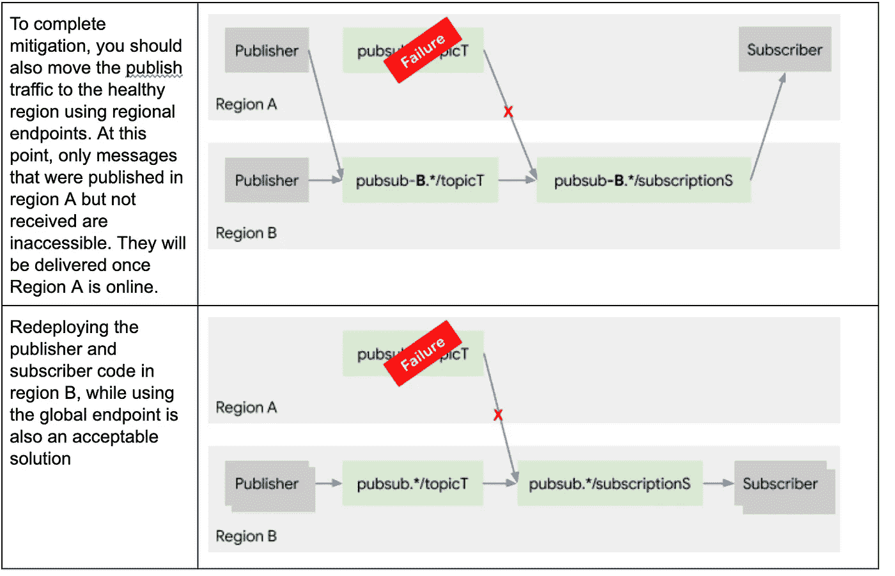
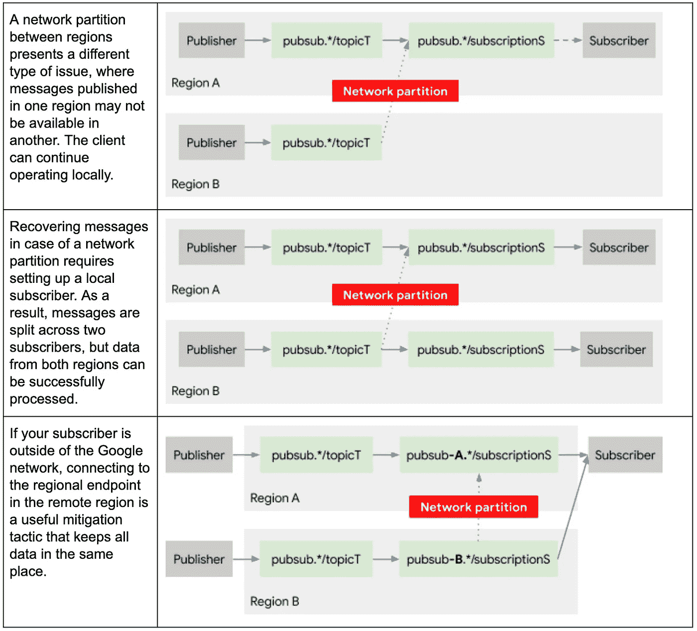

# 谷歌云发布/订阅可靠性指南:第 2 部分订阅

> 原文：<https://medium.com/google-cloud/google-cloud-pub-sub-reliability-guide-part-2-subscribing-16b6b5b89182?source=collection_archive---------2----------------------->

我建议在开始这本书之前通读第一部分。这篇文章是帮助 [Google Cloud Pub/Sub](http://cloud.google.com/pubsub) 用户编写使用该服务的可靠应用的系列文章的一部分。是的，Pub/Sub 非常可靠，可用性很高。不，它并不完全可靠。作为一名应用程序开发人员，这正是您的用武之地。我希望这组文章能为您提供设计极端可靠性的背景知识。这些文章是由 Cloud Pub/Sub 的产品经理在 [Kamal Aboul-Hosn](https://medium.com/u/4f61f6483c5f?source=post_page-----12577b9069fd--------------------------------) 等人的大力帮助下撰写的。

# 发布者和订阅者可靠性之间的一般差异

订阅者应用程序的工作是处理收到的消息，并向云发布/订阅确认它们。如[Cloud Pub/Sub Monitoring Guide](https://cloud.google.com/pubsub/docs/monitoring)中所述，可以通过积压的大小(或尚未确认的消息的数量)和最早的未确认消息的年龄来监控订户在确认消息方面取得的进展。订阅问题导致这些指标中的至少一个指标开始增长。

出版中讨论的许多概念在这里都适用。订阅 API，包括 pull 和 streamingPull，旨在提供区域性的故障隔离。关于 API 不可用和重试的一般类型的章节适用。订阅者和发布者应用程序之间的主要区别在于，消息数据的位置由发布操作决定:对于区域 B 中的订阅者来说，要访问在区域 A 中发布的消息，云发布/订阅必须在两个区域中启动并可用。[区域端点](https://cloud.google.com/pubsub/docs/reference/service_apis_overview)是考虑故障转移策略的常用工具。

从区域性故障中恢复的广泛策略如下所示。

从区域性故障中恢复的策略。

完成区域性故障的缓解。

另一种需要考虑的失败是两个区域之间的网络划分。除了全局消息之外，还可以通过监视区域积压大小和最旧的未确认消息的年龄来检测区域划分。一般来说，关于最早未确认消息的全局年龄(主题/最旧 _ 未确认 _ 消息 _ 年龄度量)的警报将引导您调查区域状态(主题/最旧 _ 未确认 _ 消息 _ 年龄 _ 按区域度量)，因此可能不需要区域警报。下图说明了在这种情况下您的选择。

此外，订阅者应用程序必须考虑发布者选择的故障转移或冗余策略。如果发布者应用程序发布到两个单独的主题，则订阅者可以从两个主题中检索数据并对其进行重复数据删除；或者订阅其中一个主题的订阅，并在出现问题时从另一个主题的订阅进行故障转移，重新处理在故障转移订阅中未被确认但在失败的订阅中被确认的消息。

# 卡住的消息

重要的是，要检测并准备好服务仍然可以访问，但消息的子集无法传递给订阅者应用程序的情况。这些消息被称为“滞留”，这反映在一个或多个区域中不断增长的消息积压或最早的未确认消息的年龄。

消息可能滞留在客户端或服务中。如果客户端请求的消息超过了它可以处理的数量，并且一直发送 modifyAckDeadline 请求，消息可能会滞留在客户端上。在此期间，发布/订阅尝试不将消息发送给其他客户端。客户端库自动将客户端实例检索消息的截止时间延长到某个截止时间。截止日期应该根据你的目标来调整:截止日期太短可能会导致消息的重复传递，而截止日期太长可能会导致消息被过载的机器卡住。使用 Python 库中的[流控制](https://github.com/googleapis/python-pubsub/blob/2e03ba090ea938f19821622ebf6a87391dede0f5/google/cloud/pubsub_v1/types.py#L129)对象的 [setMaxAckExtensionPeriod](https://googleapis.dev/java/google-cloud-clients/latest/com/google/cloud/pubsub/v1/Subscriber.Builder.html#setMaxAckExtensionPeriod-org.threeten.bp.Duration-) 和 max_lease_duration 属性，可以在 Java 客户端库中配置总截止时间。

不幸的是，对于服务端的停滞，在服务之外几乎无能为力。一般来说，stuckness 是罕见的，暂时的，内部监测。然而，一旦你怀疑服务端有问题，向[提交一个支持请求](https://console.cloud.google.com/support)总是一个好主意，以确保不会遗漏。

关键的任务是区分客户端和服务端的问题。通过查找过载的客户端(高 RAM、CPU 或网络利用率)或记录导致处理时间延长的下游请求中的错误，您可能能够检测到客户端问题。例如，如果处理消息涉及到对数据库的写入，则重复的数据库连接错误可能表明您可能正在处理数据库问题或热键。在调试日志记录级别记录所有已实现的消息生命周期事件(如消息接收和确认，包括消息 ID 和时间戳)通常是一种良好的做法。包含消息 ID 以连接不同的事件是很重要的。这将有助于你在问题出现时迅速集中注意力。当您的客户端监控不足以排除客户端问题时，客户端重新启动将确保任何客户端阻塞消息被重置和重新传递。当然，如果问题是由特定于某个给定消息的原因引起的，重新传递会使系统处于相同的状态。出于这个原因，考虑使用[死信主题](https://cloud.google.com/pubsub/docs/dead-letter-topics)来限制重新交付的数量。

# 后续步骤

看一下[第三部分，其中包括行政操作](/@kir-gcp/google-cloud-pub-sub-reliability-guide-part-3-administrative-operations-aa3791b465ec)。一如既往，产品文档对[大有裨益。我们会阅读并感谢您的评论和反馈。](http://cloud.google.com/pubsub/docs)