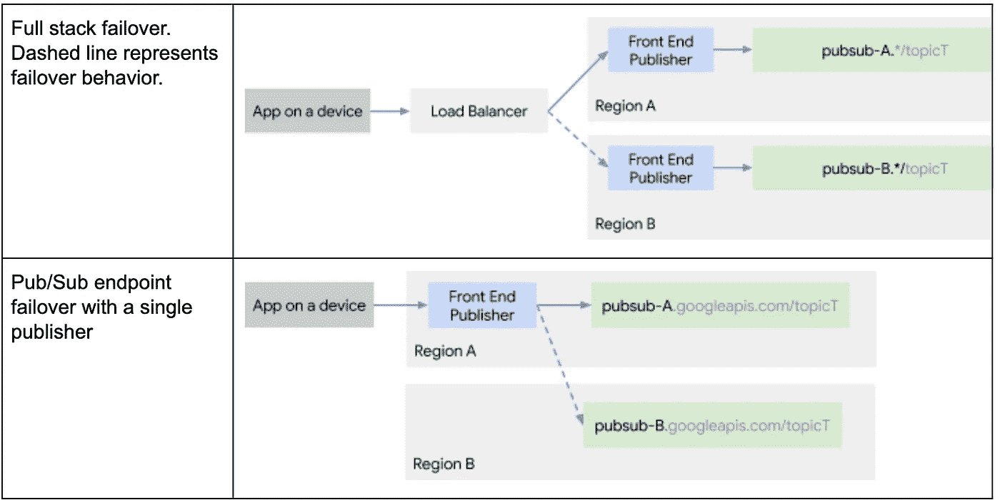

# 谷歌云发布/订阅可靠性用户指南:第 1 部分发布

> 原文：<https://medium.com/google-cloud/google-cloud-pub-sub-reliability-user-guide-part-1-publishing-12577b9069fd?source=collection_archive---------1----------------------->

这是一系列文章中的第一篇，这些文章将帮助使用谷歌云发布/订阅服务的用户编写可靠的应用程序。以下部分将涵盖[订阅](/@kir-gcp/google-cloud-pub-sub-reliability-guide-part-2-subscribing-16b6b5b89182)和[行政操作](/@kir-gcp/google-cloud-pub-sub-reliability-guide-part-3-administrative-operations-aa3791b465ec)。

是的，Pub/Sub 非常可靠，可用性很高。不，它并不完全可靠。作为一名应用程序开发人员，这正是您的用武之地。我希望这组文章能为您提供设计极端可靠性的背景知识。这些文章是由 Cloud Pub/Sub 的产品经理在 Kamal Aboul-Hosn 等人的帮助下撰写的。

# 发布错误的类型

使用发布/订阅的应用程序首先关注的是发布:将消息发送到发布/订阅提供的持久存储中。发布 API 的任何不可用性都会造成数据丢失的风险。因此，作为应用程序设计人员，您必须在代码的复杂性和它在不丢失数据的情况下可以处理的不可用性类型之间取得平衡。预计有三种主要的不可用性:

*   瞬时故障:单个请求或几秒钟的降级可用性
*   暂时不可用:几秒到几分钟
*   长时间不可用:几十分钟到几小时

我们看一下每种情况以及其他情况的一些设计考虑。此外，我们还简要讨论了支持任何实际可靠性设计所需的一组指标和建议警报。我们建议在深入研究设计之前，查看[云发布/订阅监控指南](https://cloud.google.com/pubsub/docs/monitoring)以更全面地了解指标。

# 瞬时故障

与许多多租户分布式服务一样，发布/订阅也面临后台瞬时请求失败率的问题。这种情况很少见:通常，每千个请求中只有一个或更少。错误率将随您的应用程序行为、与 GCP 的网络连接以及许多其他因素而变化。您应该针对您的特定应用对其进行基准测试。有两种主要的瞬时请求失败:由服务显式返回的错误和请求超时。这些通常在时间上没有很强的相关性，至少在秒的尺度上。因此，处理这两种情况的常见策略是简单地重试请求。请注意，有些错误是不可重试的，例如由格式错误的请求或无效的资源标识符导致的错误；这些超出了可靠性讨论的范围。虽然发布/订阅客户端库通常会超时并为您重试请求，但了解重试设置并处理、记录和警告(例如，使用基于[日志的度量](https://cloud.google.com/logging/docs/logs-based-metrics))永久失败是很重要的。《T2 出版商指南》是理解这些的一个很好的起点。

请求超时可能是由客户端造成的，具体取决于您作为开发人员选择的配置、发布/订阅服务以及您的应用程序与它的网络连接。与任何多层、多租户、分布式系统一样，发布/订阅具有“长尾”请求延迟:虽然大多数请求在几十毫秒内完成，但在成功或失败之前，有些请求可能会停滞几秒甚至几分钟。如果您习惯于与具有预配置的专用容量的系统进行交互，并且在发布者和处理请求的机器之间只有一个本地网络跃点，这可能会令人惊讶。长尾延迟和后台出错率是水平可伸缩性的代价。延迟和错误可能是由处理您的请求的机器临时过载、网络问题或许多其他问题引起的。通过假设您的应用程序可以处理这种情况，发布/订阅可以对流量进行负载平衡以解决此类问题，扩大或缩小规模。

作为 publisher 应用程序的开发人员，您必须选择超时持续时间。更短超时的代价是重复的消息:如果一个请求将要成功，给定时间，超时和过早重试将有效地用不同的消息 id 发布相同的消息两次。这给用户带来了更多的麻烦，并带来了每条消息的额外处理和网络成本。另一方面，积极超时的好处是可以减少尾部延迟。我们建议从 10 秒钟的超时开始。

一旦请求失败，就必须设计一个重试策略。首先了解典型错误，并为您的应用程序请求超时。你可以使用客户端指标或者使用 GCP API 指标(特别是 serviceruntime.googleapis.com/api/request_latencies,with 第 99 百分位和第 50 百分位的聚合器)来估算这个[。请注意，这是测量服务完成请求所需的时间，而不是捕获您的应用程序和 GCP 之间的网络连接的延迟。您将不得不用客户端工具来测量这些。](https://cloud.google.com/apis/docs/monitoring)

一旦了解了错误率和延迟的分布，就必须配置重试策略。发布/订阅客户端库通常采用指数回退，从初始超时开始并继续尝试总超时(参见发布者指南中的[“重试请求】；Java](https://cloud.google.com/pubsub/docs/publisher#retry) [RetrySettings](http://googleapis.github.io/gax-java/latest/apidocs/com/google/api/gax/retrying/RetrySettings.html) ，Python [config](https://github.com/googleapis/google-cloud-python/blob/38df4a03967ef3a4eb0751253e08e06b8f01b433/pubsub/google/cloud/pubsub_v1/gapic/publisher_client_config.py) 的文档。这里最重要的设置是:

*   初始 RPC 超时:这决定了放弃初始 RPC 的时间。
*   总超时:保持重试的时间。

我们建议从 10 分钟的总超时和 10 秒的初始 RPC 超时开始。

更长的重试时间使您的应用程序对短期故障更加健壮，但是它们也可能延长您通过日志和警报发现错误情况的时间。它们也使您的应用程序面临耗尽内存的风险:每一个要重试的新消息都必须存储在内存中。因此，您的计算机必须有足够的空间来存储大于超时持续时间乘以传入数据速率的数据量。如果发布者应用程序位于负载平衡器和可以重试请求的应用程序的下游，则较短的超时(比如 1 分钟)可能是合适的。例如，如果请求源自具有重试策略的移动客户端，则快速失败允许移动客户端尝试将请求发送到另一个前端，而不是等待响应。在发布/订阅客户端库中实现的发布者流控制机制可以帮助安全地实现这种故障。

重试并不总能解决问题。例如，您可能会遇到一个不可重试的错误:应用程序的凭据可能会变得无效，或者您可能不再拥有 IAM 权限来发布该主题。此外，只有一些服务器错误响应代码被客户端库视为可重试，而其他代码则不会重试。客户端库通常提供可配置的安全默认值。Java 客户端库[默认设置](https://github.com/googleapis/google-cloud-java/blob/299f5bbc4524d6c82881ed9e843702321b238faa/google-cloud-clients/google-cloud-pubsub/src/main/java/com/google/cloud/pubsub/v1/Publisher.java#L162)是一个很好的指南，但是您应该知道您选择的客户端库所使用的设置。也有可能暂时不可用的时间超过总超时时间，在这种情况下，超时和可重试错误实际上变成了永久错误。例如，您可能经历了持续时间超过总超时时间的网络分区或降级。

您必须显式地处理这种情况，当使用客户端库或其他自定义机制时，通过发布请求未来回调。在这种情况下，您可以选择将邮件保存在本地磁盘上。这个决定是一个权衡复杂性和可靠性的问题。要做的更重要的事情是在云监控中将故障作为客户端度量(例如，使用[自定义度量](https://cloud.google.com/monitoring/custom-metrics/)或基于日志的度量)暴露出来。

如果重试不能解决问题，您必须通过调整相应的客户端设置，给应用程序更多的时间和更多的重试次数；或者您可能需要更多的机器或网络容量，以防问题是由流量增加引起的。事实上，CPU 和网络容量不足是发布/订阅团队看到的发布超时的最常见原因之一。也有可能您正面临一个非随机的故障:暂时或永久的不可用——这是下一节的主题。

# 暂时不可用

如果您无法在足够长的时间内连接到发布/订阅，重试将无效。这可能是由于您的应用程序和发布/订阅服务之间的网络问题或发布/订阅的区域性中断造成的。问题不一定是完全不可用:请求错误率高的部分不可用可能会导致高重试率，从而导致您超出可用的网络、RAM 或 CPU 容量。如果您的应用程序与 GCP 的连接有限，或者在 GCP 每台机器上的运行速率在 100MB/s 或以上，这种情况尤其可能发生。([这篇博文](https://cloud.google.com/blog/products/gcp/5-steps-to-better-gcp-network-performance?hl=ml)提供了一些了解和优化你的机器可用带宽的技巧。)

发布/订阅旨在使数据操作(发布和接收消息)的中断具有区域性。具体来说，发布/订阅可以处理单个区域的中断，而不会产生明显的影响。如[本架构概述](https://cloud.google.com/pubsub/architecture)中所述，要使停机成为区域性的，两个可用性区域必须同时发生故障。多区域或“全局”中断仅影响运行发布服务器的区域。如果您有一个从区域 A、B 和 C 发布的应用程序，而区域 A 和 B 关闭了，则区域 C 中的应用程序不受影响。同时，来自 A 和 B 中的应用的流量没有被负载平衡到 C 或另一个区域。这是因为 Pub/Sub 故意将流量保持在该区域内，以防止级联故障。一个例外是从 GCP 网络外部连接到发布/订阅的全球服务端点的流量。此类请求将被负载平衡到最近的可用区域。因此，数据操作(如发布)的长时间中断可以被认为是区域性的。可能的全局故障可能是全局相关性的故障，如网络(取决于您如何连接到 GCP)、IAM 或负载平衡，而不是发布/订阅本身。

处理暂时不可用的一个简单策略是使用长重试时间，并确保在服务不可用时，每台发布者计算机上都有足够的 CPU 和内存容量来缓冲内存中的数据。例如，通过将用户请求日志发布到 Pub/Sub 来处理用户请求日志的前端每秒可以处理 1000 个请求，每个请求会产生 1KB 的消息。经受住 10 分钟的停机需要不到 1 GB 的 RAM 来存储消息。这很容易做到，所以你可以选择 10 分钟甚至 20 分钟的重试时间。相比之下，如果您的发布者是高吞吐量分析管道的一部分，它可以轻松处理 100MB/s 的流量，这将需要 60GB 的 RAM 来承受 10 分钟的中断。因此，虽然 10 分钟的中断可以被视为临时的，可以通过重试来处理，但对于更大容量的系统，10 分钟不再是“临时的”:它被延长了。因此，对于您的应用程序设计来说，根据预期的流量模式确定长时间中断的条件和时间范围是非常重要的。在这两种情况下，设置发布错误日志和高发布错误率和机器 RAM 利用率警报是非常重要的。这将有助于减轻和分析故障。

下面讨论了帮助您的应用程序在区域性中断中幸存下来的方法。

# 长期不可用

长期不可用和临时不可用之间的真正区别在于您是否认为简单的重试将最终解决问题。虽然您通常无法预测临时停机是否会延长，但以下想法可能有助于您决定应用程序的临时停机时间:

*   传入报文数据可以在机器 RAM 中累积的持续时间
*   机器寿命有限的机器的机器寿命(*例如*可抢占的虚拟机)
*   常见网络问题之间的时间间隔如果您到 GCP 的连接容易出现可预测持续时间的拥塞
*   针对您的数据需求的明确、紧凑的恢复点目标。

最终，您必须在简单、低成本的设计和极高的可用性之间找到平衡点。

有几个基本方法可以减轻长期不可用性:替代存储、故障转移和冗余发布。替代存储的一个简单方法是首先将所有消息数据写入磁盘上的日志，然后对日志进行结尾。如果机器重新启动，您可以设置它继续自动读取日志或手动从磁盘恢复数据。作为一种优化，您可以仅在发布/订阅不可用时写入磁盘，并确保在服务恢复时将磁盘中的数据重新发布到发布/订阅。这种方法可以帮助您经受住比 RAM 更长时间的不可用，甚至可以经受住机器重启。缺点包括正常情况下额外的发布延迟、更高的 CPU 和存储成本、维护正确运行的日志循环守护程序的需要以及跟踪每个机器上哪些日志文件的哪些部分尚未发布的某种机制。

为了增加冗余，您可以考虑使用备份存储系统而不是发布/订阅来处理这个问题。例如，您的日志循环机制可能会在所有日志文件关闭后立即将它们上传到 GCS。这将允许日志循环之间的数据丢失，但这是防止灾难性数据丢失的相对简单且成本有效的设计。请注意，GCS 本身可能是日志存储的可行替代方案，但是，它不提供跟踪确认的机制，并且具有固有的较高延迟。

另一种方法是区域故障转移，它依赖于这样一个事实，即发布/订阅旨在使区域成为数据操作的独立故障域。故障域的这种独立性使得通过从不同区域发布到发布/订阅，或者如果从 GCP 以外的地方发布，则通过使用[区域端点，实现更高程度的可用性成为可能。](https://cloud.google.com/pubsub/docs/reference/service_apis_overview)这种方法可以应用于栈的不同层次，从产生流量的前端到发布者代码本身。最简单也可能是最可靠的设置是全栈冗余。在这里，您将在两个不同的区域(比如 A 和 B)运行两组发布前端，由一个负载平衡器负责。一旦区域 A 中的前端确定它们处于长时间中断中，它们将开始拒绝任何上游请求，导致这些请求被平衡到区域 b 中的前端。这将使一些消息滞留在区域 A 中的发布者上，但至少将使更新的数据可用，从而限制中断的范围。这样做的总成本会更高，应用程序延迟会增加，并且随着请求被路由到另一个区域 b，一些区域出口成本也会增加。

发布故障转移设计的类型。

您还可以使用发布/订阅[区域服务端点](https://cloud.google.com/pubsub/docs/reference/service_apis_overview#service_endpoints)在发布者客户端内部创建故障转移策略。每个发布服务器都维护着一个位于不同 GCP 地区的发布/订阅端点列表。一旦发布者确定它面临长时间的中断，它将使用不同的区域端点重新初始化发布/订阅客户端，并通过将消息发布到新的客户端实例来解决所有未完成的发布任务。这也可能导致额外的延迟和跨区域出口成本。一种实现将保持对错误率和等待时间的内部估计，并且在某一点确定主要端点不再可行。此时，它将使用故障转移区域端点重新构建客户端，并在那里开始发布。它还会定期尝试发布到主端点，并在确定可行时切换回来。应该以指数级回退和纵向扩展的方式执行故障切换。或者，可以使用最小的工具手动执行故障转移，用新的端点重新启动客户端。如果更高级别的负载平衡不可行，这种故障转移可能是有用的。当与全栈故障转移相结合时，它还可以提供额外的保护层，因为在遭受故障的区域中等待发布的消息有更大的机会成功发布。

对于需要极高可靠性的情况，可以使用发布/订阅的区域隔离在不同的区域发布每条消息两次或更多次。您可以将每条消息同步发布到两个区域端点。或者，您可以将冗余扩展到应用程序堆栈的更高层，比方说，将每个传入的用户请求转发到两个不同区域的前端。这种模式比负载平衡成本更高，但是一旦它起作用，单个区域的故障不会对您的应用程序造成任何改变。代价不仅仅是数据和代码的复制。真正的复杂性代价是用户必须对来自两个来源的消息进行重复数据删除。然而，在一些用例中，这样的措施是值得的。事实上，这是由 Google 内部的一些较大的 Pub/Sub 用户完成的。

# 异常错误的极端冗余

有些错误不适合这里描述的基于时间的类，需要一种替代方法。首先，由于配置错误或人为错误导致的内部发布/订阅错误很少。这些往往会影响项目或主题的子集。因此，在设计冗余系统的故障转移时，值得将主资源和故障转移资源放入不同的 GCP 项目中，即使它们位于同一区域。

其次，访问控制存在人为错误。例如，发布者应用程序使用的生产帐户可能会被操作员意外删除。为了降低这方面的风险，请使用范围较窄的权限，为每个工作负载或每个项目设置单独的服务帐户，如果可能的话，将 IAM 配置作为代码进行维护和部署，包括审查和集成测试。

# 预警和指标

无论你做什么选择，总有一个你没有预料到的失败的可能性。因此，重要的是，您拥有带有[警报](https://cloud.google.com/monitoring/alerts)的度量，这将让您知道您对系统行为的假设何时被违反。首先是关于发布请求错误率、发布请求异常高的尾部延迟以及机器内存使用的警报。此外，您应该查找由该服务报告的发布流量的意外下降，这可能表明消息没有到达该服务。

此外，您可以选择让您的应用程序报告[自定义指标](https://cloud.google.com/monitoring/custom-metrics/)，例如

*   客户端计算机上未完成的消息数据量
*   永久性(不可重试)故障的数量

如果一些等待时间是可接受的，错误计数可以被设置为[基于日志的度量](https://cloud.google.com/logging/docs/logs-based-metrics/)。

客户端日志也可能非常有用。例如，您可以选择让您的应用程序在未完成请求的积压超过某个阈值时记录警告，或者计算总请求延迟(包括重试),并在请求延迟较高时记录这些警告。此类日志条目可以转化为基于日志的指标和警报。

# 从故障中恢复时的流量控制

当设计从临时和长期故障中恢复的系统时，调整恢复速度很重要。一旦由于网络中断而建立了大量的积压，一旦服务恢复，一个幼稚的应用程序可能会试图尽快发布整个缓冲区。这通常会导致错误，因为机器可用的出站带宽和总发布配额都是有限的。

了解您的计算机可用的带宽并使您尝试向发布/订阅发送消息数据的速率保持在该限制之下是非常重要的。否则，您将造成网络拥塞，导致大多数请求超时，并出现 DEADLINE_EXCEEDED 错误，即使服务可用且网络正常。一个简单的方法是，每当未完成的请求或发布未来的数量超过阈值时，暂停您的发布者代码。大多数[云客户端库](https://cloud.google.com/pubsub/docs/reference/libraries)都支持这一点。例如，在 Java 客户端库中，使用 [BatchingSettings](https://googleapis.dev/java/gax/1.59.0/com/google/api/gax/batching/BatchingSettings.Builder.html) 对象的 FlowControlSettings 来配置流控制。

# 后续步骤

这是它的出版。下一步是[订阅](/@kir-gcp/google-cloud-pub-sub-reliability-guide-part-2-subscribing-16b6b5b89182)，这将在本系列的第 2 部分中介绍。