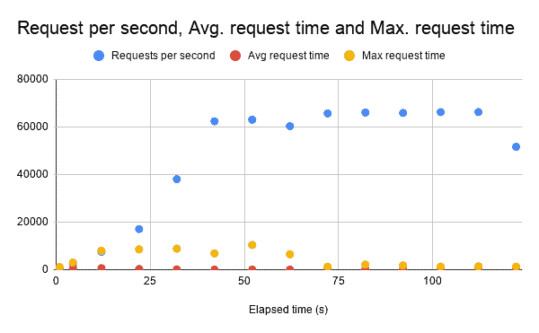

# Google 云运行部署和弹性基准测试

> 原文：<https://medium.com/google-cloud/google-cloud-run-deploy-and-elasticity-benchmark-15704e46c54?source=collection_archive---------1----------------------->

# 介绍

谷歌刚刚宣布了 Cloud Run，这是一种新的无服务器解决方案，可以在不管理底层基础设施的情况下运行容器化的应用程序。云运行完全管理服务的负载平衡和自动扩展。


在本文中，我将部署一个容器化的应用程序，并对其进行测试，重点关注:

*   云运行部署服务的速度有多快
*   如何快速扩展云运行以处理大量并发用户

# 部署

## Python 应用程序

让我们创建并部署一个简单的 Python 应用程序进行测试。详细说明可以在这里找到:[https://cloud . Google . com/run/docs/quick starts/build-and-deploy](https://cloud.google.com/run/docs/quickstarts/build-and-deploy)

该应用程序由两个文件组成:app.py 和 Dockerfile。它简单地返回“Hello World！”。

helloworld/app.py

```
import osfrom flask import Flaskapp = Flask(__name__)[@app](http://twitter.com/app).route('/')
def hello_world():
    target = os.environ.get('TARGET', 'World')
    return 'Hello {}!\n'.format(target)if __name__ == "__main__":
    app.run(debug=True,host='0.0.0.0',port=int(os.environ.get('PORT', 8080)))
```

## 构建容器映像

我将利用云构建来构建映像。在 Dockerfile 文件所在的目录中运行该命令。

```
gcloud builds submit — tag gcr.io/jeanno-cloud-run-test/helloworld
```

构建时间很大程度上取决于 Dockerfile 文件和应用程序的大小。对于这个简单的 Python 应用程序。只花了 24 秒就建成了。到目前为止，这只是一个标准的 Docker 图像构建，没有什么花哨的。

# 部署时间

此时，我已经构建了一个容器映像，它位于:

```
gcr.io/jeanno-cloud-run-test/helloworld
```

现在，越来越有意思了。借助云运行，我可以在不到 30 秒的时间内快速轻松地将服务启动到就绪状态。我使用下面的命令来部署和测量所需的时间。

```
time gcloud beta run deploy hello — image gcr.io/jeanno-cloud-run-test/helloworld — region=us-central1 — allow-unauthenticatedDeploying container to Cloud Run service [hello] in project [jeanno-cloud-run-test] region [us-central1]
✓ Deploying new service... Done.                     
  ✓ Creating Revision...
  - Routing traffic...
Done.
Service [hello] revision [hello-00001] has been deployed and is serving traffic at [https://hello-3o53mu62aa-uc.a.run.app](https://hello-3o53mu62aa-uc.a.run.app)real    0m21.006s
user    0m0.408s
sys     0m0.082s
```

之后，我立即点击打开链接，在浏览器中打开。加载页面花了大约 2 秒钟。从开始部署到准备就绪，只需要大约 23 秒的时间。

附注:我本可以在脚本中包含 curl，并对其计时以获得更精确的度量，但这没关系，因为它不应该有太大的差异。

# 横向扩展和压力测试

## 方法学

现在有趣的部分来了。我已经准备好了服务，是时候对它进行压力测试了。我将使用 JMeter 在美国中心 1 的 n1-standard-64 (64 个 vCPUs，240 GB 内存)计算引擎实例上执行测试。

由于计算引擎实例更靠近云运行区域(也在美国中心 1)，往返时间要短得多，因此每秒可以实现更高的请求数。

我使用下面的 JMeter 命令开始测试。

```
jmeter -n -t test-plan.jmx -p jmeter.properties
```

在测试计划中，我设置了一个 5 秒钟的斜坡，最多可以容纳 5000 个并发用户。每个用户由一个线程代表，线程将继续一个接一个地发出 HTTP 请求。按照 test-plan.jmx 中的规定，在 JMeter 中检查响应，以确保它具有 HTTP 状态代码 200。测试将运行 120 秒。

由于当没有活动流量时，云运行扩展到 0，我们可以想象它是一个处理大量意外峰值流量的空闲服务，需要快速扩展以匹配负载。

我还为它指定了额外的 JMeter 属性，让它每 10 秒给我一个摘要，而不是默认的 30 秒。

## 结果

JMeter 运行完毕后，会生成一个 jmeter.log 文件。让我们关注这三个指标:每秒请求数(RPS)、平均请求时间和最大请求时间。这里有一个图表来直观地显示结果。



JMeter 结果

每秒的请求数在 40 秒内以指数级增长到 60k 以上，这是非常令人印象深刻的。平均值。在上升过程中，请求时间略少于 1000 毫秒，最终下降到不到 100 毫秒。最大值。请求时间在上升期间为 5000 毫秒到 10000 毫秒，然后迅速下降到不到 2000 毫秒。RTS 在最后的下降是因为 JMeter 线程的下降，所以我们应该忽略这一部分。

只有不到 1%的错误(带有 HTTP 状态代码的 713 响应！= 200)发生在斜坡上升时间(7.1–17.1 秒)开始时。并且在每个其他间隔中出现 1 或 0 个误差。

即使在加速期间，大多数请求也在不到 1000 毫秒的时间内成功完成。同样，我没有配置任何东西来处理峰值。它完全由 Cloud Run 管理，以提供这样的可扩展性。

# 超越

此时，你可能会问:“云运行的极限是什么？”。显然我还没有达到极限。

在撰写本文时，Cloud Run 中容器实例的最大数量被限制为 1000 个。每个容器最多可以处理 80 个并发连接。云运行服务可以处理多达 80，000 个并发连接。60k RPS/5000 * 80000 = 960k RPS。通过简单的计算，我理论上预计我的服务最多可以处理 96 万 RPS。

RPS 在很大程度上取决于请求处理时间。如果每个请求需要 1 秒钟处理，该服务最多只能处理 80k RPS。

然而，通过 GCP 支持可以增加容器实例的最大数量，这意味着云运行的实际限制实际上取决于区域容量。

为了进行更大规模的实验，我需要一个分布式的负载测试解决方案。我现在没有这样的设置。如果你想看这个，请告诉我，我们甚至可能想尝试打破云运行(因为我的同事也渴望看到这一点)。

如果你喜欢这篇文章或觉得它有帮助，你可以给我几个掌声，并关注我，当我的下一篇文章出来时，你会收到通知！