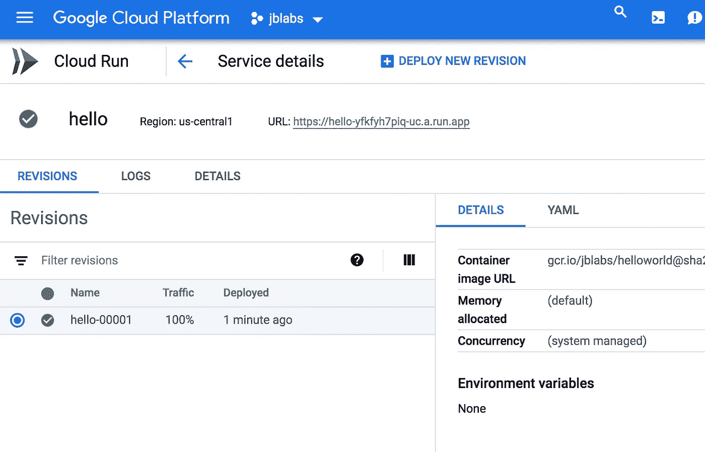

# Google Cloud Run for Go

> 原文：<https://medium.com/google-cloud/google-cloud-run-for-go-ec09ddbba111?source=collection_archive---------0----------------------->

Google Cloud 最近推出了一个完全托管的容器执行环境，名为 [Cloud Run](https://cloud.google.com/blog/products/serverless/announcing-cloud-run-the-newest-member-of-our-serverless-compute-stack?utm_source=twitter&utm_medium=unpaidsocial&utm_campaign=global-gcpcloud-liveevent&utm_content=event-next) 。这是一个专门针对请求驱动的工作负载的环境。它提供自动扩展、缩减到零、非常快速的部署、自动 HTTPS 支持、全局名称等等。只要 gVisor 支持语言运行时，Google Cloud Run 就没有语言运行时限制。它只要求部署在一个端口上公开一个 HTTP 服务器。

为了部署 Go 服务器，我们将从一个最小的 helloworld HTTP 服务器开始。容器运行时期望服务器监听$PORT:

```
$ cat main.go
// ...func main() {
 http.HandleFunc("/", func(w http.ResponseWriter, r *http.Request) {
  fmt.Fprintln(w, "hello world")
 }) port := os.Getenv("PORT")
 if port == "" {
  port = "8080"
 } log.Fatal(http.ListenAndServe(":"+port, nil))
}
```

为了构建 Docker 映像，请创建一个多阶段 Docker 文件:

```
$ cat Dockerfile
FROM golang:1.14 as buildWORKDIR /go/src/app
COPY . .RUN go build -v -o /app .# Now copy it into our base image.
FROM gcr.io/distroless/base
COPY --from=build /app /app
CMD ["/app"]
```

构建映像并将其推送到[谷歌容器注册中心](https://cloud.google.com/container-registry/):

```
$ docker build -t gcr.io/$GCP_PROJECT_NAME/helloworld .
$ docker push gcr.io/$GCP_PROJECT_NAME/helloworld
```

然后，从云控制台或终端，您可以使用构建的映像创建一个新服务:

```
$ gcloud run deploy hello --image gcr.io/$GCP_PROJECT_NAME/helloworld --project $GCP_PROJECT_NAME
# ...
Service [hello] revision [hello-00001] has been deployed and is serving traffic at [https://hello-yfkfyh7piq-uc.a.run.app](https://hello-yfkfyh7piq-uc.a.run.app)
```

您可以使用提供的端点来访问服务。日志等操作参见[云运行控制台](http://console.cloud.google.com/run)。



Google Cloud Run 专门针对请求驱动的 HTTP/HTTPS 工作负载进行了优化。容器可以被抢占和迁移，所以如果您计划将它用于长时间运行的服务，这并不太好。除了 HTTP/HTTPS 之外，目前也没有其他支持。如果您需要更多的灵活性，请参见[GKE 上的云运行](https://www.youtube.com/watch?v=RVdhyprptTQ)。

如果你有任何反馈，请随时联系 jbd@google.com。