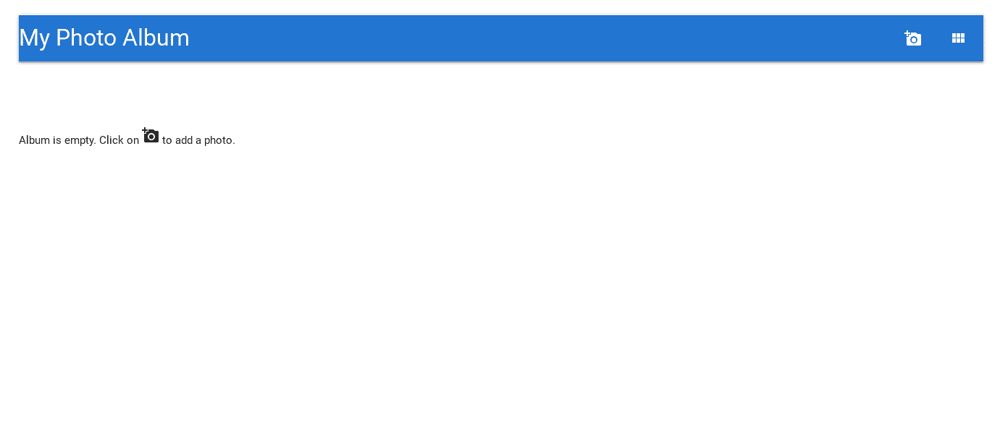
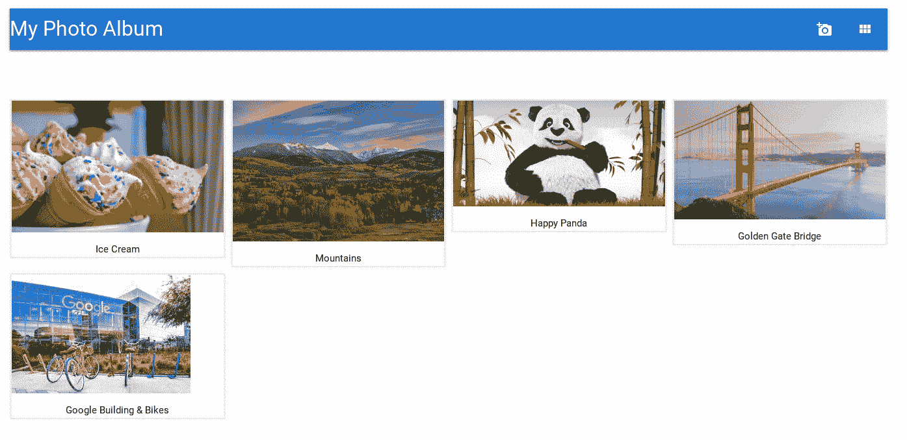

# Google Cloud Run on Rails:一个真实的例子(第 2 部分:本地运行)

> 原文：<https://medium.com/google-cloud/google-cloud-run-on-rails-a-real-life-example-part-2-running-locally-5734a1a7532f?source=collection_archive---------5----------------------->

第 1 部分是关于建立你的 GCP 项目以及你的工作环境。现在让我们关注相册应用程序本身，并在投入生产之前在本地运行它。

**注意:** *在您的本地环境中运行相册应用程序是可选的。你可以放心地跳过这一部分(或者只是略读一下)，进入* [*第 3 部分*](/@laurent_90293/google-cloud-run-on-rails-a-real-life-example-part-3-production-environment-and-security-e109063ef745) *。*

# 介绍相册应用程序

我们在本教程中使用的 Rails 应用程序是一个相册。它足够简单，可以安装在一个 Rails 控制器中，但又足够丰富，可以执行一些专业应用程序在现实生活中通常需要的 GCP 服务。

这包括:

*   **云构建**构建应用程序的容器映像，并将其部署到云运行
*   **容器注册表**用于存储和唯一标识容器映像的版本，并检查其漏洞
*   **云 SQL** 大规模管理您的生产 MySQL 数据库
*   **Google 云存储**作为 Rails 主动存储后端来存储图片文件
*   **谷歌云密钥管理服务** (KMS)保护你的应用秘密和凭证

Github 提供了该应用程序的源代码。要在本地克隆它，请运行以下命令:

```
$ git clone [https://github.com/ljulliar/photo_album.git](https://github.com/ljulliar/photo_album.git)
```

如果您想了解其中的内容，您可以在以下文件中找到该应用程序的精华:

*   [**图片控制器**](https://github.com/ljulliar/photo_album/blob/master/app/controllers/pictures_controller.rb) :这里你会发现一个典型的 Rails 控制器，带有创建、显示和删除照片的动作。
*   [**图片模型**](https://github.com/ljulliar/photo_album/blob/master/app/models/picture.rb) :这是声明图片模型的地方，也是我们声明 Rails ActiveStorage 管理与创建的每个图片实例相关联的图像文件的地方。
*   [**定义数据库模式的两个数据库迁移文件**](https://github.com/ljulliar/photo_album/tree/master/db/migrate) :一个由 ActiveStorage 自动生成，另一个用于图片数据。
*   [**视图**](https://github.com/ljulliar/photo_album/tree/master/app/views) 和 partials 文件用于呈现应用 HTML 页面。该应用程序的外观基于[materialize-sass](https://rubygems.org/gems/materialize-sass/)Ruby gem，这是 Materialize 的 Sass 支持版本，是一个基于[材料设计](https://material.io/)的现代响应前端框架。

# 安装 Ruby 和 gems

如果 Ruby 尚未安装在您的工作环境中，您可以按如下方式快速安装它:

首先[安装 RVM](https://rvm.io/rvm/install) ，Ruby 版本管理器。尽管安装 RVM 是可选的，我还是强烈推荐使用它(或者你选择的任何其他 Ruby 版本管理器),因为它让 Ruby 版本的安装变得如此简单。

```
# install rvm signature key
$ gpg --keyserver hkp://pool.sks-keyservers.net --recv-keys 409B6B1796C275462A1703113804BB82D39DC0E3 7D2BAF1CF37B13E2069D6956105BD0E739499BDB# install rvm
$ curl -sSL [https://get.rvm.io](https://get.rvm.io) | bash# load rvm environment variables
$ source ~/.rvm/scripts/rvm 
```

rvm 启动并运行后，安装本教程所需的 Ruby 版本(2.6.3 或您阅读本文时最新的稳定的 2.6.x 版本):

```
$ rvm install ruby-2.6.3       # Install ruby 2.6.3
$ rvm --default use ruby-2.6.3 # Make it the default version
$ ruby -v                      # check that it’s working fine
```

现在让我们按照`Gemfile` 文件中的说明，安装相册应用程序所需的 Ruby gems。您会注意到 Rails 应用程序依赖于`google-cloud-storage` gem，因为 Rails ActiveStorage 需要它来访问存储图像文件的 GCS 桶。

您可能已经注意到，云 SQL 没有特定的精华。由于我们使用的是云 SQL MySQL 实例，传统的`mysql` Ruby gem 是我们与本地或生产 MySQL 数据库接口所需的全部。

```
$ cd ./photo_album
$ bundle install
```

这样，我们的 Ruby 环境就准备好了。现在让我们来探索和设置 MySQL。

# 设置 MySQL

对于本教程，我们需要安装 MySQL 5.6 或更高版本。在您的工作环境中，键入以下命令:

```
$ sudo apt install mysql-server libmysqlclient-dev  # install...
$ sudo service mysql start   # and start the database server
```

**注意** : *如果您使用 Cloud Shell 作为您的工作环境，那么您在 Cloud Shell 的主目录中所做的所有更改都会在工作会话中保持不变，但是系统范围的修改(比如安装新的 Debian 包)则不会。所以如果你决定关闭你的会话或者暂停你的工作一段时间，你将不得不重新安装并启动 mysql。*

现在为本地 MySQL 开发数据库创建用户名(用您喜欢的密码替换下面的`xxx`，并确保相应地更新`config/database.yml`文件的开发和测试部分，以反映您选择的密码):

```
$ mysql -u rootCREATE USER ‘dev_db_user’@’localhost’ IDENTIFIED BY ‘xxx’;
GRANT ALL ON *.* TO ‘dev_db_user’@’localhost’ WITH GRANT OPTION;CREATE USER ‘test_db_user’@’localhost’ IDENTIFIED BY ‘xxx’;
GRANT ALL ON *.* TO ‘test_db_user’@’localhost’ WITH GRANT OPTION;FLUSH PRIVILEGES;exit
```

# 在本地运行相册

然后，让我们创建并填充本地 MySQL 开发数据库…

```
$ bundle exec rake db:setup
```

…并在我们的本地环境中启动相册应用程序。

```
$ bundle exec rails server
```

用你最喜欢的浏览器访问 http://localhost:3000/ ,你会看到一个主页，邀请你在空相册中加载一张新照片。

**注意** : *如果你使用的是云 shell，点击 Shell 窗口正上方的 Web 预览图标(寻找< >符号)，将预览端口改为 3000。然后点击“在端口 3000 上预览”,瞧！*



你的原始相册

你可以玩你的相册:上传两张图片及其说明，点击其中一张查看细节，也可以删除一张照片。您应该会看到类似这样的内容:



你的相册里有几张漂亮的照片

一切都好吗？现在让我们转到[第 3 部分](/@laurent_90293/google-cloud-run-on-rails-a-real-life-example-part-3-production-environment-and-security-e109063ef745)，为在生产中部署打下基础。