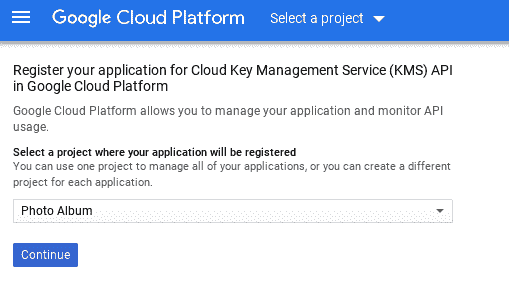

# 运行在 Rails 上的 Google Cloud:一个真实的例子(第 3 部分:生产环境和安全性)

> 原文：<https://medium.com/google-cloud/google-cloud-run-on-rails-a-real-life-example-part-3-production-environment-and-security-e109063ef745?source=collection_archive---------2----------------------->

在本教程的[第 1 部分](/@laurent_90293/google-cloud-run-on-rails-a-real-life-example-part-1-preparing-the-ground-705c94ab8a7a)中，我们设置了我们的项目环境，而[第 2 部分](/@laurent_90293/google-cloud-run-on-rails-a-real-life-example-part-2-running-locally-5734a1a7532f)致力于在您的本地开发环境中运行相册应用程序。

# 设置云运行

如果在[第 1 部分](/@laurent_90293/google-cloud-run-on-rails-a-real-life-example-part-1-preparing-the-ground-705c94ab8a7a)中尚未启用，则启用云运行 API:

```
$ gcloud services enable run.googleapis.com
```

还定义了 Google Cloud 区域 Cloud Run 将运行于:

```
$ gcloud config set run/region us-central1
```

**注意** : *在撰写本文时，云运行仍处于测试阶段，因此仅可从* `us-central1` *区域*获得

# 设置 Rails 主密钥

从版本 5.2 开始，Rails 生成一个秘密主密钥来加密 cookies 中的用户会话参数、应用程序和浏览器之间来回传递的其他类型的敏感信息以及您自己的应用程序数据。要创建新的 rails 主密钥和相应的凭证文件，请键入以下命令:

```
$ EDITOR=vim rails credentials:edit # generate secret_key_base
```

它会启动 vi 编辑器，其中已经填充了新的凭证文件，因此您只需保存它。凭证文件的加密版本在`config/credentials.yml.enc`中，相应的主密钥在`config/master.key`中。后者是非常敏感的信息，未经授权的人或程序不得访问。我们马上会看到如何保护万能钥匙。

# 使用云 SQL 设置您的生产数据库

如果还没有在第 1 部分中完成，启用云 SQL 管理 API。

```
$ gcloud services enable sqladmin.googleapis.com
```

[Cloud SQL](https://cloud.google.com/sql/docs/) ，GCP 上可用的 MySQL 的托管版本，是我们在本教程中选择的 RBDMS。

让我们创建一个所谓的“db-f1-micro”服务器实例，这是最小的云 SQL 实例。它非常适合我们的演示应用程序(参见[其他类型的 MySQL 实例](https://cloud.google.com/sql/pricing#2nd-gen-pricing))。我们还需要用密码保护数据库 root 帐户，并定义另一个我们将在生产中专门由 Rails 使用的帐户。

```
# Create a small Cloud SQL instance with a public IP (takes some time)
$ gcloud sql instances create photo-album-production --tier=db-f1-micro --region=us-central1 --assign-ip# Protect database root account
$ gcloud sql users set-password root --host % --instance photo-album-production --password ***your_root_db_password***# Create a new database account for Rails in production
$ gcloud sql users create prod_db_user --instance photo-album-production --host % --password ***your_prod_db_password***
```

让我们检查一下我们的云 SQL 实例是否可以使用。下面的命令应该将您的实例显示为“RUNNABLE”。

```
$ gcloud sql instances list
```

[在 Google Cloud Web 控制台上访问您的云 SQL 实例](https://console.cloud.google.com/sql)，复制实例连接名称并将其粘贴到`config/database.yml`中生产部分的`socket`字段中。

```
production:
  <<: *default
  database: photo_album_production
  username: prod_db_user
  password: <%= ENV[‘DATABASE_PASSWORD’] %>
  socket: “/cloudsql/*project_id*:us-central1:photo-album-production”
```

**安全提示:** *您可能已经知道，从安全角度来看，在应用程序的源代码中明文存储密码和凭证是绝对不允许的。这就是为什么对于生产部署，Rails 将在运行时从 DATABASE_PASSWORD 环境变量中获取数据库密码。在本文的后面，Google 云密钥管理系统(云 KMS)将帮助我们加密这个密码，并且只在 Rails 真正需要的时候才解密。*

# 在 GCS 上创建图像存储桶

相册应用程序依靠 [Rails 活动存储](https://edgeguides.rubyonrails.org/active_storage_overview.html)来管理图像文件。活动存储是一个非常酷的模块，它方便上传任何类型的文件，并将这些文件存储在选择的存储后端。当在开发或测试环境中本地运行时，存储后端通常是您的本地磁盘。在生产中，我们选择使用 Google 云存储(GCS)作为我们的后端，以获得最大的可扩展性和可靠性。

让我们创建 GCS 存储桶，将图像存储在与云运行实例相同的位置，以获得最佳性能:

```
$ gsutil mb -p $PROJECT_ID -l us-central1 gs://photo_album_images_xxxxxx
```

其中`xxxxxx`是一个 6 位数字，您可以选择它作为唯一的存储桶名称。

然后，让我们通过编辑`config/storage.yml`文件将活动存储指向这个桶。查找`google`部分，并使用您自己的项目 ID 和 bucket 名称调整项目参数。

```
google:
  service: GCS
  project: ***project_id***
  credentials: <%= Rails.root.join(“config/photo_album_runner.key”) %>
  bucket: ***photo_album_images_xxxxxx***
```

还要编辑`config/environments/production.rb`文件，通知 Active Storage 我们将在生产中使用 Google Storage 后端:

```
config.active_storage.service = :google
```

# 创建应用程序服务帐户

在我们可以在生产中部署我们的应用程序并第一次运行它之前，我们必须将它与一个[服务帐户](https://cloud.google.com/iam/docs/service-accounts)相关联。简而言之，服务帐户是一个特殊的 Google 帐户，当您的应用程序与其他 GCP 服务接口时，它会模拟您的应用程序。

让我们用 [Google Cloud IAM](https://cloud.google.com/iam/) (身份&访问管理)创建一个名为“photo-album-runner”的服务帐户:

```
$ gcloud iam service-accounts create photo-album-runner --display-name “Photo Album Cloud Runner”
```

使用以下命令查看完整的服务帐户名称:

```
$ gcloud iam service-accounts list
NAME                     EMAIL                             DISABLEDPhoto Album Cloud Runner **photo-album-runner@photo-album-xxxxxx.iam.gserviceaccount.com** False
...
...
```

**注意** : *您可能还会注意到列表中的另外两个服务帐户。每当您创建一个新项目时，GCP 都会自动创建这些帐户:一个计算引擎服务帐户和一个应用引擎服务帐户。在本教程中，我们不会用到这些。*

下一步是向我们全新的服务帐户授予角色，以便它获得足够的权限来履行其职责。那么这个服务帐户到底需要做什么呢？

*   首先，它需要在 GCS 桶中查看、创建、删除对象，因为这是我们存储图像的地方。这可以通过授予`storage.objectAdmin`角色来实现。
*   它还必须能够作为客户端与我们的云 SQL 实例对话(`cloudsql.client`角色)。

`photo-album-runner`服务帐户现在已经配备了它所需要的角色。不多不少。

下一步是要求 Cloud IAM 以 JSON 文件的形式为我们生成一个服务帐户密钥，保存在`config/photo_album_runner.key`文件中。该文件将在运行时用作相册应用程序的 Google 凭证，以建立其与其他 GCP 服务的身份。

```
$ gcloud iam service-accounts keys create ./config/photo_album_runner.key --iam-account photo-album-runner@$PROJECT_ID.iam.gserviceaccount.com
```

这个凭证文件绝对是一条敏感的信息。如果有人能够访问该文件，他/她也可以访问我们正在使用的各种 GCP 服务。很明显，这个关键文件以及我们应用程序的其他敏感信息必须得到绝对的保护。谷歌云 KMS 救援！

# 保守我们的秘密…秘密

幸运的是，谷歌云密钥管理服务(云 KMS)正是旨在提供这种服务，它与谷歌云构建优雅地运行。记住这一点，让我们退后一步，列出 Rails 应用程序中需要加密的所有资源:

*   由 Rails ( `config/master.key`)生成的主密钥文件，如上所述。
*   我们将在运行时在 DATABASE_PASSWORD 环境变量中传递的 Rails 生产数据库密码(参见`config/database.yml`)
*   在云环境中运行时，模拟我们的应用程序的 GCP 服务帐户的凭据

由于 Rails 5.2，所有加密的秘密、Rails 需要的秘密以及应用程序的其他秘密都存储在一个加密文件中:config/credentials.yml.enc。用于加密/解密该文件的主密钥在 config/master.key 中。出于显而易见的安全原因，gitignore 确保它不会被提交到您的源代码库中。

由于这个文件不是我们的源存储库的一部分，我们必须找到另一种安全的方式来为 Rails 提供这个主密钥文件，因为构建应用程序容器和随后在容器中运行 Rails 应用程序都需要它。让我们看看如何做到这一点。

如果在[第 1 部分](/@laurent_90293/google-cloud-run-on-rails-a-real-life-example-part-1-preparing-the-ground-705c94ab8a7a)中尚未完成，请从 Web 控制台(以下截图)或命令行启用[谷歌云 KMS API:](https://console.cloud.google.com/flows/enableapi?apiid=cloudkms.googleapis.com)

```
$ gcloud services enable cloudkms.googleapis.com
```



从 Google Cloud Web 控制台为您的项目启用云 KMS

现在让我们创建一个名为 photo-album 的密匙环，一个用于 Photo Album 服务帐户，一个用于 Rails 主密钥。

两个加密的文件`config/photo_album_runner.key.enc`和`config/master.key.enc`可以安全地提交到您的源代码库中。稍后构建容器映像时，云构建将要求云 KMS 仅在需要时并且仅在任何人都无法访问的上下文中解密密钥，从而保护您的秘密。

让我们也加密我们将用于生产数据库的数据库密码，以便我们避免在我们的任何源文件(通常是`config/database.yml`或`Dockerfile`)中留下明文的生产密码。将下面的`xxx`替换为您在前面的云 SQL 部分创建 prod_db_user 时选择的密码:

```
$ gcloud kms keys create db_pwd_key --location=us-central1 --keyring photo-album --purpose encryption$ echo -n “xxx” | gcloud kms encrypt --location us-central1 --keyring photo-album --key db_pwd_key --plaintext-file - --ciphertext-file -| base64 --wrap 0
```

将 base64 编码的密码复制粘贴到`cloudbuild.yaml`文件中(参见文件末尾的 DB_PWD 条目)

这就是[第三部](/@laurent_90293/google-cloud-run-on-rails-a-real-life-example-part-3-production-environment-and-security-e109063ef745)的结尾。我们的生产环境已经就绪。本教程的第 4 部分(也是目前的最后一部分)将介绍如何构建容器映像并将其部署到生产环境中。