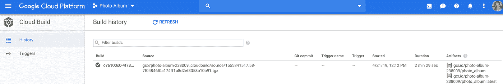

# Google Cloud Run on Rails:一个真实的例子(第 4 部分:上线！)

> 原文：<https://medium.com/google-cloud/google-cloud-run-on-rails-a-real-life-example-part-4-going-live-64c566b73b7b?source=collection_archive---------3----------------------->

在经历了[第一部](/@laurent_90293/google-cloud-run-on-rails-a-real-life-example-part-1-preparing-the-ground-705c94ab8a7a)、[第二部](/@laurent_90293/google-cloud-run-on-rails-a-real-life-example-part-2-running-locally-5734a1a7532f)和[第三部](/@laurent_90293/google-cloud-run-on-rails-a-real-life-example-part-3-production-environment-and-security-e109063ef745)之后，这里是这个系列的最后一集。这是您的应用程序在互联网中实际运行的地方。😅

# 准备 Google 云构建

Cloud Run in life 的使命是部署和扩展包装在容器中的 HTTP/S 驱动的工作负载。因此，让我们为 Ruby on Rails 应用程序构建一个容器。因为本教程的目标是向您展示如何最好地利用各种 GCP 服务，所以让我们依靠 [Google Cloud Build](https://cloud.google.com/cloud-build/docs/) (GCB)来组装我们的容器。

在启动 build 命令之前，我们必须授予 Cloud Build(或者更准确地说是模拟 Cloud Build 的服务帐户)对我们之前加密的三条信息的`cloudkms.cryptoKeyDecrypter`角色(参见[第 3 部分](/@laurent_90293/google-cloud-run-on-rails-a-real-life-example-part-3-production-environment-and-security-e109063ef745))。有了这个角色，Cloud Build 能够在构建过程中需要时解密这些秘密(在下面的`cloudbuild.yaml`文件中有更多相关信息)。

要查找由 GCP 自动创建的云构建服务帐户的名称，请访问[谷歌云平台控制台 IAM](https://console.cloud.google.com/iam-admin/iam/project) 页面，并查找角色为“云构建服务帐户”且符合以下模式的帐户:`xxx...xxx@cloudbuild.gserviceaccount.com`。

# 运行生成操作

与其调动本地机器的处理能力来构建应用程序容器，不如让我们将这项任务委托给 [Google Cloud Build](https://cloud.google.com/cloud-build/) 。在撰写本文时，前 120 分钟*每天*是免费的，您只需为 Google 云存储中容器映像使用的空间付费，这反过来又为您提供了 5GB 的免费空间。我们的容器映像的大小小于 100 MB，这意味着除非您坚持保留您的构建的最后 50 个版本，否则您不用支付一分钱。如果真的到了那一步，你仍然可以享受 300 美元的免费积分。

让我们花点时间回顾一下云构建将使用的配置文件。它们都可以在源代码库的根目录下找到。

**cloudbuild.yaml** :这个文件描述了 cloudbuild 构建容器必须经历的步骤。文件本身由四个步骤组成。实际上是五个，但第一个是隐含的:

1.  创建源目录(当前工作目录)的压缩 tarball，将其转移到 GCS bucket 中，并在 Cloud Build 工作区中解压缩归档文件。
2.  请云 KMS 解密 master.key.enc 文件，以便它可用于其余的构建过程(以及我们将发布的未来容器)
3.  对服务帐户凭据执行相同的操作
4.  按照`Dockerfile`中的说明构建容器，在此之前，确保解密生产数据库密码，并将其作为环境变量(DB_PWD)传递
5.  将新映像推送到容器注册表，以便通过云运行部署到生产环境中

**Dockerfile** :这个文件由云构建中的“构建映像”步骤调用。阅读下面的评论，找出每个语句的作用。

最后，找到下面的`entrypoint.sh` 脚本，它将在每次云运行启动新的容器实例时运行。这需要说几句话:

1.  db:create rake 任务实际上将在云运行实例的第一次启动时创建数据库，对后续运行没有影响
2.  在 entrypoint 脚本中运行 db:migrate 是一个方便的技巧。但是，它可能偶尔会在日志中生成错误消息，这些错误消息是由同时启动的并发云运行实例引起的。尽管这是无害的。
3.  `$PORT`是由云在运行时提供的，还有许多其他环境变量。

现在是构建容器的时候了:

```
$ gcloud builds submit --config cloudbuild.yaml
```

构建步骤的日志应该在您的屏幕上展开。几分钟后，您应该会看到一条成功消息，以及刚刚创建的容器映像的名称。

**注意** : *构建日志也可以在* `*~/.config/gcloud/logs*` *中找到，也可以从 Google Cloud Web 控制台的菜单> Cloud Build 下找到，以防您需要进一步调查。*



显示最新版本的云构建 Web 控制台

如果构建成功，云构建还会将最新的容器映像推送到相册文件夹下的[容器注册表](https://cloud.google.com/container-registry/docs/)中:


显示最新构建的容器映像的容器注册表 Web 控制台

# 检查漏洞

使用像 Cloud Run 这样的无服务器服务肯定会让您的生产部署变得更加轻松。您基本上可以忘记管理自己的服务器或集群的所有复杂性。但是有一件事您一定不能忘记:那就是确保您构建和部署的容器是安全的，不会受到攻击。

幸运的是，从容器注册表的设置菜单中，您可以激活漏洞扫描 API(见下面的截图)。在我撰写本文时，它仍处于测试阶段，但我强烈建议您立即激活该功能，因为它将帮助您在实际部署到生产环境之前发现映像中的任何潜在漏洞。**非常*** 有用的服务。


在容器注册表中启用自动容器映像漏洞扫描

# 部署应用程序

如果您的构建进展顺利，并且在您的过程中没有发现严重的漏洞，您可以要求 Cloud Run 部署您刚刚构建的映像:

第一个参数“photo-album”是我们给云运行服务起的名字。它会在第一次部署时自动实例化。

*   第二个参数是刚刚构建并在容器注册表中注册的映像的路径。
*   第三个参数告诉 Cloud Run 将哪个云 SQL 用于此服务。如果您进行其他部署，则不需要第三个参数，因为 Cloud Run 会将它从一个服务版本持续到下一个版本。
*   最后一个参数告诉云构建忽略身份验证步骤。这是因为在您创建的项目中，您被授予了角色`project.owner`。

部署大约需要一分钟，最后一条消息会告诉您应用程序的公共 URL。从那一刻起，你就在直播！


云运行修订屏幕

# 监控您的应用

一旦您的应用程序部署到生产环境中，就不要再去关注它了。首先要做的是确保 Cloud Run 捕获 Rails 日志。Cloud Run 监控大量日志消息的 [I/O 源](https://cloud.google.com/run/docs/logging#container-logs)，其中一个是标准输出。事实证明，从 Rails 5 开始，将 Rails 生产日志重定向到 STDOUT 只是设置 RAILS_LOG_TO_STDOUT 环境变量的问题。这就是为什么您会在 Dockerfile 文件中找到以下语句:

```
# Redirect Rails log to STDOUT for Cloud Run to capture
ENV RAILS_LOG_TO_STDOUT=true
```

云运行日志可在云运行 Web 控制台的`LOGS`选项卡下获得(参见上面的屏幕截图)。

除了收集系统和应用程序日志消息，Cloud Run 还收集许多指标，如请求计数、请求延迟以及容器 CPU 和内存分配。指标可从同名的选项卡中获得(参见上面的屏幕截图)。

使用云运行收集 Rails 日志是第一步。一个更高级的替代方案是使用 Google [Stackdriver](https://cloud.google.com/stackdriver/) 不仅收集日志消息，还在出现错误时激活应用程序监控/警报、堆栈跟踪和源代码级调试。但是我们将这个主题留给另一篇文章。😄

# 结论

恭喜你！您已经完成了本教程的学习。当然，这需要消化大量信息，但是现在您已经有了安全部署 Rails 应用程序并使它们随意伸缩的坚实基础。在我撰写本文时，Cloud Run 仍处于测试阶段，但它已经是一个非常稳定且可扩展的产品。预计未来几周和几个月会有更多功能发布。

当然这绝不是一篇全面的文章。您可能希望在 Rails 应用程序中利用许多其他 GCP 服务，例如:

*   使用云任务触发异步后台处理任务(例如，在后台生成照片的缩略图)
*   使用云调度程序生成周期性任务
*   将 Rails 日志消息重定向到 Stackdriver，以获得更高级的监控、警报和调试功能
*   进行性能研究，为您的应用找到最佳的云运行实例[内存限制](https://cloud.google.com/run/docs/configuring/memory-limits)与[并发级别](https://cloud.google.com/run/docs/configuring/concurrency)的比率。

每个主题都可以是(将会是？😉)一篇文章本身的主题。因此，请尽情阐述并享受 Google Cloud Run 上 Rails 的强大功能。

一如既往，欢迎评论。