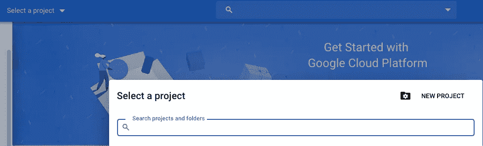
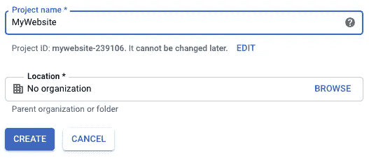
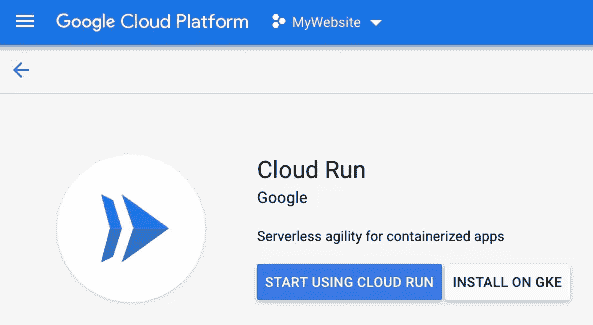
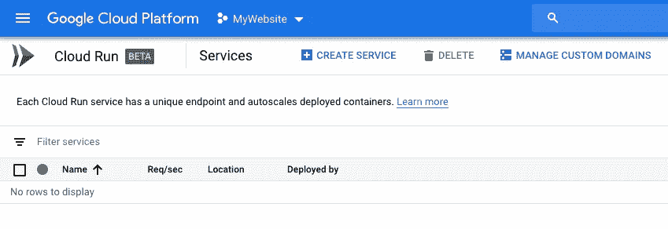
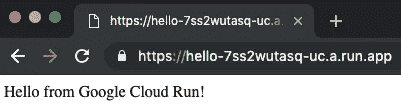
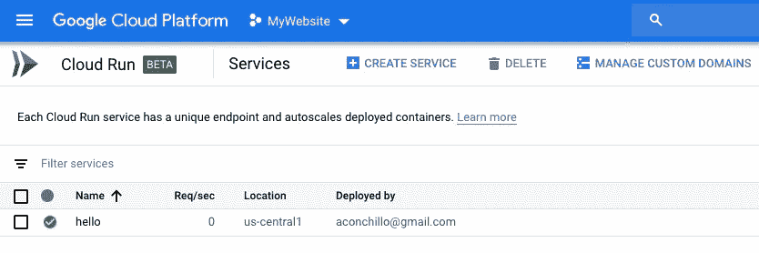

# 谷歌云运行或如何在 5 分钟内运行您的静态网站等等

> 原文：<https://medium.com/google-cloud/google-cloud-run-or-how-to-run-your-static-website-in-5-minutes-and-much-more-dbe8f2804395?source=collection_archive---------0----------------------->

*TLDR；*这篇文章没有从技术角度深入讨论 Google Cloud Run 的工作原理。此外，Google Cloud Run 可以做的不仅仅是运行一个简单的网站。这篇文章只是详细描述了一个非常简单的用例以及我第一次使用它的经历，希望它能帮助那些可能好奇但不知道从哪里开始的人(即使已经存在的[快速入门](https://cloud.google.com/run/docs/quickstarts)可能就是你需要的全部)。

我有一个月的问题。我的专用服务器硬盘彻底没电了( *fsck* 甚至不能用了)，10 年后我们终于决定扔掉它。不幸的是，我妈妈的商业网站在那里运行。没错！这只是一个流量很低的静态网站，但对她来说仍然是一个非常好的网站。

直到昨天，我一个月什么都没做。当类似的事情发生时，我通常会抓住机会尝试新事物，我不想使用任何上传 HTML 文件的服务，就是这样。我想到的第一个选择是使用 [Firebase 托管](https://firebase.google.com/docs/hosting),但我已经为另一个单页面网站这样做了，而且我已经在工作中使用 Firebase。

幸运的是，[Google Next’19](https://cloud.withgoogle.com/next/sf/)发生在几周前。昨天，我在通勤途中听了[谷歌云平台播客](https://www.gcppodcast.com/)，这一集是关于 2019 年发布的新产品:[谷歌云运行](https://cloud.google.com/run/)。当播客完成时，我清楚地看到:我只是要使用谷歌云运行！

但是 Google Cloud Run 是什么？这是一种正确的无服务器方式。打扰一下。使用 [Google Cloud Functions](https://cloud.google.com/functions/) 你可以在一个文件中编写一个 Node.js(或者 Go…) HTTP 请求处理程序并上传。部署该功能后，您会得到一个 URL，您已经设置好了，您只需指向它。谷歌云运行更上一层楼。您现在部署容器，而不是上传您的函数文件。为什么这样更好？因为现在你可以在你的容器里放任何你想要的东西。不用等你喜欢的语言被云功能支持(这永远不可能发生)，现在你只需要创建一个容器，然后在里面运行你想运行的任何东西。您所要做的就是打开容器中的端口 8080(稍后会详细介绍)。与云功能一样，它可以开箱即用，你可以将你的容器连接到其他谷歌云产品。想象一下可能性。

截至今天，我很确定肯定已经有一堆文章在谈论我要解释的内容，但这种体验是如此的无痛、美丽、简单和快速，以至于我认为它值得分享。所以，开始了！

# 创建一个新的谷歌云平台项目

如果这是你第一次创建一个新的 GCP(谷歌云平台)项目，下面是你怎么做。如果你已经知道怎么做，只需在控制台中创建一个新项目并命名，比如说*我的网站*，然后跳到下一节。

首先，进入[谷歌云控制台](https://console.cloud.google.com/)，点击顶部的*选择一个项目*。这将打开一个模态窗口，点击*新建项目*。



接下来，只需输入项目名称，我们说是 *MyWebsite* 点击 *Create* 。在这一步中有一件**非常重要的**事情需要记住:*项目 ID* 是 *mywebsite-239106，*记下来，因为我们以后会用到它。



项目创建完成后，从我们一开始点击的同一个*选择项目*下拉列表中选择它。

# 启用计费(以及关于定价)

不幸的是，我刚刚意识到你必须经历这一步。当我第一次尝试 Google Cloud Run 时，我已经启用了我的计费，所以直到现在我才意识到这是必要的。我只是假设你对此没有任何问题。最终，运营一个低流量网站将“几乎”免费。请参见[谷歌云运行定价](https://cloud.google.com/run/pricing)了解更多详情。

# 启用 Google 云运行

假设您已经选择了您的 GCP 项目，只需转到 Google Cloud Run 并点击*开始使用 Cloud Run* 。



你应该最终在谷歌云运行控制台。



# 安装并授权 Google Cloud SDK

如果你已经安装了 [Google Cloud SDK](https://cloud.google.com/sdk/) 并且你知道你在做什么，你可能可以跳过这一步(记得更新 Google Cloud SDK，安装测试版组件并选择你新创建的项目)。

如果你正在使用 OS X，很可能你已经安装了[自制软件](https://brew.sh/)。如果有，只需键入:

```
$ brew cask install google-cloud-sdk
```

如果你没有自制软件，我建议你安装它。如果你不想安装它，你可以遵循来自 [Google Cloud SDK](https://cloud.google.com/sdk/) 的安装说明，如果你使用 GNU/Linux 也一样。

所以，一旦安装了 Google Cloud SDK，你需要用你用来创建你的项目的 Google 帐户来授权它。键入以下内容:

```
$ gcloud auth login
```

接下来，安装 Google Cloud SDK 测试版组件:

```
$ gcloud components install beta
```

最后，选择你的项目(还记得我们之前记下的项目 ID 吗？):

```
$ gcloud config set project mywebsite-239016
```

# 安装 Docker

同样，在 OS X，如果你有自制软件，只需输入:

```
$ brew cask install docker
```

如果没有，只需[下载 Docker](https://docs.docker.com/docker-for-mac/install/) 并按照说明操作即可。这很简单。

# 创建容器

最后，有趣的部分。我们接下来要做的是部署一个简单的 HTML 页面，并通过 Google Cloud Run 提供服务。让我们首先创建一个新目录，并对其进行一些组织:

```
$ mkdir website
$ cd website
$ mkdir html nginx
```

在 *html* 目录下创建一个*index.html*文件，内容如下:

```
<html>
<body>Hello from Google Cloud Run!</body>
</html>
```

为了提供这个文件，我们只需要一个网络服务器。我们将使用 [nginx](https://www.nginx.com/) 。我说过 Google Cloud Run 使用容器，这意味着我们可以简单地使用现有的 *nginx* 容器。默认 nginx 容器的唯一问题是它在端口 80 上服务文件，然而 Google Cloud Run 期望容器在端口 8080 上服务东西。所以，我们稍后会给 *nginx* 提供一个新的配置文件。

在*网站*目录下新建一个 *Dockerfile* :

```
$ cat Dockerfile
FROM nginxCOPY html /usr/share/nginx/htmlCOPY nginx/default.conf /etc/nginx/conf.d/default.conf
```

在这个*Docker 文件*中，我们只是告诉 Docker 基于 *nginx* 容器创建一个新的容器，并且我们正在添加我们的 *html* 目录(包含我们的*index.html*)以及我们接下来将创建的 *nginx* 配置文件。

在 *nginx* 目录中创建一个 *default.conf* 文件(注意我们如何监听端口 8080):

```
$ cat nginx/default.conf
server {
    listen       8080;
    server_name  localhost; location / {
        root   /usr/share/nginx/html;
        index  index.html index.htm;
    } # redirect server error pages to the static page /50x.html
    error_page   500 502 503 504  /50x.html;
    location = /50x.html {
        root   /usr/share/nginx/html;
    }
}
```

完成所有这些后，您应该有这样的目录结构:

```
$ tree
.
├── Dockerfile
├── html
│   └── index.html
└── nginx
    └── default.conf
```

注意，在 *html* 目录或者其他地方，你可以添加更多的文件:更多的 html 文件、CSS 文件、图片等等。如果是一个大网站，最好将内容上传到[谷歌云存储](https://cloud.google.com/storage/)，并保持容器较小。

# 构建和部署容器

现在我们可以构建容器并推动它。这是通过 Google Cloud SDK 命令完成的:

```
$ gcloud builds submit --tag gcr.io/mywebsite-239106/hello
```

我们已经指定了我们的项目 *mywebsite-239106* 以及我们新的 Google Cloud Run 服务的名称 *hello* 。

最后，我们可以将新容器部署到 Google Cloud Run:

```
$ gcloud beta run deploy --image gcr.io/mywebsite-239106/hello
```

如果一切顺利，您应该会看到如下消息:

```
Service [hello] revision [hello-00001] has been deployed and is serving traffic at [https://hello-7ss2wutasq-uc.a.run.app](https://hello-7ss2wutasq-uc.a.run.app)
```

看起来生成的 URL 已经启动并运行了！



您还可以查看 Google Cloud Run 控制台了解更多详细信息:



之后，您可以对您的网站进行更改，并继续构建和部署新的容器。Google Cloud Run 将列出您已经部署的所有修订。

# 分配一个域

接下来，您可以为新的 Google Cloud Run 服务分配一个域。我不打算在这里讨论这个问题，因为它需要你更新你的域名 DNS 记录，这实际上取决于你使用的服务，但我必须说这个过程非常简单。部署完成后，您只需点击*管理定制域*(见上图)。

哦！最棒的是，证书已经为您管理好了。我很高兴地感到惊讶，没有做任何事情一个[让我们加密](https://letsencrypt.org/)证书已经为我的域设置好了，HTTP 和 HTTPS 都工作得很好。

就这样了！

对了，我提到了一些关于 Firebase 和 work 的事情。我们在工作中使用 Firebase 和其他谷歌云平台的东西。我只是想分享一个我们已经工作了几个月的新项目。这是一个非常酷的屏幕共享新概念，并且有一个奇怪的名字。来看看:[https://www.rumpus.co/](https://www.rumpus.co/)