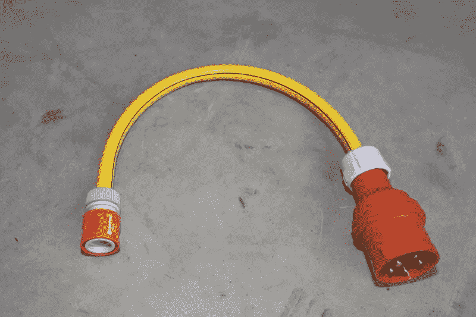
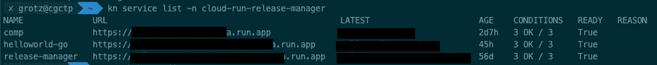
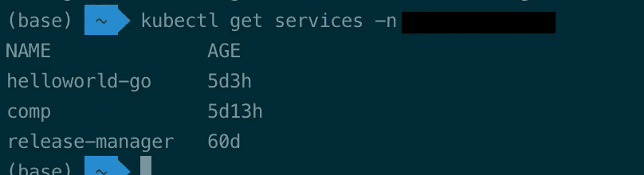

# 使用 KNative CLI 运行 Google Cloud

> 原文：<https://medium.com/google-cloud/google-cloud-run-with-knative-cli-4299d94110d5?source=collection_archive---------1----------------------->



从[THW·维恩海姆](https://www.thw-viernheim.de/berichte/archiv/2011/neuer-adapter-ermoeglicht-wasserversorgung-ueber-aggregate.html)到 Gardena 的三相电流

如你所知，Google Cloud Run 正在实现 KNative API，并且基本上以托管服务的形式提供 KNative。 [Ahmet](https://twitter.com/ahmetb) 就此写了一篇很棒的[博客文章](https://ahmet.im/blog/cloud-run-is-a-knative/)，并对云运行 API 偏离 KNative API 的地方给出了很好的见解。今天我想向你们展示这在现实中意味着什么。通常，当使用 Cloud Run 时，您会使用 Google 提供的 gcloud SDK 工具，但您也可以轻松使用 KNative 的 [kn CLI。](https://knative.dev/docs/install/client/)

为此，您必须设置 Kubernetes 配置(`˜/.kube/config`)以指向云运行 API:

```
apiVersion: v1
clusters:
- cluster:
    server: [https://us-central1-run.googleapis.com:443](https://us-central1-run.googleapis.com:443)
  name: cloudrun
contexts:
- context:
    cluster: cloudrun
    user: cloudrun
  name: cloudrun
current-context: cloudrun
kind: Config
preferences: {}
users:
- name: cloudrun
  user:
    exec:
      apiVersion: client.authentication.k8s.io/v1beta1
      args: null
      command: gke-gcloud-auth-plugin
      env: null
      installHint: Install gke-gcloud-auth-plugin for use with kubectl by following
        go/gke-kubectl-exec-auth
      interactiveMode: IfAvailable
      provideClusterInfo: true
```

上面的配置使用[gke-g Cloud-auth-plugin](https://cloud.google.com/blog/products/containers-kubernetes/kubectl-auth-changes-in-gke)credential helper 来针对云运行 API 进行身份验证。需要注意的是，你必须选择一个区域端点。在 Cloud Run API 中，k8s 名称空间相当于一个 GCP 项目，因此要与 API 交互，您需要提供一个项目 id 或项目编号，并带有参数`-n`，因为没有`default`。下面是一个使用 kn 列出服务的示例:

`kn service list -n <gcp_project_id>`



查询可用服务时的控制台输出示例

# 使用 Kubectl

我问自己,`kn`管用吗,`kubectl`也管用吗？遗憾的是，云运行 API 缺少 Kubernetes API 中的一些发现端点，而这些端点本来就允许这样做。所以你在调用`kube get all`时会得到一些错误。但是我通过为云运行创建一个简单的 [K8S API 兼容层](https://github.com/cgrotz/blog-examples/tree/main/cloudrun-kubernetes-compatibility-layer)来实现其中的一些端点，尝试了各种可能。由于你下面没有一个羽翼丰满的 K8S，所以有一些限制，但这可以让你和`kubectl`一起使用 Cloud Run。要使用它，部署示例兼容性层并修改上面的配置以指向您的云运行服务。

遗憾的是，Cloud Run API 在响应负载中使用项目编号，这意味着如果您使用名称空间的项目 id 而不是项目编号，您将从 kubectl 获得一条错误消息。列出 GCP 项目中部署的服务的示例如下:



运行 kubectl get service -n

要部署新的云运行服务，您可以简单地调用`kubectl apply --validate=false -f <yaml>`，但是由于兼容层目前不提供 Knative 的 swagger/OpenAPI 规范，您必须禁用验证。

我还测试了 Helm 的兼容性层，但由于 Helm 默认使用基于秘密的[存储后端](https://helm.sh/docs/topics/advanced/#storage-backends)作为其部署状态。如果你想让它运行或者扩展兼容层来实现一个简单的 secrets API，你可以选择一个 SQL 存储后端，例如一个 GCP Secret Manager 后端。