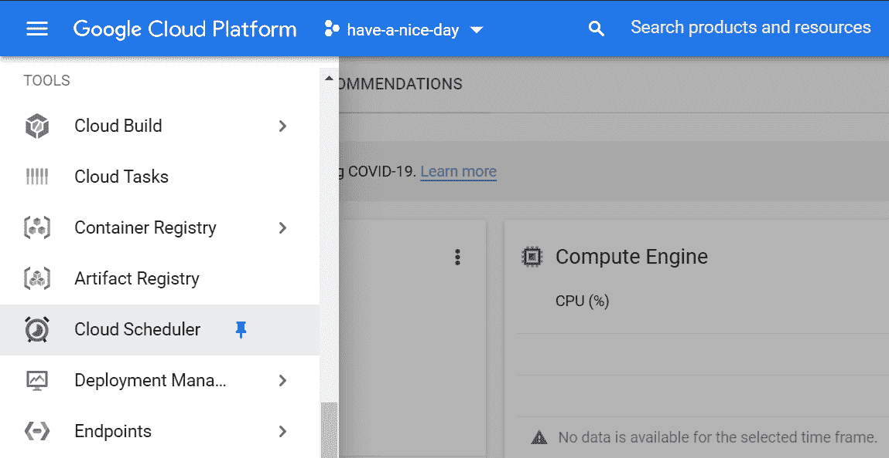
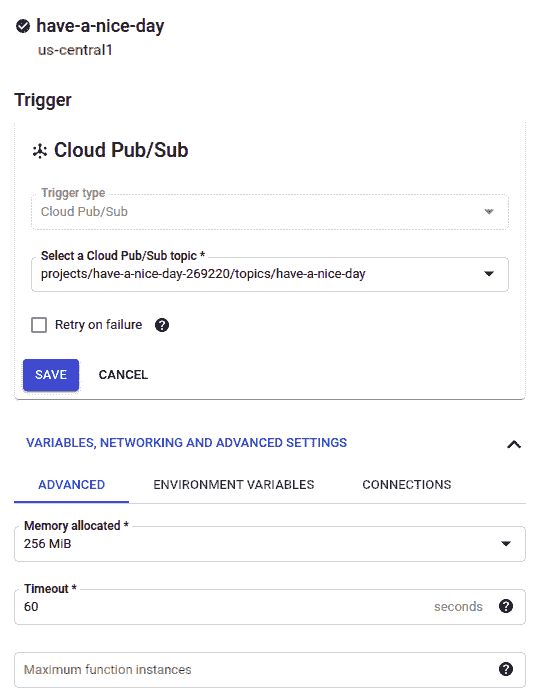

# Google Cloud Scheduler:使用 Python 的无服务 CRON 作业

> 原文：<https://medium.com/google-cloud/google-cloud-scheduler-serveless-cron-jobs-with-python-ae10509479b8?source=collection_archive---------0----------------------->

我自己没有经历过，只听说过一些脚本以给定的频率运行的麻烦。每当专业人员需要自动化这个过程时，他们可能需要在一台机器上部署一个 CRON。

因为这是一个已知的问题，而且我有使用云服务的经验，所以我决定看看谷歌云平台能提供什么。我找到的答案是 Google Cloud Scheduler，一个完全托管的 CRON 作业服务。

为了玩它，我决定做一个推特机器人。并不是说我是 Twitter 爱好者，但是使用它的 Python API 非常简单。我给这个机器人设定了每天早上 8 点发布“祝你愉快”的程序。

为了做到这一点，我将 Google Cloud Scheduler 通过 Cloud Pub/Sub 来触发一个云功能。

# 谷歌云发布/订阅

这是一个完全托管的消息服务，像 Apache Kafka，RabbitMQ 等。它可以用于大量数据，并保证消息至少被传递一次。在这里，我简单地创建了一个名为 have-a-nice-day 的主题，这是一个非常简单的过程。

发布/订阅主题

我很确定每天一次对几个字节使用这样一个强大的工具是一种过度的杀戮。但它使用起来并不复杂，而且你为传输的数据付费，何乐而不为呢？

# 谷歌云调度程序

谷歌云调度程序可以在 GCP 菜单的工具部分找到。

在哪里可以找到谷歌云调度程序

在那里，您将看到您已经设置的作业(可能还没有)。单击创建作业以设置要运行的参数。在那里，你必须给它一个名称，描述，频率，时区和目标。

使用 unix-cron 格式指定频率。如果你和我一样，不熟悉它，我建议你检查一下 [crontab guru](https://crontab.guru/) 以获得一种可访问的方法来编辑这种表达式。

对于目标，您可以在 HTTP、发布/订阅或应用引擎 HTTP 之间进行选择。由于我想触发一个云功能，所以我选择发布到一个发布/订阅主题。HTTP 请求也可以完成这项工作。

一旦选定，它会询问您想要发送的主题和信息。我的工作最终是这样的:

如何配置谷歌云调度程序

# 谷歌云功能

Google Cloud Functions 是一小段代码，可能由 HTTP 请求、云发布/订阅消息或云存储上的一些操作触发。在这一步中，我简单地选择了 Cloud Pub/Sub 触发器，并定义了它正在监听的主题。对于环境变量，我放置了访问 Twitter API 的凭证。

谷歌云功能设置

我决定使用 Python，因为我发现 Python Twitter [repo](https://github.com/bear/python-twitter.) 中的代码很容易使用。在这个页面中，您必须选择当云函数被触发时将运行哪个函数，在这个例子中，是 hello_cloudscheduler。你可以找到我在这个 [github gist](https://gist.github.com/andrevrochasilva/ba4e7279e7b4d76b22465da027f3059f) 中使用的代码。别忘了把 python-twitter 放在需求里！

云功能配置

完成了！有了我们所做的工作，我们将每天运行一项任务，而不必为此而部署和维护虚拟机。你可以使用相同的架构[每天运行云数据流](https://towardsdatascience.com/my-first-etl-job-google-cloud-dataflow-1fd773afa955)。由于 Cloud Pub/Sub 功能强大，您可以根据自己的喜好提高频率。完全无服务器。

我的个人资料照片是我真正的猫

当然，我喜欢看到一些朋友手动转发我的自动帖子。