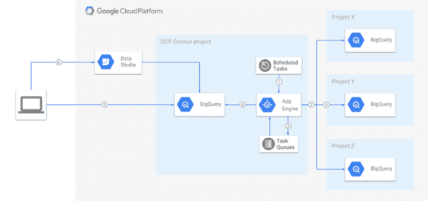
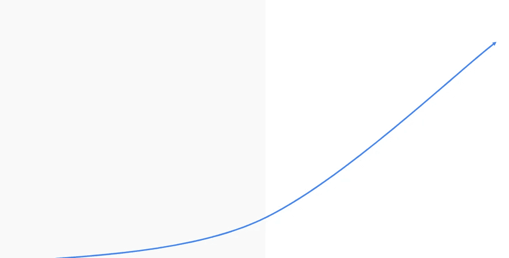
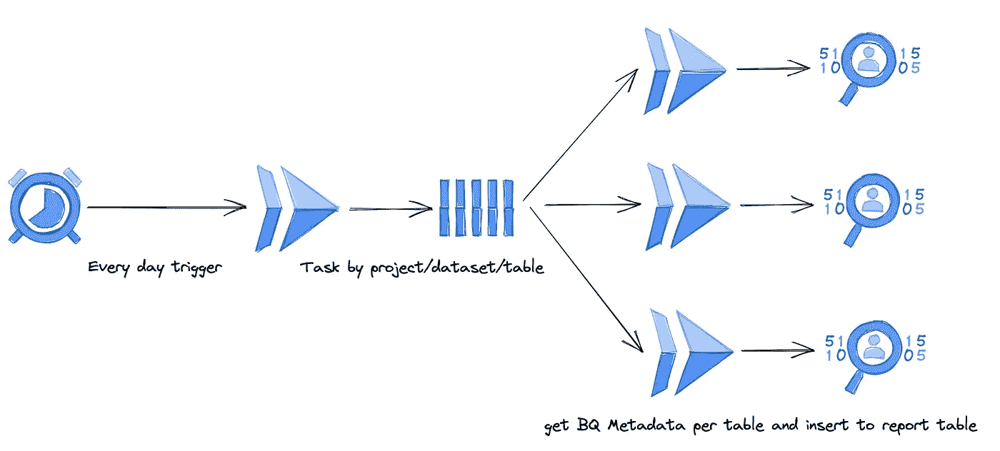
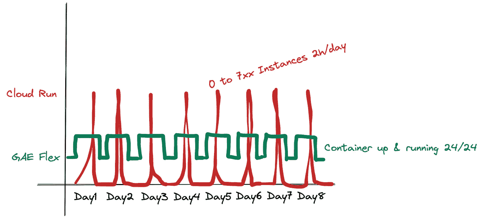
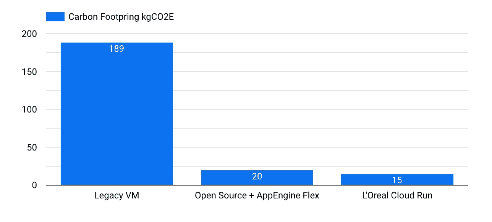
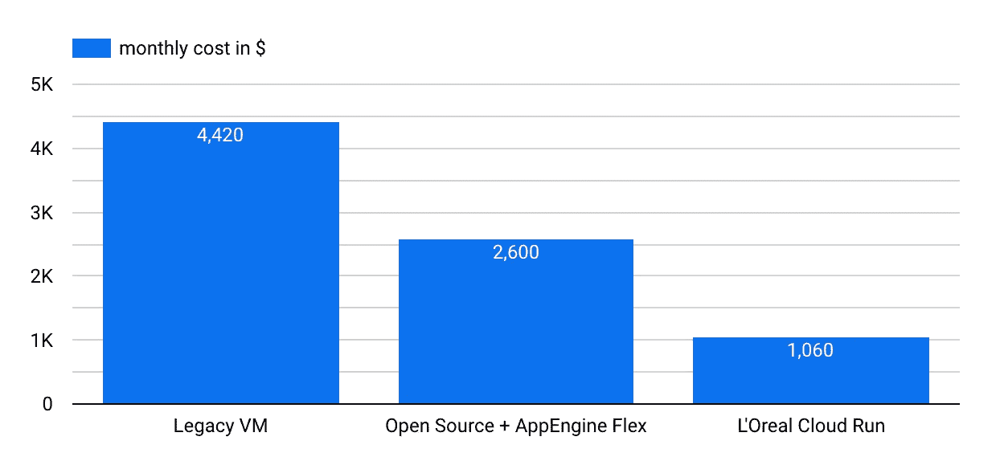

# 谷歌云无服务器技术永不休眠

> 原文：<https://medium.com/google-cloud/google-cloud-serverless-technology-never-sleep-8a2e5e97f789?source=collection_archive---------0----------------------->

尝试寻找最有效的解决方案来部署您的应用程序是一个好方法。

您的公司会很高兴拥有一个经济高效的平台，但是…..故事还没有结束！

# 这是我的故事，始于 4 年前:

最初的目标是测量和报告公司中 BigQuery 的使用情况，每天在一个表中报告**每个表的行数、每个表的大小等...**

在寻找不同的实现方式后，我发现了开源解决方案:

 [## 通过 Ocado Technology 的 GCP 人口普查|谷歌云博客分析你的 BigQuery 使用情况

### 编者按:今天我们听到谷歌云客户 Ocado 技术，它创造了(和开源！)一个程序…

cloud.google.com](https://cloud.google.com/blog/products/gcp/analyzing-your-bigquery-usage-with-ocado-technologys-gcp-census) 

多亏了 [**DoIt 团队**](https://www.doit-intl.com/) ，代码很容易在 AppEngine Flexible 上部署。

最初，我们有数百张桌子，这意味着每天都可以快速运行，而且成本非常低，不需要维护。

但是因为平台的采用是好的，我们现在有数百万的表和数据集…

以下情况的结果:

*   扫描现在需要**每天 23 小时**
*   扫描和导出成本现在接近每月 **3 000 美元**

对问题进行故障排除后，我们没有发现所用解决方案的任何问题。

现在是时候找到另一种方法来做到这一点，而不是重新发明轮子..

我们的想法是利用 4 年前不可用的新的无服务器生成工具… **云运行**！

同类最佳的可扩展性、效率和灵活性。

我们从以前使用的解决方案中提取代码，并部署如下:

云任务是管理每个项目、每个数据集和每个表的所有云运行的不同调用，以并行使用最大限度的云运行服务。

# 结果是:

*   **运行 2 小时**
*   **每月成本 800 美元**(1 次运行成本 26 美元)BigQuery insert 的 260 美元&云日志
*   **713** 运行期间使用的云运行容器

哇！！！无服务器 2.0 已经到来，这股浪潮令人难以置信地强大，证据很明显:

*   部署解决方案后不要睡觉，因为你确信问题已经无限期地解决了
*   尝试花一点时间来重构一个应用程序有时是一个非常好的方法

请记住，无服务器 v1 使用的是 GAE flex 容器(每月 100%的时间都在运行，从几个容器到更多容器，但从不扩展到 0 ),无服务器 v2 每次运行都使用 7xx 容器，每天按需启动，并在每次运行后自动关闭…

# 因为我们想衡量该解决方案的效率，所以我们做了最后一个测试:

复制 Cloud Run 中使用的 python 代码，并尝试将其部署在经典 VM 中，像过去一样逐个表地调用 API..

使用的虚拟机是 N2-standard-16,当然它不提供 API 调用的可伸缩性和并行性..

为什么不是最便宜的虚拟机？因为我们担心如果这项工作需要几个小时，内存中的信息会爆炸…

# 结果很疯狂:

1 全程跑拍 **7 天！**

现在想象一下，在不到 24 小时的时间里，需要多少台虚拟机才能做到这一点:

*   **7 台虚拟机**工作人员在不到 24 小时内完成工作，如果我们继续扫描越来越多的表，时间会更快…
*   **4，000 美元**7 台虚拟机的月成本+ 420 美元的 BQ 流插入/云日志= **4，420 美元**

现在我们可以看到无服务器 2.0 是多么强大和高效。

**最后，除了金钱支出之外，还要比较 3 种情景的碳足迹信息:**

数字为我说话…现在你知道你要做什么了。

# 至摘要

我花了几天时间从无服务器 v1 切换到 v2，以获得:

**每月成本降低 59%**

**每月碳足迹减少 25%** 。