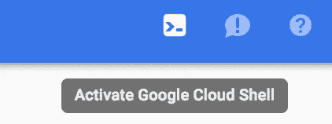
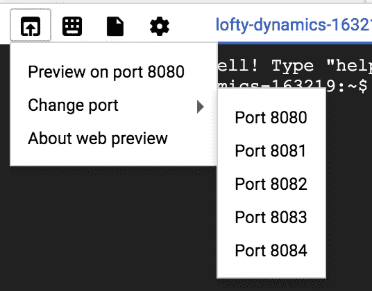

# 谷歌云壳，免费游乐场

> 原文：<https://medium.com/google-cloud/google-cloud-shell-the-free-playground-b5ab4793224?source=collection_archive---------0----------------------->

你可能没有注意到，在谷歌云控制台的右上方有一个小小的外壳图标。

激活谷歌云外壳

这就是你要的，免费的操场。你可以在 https://cloud.google.com/shell/了解更多信息。

你可能想知道谷歌为方便你配置和使用谷歌云而创建的 web shell 有什么特别之处。嗯，你可以用它做的不仅仅是“谷歌云”。

Google Cloud Shell 是一个运行 Debian 的 f1-micro 实例，预装了开发人员工具，并且有一个主目录 ***跨会话*** 持续存在。

主目录是 5GB 的永久磁盘存储。这意味着你可以带来你的`.zshrc`，在`$HOME`中安装你的工具，在`$HOME/bin`中放入二进制文件，你就安全了。

我不是说你应该把它变成你的开发环境，我只是强调了可能性。

锦上添花的是，只要服务器监听端口 8080–8084，您甚至可以预览 web 应用程序。

Web 预览

我的一个使用案例是作为码头工人游乐场。当你可以免费使用谷歌的时候，为什么要麻烦你的 MacBook，用你的带宽去尝试一些东西呢？

我对 Google 的唯一要求是让用户能够通过 SSH 连接到云 Shell。

它不是一个强大的实例(f1-micro ),也没有太多的存储空间(5GB ),但它肯定是有用的，而且是免费的。