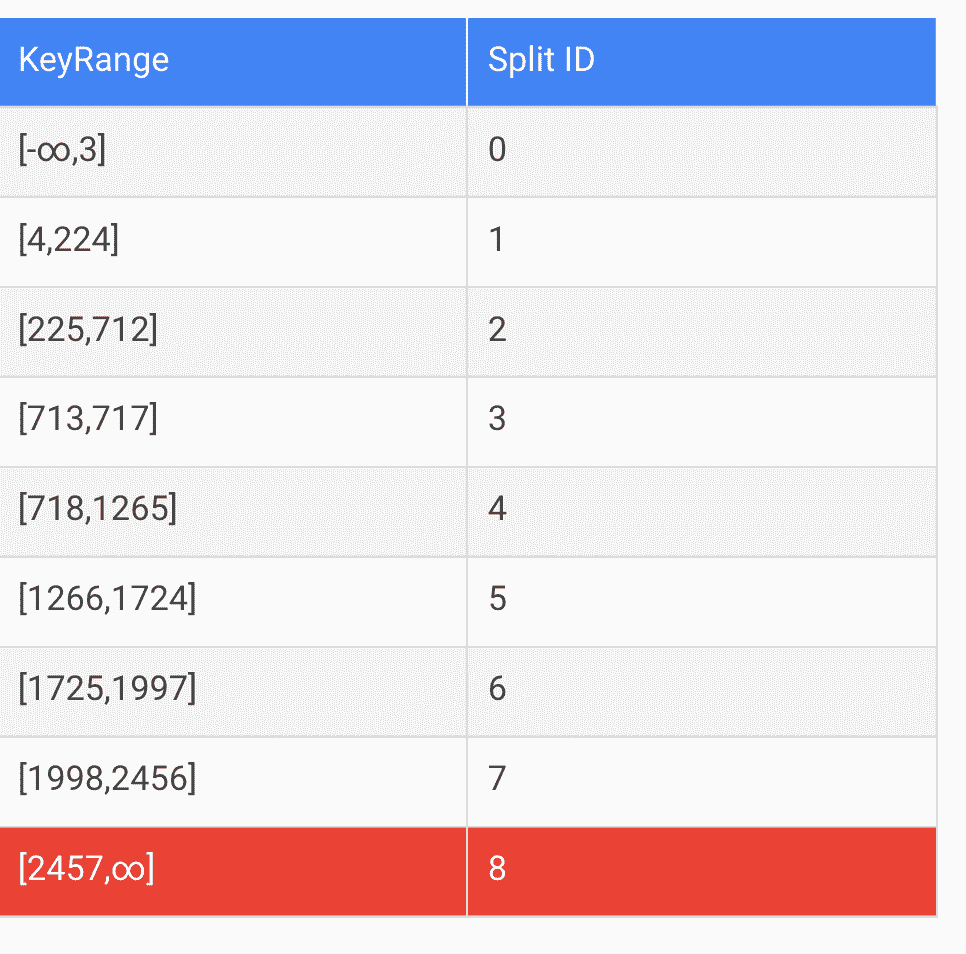
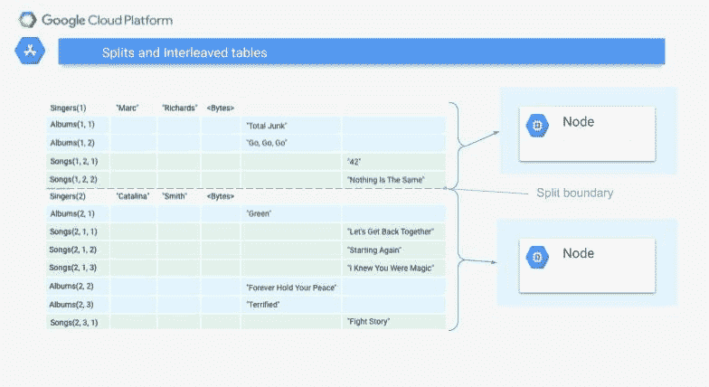

# 谷歌云扳手——关键概念

> 原文：<https://medium.com/google-cloud/google-cloud-spanner-critical-concepts-1bd9ec52abe3?source=collection_archive---------0----------------------->

这是谷歌云扳手系列的一部分。第一篇文章提供了一个技术概述。这篇文章详细介绍了使用数据库时值得理解的一些概念。在我们使用 Google Cloud Spanner 的过程中，我们很快意识到我们不仅仅是在处理另一个 OLTP 数据库，但是，它的架构中有几个关键部分是专门设计来实现全局性能的。在设计应用程序以及如何在数据库中管理数据时，需要考虑这些特性。如果在开发应用程序时没有考虑到这些关键概念，当系统在生产环境中处于负载状态时，很可能会导致性能问题。

谷歌的云扳手是一个无与伦比的数据库解决方案。我特别说解决方案，因为正是软件和硬件的结合才真正让 Cloud Spanner 独一无二。它特别适合要求[事务一致性](https://cloud.google.com/spanner/docs/true-time-external-consistency)的全球分布式系统。它依靠 TrueTime，使用同步的 GPS 和原子钟，通过定制的 Paxos 引擎来序列化大多数交易

在 Google 的技术文档中详细讨论了具体的特性，但是，在开始时很容易忽略这些概念的重要性。我试图提供一个最关键概念的总结，以帮助人们开始使用谷歌云扳手

# 主键

主键在云扳手架构和性能中扮演着重要角色。然而，[主键](https://cloud.google.com/spanner/docs/schema-and-data-model#primary_keys)必须由用户或应用生成。主键索引是自动创建的，以保持性能。关于索引的更多细节可以在下一节中找到。

单调递增的主键会产生热点，这会影响负载和规模下的查询性能。有多种推荐的主键策略，[选择主键](https://cloud.google.com/spanner/docs/schema-and-data-model#choosing_a_primary_key)是模式设计中非常重要的一部分。

# 热点和分裂

为了冗余和性能，Cloud Spanner 会将数据分成[份](https://cloud.google.com/spanner/docs/schema-and-data-model#database-splits)份。由于负载或数据大小，可能会发生拆分，数据将被移动以平衡负载并提高性能。

当现有拆分达到 4 GB 时，Cloud Spanner 通常会创建一个新的拆分。超过 4 GB 的单行将影响查询和事务性能。

Cloud Spanner 通过键范围在服务器之间划分数据，因此需要仔细考虑主键以确保性能。单调递增的主键会创建一个热点，因为数据总是添加到同一个拆分的末尾。这很容易造成负载下的性能瓶颈。

此图展示了 Spanner 如何跨键范围拆分数据

**谷歌**

*   在此示例中，所有新写入都将在剥离 8 中结束。

在同一个剥离中，这种一致的读取和写入所产生的热点会降低性能。对于[批量加载](https://cloud.google.com/spanner/docs/bulk-loading)和负载下的写入性能来说尤其如此，持续的重新分片会增加写入延迟。因此，实施正确的[主键策略](https://cloud.google.com/spanner/docs/schema-design#primary-key-prevent-hotspots)将提高性能。

# 索引和辅助索引

Cloud Spanner 将索引存储在单独的索引表中。由于索引表被视为实际表，因此当检索未存储在索引表中的数据时，Cloud Spanner 将创建一个从索引表到源表的连接。对于[二级索引](https://cloud.google.com/spanner/docs/secondary-indexes)，可以指定附加字段，并且[与索引](https://cloud.google.com/spanner/docs/secondary-indexes#storing-clause)一起存储，从而消除了后连接并提高了性能。

由于数据分布在 Cloud Spanner 服务器上以获得冗余和性能，索引表可以存储在与源数据不同的服务器上，源数据也可以分布在多个服务器上。索引的存储成本和写操作的性能开销很小，但是正确的索引可以显著提高查询的性能。

# 交叉表

*   Cloud Spanner 具有额外的[模式结构](https://cloud.google.com/spanner/docs/schema-and-data-model)功能，通过使用交叉表，可以在数据中存在父子关系的情况下提高性能。
*   交叉表允许通过简单的[协同定位连接](https://cloud.google.com/spanner/docs/query-execution-plans#co-located_join_queries)返回父子关系，该连接可以由数据所在的单个服务器处理。
*   将这种结构的数据存储在交叉表中可以提高查询和写入性能，并且当非交叉数据被自动分割成位于不同服务器上的单独片段时，可以避免代价高昂的[反向连接和交叉应用](https://cloud.google.com/spanner/docs/query-execution-plans#index_and_back_join_queries)。
*   拆分只发生在交叉表层次结构的根上。对于行大小和拆分，Cloud spanner 将父行及其所有交错的子行视为同一 spit 的一部分。

下图说明了多个交叉表的拆分边界。这些表如下:

*   家长:歌手
*   交错儿童:相册
*   交错儿童:歌曲

图标**谷歌**

*每个顶级行，在本例中为 Singer 行，将与其层次结构中所有交错的子行一起拆分。*

这份关于[优化模式设计](https://cloud.google.com/spanner/docs/whitepapers/optimizing-schema-design)的白皮书很好地解释了其中的机制。

# 阅读和写作

Cloud Spanner 提供外部一致的写入，即使这些事务可能跨越多个服务器，甚至全球的数据中心。这种保证甚至比最强的 ANSI/ISO 标准 SQL 92 隔离级别——serializable 还要强，并且通过 [TrueTime](https://cloud.google.com/spanner/docs/true-time-external-consistency) 成为可能。每次写入都会创建一个新的不可变数据版本，其时间戳是写入事务的时间戳。

数据存储一小时，启用[多版本并发控制](https://cloud.google.com/spanner/docs/true-time-external-consistency#timestamps_and_multi-version_concurrency_control_mvcc)。

时间戳也被分配给每个读取事务，并为称为强读取的读取提供一致性保证。这些时间戳还允许在不需要读锁的情况下执行只读事务，因为在执行查询的时间点存在数据状态的副本。

Cloud Spanner 的 MVCC 还允许在该历史或[时间戳绑定](https://cloud.google.com/spanner/docs/timestamp-bounds)内的特定时间进行读取。这称为陈旧读取，在读取的新近性不重要的情况下，陈旧读取可用于提高多区域配置的性能。

正如全球分布式数据库所预期的那样，写事务会带来复制开销，并且还会跨越多个服务器。对于读写事务，这将导致一个读锁，直到写入被复制和提交。因此，[只读](https://cloud.google.com/spanner/docs/transactions#read-only_transactions)的事务应该注意使用只读功能而不是读写功能。

在同一个键空间中读取和写入增加了从服务器上的单个分割中读取和写入的机会。最大限度地减少对同一事务的多个行进行读写的事务，可以减少事务跨越多个服务器的机会，从而降低性能成本。

关于[的文档读作](https://cloud.google.com/spanner/docs/reads)，[并行读作](https://cloud.google.com/spanner/docs/reads#read_data_in_parallel)，关于[读写的生命周期](https://cloud.google.com/spanner/docs/whitepapers/life-of-reads-and-writes)的白皮书对该主题进行了更详细的描述。

# 限制

出于架构原因，并且为了保持其高性能和冗余性，Cloud Spanner 有某些[配额和限制](https://cloud.google.com/spanner/quotas)，这些应该在应用程序设计中加以考虑。配额可以通过提前期增加。

例如，每个提交有 20，000 个变化的限制，每个查询最多有 15 个连接。

> 注意:插入和更新操作与它们影响的列数的多重性一起计算。例如，将值插入到一个键列和四个非键列中，对于 insert 来说，总共有五个突变。不管受影响的列数是多少，删除和删除范围操作都计为一个变异。

这些限制以及模式设计和热点预防对批量装载有影响，因此请确保遵循[批量装载最佳实践](https://cloud.google.com/spanner/docs/bulk-loading)。

分割的大小限制是[大约 4GB](https://cloud.google.com/spanner/docs/schema-design#limit_row_size) ，因此超过 4GB 的一行将影响查询和事务性能。父行及其所有交错的子行都会增加行的大小，因为数据是在父行级别拆分的。

# 节点和复制

为了确保可用性和性能，Cloud Spanner 跨实例配置中定义的多个区域复制数据，并将它们分割成[分割](https://cloud.google.com/spanner/docs/schema-and-data-model#database-splits)。

[实例配置](https://cloud.google.com/spanner/docs/instances#configuration)定义了该实例中数据库的地理位置和复制。

Cloud Spanner 服务器使用基于 Paxos 的同步复制，在提交事务之前，每次写入都会复制到至少大多数副本。无论是将数据写入由服务器管理的单个拆分，还是写入多区域实例中多个服务器的多个拆分，都会发生这种情况。

[节点计数](https://cloud.google.com/spanner/docs/instances#node_count)决定了该实例中数据库可用的计算和存储资源量。

> N 注意:[监控](https://cloud.google.com/spanner/docs/monitoring-stackdriver#create-alert)节点利用率以确保应用程序的性能和线性伸缩是很重要的。

Google 建议将特定区域实例 CPU 利用率保持在 65%以下，多区域实例保持在 45%以下

# 关键链接

**重要阅读**

Google Cloud Spanner 有大量的文档，但是如果你刚刚开始学习，并且需要更多的基于你刚刚学到的知识的信息，下面的链接也值得一读。

[最佳实践](https://cloud.google.com/spanner/docs/best-practice-list)

[云平台 Youtube 视频](https://www.youtube.com/user/googlecloudplatform/search?query=spanner)

用[控制台](https://cloud.google.com/spanner/docs/monitoring-console)或[云监控](https://cloud.google.com/spanner/docs/monitoring-stackdriver)进行监控

[延迟指标](https://cloud.google.com/spanner/docs/latency)

[延迟故障排除演示](https://github.com/GoogleCloudPlatform/opencensus-spanner-demo)

[配额和限额](https://cloud.google.com/spanner/quotas)

[审计日志](https://cloud.google.com/spanner/docs/audit-logging)

[客户端库](https://cloud.google.com/spanner/docs/reference/libraries)

[事件源系统](https://cloud.google.com/solutions/deploying-event-sourced-systems-with-cloud-spanner)

[DDL 参考](https://cloud.google.com/spanner/docs/data-definition-language)

[游戏最佳实践](https://cloud.google.com/solutions/best-practices-cloud-spanner-gaming-database)

[SQL 语法](https://cloud.google.com/spanner/docs/query-syntax)

[查询执行计划](https://cloud.google.com/spanner/docs/query-execution-plans)

[真实时间和外部一致性](https://cloud.google.com/spanner/docs/true-time-external-consistency)

[CPU 利用率指标](https://cloud.google.com/spanner/docs/cpu-utilization)

[信息模式](https://cloud.google.com/spanner/docs/information-schema)

[云扳手的寿命写着&写着](https://cloud.google.com/spanner/docs/whitepapers/life-of-reads-and-writes)

[会话](https://cloud.google.com/spanner/docs/sessions)

[批量装载最佳实践](https://cloud.google.com/spanner/docs/bulk-loading)

[访问控制](https://cloud.google.com/spanner/docs/iam)

[长时间运行操作](https://cloud.google.com/spanner/docs/manage-long-running-operations)

[性能退化](https://cloud.google.com/spanner/docs/troubleshooting-performance-regressions)

如果你真的很想了解 Google Cloud Spanner 内部的机制，他们会发布定义该技术的白皮书。