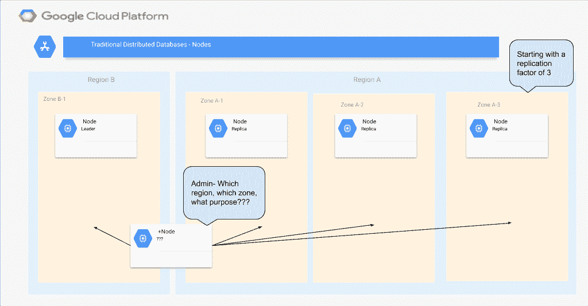
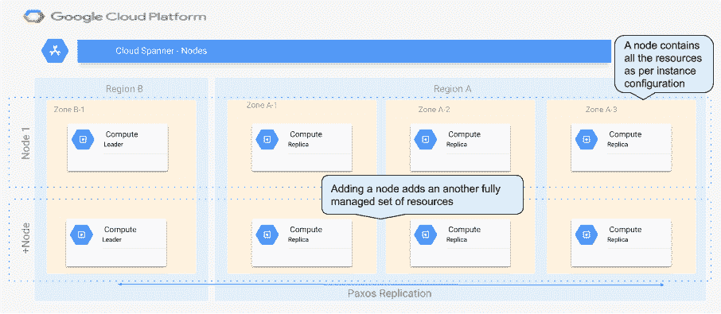

# 谷歌云扳手节点

> 原文：<https://medium.com/google-cloud/google-cloud-spanner-nodes-8cc38f46ebd1?source=collection_archive---------0----------------------->

随着我们继续探索 Google Cloud Spanner，我发现了一个突出的概念，即节点。

*通常在云计算中，实例是单个虚拟机的同义词，节点是虚拟机底层的 CPU、内存、存储和网络。在 Cloud Spanner 中，这种关系仍然成立，但是由于实例的性质，这种关系变得更加复杂。节点还与实例配置直接相关，因此与伸缩性也直接相关，所以很好地理解这一点很重要，我将在下面进行更详细的解释。*

# 节点

Cloud Spanner 文档松散地将节点定义为资源的集合，即 CPU、RAM 和 2TB 的存储。

这非常简单，这意味着如果您的数据库监控显示您使用的资源超过了最佳值，或者您的存储空间不足，您只需进入云控制台，添加一个节点。根据定义，这将为实例增加更多的计算和存储资源。

这就是 Cloud Spanner 节点与常规节点的不同之处，添加一个节点不仅仅是向您的实例添加一组计算资源，事实上它还向您的实例中的每个副本添加一组资源。

向传统的分布式/集群数据库添加节点时，您只是向集群添加了一个计算资源或服务器。作为管理员，您必须管理数据库如何使用该节点，无论它是成为新碎片、读写副本、只读副本、见证副本还是热故障转移群集，根据数据库的不同，选项可能会很多，管理开销也会很高。

图标**谷歌**

在 Spanner 中，管理是透明的，因此节点的定义包含了使用全套资源增加实例容量所需的所有资源，而不管它是区域性的还是多区域性的，是需要读取副本还是见证副本，或者两者都需要。

图标**谷歌**

这是一个非常强大的概念，它表明了“完全受管”、“无限的规模”和“99.999%的可用性”。节点的每一次添加都由实例自动管理，因此被复制、分片并主要用于增加 Cloud Spanner 的高可用性架构的规模。在其他数据库中，添加计算或存储需要配置—是否用于主计算、故障切换、复制、备份等。在 Cloud Spanner 中，您只需在云控制台中单击以添加另一个节点，一切都在后台发生，您的应用程序根据您的实例配置拥有更多高可用性资源。

关于实例的 Cloud Spanner [文档列出了所有不同的实例配置，并解释了根据您的区域配置，您将拥有的副本数量之间的差异。](https://cloud.google.com/spanner/docs/instances)

# 关于副本、节点和实例配置的快速说明

每个区域实例有 3 个副本，因此在这种情况下，添加到实例中的每个节点都会导致每个副本的计算和存储增加，因此有 3 个副本集。这保持了 99.99%的可用性，以及[“每秒 10，000 个查询(QPS)的读取或 2，000 个 QPS 的写入(以每行 1 KB 的数据写入单行)”](https://cloud.google.com/spanner/docs/instances#regional-performance)的规定性能。

大多数多区域实例有 4 个读写副本和一个[见证副本](https://cloud.google.com/spanner/docs/replication#witness)，因此添加一个节点会增加所有 5 个副本的总计算和存储。这允许 Cloud Spanner 提供 99.999%的可用性。除此之外,“nam6”地区有 2 个额外的只读副本,“nam-eur-asia1”配置跨越 3 个大洲，有 4 个额外的只读副本。

这是相当惊人的，因为这意味着向您的“nam-eur-asia1”实例添加一个节点意味着 Google 提供 9 组 CPU 和内存，以及 9 组 2TB 的额外容量(每个副本一个)来支持您的高可用性实例。

这 9 组资源的管理方式不仅可以实现复制和故障转移以获得高可用性，还可以获得外部一致性，而不管数据库及其用户的全球分布如何。如果您有兴趣了解 Google 如何使用 Paxos 引擎以及原子钟和 GPS 时钟来管理所有这些资源并提供最高水平的一致性，那么值得阅读关于 TrueTime 和外部一致性的白皮书和文档。