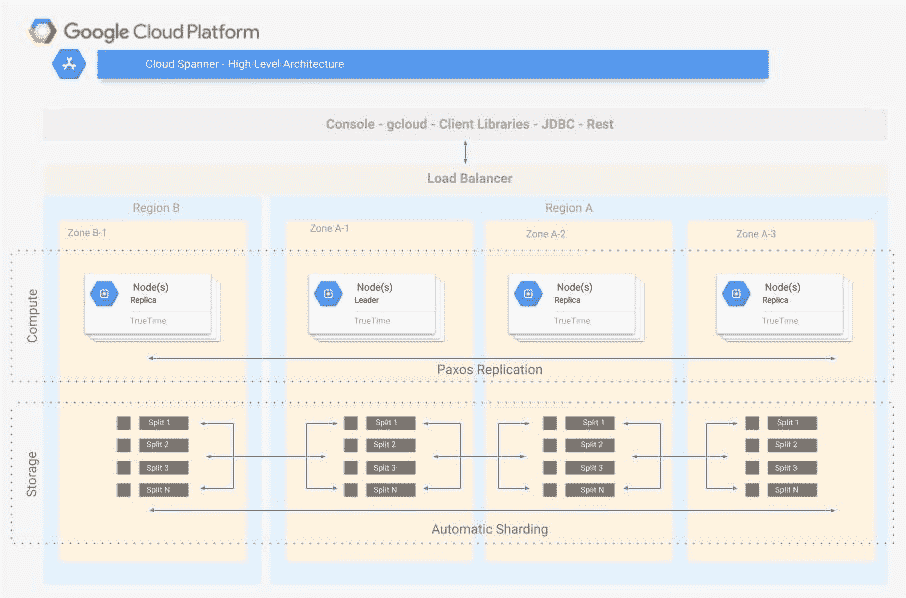
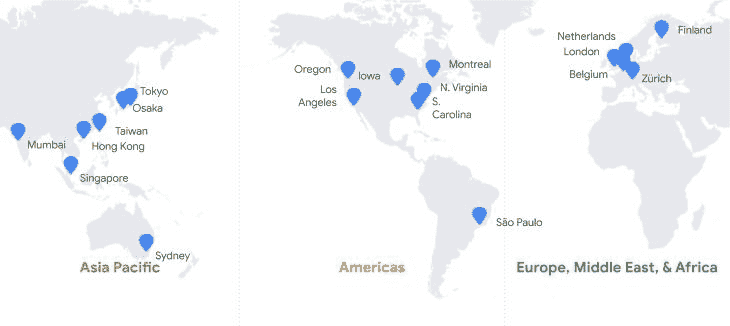
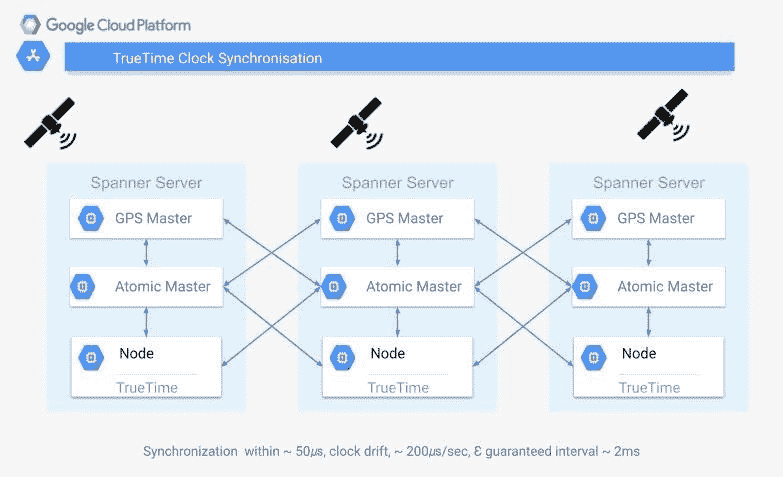

# 谷歌云扳手技术概述

> 原文：<https://medium.com/google-cloud/google-cloud-spanner-technical-overview-e3e37d81ea60?source=collection_archive---------0----------------------->

Cloud Spanner 是一个[关系](https://cloud.google.com/spanner/docs/schema-and-data-model)数据库，在规模上具有[事务一致性](https://cloud.google.com/spanner/docs/true-time-external-consistency)。

当我试图阅读和了解 Cloud Spanner 时，我意识到有必要对 Cloud Spanner 做一个简短的概述。根据我的笔记和对文档的理解，我给出了以下概述，希望它能帮助对这项技术感兴趣的其他人。

Google Cloud Spanner 是完全托管的，并采用自动分片(称为[分割](https://cloud.google.com/spanner/docs/schema-and-data-model#database-splits))和[复制](https://cloud.google.com/spanner/docs/replication)来扩展到数百万个节点和数万亿个数据库行，并且仍然[高度可用](https://cloud.google.com/spanner/sla)。Spanner 在 Google 用于需要高度一致性的大规模关键任务应用，包括 Google AdWords。

# 何时使用谷歌云扳手

Google Cloud Spanner 可用于满足您的应用程序的以下要求:

*   在线交易处理
*   全球规模
*   关系数据模型
*   酸性/强或外部一致性
*   低延迟
*   全面管理且高度可用
*   自动复制

Google Cloud Spanner 已经在以下用例中使用:

**临界高负荷交易**

*   金融交易
*   保险
*   电信和计费
*   全球呼叫中心

[**事件源系统**](https://cloud.google.com/solutions/deploying-event-sourced-systems-with-cloud-spanner)

*   供应链管理和制造
*   物流和运输
*   电子商务(高可用性)

[游戏](https://cloud.google.com/solutions/best-practices-cloud-spanner-gaming-database)

# 特征

图标**谷歌**

Google Cloud Spanner 是完全托管的，不需要管理开销。Google Cloud Spanner 维护以下 SLAs 多区域部署提供 99.999%的可用性 SLA，相当于每年停机 5 分钟，单区域部署提供 99.99%的可用性 SLA，每年停机 52.5 分钟。数据库管理只需要在创建数据库时选择区域配置，然后调整计算资源的大小来管理大规模性能。其他管理功能(如复制和分片)也得到管理，系统更新能够透明地进行，而不需要数据库停机。

作为一个完全管理的系统，暂时故障在内部管理，不需要在应用层考虑。应用层需要考虑由于潜在死锁或其他原因导致的事务失败。

[实例](https://cloud.google.com/spanner/docs/instances)可以是区域性的，也可以是多区域性的。在区域实例的情况下，数据将被绑定到该区域以提供局部性。多区域利用基于 paxos 的复制、TrueTime 和领导者选举来提供全球一致性和更高的可用性。Google Cloud Spanner 实例具有:

*   至少三个数据库读写副本，每个副本位于不同的区域
*   每个区域都是一个独立的隔离故障域
*   用于写入/事务提交的 Paxos 分布式共识协议
*   跨所有区域将写入同步复制到所有分区
*   即使一个区域出现故障，数据库仍然可用(多区域可用性 SLA 为 99.999%，区域可用性 SLA 为 99.99%)

图片**谷歌**

Google Cloud Spanner 通过 [IAM 集成](https://cloud.google.com/spanner/docs/iam/)提供安全性，在实例和数据库级别为组和用户配置权限和访问。存储在 Google Cloud Spanner 中的数据在静态时也是加密的。还为管理活动和数据访问提供了全面的[审计日志](https://cloud.google.com/spanner/docs/audit-logging)。管理活动日志包括修改资源配置或元数据的任何操作。数据访问日志包含读取资源配置或元数据的 API 调用，以及创建、修改或读取数据库内容的用户驱动的 API 调用。

[复制](https://cloud.google.com/spanner/docs/replication)用于全局可用性和地理位置，副本之间的故障转移对客户端是透明的。使用 Paxos 分布式一致性协议复制事务，以确保事务在提交之前有足够的副本可用。Google Cloud Spanner 自动将数据重组为[分割](https://cloud.google.com/spanner/docs/schema-and-data-model#database-splits)，并自动跨机器(甚至跨数据中心)迁移数据以平衡负载，并应对故障。Spanner 的分片考虑交叉表中的父子关系，相关数据一起迁移以保持查询性能。

Google Cloud Spanner 通过多种渠道向应用程序公开:

*   [客户端库](https://cloud.google.com/spanner/docs/reference/libraries/)
*   C#
*   C++
*   去
*   Java 语言(一种计算机语言，尤用于创建网站)
*   节点. js
*   服务器端编程语言（Professional Hypertext Preprocessor 的缩写）
*   计算机编程语言
*   红宝石
*   Rest API，包括对实例和数据库管理的支持，以及 CRUD 等等
*   [JDBC 司机](https://cloud.google.com/spanner/docs/jdbc-drivers)
*   谷歌云控制台，提供全面的管理支持，以及控制平面和数据平面操作
*   gcloud 命令行工具，包括实例和数据库管理、完整的 CRUD 以及操作管理

Google Cloud Spanner 中的数据可以使用 [SQL 查询(ANSI 2011)](https://cloud.google.com/spanner/docs/query-syntax/) 、[数据操作语言(DML)](https://cloud.google.com/spanner/docs/dml-syntax) 以及[变异](https://cloud.google.com/spanner/docs/modify-mutation-api)进行查询/修改。[模式更新](https://cloud.google.com/spanner/docs/schema-updates)发生在实时数据库上，不需要任何停机时间。

Google Cloud Spanner 为所有事务提供[外部一致性](https://cloud.google.com/spanner/docs/true-time-external-consistency)，这是比 [ACID 和可串行化](https://cloud.google.com/spanner/docs/transactions#rw_transaction_semantics)都更强的保证。它通过使用 TrueTime 来实现这一点，TrueTime 是一种高精度、高可用性的全球分布式时钟。TrueTime 由同步的 GPS 和原子钟组成，漂移最小。TrueTime 生成单调递增的时间戳，这允许在一个时间戳对数据库进行全局一致的读取，而不需要锁。这些高度准确的时间戳提供了事务的串行化，最大限度地减少了由于时间戳冲突而导致的事务争用和失败。

当在只读事务或单个读取调用中读取 Google Cloud Spanner 中的数据时，您可以设置一个[时间戳绑定](https://cloud.google.com/spanner/docs/timestamp-bounds)，它告诉 Google Cloud Spanner 如何选择读取数据的时间戳。关于[读数](https://cloud.google.com/spanner/docs/reads)的文档提供了更多关于读数类型以及它们何时有用的信息。

图标**谷歌**

通过添加和删除节点来管理扩展:

*   添加节点可以线性扩展您的 Google Cloud Spanner 实例
*   拆分会自动分布到新节点
*   每个节点允许额外的 2TB 数据存储
*   节点提供额外的计算资源来提高吞吐量

# Cloud Spanner 与传统数据库相比如何

Google Cloud Spanner 在一些关键方面不同于传统数据库，在其他方面有相似之处。

**关系表:**与交叉存取表的优化相关

**外键:**外键和交叉表

**SQL:** SQL、DML 和突变

**JDBC:** 由两名驾驶员支持

**客户端库:**用于 C#、Go、Java、Node.js、PHP、Python、Ruby 的客户端库

**存储过程:**可以使用云函数来管理常规的长时间运行的事务

**触发器:**当前不支持触发器

**光标:**如果需要，分页结果

**视图:**目前不支持

**数据定义语言:**数据定义语言

**性能模式:**审计和性能模式

**酸性符合:**外部一致性(甚至超过酸性)

**SSL 支持:**现成的 SSL 支持

**查询缓存:**使用一些缓存来查询重启令牌

**子选择:**支持“子选择”和“with”子句

**复制支持:**完全托管复制，无停机故障转移

**分区表:**针对性能和故障转移的自动表拆分和分片

**集群:**完全管理的多区域复制

**多个存储引擎:**全面管理的优化存储

**具有潜在停机时间的模式更新:**没有停机时间的实时模式更新

# 关键链接

**重要阅读**

Google Cloud Spanner 有大量的文档，但是如果你刚刚开始学习，并且需要更多的基于你刚刚学到的知识的信息，下面的链接也值得一读。

[最佳实践](https://cloud.google.com/spanner/docs/best-practice-list)

[云平台 Youtube 视频](https://www.youtube.com/user/googlecloudplatform/search?query=spanner)

用[控制台](https://cloud.google.com/spanner/docs/monitoring-console)或[云监控](https://cloud.google.com/spanner/docs/monitoring-stackdriver)进行监控

[延迟指标](https://cloud.google.com/spanner/docs/latency)

[延迟故障排除演示](https://github.com/GoogleCloudPlatform/opencensus-spanner-demo)

[配额和限额](https://cloud.google.com/spanner/quotas)

[审计日志](https://cloud.google.com/spanner/docs/audit-logging)

[客户端库](https://cloud.google.com/spanner/docs/reference/libraries)

[事件源系统](https://cloud.google.com/solutions/deploying-event-sourced-systems-with-cloud-spanner)

[DDL 参考](https://cloud.google.com/spanner/docs/data-definition-language)

[游戏最佳实践](https://cloud.google.com/solutions/best-practices-cloud-spanner-gaming-database)

[SQL 语法](https://cloud.google.com/spanner/docs/query-syntax)

[查询执行计划](https://cloud.google.com/spanner/docs/query-execution-plans)

[真实时间和外部一致性](https://cloud.google.com/spanner/docs/true-time-external-consistency)

[CPU 利用率指标](https://cloud.google.com/spanner/docs/cpu-utilization)

[信息模式](https://cloud.google.com/spanner/docs/information-schema)

[云扳手的寿命写着&写着](https://cloud.google.com/spanner/docs/whitepapers/life-of-reads-and-writes)

[会话](https://cloud.google.com/spanner/docs/sessions)

[批量装载最佳实践](https://cloud.google.com/spanner/docs/bulk-loading)

[访问控制](https://cloud.google.com/spanner/docs/iam)

[长时间运行操作](https://cloud.google.com/spanner/docs/manage-long-running-operations)

[性能回归](https://cloud.google.com/spanner/docs/troubleshooting-performance-regressions)

如果你真的很想了解 Google Cloud Spanner 内部的机制，他们会发布定义该技术的[白皮书](https://cloud.google.com/spanner/docs/whitepapers)。