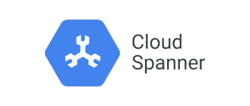

# 具有实体框架核心的谷歌云扳手

> 原文：<https://medium.com/google-cloud/google-cloud-spanner-with-entity-framework-core-2ddd16d2b252?source=collection_archive---------5----------------------->

[Google Cloud Spanner](https://cloud.google.com/spanner) 是一个全面管理、可扩展的关系数据库服务，用于区域和全球应用数据。它是第一个可扩展的、企业级的、全球分布的、高度一致的数据库服务，专为云构建，将关系数据库结构的优势与非关系水平扩展相结合。

[实体框架(EF)核心](https://docs.microsoft.com/en-us/ef/core/)是流行的实体框架数据访问技术的轻量级、可扩展、[开源和跨平台版本。EF Core 现在可以使用其](https://github.com/dotnet/efcore)[开源提供者](https://github.com/cloudspannerecosystem/dotnet-spanner-entity-framework)作为 Google Cloud Spanner 的对象关系映射器(O/RM)。本文将通过创建一个简单的控制台应用程序来帮助您开始使用用于 Spanner 的实体框架核心，该应用程序使用带有 EF 核心的 Spanner。

# 创建项目并添加提供程序

本教程使用的示例项目的源代码可以在这里找到。

首先在 Visual Studio 中创建一个空的 ConsoleApp。然后按照[自述文件](https://github.com/cloudspannerecosystem/dotnet-spanner-entity-framework#create-and-publish-a-nuget-package-locally-using-visual-studio)中的说明将 Google Cloud Spanner 的实体框架核心提供者添加到项目中。

## 创建本地 NuGet 包

Google Cloud Spanner 的实体框架核心提供者目前有 [**预览版**](https://github.com/cloudspannerecosystem/dotnet-spanner-entity-framework#googlecloudentityframeworkcorespanner) 发布状态，不具备生产级支持。

**提示:您也可以跳过下面的步骤，从 GitHub 中** [**克隆仓库**](https://github.com/cloudspannerecosystem/dotnet-spanner-entity-framework) **，并将实体框架核心项目作为项目引用添加到您的 ConsoleApp 中。**

1.  将[dot net-spanner-entity-framework 存储库](https://github.com/cloudspannerecosystem/dotnet-spanner-entity-framework)克隆到您的本地系统。
2.  在 Visual Studio 中打开解决方案，右键单击 Google。cloud . entityframeworkcore . spanner 项目，然后单击 Pack。这将生成一个项目的 nuget 本地包，您可以在 ConsoleApp 中使用它。
3.  [下载 NuGet 可执行文件](https://www.nuget.org/downloads)并复制到您的本地提要中(例如 C:\local-nuget-feed)。
4.  打开命令提示符并转到您的本地提要路径(例如 C:\local-nuget-feed)。
5.  运行下面的命令将包添加到您的本地 nuget 提要:
    `nuget add path\to\source\Google.Cloud.EntityFrameworkCore.Spanner\bin\Debug|Release\Google.Cloud.EntityFrameworkCore.Spanner.1.0.0-beta.nupkg -Source C:\local-nuget-feed`
6.  返回 Visual Studio，将您的本地提要添加为 nuget 的包源。为此，请单击“工具”|“获取包管理器”|“包管理器设置”(具体的菜单项可能会因您的 Visual Studio 版本而异)。选择包源，然后单击添加。选择您的本地 nuget 提要(例如 C:\local-nuget-feed)并给它一个合理的名称。
7.  通过单击工具| NuGet 包管理器|管理解决方案的 NuGet 包，将包添加到 ConsoleApp 项目中。确保选择您的本地 nuget feed 作为包源，并启用**包含预发布**选项。选择谷歌。列表中的 cloud . entityframeworkcore . spanner。

# 创建模型

在实体框架中，使用模型访问数据。模型由实体类、实体的附加配置和表示数据库会话的上下文对象组成。本教程使用以下模型。

实体框架核心的示例模型

上面的示例模型包含三个实体；歌手，专辑和曲目。该模型还显示了在 Spanner 中创建彼此相关的实体时的两种可能性:

*   专辑引用歌手使用普通[外键约束](https://cloud.google.com/spanner/docs/foreign-keys/overview)。这将确保每个专辑引用一个现有的歌手记录，并且在没有删除该歌手的所有专辑的情况下，不能删除该歌手。
*   轨道通过在父实体专辑中[交错引用专辑。这将确保所有曲目记录与父专辑一起物理存储。](https://cloud.google.com/spanner/docs/schema-and-data-model#creating-interleaved-tables)

请注意，对于两个特定实体之间的关系，您应该只从两个**中选择一个**，而不是两个。

# 数据模型

下面列出了与该模型一起使用的相应数据模型。

数据模型

您还可以让 Entity Framework 使用迁移为您生成数据模型，或者让 Entity Framework 从现有数据库生成代码。参见[管理模式](https://docs.microsoft.com/en-us/ef/core/managing-schemas/)了解更多信息。为了使事情尽可能简单，本教程手动创建两者。

# 插入数据

我们在模型中定义的 context 类为我们定义的每个实体包含一个`DbSet`。将数据插入数据库非常简单:

1.  创建将连接到数据库的上下文。
2.  向集合中添加新实体。
3.  对上下文调用 SaveChanges。

使用实体框架核心插入数据

# 查询数据

我们还使用`DbSet`从数据库中查询数据。您可以通过指定实体的键从集合中获取单个实体，也可以使用 LINQ 查询实体集合。

使用实体框架核心查询数据

# 更多样本

Cloud Spanner 实体框架核心提供者库[包含几个额外的示例](https://github.com/cloudspannerecosystem/dotnet-spanner-entity-framework/tree/master/Google.Cloud.EntityFrameworkCore.Spanner.Samples)，用于结合 Cloud Spanner 的实体框架的特定特性。其中包括:

*   [手动读/写交易](https://github.com/cloudspannerecosystem/dotnet-spanner-entity-framework/blob/master/Google.Cloud.EntityFrameworkCore.Spanner.Samples/Snippets/TransactionSample.cs)
*   [只读交易](https://github.com/cloudspannerecosystem/dotnet-spanner-entity-framework/blob/master/Google.Cloud.EntityFrameworkCore.Spanner.Samples/Snippets/ReadOnlyTransactionSample.cs)
*   [使用云扳手在实体框架核心中使用并发令牌](https://github.com/cloudspannerecosystem/dotnet-spanner-entity-framework/blob/master/Google.Cloud.EntityFrameworkCore.Spanner.Samples/Snippets/ConcurrencyTokenSample.cs)
*   [保存实体时自动写入提交时间戳](https://github.com/cloudspannerecosystem/dotnet-spanner-entity-framework/blob/master/Google.Cloud.EntityFrameworkCore.Spanner.Samples/Snippets/CommitTimestampSample.cs)
*   [使用数组数据类型](https://github.com/cloudspannerecosystem/dotnet-spanner-entity-framework/blob/master/Google.Cloud.EntityFrameworkCore.Spanner.Samples/Snippets/ArraysSample.cs)

请查看存储库中的完整列表。

# 可运行代码

基于本教程的完整示例项目可以在这里找到。这是一个可运行的应用程序，不需要谷歌云扳手数据库，因为它使用云扳手模拟器。可以在这里找到:[https://github.com/olavloite/spanner-efcore-tutorial](https://github.com/olavloite/spanner-efcore-tutorial)