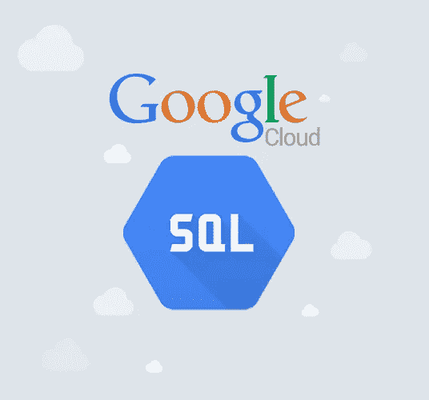
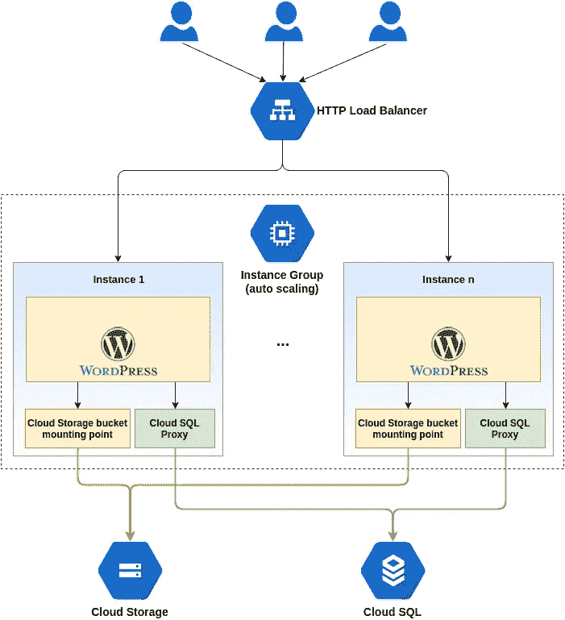

# 具有自动缩放功能的 Google Cloud SQL 代理

> 原文：<https://medium.com/google-cloud/google-cloud-sql-proxy-with-autoscaling-1f63f1dd4017?source=collection_archive---------0----------------------->

GCP 最好的特性之一是在管理实例组中自动伸缩。

如今，所有的应用程序都需要自动缩放功能，因为人们可以随时预测流量，我们确实需要我们的应用程序为任何类型的流量做好准备，也不需要在没有流量时支付额外费用。

一个**托管实例组**使用一个模板来创建一组相同的实例。您可以将托管实例组作为单个实体进行控制。如果您想要对属于托管实例组的实例进行更改，您可以对整个实例组进行更改。

在高流量的情况下，autoscaling 将使用此实例模板并启动一个新的服务器来处理实例组中的请求，并在需要时缩小规模。

到目前为止，一切似乎都很好，很容易。

现在您的应用程序需要一个数据库。

**Google Cloud SQL** 是一个完全托管的数据库服务，可以轻松地在 Google Cloud 平台上设置、维护和管理您的关系数据库。您可以将云 SQL 与 MySQL 或 PostgreSQL 配合使用。

我的应用是 GCE 上的 wordpress 应用和 Google Cloud SQL 上的数据库。正如我们所知，谷歌云 SQL 只允许来自授权 IP 的连接。但是在托管实例组中创建的所有新实例都有新的外部 IP，这些 IP 不是静态的。因此，为了让我所有的新实例连接到我的谷歌云 SQL 实例，我可以使用云 SQL 代理。

**云 SQL 代理**提供对您的云 SQL 第二代实例的安全访问，无需将 IP 地址列入白名单或配置 SSL。

**在 GCE 上安装云 SQL 代理**

[https://cloud . Google . com/SQL/docs/MySQL/connect-compute-engine # GCE-connect-proxy](https://cloud.google.com/sql/docs/mysql/connect-compute-engine#gce-connect-proxy)

这些步骤是在实例上执行的，但是由于我们的实例是按需创建的，因此解决方案是在启动脚本中添加这些步骤。

例如:

> #!/bin/sh
> sudo apt-get 更新
> sudo apt-get 安装 MySQL-client
> wget[https://dl.google.com/cloudsql/cloud_sql_proxy.linux.amd64](https://dl.google.com/cloudsql/cloud_sql_proxy.linux.amd64)-O cloud _ SQL _ proxy
> chmod+x cloud _ SQL _ proxy
> sudo mkdir/cloud SQL；sudo chmod 777 /cloudsql
> 。/cloud _ SQL _ proxy-dir =/cloud SQL&

这将允许在该实例组中创建的每个新实例能够连接到 google cloud SQL。

您还可以使用服务帐户对实例进行身份验证。可以从默认的实例元数据值中获取该实例的服务帐户。