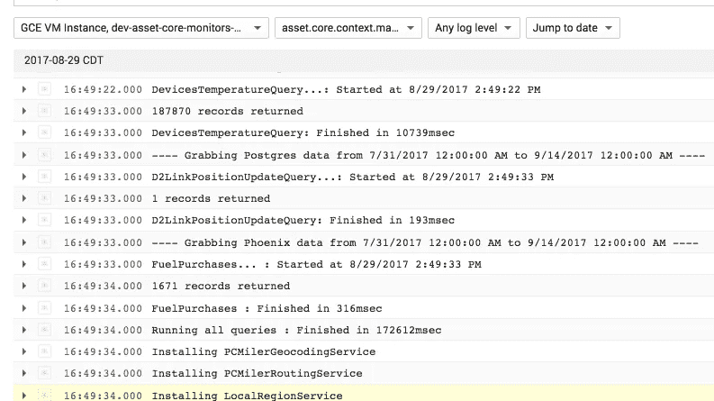
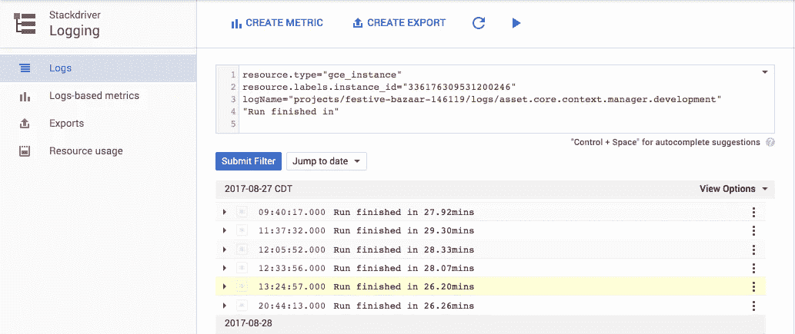
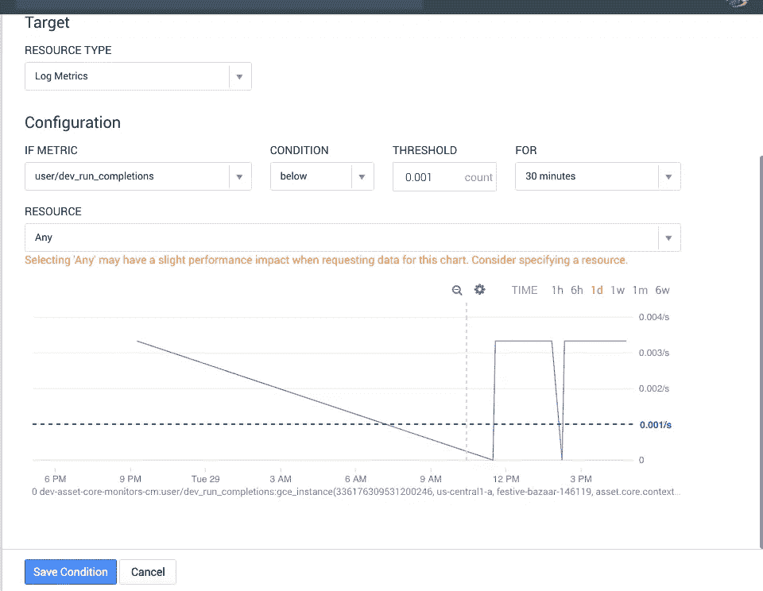

# 用于批处理的 Google 云/堆栈驱动程序监控

> 原文：<https://medium.com/google-cloud/google-cloud-stack-driver-monitoring-for-batch-processes-1982f0531bb6?source=collection_archive---------3----------------------->

所以你有一个批处理过程。它可能按计划定期运行，甚至连续运行。这可能是一个需要很长时间来运行的过程，你不需要关心它是否需要更长或更短的时间来运行，但它确实需要按照你期望的节奏来运行。

如果你使用 Google Cloud 来运行你的基础设施，你也可以使用 [Google StackDriver](https://cloud.google.com/stackdriver/) 来进行监控和日志记录。如果是的话，那么您可能想知道如何在 StackDriver 中为您的批处理过程设置一个监控警报？

我知道我做到了。我们有一个实际上连续运行的批处理过程，通常运行大约需要 10-25 分钟。当它完成时，它重新开始并再次运行。我们将它设置为日志到堆栈驱动程序日志，如下所示:



对于那些想要为 StackDriver 不自动支持的任意应用程序设置这样的日志记录的人来说，您会想要使用适当的 [fluentd](https://www.fluentd.org/) 配置来设置 [StackDriver 日志记录代理](https://cloud.google.com/logging/docs/agent/)。对于上述内容，这是我们为应用程序使用的配置文件，该应用程序本身以一种特定的格式记录注销，并将其记录到运行它的服务器上的一个基于文本的日志文件中:

```
<source> 
  type tail 
  path D:\_CM_runtime\Current\Logs\logs.log
  tag asset.core.context.manager.development
  format /^(?<time>\d{4}-\d{2}-\d{2} \d{2}:\d{2}:\d{2}\.\d{4}) — (?   <log_level>\w+) — (?<message>.*)$/ 
  time_format %Y-%m-%d %H:%M:%S.%L 
</source>
```

回到警报…为了工作，您首先需要知道您的批处理是否成功运行。根据我们的需要，我们有一个简单的日志条目，由以下内容组成，如果这些内容经常出现在日志条目中，则意味着批处理进程正在按照我们的预期运行:


我们想要的是，如果日志文件中的条目在某个合理的时间阈值后没有出现，就会有一个警报困扰我们。首先要做的是为此设置一个日志度量。为此，您可以在 Stackdriver 日志控制台中创建一个新的基于日志的指标，并添加您需要的任何过滤逻辑来识别您希望找到的内容，如下所示:



如您所见，我们只是根据我们期望在日志中找到的文本条目来过滤我们想要的日志。在这种情况下，条目出现在大约 26 分钟或以上示例中。我们想要做的是设置一个警报，比如说，如果我们没有看到那个日志条目，每 30 分钟，提醒我们有问题。

您可以使用 Stackdriver Monitoring 根据上面创建日志度量设置警报策略。使用您在上面创建的基于日志的度量创建一个带有条件的新警报，如下所示:



您会注意到这里的一些事情:首先，在 1 天的图形上，图形非常尖锐，这是因为这个批处理过程大约每 25 分钟运行一次，这当然不频繁，所以我们预计会看到这些尖峰。此外，最近出现了一个问题，所以我们没有看到之前的一些完成峰值，因为它实际上并没有运行。

其次，由于频率的原因，该图在每秒的*基础上具有非常小的数字。同样，当您考虑像这样不经常运行的批处理过程时，这是有意义的。为此，我们知道任何低于阈值**0.001/秒**的**都足以知道存在问题，如果**持续 30 分钟或更长时间**(我们知道是否应该调查问题的阈值)，那么继续前进并提醒我们！***

在您创建了该条件，并使用您希望的通知方式等配置了警报策略的其余部分之后。，您可以保存它，并开始获得有关批处理过程的警报。祝好运，监控愉快！