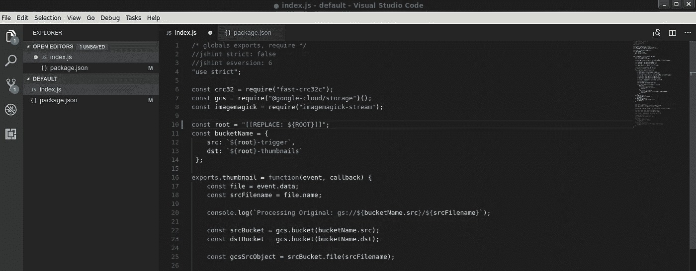
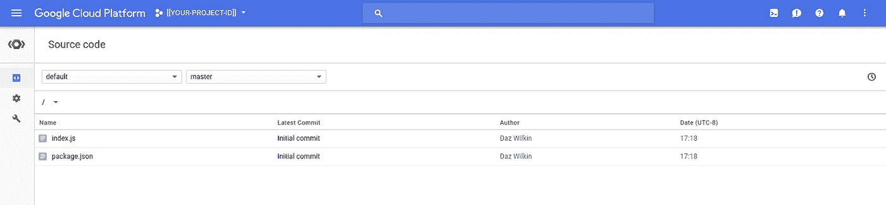
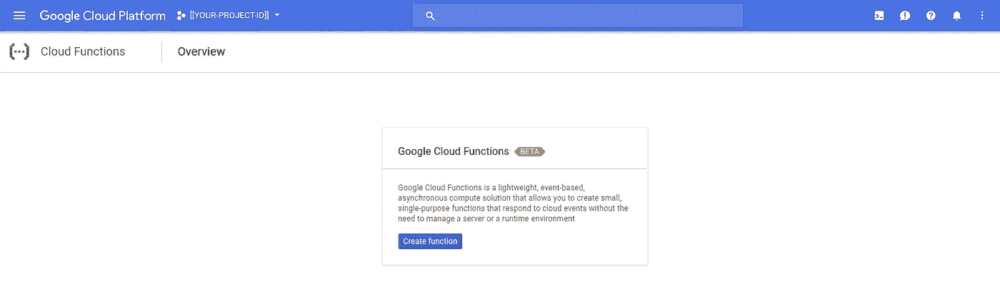
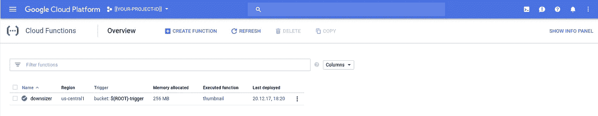
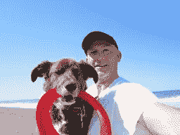

# 谷歌云存储“缩小者”

> 原文：<https://medium.com/google-cloud/google-cloud-storage-downsizer-af0048591e40?source=collection_archive---------1----------------------->

## 谷歌云功能的进一步探索

没有人阻止我…这太有趣了；-)

App Engine Standard 提供了一项图像服务，许多客户都很重视这项服务，并经常使用它来创建缩略图(在[谷歌云存储](https://cloud.google.com/storage/)中)。 [Firebase](https://firebase.google.com/) 有一个[云函数](https://cloud.google.com/functions/) [样本](https://firebase.google.com/docs/storage/extend-with-functions#example_image_transformation)，它也使用 [ImageMagick](http://www.imagemagick.org) 来显示缩略图。

这是我的版本。它使用文件流，所以应该(尚未测试)规模更好，它创建多个缩小(缩略图)图像。我决定使用[云源代码库](https://cloud.google.com/source-repositories/)来托管我的代码，虽然它会从新的云功能部署的变更触发中受益。

## 设置

我认为你可能会从谷歌云平台的[免费](https://cloud.google.com/free/)(如啤酒)层中受益，因为谷歌云功能、谷歌云存储和谷歌云资源存储库似乎都包含在内。

打开 bash 终端并获取编码:

```
ROOT=$(whoami)-171220
BILLING=[[YOUR-BILLING-ID]]
PROJECT=[[YOUR-PROJECT-ID]] // ${ROOT}-downsizer
REGION=us-central1# Create GCP Project
gcloud alpha projects create $PROJECT# Link it to your Billing Account
gcloud alpha billing projects link $PROJECT --account-id=$BILLING# Enable Cloud Functions
gcloud services enable cloudfunctions.googleapis.com \
--project=$PROJECT# GCS is enabled by default create 2 buckets
for BUCKET in trigger thumbnails
do
  gsutil mb \
  -c regional \
  -l ${REGION} \
  -p ${PROJECT} \
  gs://${ROOT}-${BUCKET}
done
```

## 云资源仓库(CSR)

CSR 是一项提供托管、私有 Git 回购的服务。我通常很懒，使用常规的文件系统来存放我的代码，但是用 Git 保持变化是很棒的。一旦创建了 CSR repo，就在本地为您的代码克隆它:

```
# Create a Cloud Source Repo called "default"
gcloud source repos create default# Change to your working directory
gcloud source repos clone default --project=${PROJECT}
```

创建 index.js:

和 package.json:

打开 Visual Studio 代码(或您首选的编辑器)。用 bash 环境变量${root}的值替换“ROOT”的值(#10)。省省吧。



Visual Studio 代码包含一个 Git 客户端，因此您可以使用它暂存您的更改并定义一个提交。或者，如果您喜欢使用命令行:

```
git add index.js
git add package.json
git commit --message "Initial commit"
git push -u origin master
```

每当您更改这些文件中的任何一个时，请重复 add，commit，push 命令，以确保您的文件正确反映在 CSR:

```
https://console.cloud.google.com/code/develop/browse/default/master?project=${PROJECT}
```



云资源仓库:默认

让我们将这段代码部署为一个云函数

## 云函数

```
https://console.cloud.google.com/functions/list?project=${PROJECT}
```



坚持使用命令行，您应该能够:

```
gcloud beta functions deploy downsizer \
--source [https://source.developers.google.com/projects/${PROJECT}/repos/default/moveable-aliases/master/paths/](https://source.developers.google.com/projects/${PROJECT}/repos/default/moveable-aliases/master/paths/) \
--trigger-bucket=${ROOT}-trigger \
--entry-point=thumbnail \
--project=$PROJECT
```

你会注意到我把“缩小者”和“缩略图”搞混了，抱歉。我从“缩略图”开始，但现在更喜欢“缩小版”。它更…戏剧化。幸运的是，云函数允许别名。我们将云函数命名为“downsizer ”,但我们告诉它，在 Node.js 代码中导出的函数称为“thumbnail”。source 标志的值是特定于＄{ PROJECT }的，事实上，回购被称为“default ”,为了简单起见，我们使用“master”。

几分钟后…

```
Deploying function (may take a while - up to 2 minutes)...
```



云功能:部署“缩小版”

或者，如果你喜欢:

```
gcloud beta functions list --project=$PROJECT
NAME       STATUS  TRIGGER        REGION
downsizer  ACTIVE  Event Trigger  us-central1
```

## 测试

因为我们为这个项目创建了存储桶，并且还没有使用它们，所以它们都是空的:

```
gsutil ls gs://${ROOT}-trigger
gsutil ls gs://${ROOT}-thumbnails
```

找到你最喜欢的图像，用 gsutil 把它复制到“触发器”桶中。这将触发云函数在“缩略图”桶中生成我们图像的 4 个缩略图。在我的示例中，我还将文件移动(重命名)到“/2013/road-trip/henry.jpg”以显示源路径被保留。

```
gsutil cp henry.jpg gs://${ROOT}-trigger/2013/road-trip
Copying file:.../henry.jpg [Content-Type=image/jpeg]...
- [1 files][  1.7 MiB/  1.7 MiB]                         
Operation completed over 1 objects/1.7 MiB.
```

这是我和我最好的朋友:


4000x3000

这张图片是 4000x3000 像素，1.7 兆字节

一切正常，你应该期待 4 个缩略图出现在'缩略图'桶。这是我的结果:

```
gsutil ls gs://${ROOT}-thumbnails/2013/road-trip/
gs://${ROOT}-thumbnails/2013/road-trip/henry.jpg_128x128
gs://${ROOT}-thumbnails/2013/road-trip/henry.jpg_256x2256
gs://${ROOT}-thumbnails/2013/road-trip/henry.jpg_64x64
```

使用“gsutil ls -l”列举它们，我了解到它们按照列表顺序分别是 18364、26154 和 15758 字节，这听起来是正确的。所以，我们来确认一下:

64x64 实际上是 64x64，因为我的原始图像不是正方形的(64/4000*3000=48)


64x48

出于同样的原因，256x256 实际上是 256 乘以 192:



256x192

## 日志

我最近有点痴迷于 grepping Stackdriver 日志记录，所以我会控制自己，只给你一个例子:

```
gcloud logging read "resource.type=\"cloud_function\" resource.labels.function_name=\"downsizer\"" \
--project=$PROJECT \
--freshness=10m \
--format='value(textPayload)'
```

> **NB** 我今天早些时候了解到的“[新鲜度](https://cloud.google.com/sdk/gcloud/reference/beta/logging/read)标志，在本例中，它只检索最近 10 分钟的日志。

## 更新日期:2017 年 12 月 21 日

我修改了示例以利用标题元数据来指定所需的缩略图大小。上面的代码反映了这一点。现在，如果对象包含一个带有大小数组的“goog-meta-sizes”标头，将使用这些大小数组，而不是默认的[“256 x256”、“128x128”、“64x 64”]:

```
gsutil  \
-h 'x-goog-meta-sizes:["8x8","32x32","512x512"]' \
cp henry.jpg gs://{ROOT}-trigger/2013/road-trip/beach/
```

结果是:

```
gsutil ls gs://${ROOT}-thumbnails/2013/road-trip/beach/
gs://${ROOT}-thumbnails/2013/road-trip/beach/henry.jpg_32x32
gs://${ROOT}-thumbnails/2013/road-trip/beach/henry.jpg_512x512
gs://${ROOT}-thumbnails/2013/road-trip/beach/henry.jpg_8x8
```

> **NB** 我发现很难找到云函数事件数据的规范。这是有据可查的，[这里](https://cloud.google.com/functions/docs/concepts/events-triggers#event_parameter_and_data_property)然后，对于云存储对象[这里](https://cloud.google.com/storage/docs/json_api/v1/objects)。

## 结论

这与我之前的 [Exploder](/google-cloud/google-cloud-storage-exploder-221c5b4d219c) 帖子没有太大的不同，但是，在没有来自谷歌或第三方的替代方案的情况下，构建、部署和运行用于事件驱动处理的云功能是很简单的。

随时欢迎反馈！

## 整理

您可以删除云功能:

```
gcloud beta functions delete downsizer \
--project=${PROJECT} \
--quiet
```

您可以在递归删除所有对象后删除存储桶。请小心使用这个命令:

```
gsutil rm -r gs://${ROOT}-trigger
gsutil rm -r gs://${ROOT}-thumbnails
```

或者，您可以简单地删除项目，这样也会删除其中的所有内容:

```
gcloud projects delete ${PROJECT} --quiet
```

谢谢！