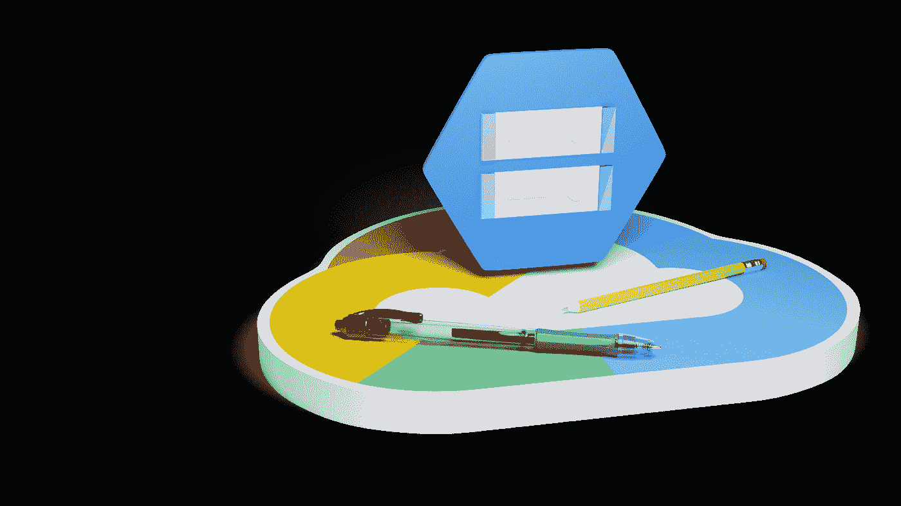

# 谷歌云存储编辑器

> 原文：<https://medium.com/google-cloud/google-cloud-storage-editor-9a740426a23b?source=collection_archive---------0----------------------->

谷歌云存储(GCS)是一种基于云的 blob 存储技术。它公开了一个 API，允许应用程序存储和检索数据。Google 为 GCS 提供了一个浏览器，允许我们查看其中包含的文件。我们可以上传新文件和下载现有文件。Google GCS 浏览器不具备查看或编辑这些文件内容的功能。要查看文件中的内容，必须先下载文件，然后在本地编辑器中打开它。

本文描述了一个开源项目，它允许我们在 GCS 中选择文件，然后在一个基于浏览器的 web 应用程序中打开它们。申请可通过访问以下网址进行即时审查:

[https://kolban-google.github.io/gcs-editor/](https://kolban-google.github.io/gcs-editor/)

要使用该应用程序，必须首先创建一个 Google Cloud 项目，并构建一些 OAuth 凭证和一个客户端 id。这样做的原因是，当进行 GCS API 调用时，出于计费目的，它们必须归于某个项目。

# 装置

创建一个 GCP 项目。

配置 OAuth 同意:

打开 Google Cloud 应用程序并访问 APIs & Service，然后选择 OAuth 同意屏幕:

在下一个面板中，选择“内部”:

现在我们要进入你自己的环境的细节。此处的值仅为示例:

在范围中，我们定义我们希望应用程序能够与云存储一起工作:

这是配置范围后屏幕的样子:

结尾会显示一个摘要页面:

接下来，设置凭证

记下您的客户 id。启动 GCS 编辑器应用程序。从 GCS 编辑器左上角的菜单中，单击设置:

粘贴上一步中生成的客户端 Id 值，然后单击“OK”。这将允许应用程序进行 GCS 调用，这些调用将被归属于相关联的项目。

浏览器将记住客户端 Id，无需再次输入。

# 使用

配置好 GCS 编辑器后，我们现在将注意力转向如何使用它。

我们执行三个步骤:

1.  我们登录应用程序，以便 GCS 知道我们是谁。当向 GCS 发出请求时，它们会基于这个身份得到授权。

我们点击顶部的“登录”按钮。

2.我们选择希望从中加载文件的存储桶。我们单击顶部的“选择存储桶”按钮。这里我们输入一个 GCS 存储桶的名称。

3.加载文件。我们现在准备加载一个文件。我们点击“加载”按钮。我们看到一个文件浏览器对话框，它正在浏览 bucket 中的 GCS 文件。然后，我们可以选择我们希望打开的文件，并单击“加载”按钮。

现在我们来看看文件的内容:

如果我们愿意，我们可以在编辑器中进行更改，然后单击“保存”按钮。这将把文件重新写回 GCS。

# GitHub 项目

该应用的[来源](https://github.com/kolban-google/gcs-editor)可在 GitHub 上获得，欢迎提交和发布。这是一个开源(原样)项目，不应被视为任何形式的谷歌产品。

该项目的核心基于:

*   [反应](https://reactjs.org/)为浏览器 UI 技术
*   [Chonky](https://chonky.io/) 用于 GCS 中的文件选择
*   Ace 作为文件的编辑

它已经在 Chrome 上进行了测试。

可以在 GitHub 页面上找到该应用程序的部署，如下所示:

[https://kolban-google.github.io/gcs-editor/](https://kolban-google.github.io/gcs-editor/)

但是，它可以通过克隆项目并运行构建来安装在您自己的环境中。

# 常见问题解答

## 未提供客户端 ID

如果您看到以下对话框，这意味着您尚未指定客户端 ID。请参阅本文顶部的安装部分。

## 未登录

如果您看到以下对话框，这意味着您尚未登录。

## 信用

*   [莱克莱斯](https://www.blendswap.com/blend/22197) —混合笔和铅笔

# 参考

*   [GitHub:GCS-编辑器](https://github.com/kolban-google/gcs-editor)
*   GitHub 页面:[启动 gcs-editor](https://kolban-google.github.io/gcs-editor/)
*   [谷歌云存储](https://cloud.google.com/storage)