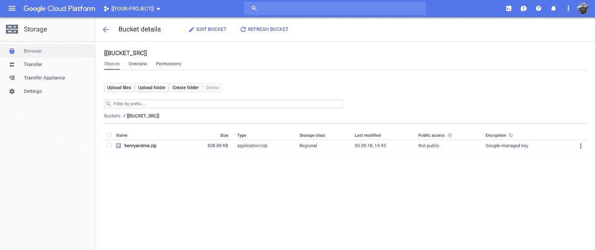
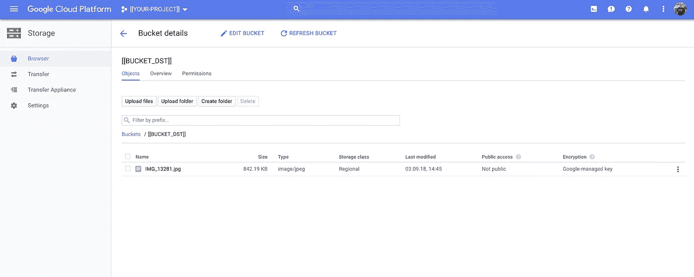
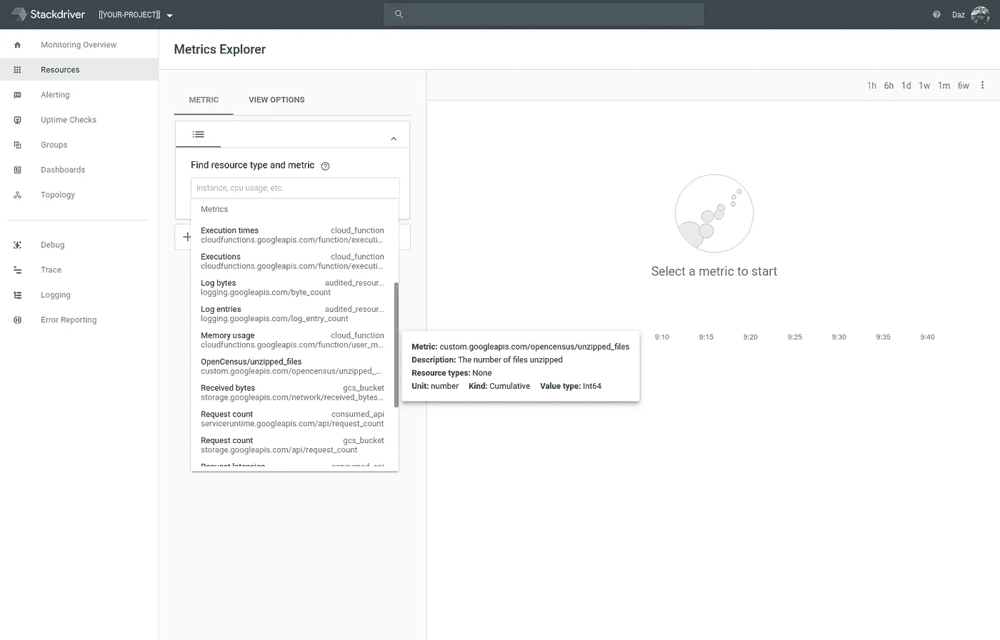
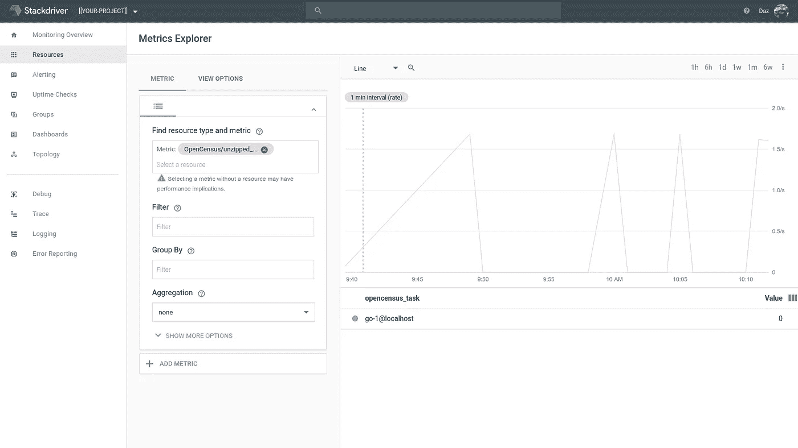
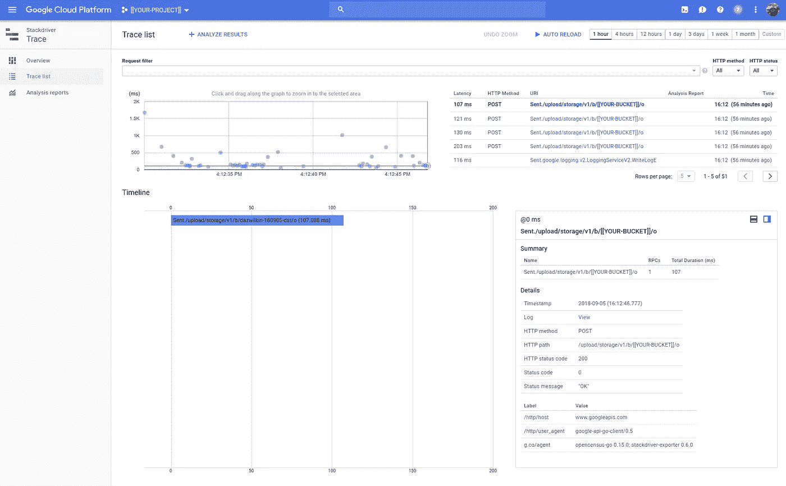

# 谷歌云存储“爆炸者”#2

> 原文：<https://medium.com/google-cloud/google-cloud-storage-exploder-2-9870d41fcee3?source=collection_archive---------2----------------------->

## Golang 云函数

地鼠和爆炸！？


参考:[霍尔马克卡迪沙克地鼠饰品](https://www.hallmark.com/ornaments/keepsake-ornaments/caddyshack-a-dynamite-gopher-ornament-1595QXI3072.html)

不完全是，但是我仍然很好…

差不多一年前，我写了一个概念验证节点。JS 云函数(这是正确的单数形式吗？)上传到 GCS 所触发的解压文件:[爆炸器](/google-cloud/google-cloud-storage-exploder-221c5b4d219c)。

随着 Golang 云函数 Alpha ( [早期访问](https://docs.google.com/forms/d/e/1FAIpQLSfJ08R2z7FumQyYGGuTyK4x5M-6ch7WmJ_3uWYI5SdZUb5SBw/viewform))的推出，并受到 [JBD](https://medium.com/u/1737b4e67578?source=post_page-----9870d41fcee3--------------------------------) 帖子([链接](/google-cloud/google-cloud-functions-for-go-57e4af9b10da))的启发，特此用 Golang 进行一次简单的(单线程)重写。

## 设置

```
PROJECT=[[YOUR-PROJECT]]
BILLING=[[YOUR-BILLING]]BUCKET_SRC=[[YOUR-SOURCE-BUCKET]]
BUCKET_DST=[[YOUR-OUTPUT-BUCKET]]gcloud projects create ${PROJECT}gcloud beta billing projects link ${PROJECT} \
--billing-account=${BILLING}gcloud services enable cloudfunctions.googleapis.com \
--project=${PROJECT}gsutil mb -c regional -l us-west1 -p ${PROJECT} gs://${BUCKET_SRC}
gsutil mb -c regional -l us-west1 -p ${PROJECT} gs://${BUCKET_DST}# Go [as usual]
mkdir -p go
export GOPATH=${PWD}/go
go get -u golang.org/x/vgo# Vgo
mkdir -p ${PWD}/vgo/exploder
cd vgo/exploder
touch exploder.go # Copy contents from file below
touch go.modvgo build && \
go mod vendor && \
gcloud alpha functions deploy Exploder \
--entry-point=Exploder \
--runtime go111 \
--set-env-vars=BUCKET_DST=${BUCKET_DST} \
--trigger-resource=${BUCKET_SRC} \
--trigger-event=google.storage.object.finalize \
--project=${PROJECT}
```

并且:

然后，给自己找一个压缩文件，上传到`${BUCKET_SRC}`，啜饮咖啡(红酒，取决于一天中的时间)，然后检查`${BUCKET_DST}`:

```
gsutil cp ${FILE} gs://${BUCKET_SRC}
gsutil ls -r gs://${BUCKET_DST}
```

或者使用云控制台的存储浏览器:



来源

并且:



目的地

然后，稍微复杂一点:

```
tree x
x
├── a
│   └── IMG_13281.jpg
├── b
│   └── IMG_13281.jpg
└── c
    ├── c1
    │   └── IMG_13281.jpg
    └── c2
        └── IMG_13281.jpg
```

并且:

```
gsutil ls -r gs://${BUCKET_DST}
gs://dazwilkin-180903-dst/x/a/:
gs://dazwilkin-180903-dst/x/a/IMG_13281.jpg
gs://dazwilkin-180903-dst/x/b/:
gs://dazwilkin-180903-dst/x/b/IMG_13281.jpg
gs://dazwilkin-180903-dst/x/c/:
gs://dazwilkin-180903-dst/x/c/c1/:
gs://dazwilkin-180903-dst/x/c/c1/IMG_13281.jpg
gs://dazwilkin-180903-dst/x/c/c2/:
gs://dazwilkin-180903-dst/x/c/c2/IMG_13281.jpg
```

## 更新:2018-09-05-增加了开放式人口普查

由于 [JBD](https://medium.com/u/1737b4e67578?source=post_page-----9870d41fcee3--------------------------------) 写了关于使用 [OpenCensus](https://opencensus.io/) 的文章，我想我应该重温一下这个故事、代码，并添加一个 stat 来统计解压缩文件的数量([链接](https://gist.github.com/DazWilkin/a28c246aa9892384eb3f6bb72c2a65e1))和一个对 GCS 对象创建的跟踪。



堆栈驱动度量浏览器

一些结果，虽然我对明显的低比率感到困惑:(



跟踪对我来说更成问题，但我认为这是因为我在部署之间不可靠`vgo build && go mod vendor`。所以，当你开发代码时，请记住这一点。



堆栈驱动程序跟踪

编码的变化是微不足道的。

## 结论

Golang 云函数运行时是运行时集的一个引人注目的补充(尽管已经过期)。Golang 优于 Node 的一个显著优点是。你的函数可能是多线程的。这个例子主要是节点的直接音译。JS 例子。对此的一个很好的改进是使代码多线程化(和异步化)。

仅此而已！