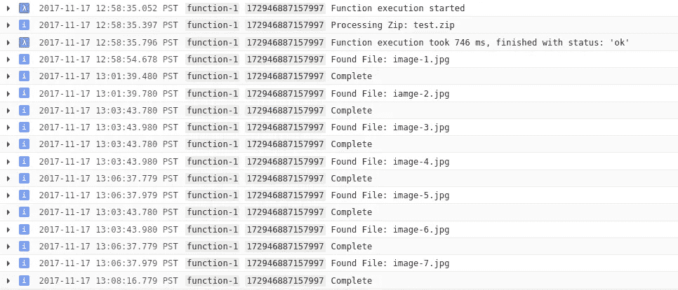

# 谷歌云存储“爆炸者”

> 原文：<https://medium.com/google-cloud/google-cloud-storage-exploder-221c5b4d219c?source=collection_archive---------0----------------------->

## 仅概念验证—使用风险自担

一个同事问云功能能不能给云存储提供解压功能。另一位同事向我推荐了一个解决方案——原则上类似 Firebase 函数提供了[图像转换](https://firebase.google.com/docs/storage/extend-with-functions#example_image_transformation)；他还建议用“爆炸者”作为一个更能引起共鸣的标题；-)

我的兴趣被激起了，我开发了以下内容作为概念验证(它有效)，但是我**敦促你不要在生产中使用它**。

客户提出的一个很好也很普遍的要求是[谷歌云存储](https://cloud.google.com/storage/) (GCS)应该包含通用的文件处理工具。目标是这些转换发生在服务端，以减少从 GCS 下载对象、处理它并将结果返回给 GCS 的复杂性。对于那些不熟悉 GCS 的人来说，这是谷歌云平台[(GCP)中的一项服务，它有效地提供了无限的“对象”即“BLOB”即“非结构化”文件存储。](https://cloud.google.com/)

你可能会开始免费使用谷歌云平台，但我怀疑，如果你正在阅读这篇文章，你可能已经是一个深受喜爱的 GCP 客户，并可能正在为这个问题寻求一个模板解决方案。亲爱的顾客，请继续阅读。

## 设置

您需要一个 GCP 项目，至少 2 个 GCS 桶，并启用云功能:

```
ROOT=$(whoami)-$(date +%y%m%d)
BILLING=[[YOUR-BILLING-ID]]
PROJECT=[[YOUR-PROJECT-ID]] // ${ROOT}-gcs-exploder
REGION=[[YOUR-PREFERED-REGION]]gcloud alpha projects create $PROJECTgcloud alpha billing projects link $PROJECT --account-id=$BILLINGgcloud services enable cloudfunctions.googleapis.com \
--project=$PROJECTfor BUCKET in receive explode staging
do
  gsutil mb \
  -c regional \
  -l ${REGION} \
  -p ${PROJECT} \
  gs://${ROOT}-${BUCKET}
done
```

## 云函数

通常，我都是命令行，但我发现云功能的控制台体验非常好，我发现自己更喜欢它。让我们从控制台开始，通过两种方式来实现这一点:

```
[https://console.cloud.google.com/functions/list?project=$](https://pantheon.corp.google.com/functions/list?project=dazwilkin-171024-blockchain){PROJECT}
```


云函数:创建函数

点击“创建功能”并


云函数:编辑器

*   你可以选择自己的“名字”
*   您可以取消“内存分配”(但可能不需要超过 256MB)
*   对于“触发器”,选择“云存储桶”
*   浏览并选择要接收压缩文件的存储桶。如果你遵循所有这些指示，它将被称为`${ROOT}-receive`。

为了方便起见，我将使用行内编辑器。

将`index.js`替换为:

> **NB** 用`${ROOT}`的值替换第 13+14 行的`[[YOUR-ROOT]]`。或者您用来创建存储桶的任何名称。

并将`package.json`替换为:


云函数:函数-1

*   选择“阶段桶”。如果你遵循所有这些指示，它将被称为`${ROOT}-staging`。
*   因为我将导出的函数重命名为`processZip`，所以请确保将“要执行的函数”属性更改为该值。
*   在“高级选项”下，您可能希望增加默认“60”(秒)的“超时”值。如果在此超时值内没有完成，函数调用将被终止。对于大型 zip 文件，60 秒的时间可能不足以分解它们。

单击“创建”将云功能部署到 GCP。


云功能:部署…

一切都好:


成功！

## 测试

我们的云函数应该在对 GCS“接收”桶的*所有*对象更改时触发。你可以在这里阅读更多关于所谓的[对象变更通知](https://cloud.google.com/storage/docs/object-change-notification) (OCN)的信息。在实践中，我们的函数应该更加谨慎地过滤那些用于我们的爆炸装置的 ocn。

我建议您创建一个相当小的 zip 文件(`${TESTZIP}`)来进行测试。

```
gsutil cp /path/to/${TESTZIP} gs://${ROOT}-receive
```

为了确认，您可以运行以下命令，尽管 cp 命令应该提供足够的成功或失败确认。

```
gsutil ls gs://${ROOT}-receive
```

控制台的浏览器有助于浏览 GCS 存储桶和对象:

```
[https://console.cloud.google.com/storage/browser?project=$](https://pantheon.corp.google.com/storage/browser?project=dazwilkin-171117-gcs-exploder&organizationId=433637338589){PROJECT}
```

它应该显示类似于以下内容的内容:


如果您进入“接收”桶，您应该看到您上传的`${TESTZIP}`文件:


浏览器:上传的 zip 文件

如果您等待几秒钟并导航到“explode”桶，您应该会看到:


浏览器:“文件夹”

GCS 将对象存储在一个平面名称空间中(每个存储桶一个对象)。为了方便起见，GCS 显示对象名中包含`/`的对象，就好像这些对象形成了一个传统的目录层次结构。在代码中，您会看到我在解压后的文件前添加了一个 Linux epoch 值(在这里是`1510952315489`)和一个`/`。浏览器显示 bucket 的内容，就好像有一个名为`1510952315489`的目录一样(您的值会有所不同，但它将是唯一的，并且对应于纪元值)，但实现是所有这些图像文件`image-1.jpg`、`image-2.jpg`实际上都被命名为:`1510952315489/image-1.jpg`、`1510952315489/image-2.jpg` …


浏览器:解压缩的文件

那起作用了…我在“接收”桶中的 test.zip 现在在“分解”桶中被分解。

并且，您应该在云日志中看到我们的`console.log`输出:



云日志记录

您可以使用 gsutil CLI 枚举这个 bucket:

```
gsutil ls -r gs://${ROOT}-explode
gs://dazwilkin-171117-explode/1510952315489/:
gs://dazwilkin-171117-explode/1510952315489/image-1.jpg
gs://dazwilkin-171117-explode/1510952315489/image-2.jpg
gs://dazwilkin-171117-explode/1510952315489/image-3.jpg
gs://dazwilkin-171117-explode/1510952315489/image-3.jpg
gs://dazwilkin-171117-explode/1510952315489/image-4.jpg
gs://dazwilkin-171117-explode/1510952315489/image-5.jpg
gs://dazwilkin-171117-explode/1510952315489/image-6.jpg
gs://dazwilkin-171117-explode/1510952315489/image-7.jpg
```

## 命令行

云 SDK(“g Cloud”)完全支持云功能。假设你在当前目录下有`index.js`和`package.json`。您*不*需要 npm 安装包。只有两个文件:

```
gcloud beta functions deploy function-1 \
--entry-point=processZip \
--stage-bucket=${ROOT}-staging \
--trigger-bucket=${ROOT}-receive \
--project=${PROJECT}
```

## 结论

希望这将引发一些关于云功能其他用途的想法。再说一次，这只是一个概念验证，在它可以用于任何其他用途之前，还需要做一些工作。

## 整理

您可以单独删除云函数:

```
gcloud beta functions delete function-1 \
--project=${PROJECT} \
--quiet
```

你可以在递归删除所有对象后删除桶——请**非常**小心使用这个命令:

```
gsutil rm -r gs://${ROOT}-receive
gsutil rm -r gs://${ROOT}-explode
```

或者，您可以简单地删除项目，这样也会删除其中的所有内容:

```
gcloud projects delete ${PROJECT} --quiet
```

谢谢！