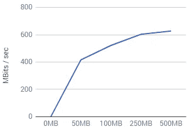
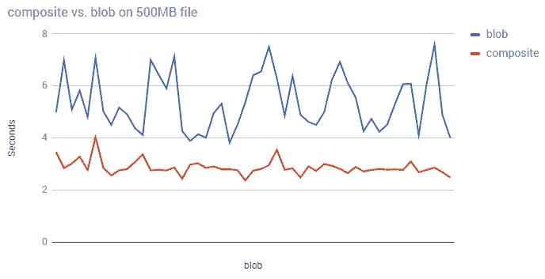
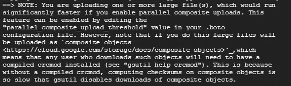

# 谷歌云存储和大对象上传速度

> 原文：<https://medium.com/google-cloud/google-cloud-storage-large-object-upload-speeds-7339751eaa24?source=collection_archive---------0----------------------->

Medic7 在上传大型视频文件时遇到问题。他们的客户会制作一些基因测试的视频，然后上传，这要花很长时间。他们需要帮助。

为了了解他们的问题，我上传了一堆 100MB、200MB 和 500MB 的文件来看看性能。你可以在下图中看到，当前的上传性能似乎在大约 200M 的对象大小时达到了极限。

因此，如果我们上传一堆 4g 文件(比如视频编辑)，我们需要一个更好的计划。

# 打碎这东西

在使用 gsutil 时，这个问题的答案会让你大吃一惊。每当你试图上传一个“大文件”时，你都会看到下面的消息。

分解一下，gsutil 可以自动使用[对象组合](https://cloud.google.com/storage/docs/composite-objects)来并行执行上传，将大型本地文件上传到 Google 云存储。这个过程的工作原理是将一个大文件拆分成多个组件，这些组件被并行上传，然后在云中组合(临时组件最终被删除)。

您可以通过在 gsutil ( *上设置`*parallel _ composite _ upload _ threshold*d `选项来启用它，或者更新您的。boto 文件，如同控制台输出提示*

> GSUtil-o GSUtil:parallel _ composite _ upload _ threshold = 150M CP。/localbigfile gs://your-bucket

其中“localbigfile”是大于 150 MiB 的文件。这将把你的数据分成大约 150 兆字节的块，然后并行上传，从而提高上传性能。(注意，对可以使用的块的数量有一些限制。有关更多信息，请参考文档)

这里有一个图表，显示了 100 个上传 300MB 文件的实例。

# 复合上传的挑战

使用并行复合上传在上传性能和下载配置之间进行权衡:如果您启用并行复合上传，您的上传将运行得更快，但是如果您想要使用 gsutil(或其他 python 应用程序)获取对象，那么客户端将需要安装编译的 crcmod(参见 [gsutil help crcmod](https://cloud.google.com/storage/docs/gsutil/addlhelp/CRC32CandInstallingcrcmod) )以便正确下载文件。

需要说明的是，对 crcmod 的这种限制是暂时的，主要是为了保护数据的完整性，并确保您的客户不会因为事情看起来不同而惊慌失措。(CRC 值和 HTTP ETAG 报头可能会有所不同。)

但是，如果这对您的设置不起作用，您有三个选择:

1) **也许** **关机了？**修改您的配置文件的‘check _ hashes’选项以禁用此步骤。注意:强烈建议您**不要禁用完整性检查**。这样做可能会使数据损坏在上传/下载过程中不被发现。

2) **不用 gsutil？**需要澄清的是，这不是一个被认可的建议。但是，如果您使用 cURL、wget 或 http 下载复合对象，那么获取将会工作(您将获得复合对象)。然而，强烈建议您仍然进行 crc 校验，这只是您现在的责任。

3) **中机？减少这个问题的另一种方法是使用云端实例下载文件(因为 crcmod 可以安装在那里)，然后完整地重新上传到一个 bucket。需要明确的是，这需要时间，也更昂贵(就交易成本而言)，但是这完全消除了 crcmod 的限制，从时间角度来看，这可能是一个双赢的结果，因为 GCP 可以轻松地从内部虚拟机获得约 16 千兆位/秒的上传速度。**

# 修复工作开始了！

对于 Medic7，将 CRCmod 放在他们的每个内部客户端上不是问题，因为上传的视频必须很快，然后在移动到另一个 GCS 存储桶进行分发之前进行内部处理，因此对他们来说，中间机器方法几乎是事实上的。复合对象的使用为他们的客户带来了 50%的性能提升，这是非常了不起的！