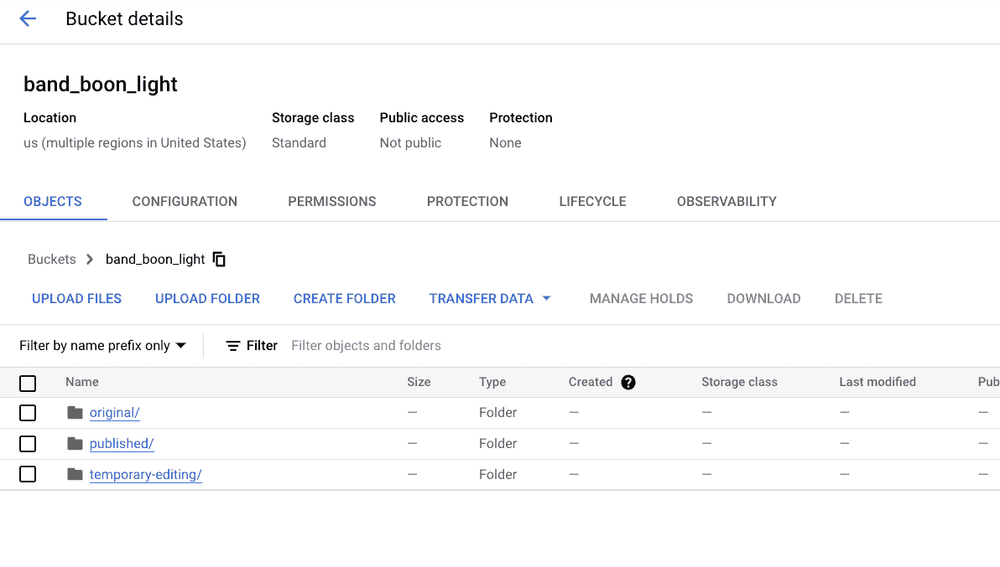
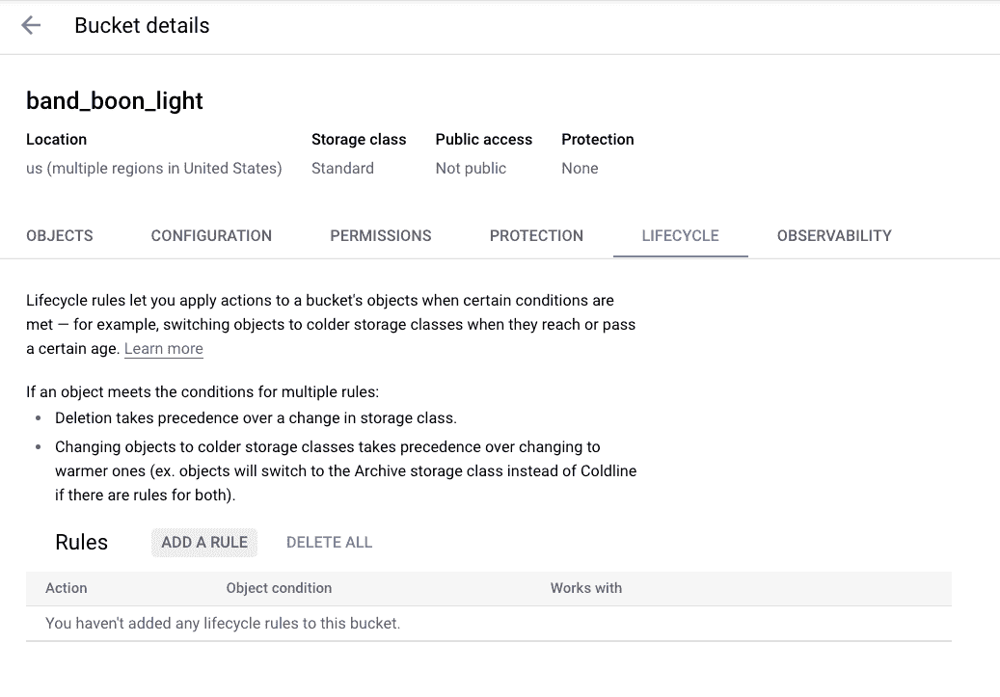
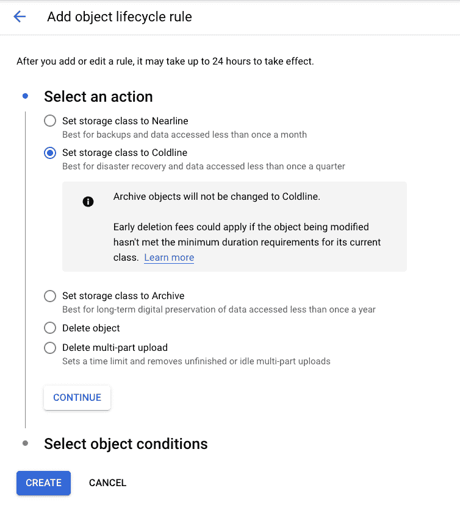
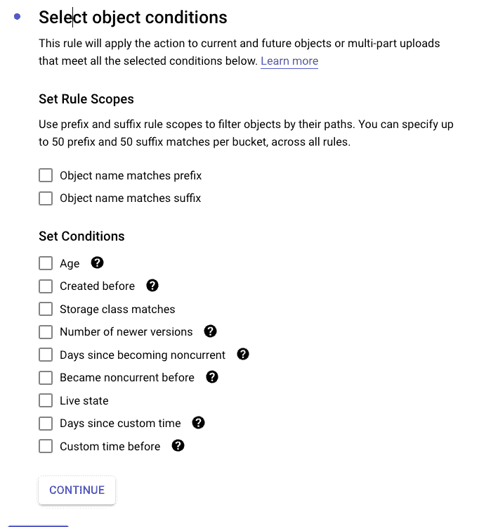
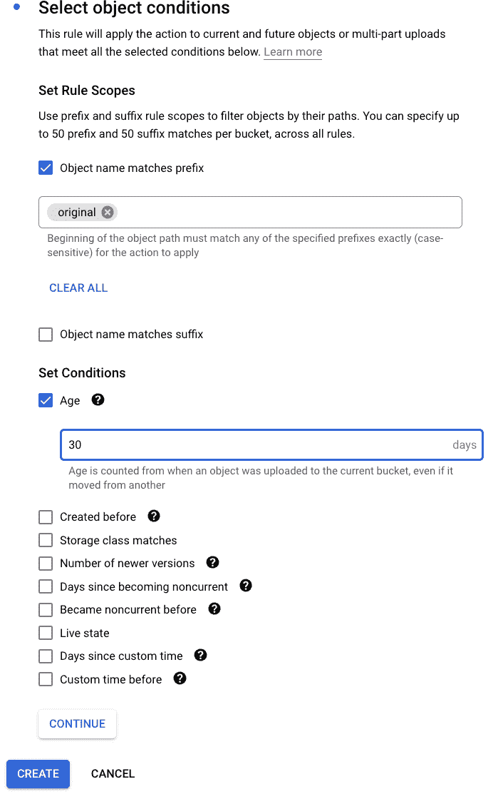
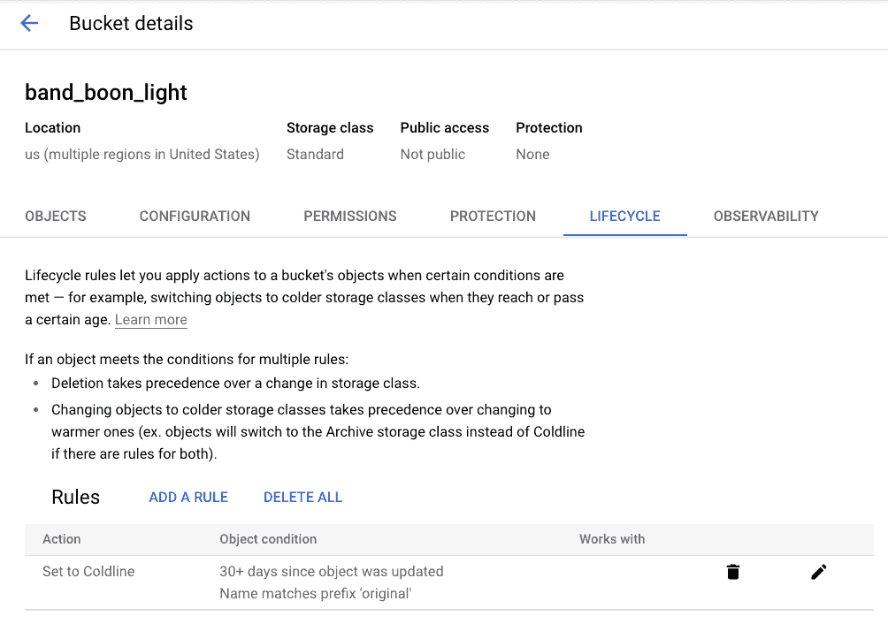
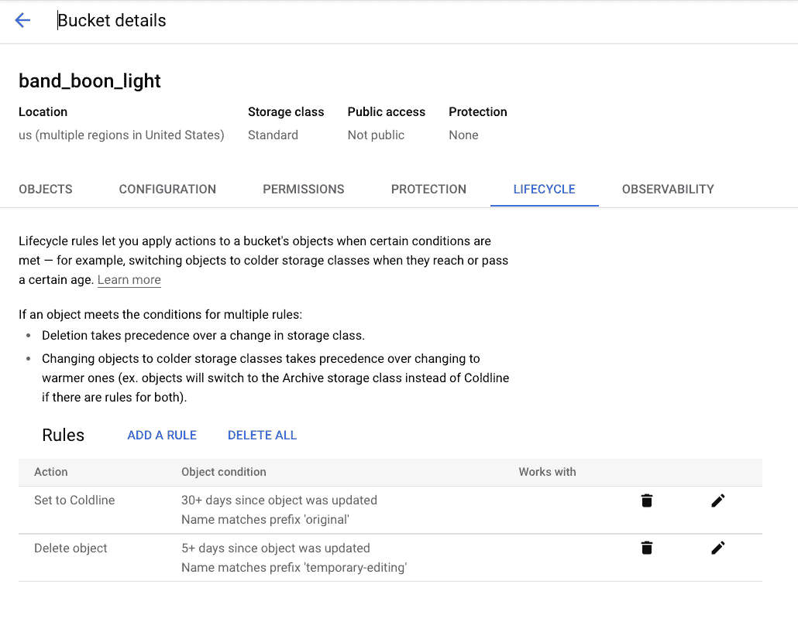

# Google 云存储—对象生命周期管理—第 1 部分

> 原文：<https://medium.com/google-cloud/google-cloud-storage-object-life-cycle-management-part-1-5da48da8854a?source=collection_archive---------2----------------------->

随着组织将数据转移到云中，制定一个管理数据生命周期的策略是非常必要的。与不需要额外成本来保存数据的内部环境相比，云环境对存储在存储环境中的任何数据收费。

对于使用内部资源的组织，管理生命周期甚至可能不是他们战略的一部分，因为一般没有直接的成本影响。但是，随着他们向云的迁移，如果他们没有达成数据生命周期战略并实施它，这可能会变成巨大的成本影响。

因此，在这两部分系列中，我们将探讨如何

*   对象生命周期管理简介(第 1 部分)
*   通过控制台设置 OLM 策略(第 1 部分)
*   了解何时执行 OLM 策略(第 1 部分)
*   可以应用的各种生命周期规则是什么(第 1 部分)
*   如何以编程方式设置 OLM 策略(第 2 部分)
*   OLM 行动监控-方法。(第二部分)

# 对象生命周期管理策略简介:

Google 云存储提供了为存储桶定义对象生命周期规则的功能，通过它我们可以控制如何以最具成本效益的方式存储或删除对象。

# 通过控制台设置 OLM 策略:

为了举例说明，我们假设有一家音乐公司“MyMusic”使用谷歌云平台来管理他们所有的音乐文件。MyMusic 公司根据音乐文件的来源定义了单独的存储桶。他们从特定的乐队获得音乐文件。他们为每一个他们来源的乐队创造桶。当他们从乐队接收歌曲时，他们将文件存储到各自的桶中。一旦接收到文件，他们就对这些文件进行编辑，以准备发布给最终用户。在这个过程中，他们在桶中创建临时文件。

最初，他们是一家小公司，从他们采购的地方有最少的乐队。他们没有对此存储桶应用任何生命周期策略。开始时，他们没有为这些文件设置任何生命周期规则。他们把所有的数据都保存在标准存储器里。他们没有意识到临时文件的成本，因为文件很小，数据量也很少。

后来，随着我的音乐出名，他们开始从多个乐队采购，他们开始看到成本急剧增加。他们发现他们没有对存储桶中的音乐文件应用生命周期策略，所有文件都保存在标准存储中。

在分析过程中，他们发现每个存储桶都有不同类型的文件:

1.  每天都会被访问的音乐文件
2.  从乐队接收的音乐文件
3.  为编辑而临时创建的音乐文件。

对于这些类型或场景，他们提出了以下生命周期行动。

**场景—标准:**

> **文件/对象类型:**每天都会被访问的音乐文件
> 
> **要采取的生命周期措施:**将文件保存在标准存储中

**场景——cold line:**

> **文件/对象类型:**从乐队接收的音乐文件
> 
> **要采取的生命周期措施:**在收到文件 1 个月后，将该文件移至存档

**场景—删除:**

> **文件/对象类型:**为编辑而临时创建的音乐文件。
> 
> **要采取的生命周期操作:**创建 5 天后删除这些文件

# 应用生命周期策略:

我们现在来看看每一种情况，以及如何设置生命周期操作:

## 场景—标准:

在这种情况下，发布的文件需要永远作为标准存储。MyMusic 公司的客户随时都想收听这些文件。因此，我的音乐应该总是让这些文件为客户所用。因此，从生命周期策略来看，这种情况下不需要采取任何措施。

## 场景—存档:

在这种情况下，虽然原件以后不会被引用，但 MyMusic 作为一家负责任的公司需要保留原件以供将来参考。但是在歌曲出版之前，他们会引用这个文件进行编辑。一旦歌曲发布，他们将不会引用该文件。另外，估计出版一首歌最多需要 20 天的时间。一旦一首歌曲被发布，原始文件将至少每个季度被访问一次。对于这种情况，成本最低的最佳存储是冷线存储。因此，使用下面设置的 OLM 策略，他们在收到文件一个月后完成了将原始文件移动到冷线存储的任务。

他们如何组织铲斗的示例结构:

为方案应用生命周期规则—归档

导航到“生命周期”选项卡，并选择“添加规则”。

对于此场景，将存储类别设置为 Cold Line。

点击选择对象条件，您将看到以下页面:

我们正在尝试创建以下规则:

规则:

1.  年龄:30 天
2.  前缀:原始

行动:移至冷线

通过配置上述条件，所有前缀为“原始”的对象将在创建 30 天后被移动到冷线存储。让我们继续设置 OLM 策略。

设置完成后，单击“create ”,您会看到它已被添加。

因此，我们已经成功地设置了 OLM 策略，用于在创建 30 天后将原始音乐文件移动到冷线存储。

## 场景—删除:

接下来，我们将添加一个规则来删除超过 5 天的临时对象。与前面创建 OLM 策略的方式类似，让我们在下面的同一个桶中创建另一个规则。

规则:

年龄:5 天

前缀:临时编辑

操作:删除

该规则已创建如下:

最后，MyMusic 实现了生命周期策略，通过这些策略，他们可以根据使用情况高效地存储数据。

# 了解何时执行 OLM 策略:

现在，他们已经设置了 OLM 生命周期策略，让我们来了解一下在条件满足后，这些策略将在何时生效。

Google 云存储在后台管理所有这些，用户不知道这些操作。GCS 对为其配置了生命周期规则的存储桶中的所有对象进行定期检查。当它确定特定对象满足生命周期规则的条件时，它会将该对象标记为有资格执行规则中指定的操作。操作可以是将对象移动到冷线或删除。

一旦对象被标记为执行某个动作，GCS 就会异步执行该动作。虽然可能已经满足了条件，但是动作可能没有以正确的方式执行。在满足条件的时间和执行动作的时间之间可能存在延迟。您的应用程序不应该依赖于在满足生命周期条件后的一定时间内发生的生命周期操作。

# 可以应用的各种生命周期条件是什么:

虽然在示例场景中我们使用了 2 个规则，但是可以使用多个其他规则来配置生命周期规则。请参考此链接，了解可应用的所有生命周期管理条件:

[https://cloud.google.com/storage/docs/lifecycle#conditions](https://cloud.google.com/storage/docs/lifecycle#conditions)

这些条件的组合使用户能够创建强大而灵活的选项，从而根据使用情况创建对象生命周期策略。

好的云存储现在还提供了一个自动分类功能，可以根据每个对象的访问模式，自动将您的存储桶中的对象转移到适当的[存储类别](https://cloud.google.com/storage/docs/storage-classes)。Autoclass 类可以从此链接引用:【https://cloud.google.com/storage/docs/autoclass

总结:

因此，MyMusic 能够为他们的数据建立数据生命周期，从而节省大量成本。但是随着公司的发展，他们面临着为大量存储桶手动设置 OLM 策略的进一步挑战。他们还需要监控 OLM 行动的能力。我们将在本博客的第二部分讨论他们是如何解决这些挑战的。