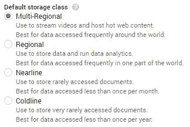
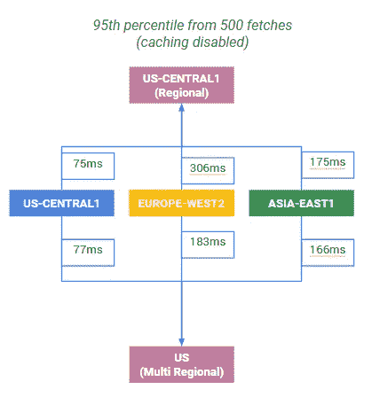

# Google 云存储:最佳性能的桶类是什么？

> 原文：<https://medium.com/google-cloud/google-cloud-storage-what-bucket-class-for-the-best-performance-5c847ac8f9f2?source=collection_archive---------0----------------------->

关于 Google 云存储，我们最常见的一个性能问题是“为了获得最佳性能，我应该使用什么类型的存储桶？”

为了帮助理解这一点，让我们来描述这些桶，并运行一些测试来找出最佳情况。

# 实用术语中的 GCS 桶

GCS 要求您创建“存储桶”来放置您的资产，其中第一个问题是您想要什么类型的服务存储桶:

区域、多区域、近线或冷藏。

Nearline 和 Coldline 不是为高性能系统设计的，所以我们现在忽略它们，看看区域和多区域存储桶的性能。

首先，让我们澄清一些术语:

*   **区域**与 GCS 数据中心的位置相关。
*   一个**多区域**与一组**区域**相关(这是一个层次问题)

# 地区的

有一个常见的场景，您希望让某个客户端或本地系统将数据上传到云环境来完成计算工作，然后将信息返回给客户端。或者，用 sysadmin 术语来说:“*您希望您的虚拟机靠近您的数据源以最大化吞吐量*”

正是因为这个原因，区域 GCS 存储桶保证该存储桶中的所有数据都位于指定的区域。

现在，公平地说，您无法细粒度地控制您的数据在区域中的哪个子区域；随着时间的推移，它可以迁移和移动。因此，写入延迟被复制到 2 个位置，其中每个位置都有不同的元数据列表，为了容错，会对其进行复制。这可能导致在写入时对所有其他元数据位置进行远程往返同步写入(由于强烈的写后读一致性)。

这意味着区域存储桶非常适合数据处理，因为它们的物理距离相当近，并且写一致性的开销很低。

# 多区域

*另一方面，*多区域存储保证了地理位置不同(相距 100 英里)的两个副本，这可以获得更好的远程延迟和可用性。

更重要的是，multiregional 大量利用边缘缓存和 cdn 向最终用户提供内容。

所有这些冗余和缓存意味着多区域带来了同步和确保不同地理区域之间一致性的开销。因此，它更适合一次写入多次读取的情况。这意味着在全球范围内频繁访问(例如“热门”对象)，如网站内容、流媒体视频、游戏或移动应用程序。

# 性能特征

为了提供真实的数字，我们设置了一个测试:将一个 2MB 的文件上传到一组区域和多区域存储桶，然后从 us-west1 中的一个虚拟机获取该资产(禁用缓存)。

该数据似乎表明多区域存储桶在跨洋读取方面表现明显更好，但是细节要比这稍微微妙一些。

回头看看日志，多区域存储桶在这些场景中表现更好的原因是，数据被复制到(多区域的)区域，这为我们的获取客户端提供了更好的访问点(和更低的延迟)。(为了证实这一点，我直接在 us-west1 和 europe-west1 之间运行了相同的精确测试，得到了大约 175ms。)

# 一场精彩的表演

这些测试向我们展示的是，桶*本身*的分类没有具体的性能差异。相反，性能是由客户端和云存储空间之间的物理距离的延迟决定的。

因此，我们在这里得到一个方便的小规则:

*   **如果缓存在**上，并且你的访问量足够高，可以利用缓存，那么这两个产品之间没有太大的区别(我可以从测试中看到)。这展示了谷歌令人敬畏的 CDN 环境的威力。
*   **如果缓存关闭**，或者访问量低到无法利用缓存，那么性能开销直接由物理因素决定。您应该尝试让资产尽可能靠近客户端，同时还要考虑成本以及数据需求所需的冗余和一致性类型。