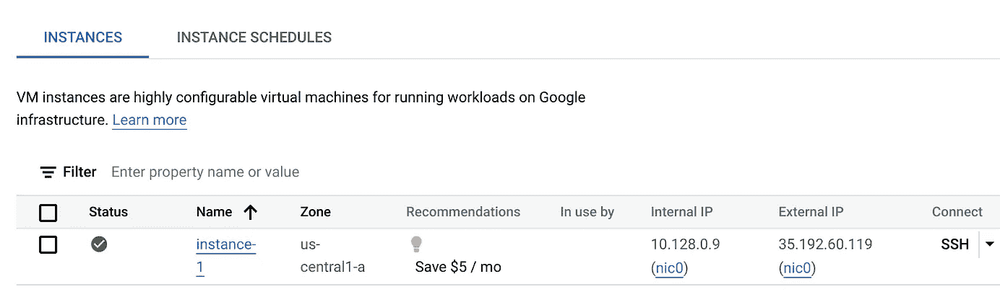
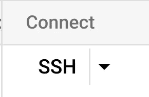
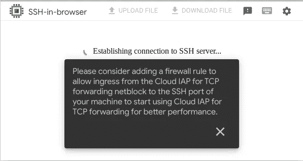
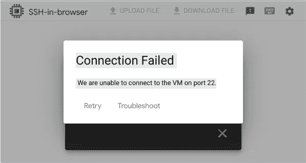
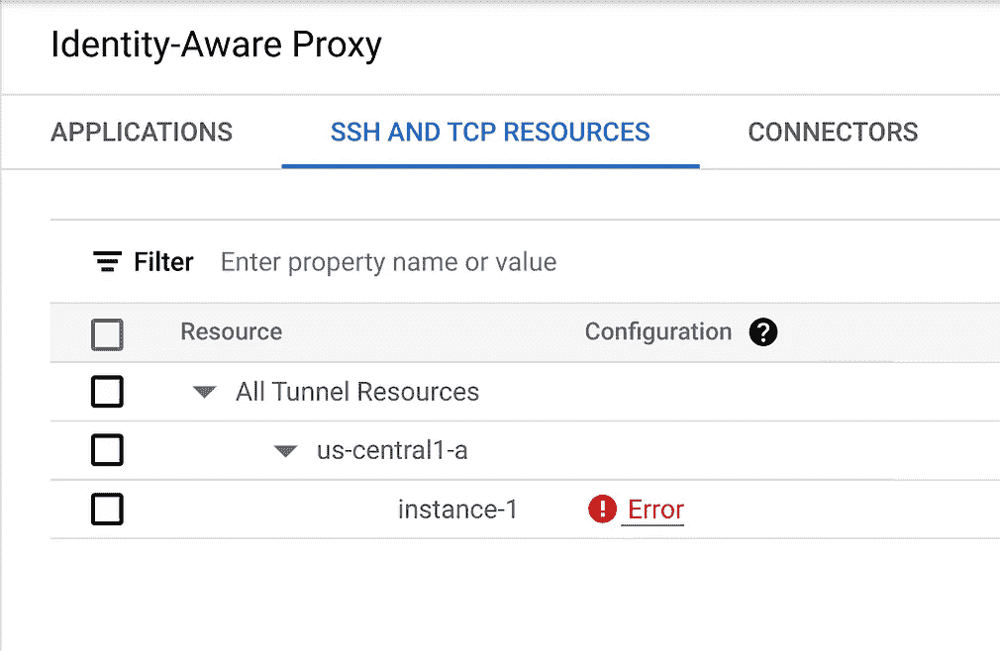
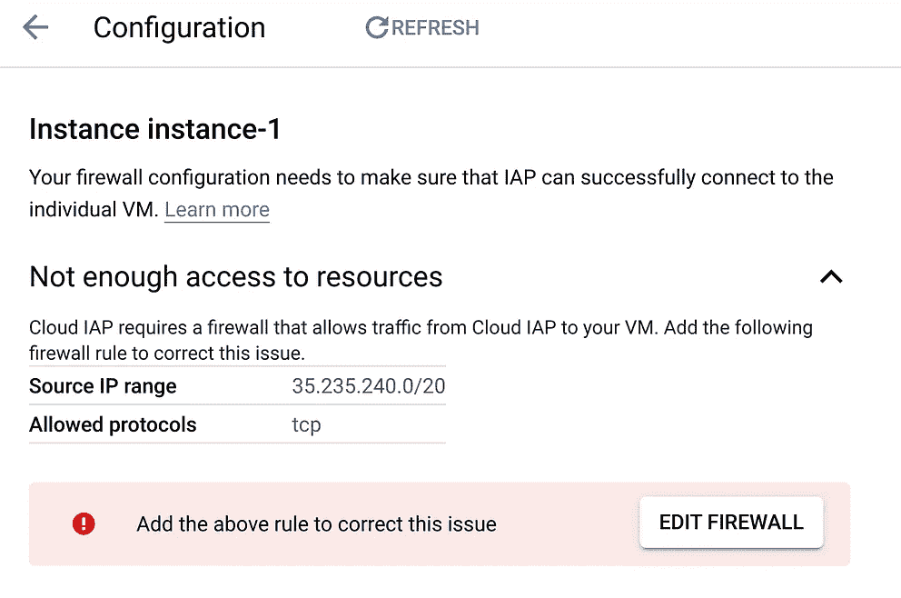
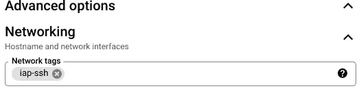
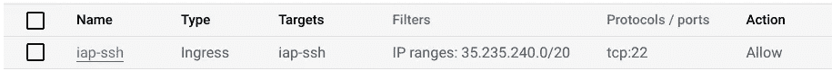
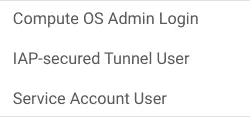
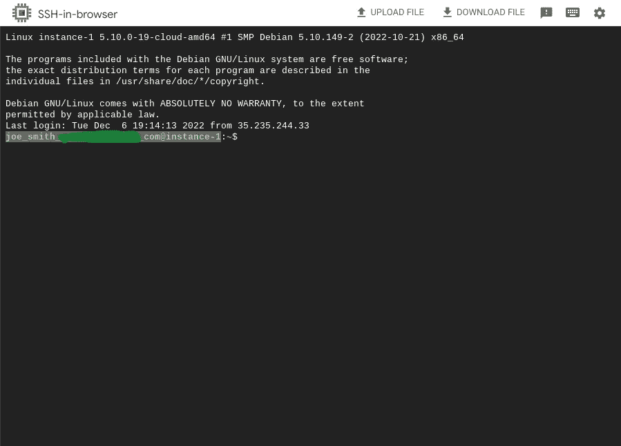

# Google Cloud Tech Nibble:用 IAP 保护 SSH 按钮

> 原文：<https://medium.com/google-cloud/google-cloud-tech-nibble-securing-the-ssh-button-with-iap-c9a4ffb2a5f0?source=collection_archive---------1----------------------->

这些科技产品是用于学习和教育的。我希望我们都知道得更清楚…但是请不要在生产环境中玩:)

这个“技术啃咬”**很快**通过[身份感知代理](https://cloud.google.com/iap)完成了保护 ssh 按钮的基本步骤，而不是在防火墙上打开 SSH。

如果您已经在 GCE ( [Google Compute Engine](https://cloud.google.com/compute) )上创建了一个虚拟机，毫无疑问，您已经看到了连接到该虚拟机的 SSH 按钮。

如果您点击此按钮，并且在您的防火墙中打开 SSH (TCP:22)到 VPC，您可能能够连接，但是，如果您没有打开 TCP:22，您将看到下面的。

除了在防火墙上打开 TCP:22，一个更安全、更易于管理的选择是使用[身份感知代理 IAP TCP 转发](https://cloud.google.com/iap/docs/tcp-forwarding-overview)来保护对虚拟机的 SSH 访问。虽然这篇文章专门讨论 SSH，但是这个过程也适用于 RDP。要通过 IAP 保护对资源的 SSH 访问，请执行以下操作:

1.  打开 [IAP 配置页面](https://console.cloud.google.com/security/iap)
2.  点击 [SSH 和 TCP 资源](https://console.cloud.google.com/security/iap?tab=ssh-tcp-resources)选项卡
3.  如果您删除了对实例的 SSH 访问，您应该会看到错误警告。单击它，您将看到一条消息，提示您需要打开从 35.235.240.0/20 到您的资源的所有 TCP。

*   设置防火墙规则的最佳实践是使用标记。您可以在[现有机器](https://cloud.google.com/vpc/docs/add-remove-network-tags#adding_new_tags_to_vm_instances)上添加网络标签，或者在高级选项→网络下创建机器时添加[标签。](https://cloud.google.com/vpc/docs/add-remove-network-tags#add_tags_to_new_vm)

4.除非您已经在实例上设置了网络标记，否则请返回到 compute engine 中的实例，并对其进行编辑以添加适当的网络标记。

5.添加一个防火墙规则，以允许 VPC 防火墙中的 TCP:22 到达您的网络标记 35.235.240.0/20。应该是:

*   方向:入口
*   来源:35.235.240.0/20
*   优先级高于任何阻止规则(回想一下，数字越小，优先级越高)
*   目的地:您希望对其启用 SSH 的机器的网络标签
*   协议:TCP 端口 22(注意，这里我只开放 22，为了更加严格，对于其他服务，如 RDP，您将需要开放各自的端口，如 RDP 的 TCP:3389)。为 IAP 开放 35.235.240.0/20 的所有 TCP 几乎没有风险，但是，许多安全管理员和策略喜欢尽可能地严格限制)
*   操作:允许

6.在 [IAm 和 Admin → IAM](https://console.cloud.google.com/iam-admin/iam) 下，向您要授予访问权限的用户或组添加以下角色。这是最低要求。

现在，当您单击实例上的 SSH 按钮时，如果您的用户得到授权，您将能够从 web 进行 SSH。

其他资源:

 [## 为计算引擎启用 IAP 身份感知代理| Google 云

### 本页说明如何使用身份识别代理(IAP)保护计算引擎实例。要为计算启用 IAP

cloud.google.com](https://cloud.google.com/iap/docs/enabling-compute-howto)