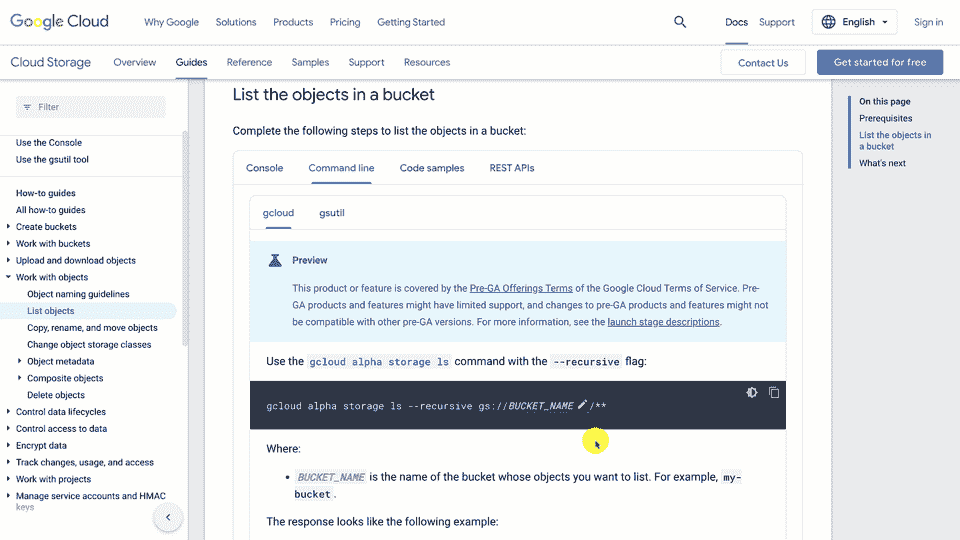
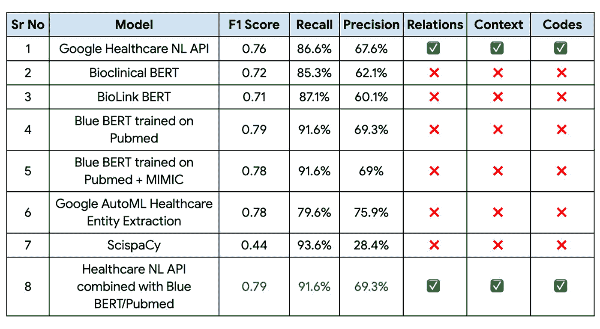
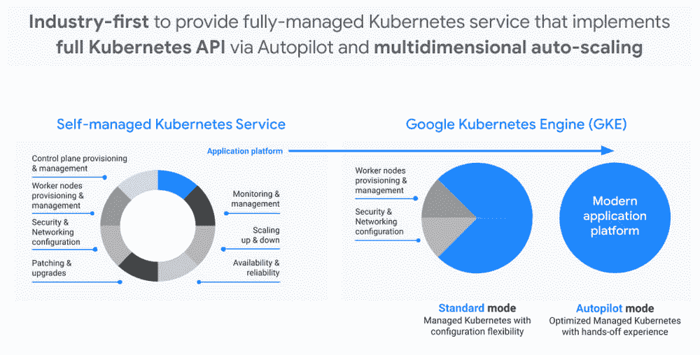
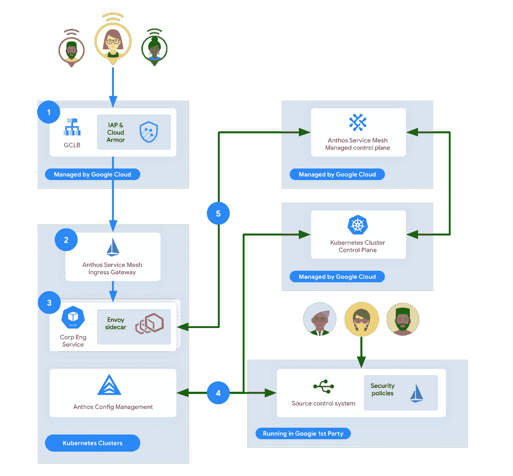
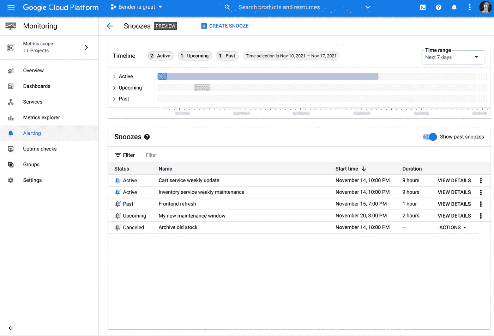
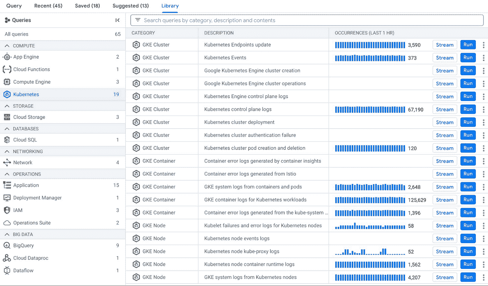
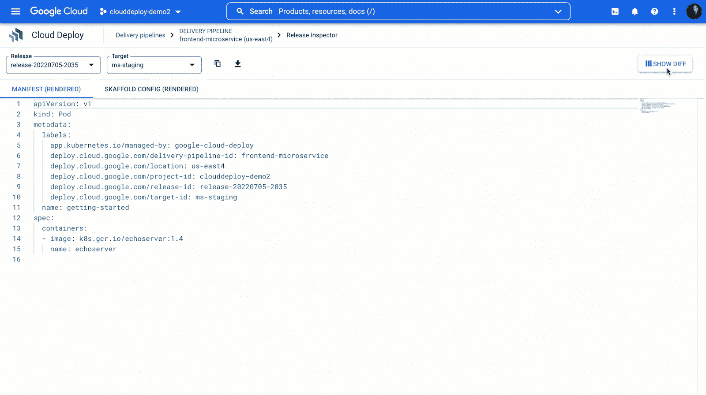
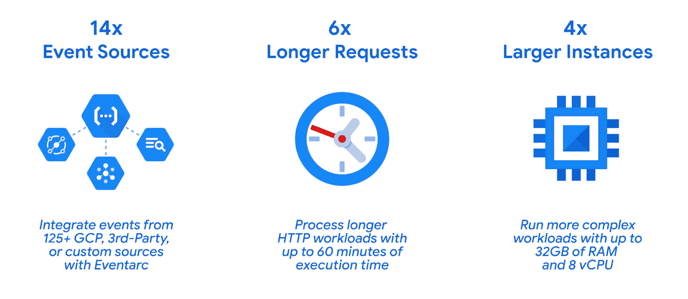
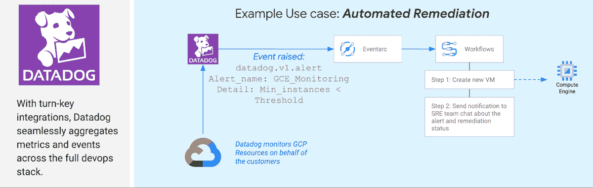
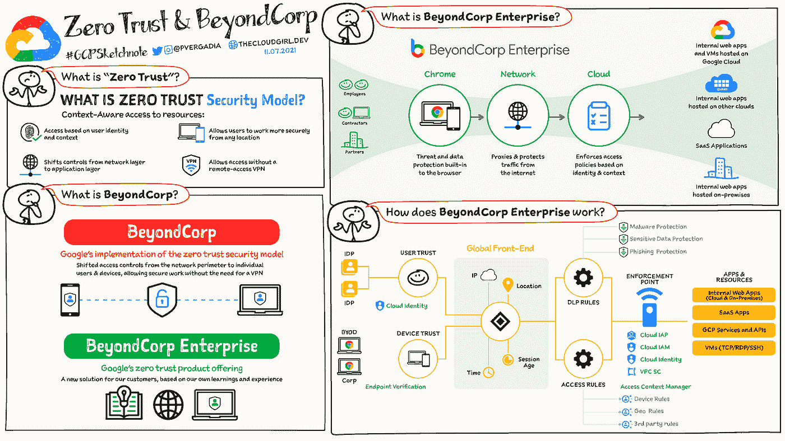

# 谷歌云技术金块—2022 年 8 月 1 日至 15 日版

> 原文：<https://medium.com/google-cloud/google-cloud-technology-nuggets-august-1-15-2022-edition-20787275d6d4?source=collection_archive---------1----------------------->

欢迎参加 2022 年 8 月 1 日至 15 日的谷歌云技术金块。

# **cloud.google.com/sdk 的合并参考文件**

如果你一直在挠头寻找客户端库和工具的统一页面，这些现在已经被放在一个单独的页面下:【cloud.google.com/sdk】T2。您将在这个 URL 下找到所有的工具和特定的编程语言库。除此之外，还有其他几个特性可以帮助您轻松地浏览这些信息:过滤器、搜索、每个版本的自动文档生成、直接代码编辑等等。查看[的博客文章](https://cloud.google.com/blog/topics/developers-practitioners/productivity-unlocked-new-cloud-sdk-reference-docs)了解更多细节，并收藏此页面。

# **基础设施**

这一举动表明了对亚太地区不断增长的云市场的持续投资，计划增加 3 个谷歌云区域:马来西亚、泰国和新西兰。查看[博客文章](https://cloud.google.com/blog/products/infrastructure/announcing-new-google-cloud-regions-in-asia-pacific)了解更多详情。查看[全球基础设施页面](https://cloud.google.com/infrastructure)了解各个地区和服务的信息。

# **客户**

临床决策支持系统(CDSS)构建起来很复杂。它需要能够定位和提取临床记录、医学杂志、出院总结等中存在的医疗实体。在一个有趣的客户案例研究中，谷歌云与印度最大的多渠道数字医疗平台之一 Apollo 24|7 合作，构建其 CDSS 解决方案的关键模块。

正如博客文章所述，该解决方案旨在“解析出院总结和处方，以提取医疗实体。然后，这些实体可以用来构建一个推荐引擎，帮助医生对药物、实验室测试等提出“下一个最佳行动”建议。

查看[案例研究](https://cloud.google.com/blog/products/ai-machine-learning/apollo-24-7s-cdss-solution-built-with-google-cloud)，其中重点介绍了使用的数据集、评估的模型、性能指标等。

# **集装箱和 GKE**

如果您已经踏上了采用 Kubernetes 作为应用程序平台的征途，那么这个平台的关键特征是什么？根据[博客文章](https://cloud.google.com/blog/products/containers-kubernetes/run-apps-on-kubernetes-with-automation-and-scale)，自动化和规模是 Kubernetes 平台的两个关键特征，随着 Google Kubernetes 引擎的创新，这两个特征都触手可及。

就自动化而言，完全管理的自动驾驶操作模式可在几分钟内为您提供安全的生产就绪型集群。还有一些关键的其他功能，如第 2 天运营、成本优化策略、服务网格等，可以简化环境管理。

在规模方面，GKE 可以支持 15，000 个节点集群。

# **安全**

谷歌云存储是一项与多个谷歌云服务集成的关键服务，通常是将数据纳入谷歌云的第一步。在一项关键的开发中，为了符合数据安全和隐私要求，现在可以通过配置一个可以扫描您的数据的作业，然后执行许多操作中的一个:编辑、替换、屏蔽等，来取消识别 Google 云存储中的数据。查看[的博客文章](https://cloud.google.com/blog/products/identity-security/announcing-easier-de-identification-of-google-cloud-storage-data)了解更多细节。

您是否知道在安全审计期间可以使用的云日志记录的 5 个关键安全和合规性功能？检查[这个](https://cloud.google.com/blog/products/identity-security/5-must-know-security-and-compliance-features-in-cloud-logging)出来。

继续讨论安全性，考虑集中和管理对跨团队、部门、环境等运行的不同业务线应用程序的访问。这正是谷歌的公司工程，管理解决方案所需的内部应用程序。他们用的是 Anthos 服务网。

查看这篇关于 ASM 特性及其如何满足需求的有趣研究[。](https://cloud.google.com/blog/topics/developers-practitioners/securing-apps-googlers-using-anthos-service-mesh)

# **数据库、分析和机器学习**

围绕 BigQuery 有几篇帖子值得一读:

*   BigQuery 是一个优秀的工具，这里有一篇文章[是一个作者对他们发现的一些有趣的特性的描述。也许你会学到一些你不知道的东西？](https://cloud.google.com/blog/topics/developers-practitioners/hidden-gems-google-bigquery)
*   大查询成本很容易失控。这篇[文章](https://cloud.google.com/blog/topics/developers-practitioners/hidden-gems-google-bigquery)非常详细地强调了你可以用来控制成本的关键领域。它还在课程结束时提供培训课程，以便在该领域学习更多知识。

Data Studio 现在作为谷歌云服务提供，这意味着它将在与谷歌云服务相同的条款下提供。这确保了谷歌支持 Data Studio 和其他谷歌云产品一样的隐私和安全承诺。查看[帖子](https://cloud.google.com/blog/products/data-analytics/data-studio-now-available-as-a-google-cloud-service)了解更多详情以及[启用此](https://support.google.com/datastudio/answer/10331670)的具体步骤。

需要哪些知识和技能来帮助组织在机器学习计划中取得成功。ML 工程师是做什么的，他们应该具备哪些技能？目前有哪些帮助培训他们的课程？这个[帖子](https://cloud.google.com/blog/products/ai-machine-learning/ml-engineers-partners-for-scaling-ai-in-enterprises)有答案。

您是否希望将顶点人工智能训练用于您在共享文件系统上展示的大型数据集？您现在可以使用 NFS 共享，如 Filestore。查看这篇[文章](https://cloud.google.com/blog/topics/developers-practitioners/access-larger-dataset-faster-and-easier-accelerate-your-ml-models-training-vertex-ai)，它给出了使用 Filestore 的一步一步的细节，并用您的定制训练代码训练一个模型。

# **操作**

有时候，您可能希望云监控中的警报策略不触发，或者换句话说，不进入休眠模式。如果开发团队不希望在非工作时间收到传呼，避免在计划维护期间甚至在停机期间触发警报，这可能会很有用。云监控中可用的暂停功能使这成为可能。查看[帖子](https://cloud.google.com/blog/products/devops-sre/snooze-your-alert-policies-cloud-monitoring)了解更多详情。

云日志有一种强大的查询语言，可以让您过滤特定于资源、环境等的日志。真正酷的是拥有跨不同种类服务的查询日志模板。例如，允许您搜索 Kubernetes 节点容器运行时日志的内置查询怎么样？Query Library 正是为了做到这一点，它为您提供了多个预构建的查询，您可以预览/定制/保存这些查询，以加快跨资源搜索特定日志的速度。详情请看这篇[帖子](https://cloud.google.com/blog/products/devops-sre/increase-developer-productivity-with-query-library)。

Cloud Deploy 在最近的版本中有了重大更新:

*   Skaffold 配置文件的自动生成。在周期的早期完成这项工作可以帮助开发人员和操作人员熟悉 Google Cloud Deploy。
*   输送管道悬挂和废弃特征。
*   Release Inspector 工具，可以轻松地检查应用程序清单，并与交付管道中的版本和目标进行比较。
*   VPC-SC 支持云部署
*   支持更多云部署区域

查看[的博文](https://cloud.google.com/blog/products/devops-sre/google-cloud-deploy-gets-continuous-delivery-productivity-enhancements)了解更多细节。

# **开发者和从业者**

“功能即服务”不需要任何介绍，Google Cloud Functions 已经可以帮助实现可编程云一段时间了。随着开发人员使用这项服务，出现了 4 个需要解决的关键领域:冷启动、延迟、连接不同的源和管理成本。作为对这些要求的回应，第二代云功能现已正式发布。它提供了强大而高效的计算选项、更快回滚的粒度控制以及来自超过 125 个 Google 和第三方 SaaS 事件源的新触发器(使用 Eventarc)。

查看[博客文章](https://cloud.google.com/blog/products/serverless/cloud-functions-2nd-generation-now-generally-available)了解更多细节，查看[文档](https://cloud.google.com/functions/docs/2nd-gen/overview)开始。

开发人员喜欢尽可能快地构建功能并发布它们。在确保安全规则到位的同时，您如何管理这种速度？安全护栏或预防性安全控制是这篇[博文](https://cloud.google.com/blog/topics/inside-google-cloud/building-security-guardrails-for-developers-with-google-cloud)中提出的内容。除了 Google Cloud 中提供的本机功能(包括组织策略、VPC-SC 和 Cloud IAM)之外，代码形式的基础设施在这里也起着关键作用。请务必查看[安全基础蓝图](https://cloud.google.com/architecture/security-foundations)。

EventArc 正迅速成为整合各种谷歌云服务事件的粘合剂，然后在此基础上编排应用程序流。现在 EventArc 不仅支持原生 Google 云服务，还支持第三方事件源。第一组集成允许谷歌云利用来自 Datadog、ForgeRock、CloudGuard 和 Lacework 等技术合作伙伴的解决方案。例如，您可以使用 Datadog 来监控计算引擎实例的数量，如果它们低于某个阈值，就会引发一个事件，并通过 EventArc 将其发送到 Google Cloud 中的一个目的地。目的地然后可以驱动由云功能等支持的下游功能来执行特定动作，即启动更多实例等。

查看[的博客文章](https://cloud.google.com/blog/products/application-development/eventarc-3rd-party-sources-preview)了解更多细节。

# **让我们来了解一下谷歌云**

了解一下[零信任模式和 BeyondCorp](https://cloud.google.com/blog/topics/developers-practitioners/zero-trust-and-beyondcorp-google-cloud) ，这是 Google 对零信任模式的实现。

# 保持联系

对这份时事通讯有任何问题、意见或其他反馈吗？请发送[反馈](https://forms.gle/UAsAS7YLxYSBTNBy9)。

想要关注新的谷歌云产品发布吗？我们有一个方便的页面，您可以将它加入书签→[Google Cloud 的新功能](https://bit.ly/3umz3cA?utm_source=ext&utm_medium=partner&utm_campaign=CDR_rom_gcp_gcptechnuggets_feb-a-2022_021622&utm_content=-)。