# 谷歌云技术金块—2022 年 8 月 16 日至 31 日版

> 原文：<https://medium.com/google-cloud/google-cloud-technology-nuggets-august-16-31-2022-edition-38145baac3ba?source=collection_archive---------1----------------------->

欢迎参加 2022 年 8 月 16 日至 31 日的谷歌云技术金块。

# **基础设施**

Apigee，除了可用的订阅和评估计划之外，Google Cloud 的 API 管理平台还引入了“按需付费”的定价模式。这种定价模式适用于 API 网关节点、API 分析和网络成本。查看[的博客文章](https://cloud.google.com/blog/products/api-management/introducing-pay-as-you-go-pricing-for-apigee-api-management)了解更多信息。

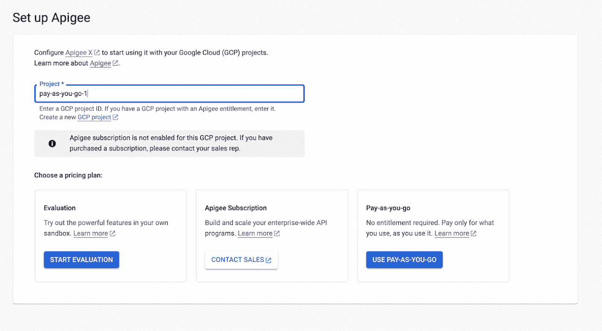

24/7 支持的 SUSE Linux Enterprise Server(“SLES”)的承诺使用折扣(“cud”)现已正式提供。请记住，SLES cud 是特定于地区的。查看[的博客文章](https://cloud.google.com/blog/products/compute/suse-linux-enterprise-server-committed-use-discount-sles-cud-on-google-cloud)了解更多细节。下表显示了截至博客发布日期的大致有效小时价格，使用虚拟机每月运行 730 小时，每年运行 12 个月来计算。

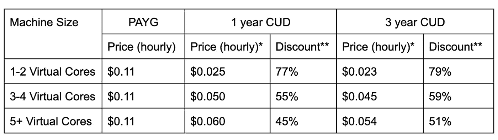

# **集装箱和库伯内特**

谷歌 Kubernetes 引擎(GKE)庆祝成立 7 周年。这篇博客文章提供了 7 种帮助客户做事的方法，包括:增强软件供应链的安全性(如下图所示),提高开发人员的工作效率，摆脱专有工具等等。查看[帖子](https://cloud.google.com/blog/products/containers-kubernetes/benefits-of-using-kubernetes)。

希望使用 ArgoCD 管理跨区域的 GKE 集群舰队。查看这篇[博客文章](https://cloud.google.com/blog/products/containers-kubernetes/building-a-fleet-with-argocd-and-gke)，它展示了如何在多种场景中做到这一点。博文中使用的所有演示代码都可以在 [Github](https://github.com/GoogleCloudPlatform/gke-poc-toolkit-demos/tree/main/gke-fleets-with-argocd) 上获得。

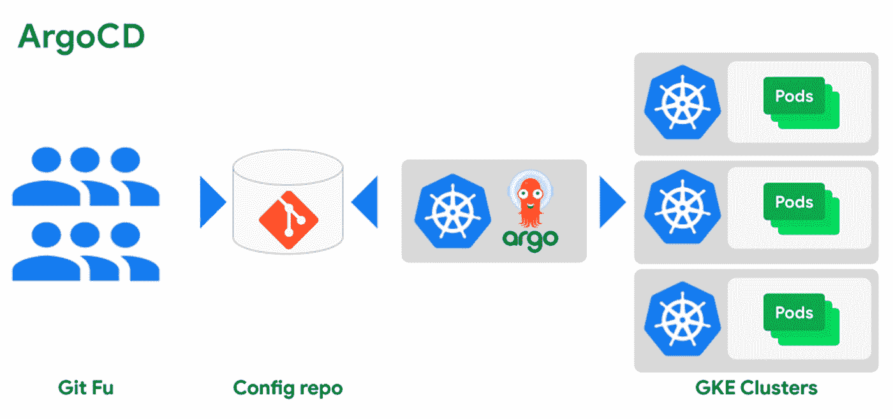

# **存储和数据分析**

谷歌云从业者在谷歌云存储中有各种存储类来管理成本。可以基于各种生命周期事件(如对象的年龄、版本历史等)将存储对象移动到各种类别中。您现在可以在对象的[名称上使用条件，特别是名称](https://cloud.google.com/storage/docs/lifecycle#conditions)的前缀和后缀。例如，您可以根据前缀对对象进行分组，甚至根据后缀对对象类型进行分组，即扩展类型(. mp4，.zip 等)。查看[的博文](https://cloud.google.com/blog/products/storage-data-transfer/understanding-cloud-storages-new-prefix-and-suffix-lifecycle-rules)了解更多细节。

Dataflow Prime 是新一代无服务器、无操作、自动调整平台，可满足您在 Google Cloud 上的数据处理需求。其中使用的突破性资源优化技术之一，[垂直自动缩放](https://cloud.google.com/dataflow/docs/guides/deploying-a-pipeline#vertical-autoscaling)很有趣。它会自动扩展工作内存，以消除手动调整工作配置的需要，并为您的工作找到合适的工作配置。查看这篇[博客文章](https://cloud.google.com/blog/products/data-analytics/introducing-vertical-autoscaling-in-dataflow-prime)，它提供了这项技术的细节。

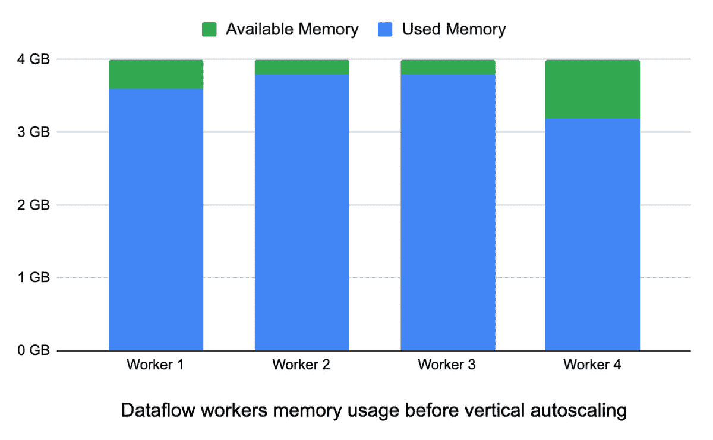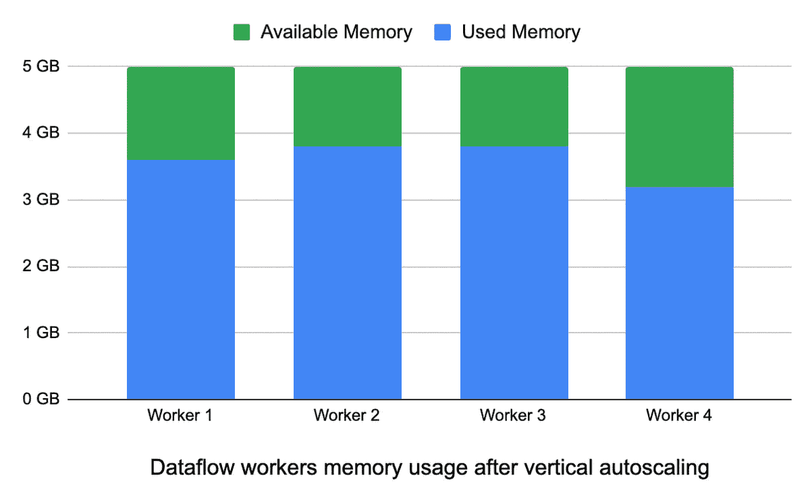

基于实例的解释，Vertex AI 中的一个新特性刚刚在 preview 中发布。它提供了可操作的解释，以减轻数据挑战，如贴错标签的示例。这肯定会加快调试模型和及时解决问题的时间。查看[博客文章](https://cloud.google.com/blog/products/ai-machine-learning/example-based-explanations-to-build-better-aiml-models)了解更多详情。

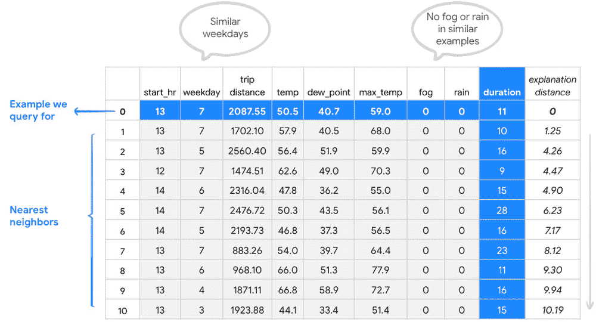

# **身份和安全**

迄今为止报道的最大的第 7 层 DDoS 是针对谷歌云的一个客户。攻击峰值为每秒 4600 万次请求。在博客“Cloud Armor Adaptive Protection 能够在攻击生命周期的早期检测和分析流量。Cloud Armor 通过推荐的保护规则向客户发出警报，然后在攻击升级到最大规模之前部署。Cloud Armor 阻止了攻击，确保客户的服务保持在线，并继续为他们的最终用户服务。”查看如何缓解攻击的[细节](https://cloud.google.com/blog/products/identity-security/how-google-cloud-blocked-largest-layer-7-ddos-attack-at-46-million-rps)。

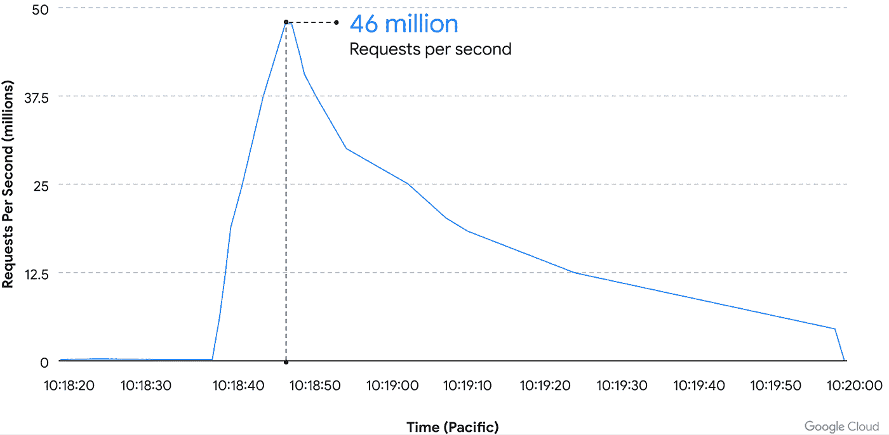

安全指挥中心为所有客户增加了虚拟机威胁检测(VMTD)服务。VMTD 的一个主要优势是它是从虚拟机管理程序部署的，而不是在实例内部。这是一种对对手不可见的方法，避免了额外的计算开销，客户只需选择一个复选框。查看[的博文](https://cloud.google.com/blog/products/identity-security/introducing-virtual-machine-threat-detection-to-block-critical-threats)了解更多细节。

Google Cloud Certificate Manager 是一项服务，允许用户大规模获取、管理和部署公共传输层安全(TLS)证书，以用于您的 Google Cloud 工作负载。查看[的博客文章](https://cloud.google.com/blog/products/identity-security/introducing-general-availability-of-google-cloud-certificate-manager)了解更多细节。

CISO 对 2022 年 8 月的展望是[出](https://cloud.google.com/blog/products/identity-security/cloud-ciso-perspectives-august-2022)。除了围绕安全新闻、行业更新、合规性和控制更新的定期更新之外，该版本还关注漏洞奖励，即漏洞奖励计划。

随着向云的迁移，人们注意到了一种反模式，即安全领导者依赖于他们用来保护其内部资源并将其用于云的工具、流程和技术。云提供了完全不同的威胁载体，它有助于重新审视如何使用云原生方法来解决安全问题。为了在这一旅程中为您提供帮助，[博客文章](https://cloud.google.com/blog/products/identity-security/why-cisos-need-to-adapt-their-mental-models-of-security-for-cloud)着眼于您在考虑保护您的云资源时应该涵盖的多个领域，包括网络安全、终端安全、共享资源模型等。

# **开发者和从业者**

由于成本、弹性、安全性、可靠性等明显优势，组织已经采用了云。对于任何参与这一旅程的人来说，它只会变得复杂，随着服务数量的增加以及优化它的具体方法，这项任务具有挑战性。但是，云提供商能否通过了解部署的当前状态并推荐优化的配置/建议来升级/降级或加强安全设置等来提供帮助呢？Active Assist 是谷歌云的一项这样的技术，是智能云计划的一部分，它将这些数据与机器学习技术相结合，为客户提供建议。这些被称为推荐器的推荐器可用于多个领域，如:虚拟机机器类型推荐器、空闲虚拟机推荐器、成本优化推荐器、IAM 设置推荐器等，这些推荐器将在适当的时候推出。今天就通过这篇[博文](https://cloud.google.com/blog/topics/developers-practitioners/make-most-your-cloud-deployment-active-assist)了解主动协助。

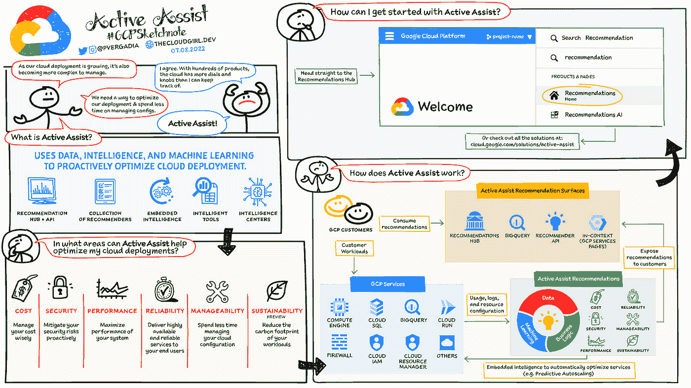

在我们之前的新闻简报中，我们提到了第三方应用与 EventArc 的首次集成。其中之一是 Datadog，这是一个流行的云应用程序监控工具。如果您正在使用 Datadog 来监控您的 Google 云资源，那么连接您在 Datadog 中为一个 Google 云资源设置的警报并触发一个动作(比如调用 Google 云功能或任何其他计算服务)来执行一些代码会很有趣。这篇[博客文章](https://cloud.google.com/blog/topics/developers-practitioners/route-datadog-monitoring-alerts-google-cloud-eventarc)正是这么做的，并为您提供了一个逐步配置 Datadog 的过程，以通过一个事件将警报路由到 Eventarc，然后可以使用 event arc 来触发 Google Cloud 中的计算操作。

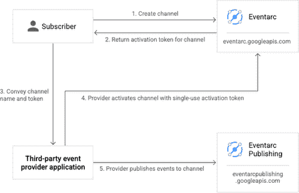

“Google Cloud 上的数据库”系列的第五部分[即将发布](https://cloud.google.com/blog/topics/developers-practitioners/lightweight-application-development-serverless-cloud-functions-java-and-cloud-sql-sql-server-2-minutes)。本部分演示了如何使用 Cloud SQL Connector for Java 构建一个基于 Java 的云函数，该云函数将连接到 Cloud SQL for SQL Server 数据库。下一节将详细介绍云 SQL 连接器。

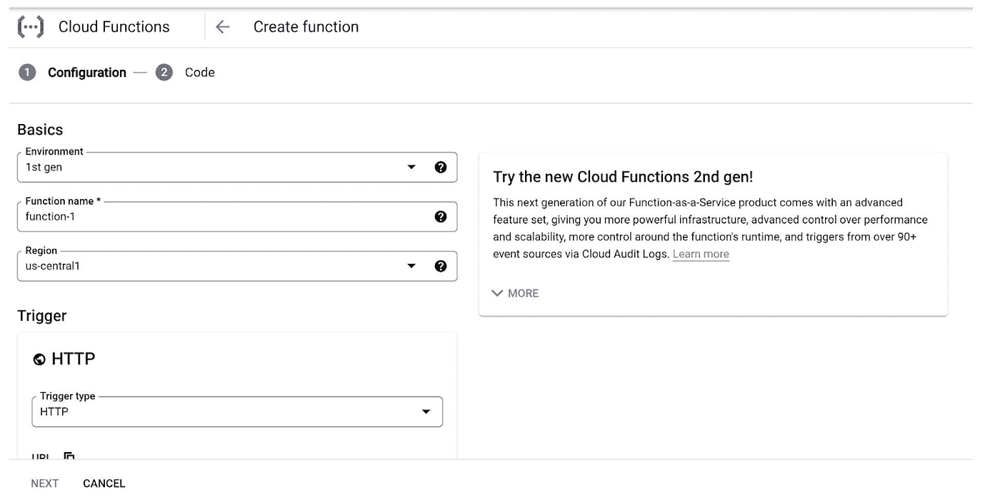

如果您是一名希望使用 Python 连接到云 SQL 的开发人员，这可不是一件容易的事情。这一问题现在通过[云 SQL Python 连接器](https://pypi.org/project/cloud-sql-python-connector/)得到了解决，这是一个 Python 包，它允许您从任何地方(本地机器、云运行、应用引擎、云函数等)安全地连接到云 SQL，这两种连接都适用于所有三个受支持的数据库引擎(Postgres、MySQL 和 SQL Server)**easy**和 **secure** 。).连接器库也可用于 [Java](https://github.com/GoogleCloudPlatform/cloud-sql-jdbc-socket-factory) 和 [Go](https://github.com/GoogleCloudPlatform/cloud-sql-go-connector) 版本。查看[帖子](https://cloud.google.com/blog/topics/developers-practitioners/how-connect-cloud-sql-using-python-easy-way)了解更多详情。

# 让我们来了解一下 GCP

我们正在进入 2022 年的下半年，如果你仍然希望获得谷歌云认证，但不确定应该选择哪种认证，这张[信息图](https://cloud.google.com/blog/topics/training-certifications/which-google-cloud-certification-exam-should-you-take)将为你提供一个基于你当前技能/兴趣领域的选择。

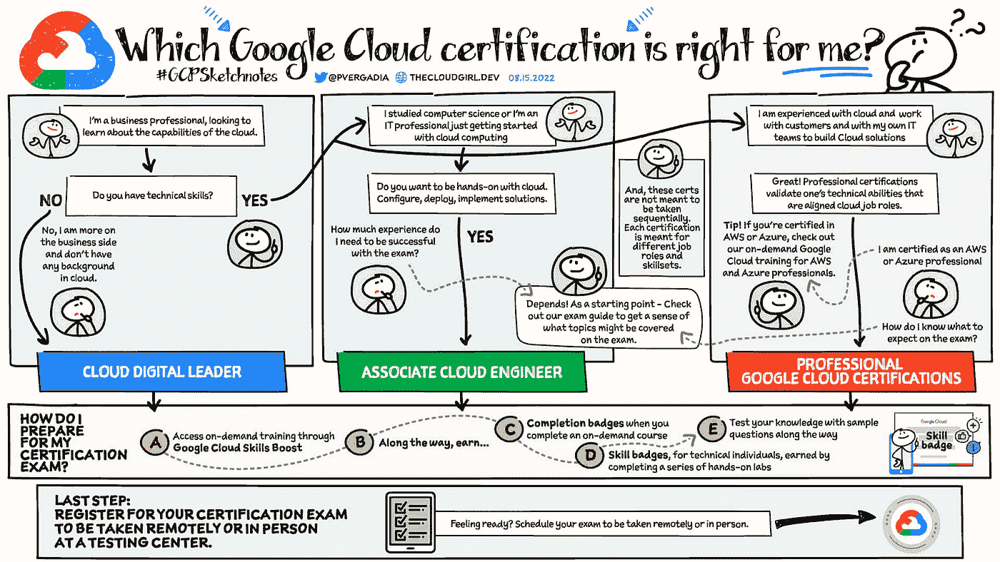

希望更新 Kubernetes 中的各种网络概念？查看这篇[博客文章](https://cloud.google.com/blog/topics/developers-practitioners/understanding-basic-networking-gke-networking-basics)，了解更多关于 Kubernetes 环境中的 IP 寻址、DNS、负载平衡器、入口、服务路由等更多细节。

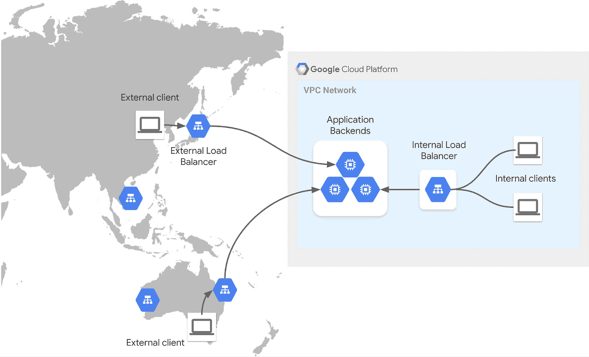

数据分析是最受学生追捧的领域之一。但是你到底从哪里开始呢？Google Cloud 中有哪些可用的工具，作为一名学生，你如何获得培养数据技能的途径。看看这篇[博客文章](https://cloud.google.com/blog/topics/developers-practitioners/leveling-your-data-analysis-skills-student)，它一步一步地展示了这一切。

# 保持联系

对这份时事通讯有任何问题、意见或其他反馈吗？请发送[反馈](https://forms.gle/UAsAS7YLxYSBTNBy9)。

想要关注新的谷歌云产品发布吗？我们有一个方便的页面，你可以把它加入书签→ [谷歌云的新功能](https://bit.ly/3umz3cA?utm_source=ext&utm_medium=partner&utm_campaign=CDR_rom_gcp_gcptechnuggets_feb-a-2022_021622&utm_content=-)。