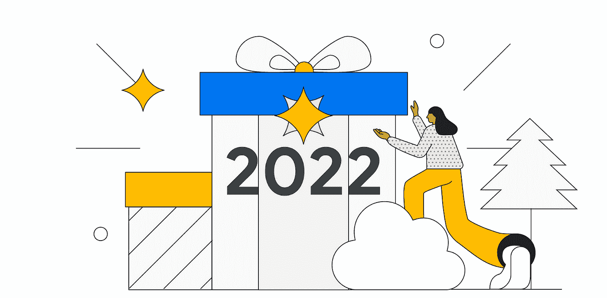
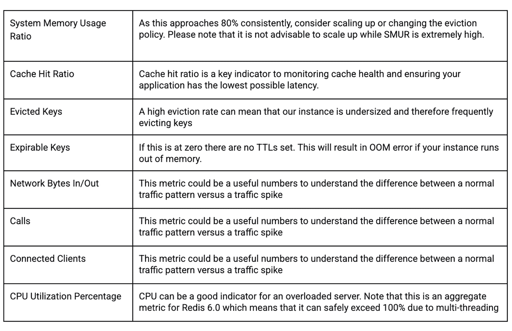

# 谷歌云技术金块—2022 年 12 月 16 日至 31 日版

> 原文：<https://medium.com/google-cloud/google-cloud-technology-nuggets-dec-16-31-2022-edition-edd9b36ecf38?source=collection_archive---------1----------------------->

欢迎参加 2022 年 12 月 16 日至 31 日的谷歌云技术金块。

# **热门故事博客**

临近年底，当你为自己在新的一年里的工作做准备时，总结今年热门故事甚至预测的博客帖子可能是有趣的读物。以下是这一类别中的一些博客文章，排名不分先后:

*   整篇时事通讯都来自官方的谷歌云博客，所以根据读者的意见，重点介绍 2022 年【2022 大新闻故事是有意义的。
*   查看 2022 年 T4 十大转型故事。这个列表中一些有趣的故事讲述了金州勇士队如何利用数据，人工智能对未来十年的预测，从谷歌的 Ares 120 孵化器中学到的经验教训等等。
*   在 2022 年的 Google Cloud NEXT 大会上，我们的 10 位专家分享了对 2025 年之前 IT 行业的预测。十二月初的一篇博文分享了这些见解。
*   低代码和无代码工具的采用将会持续下去。[看看这个预测](https://cloud.google.com/blog/products/application-development/empowering-business-users-to-write-their-own-apps)吧，到 2025 年，今天不认为自己是专业开发人员的专业人员将会开发一半的商业应用程序。

# **安全**

12 月的《CISO 透视》是一篇有趣的帖子，除了该月的标准安全新闻综述之外，它还提供了 2022 年学到的顶级安全教训。将它从中取出[。](https://cloud.google.com/blog/products/identity-security/cloud-ciso-perspectives-december-2022)

如果你喜欢播客，值得一提的是有一个[云安全播客](https://cloud.withgoogle.com/cloudsecurity/podcast?_ga=2.38905888.-2041947496.1672124323&_gl=1*11mzpvb*_ga*MjA0MTk0NzQ5Ni4xNjcyMTI0MzIz*_ga_WH2QY8WWF5*MTY3MjM4NTA5Ni41LjEuMTY3MjM4NjE2MS4wLjAuMA..)每月发布一集。

# **创业公司**

我们的创业技术指南关注的是创业公司如何经历他们组织的开始、建立和成长周期。查看这篇[博客文章](https://cloud.google.com/blog/topics/startups/google-cloud-technical-guides-for-startups-build-series-wrap-up)，它强调了在构建阶段对你有帮助的关键视频和教程。这些视频深入探讨了安全性、BigQuery、数据处理等等。

# **存储、数据库和数据分析**

您需要在 BigQuery 分析查询中获得更好的洞察力吗？面临可能的性能瓶颈？现在，您可以利用查询执行图来获得这些见解。

查看[的博客文章](https://cloud.google.com/blog/products/data-analytics/troubleshoot-and-optimize-your-bigquery-analytics-queries-with-query-execution-graph)了解更多细节。

Memorystore 是开源内存数据库 Redis 和 Memcached 的完全托管实现。查看这篇[博客文章](https://cloud.google.com/blog/products/databases/best-pactices-for-cloud-memorystore-for-redis)，它讨论了使用 Memorystore 的最佳实践。这些实践包括优化内存设置、配置维护窗口、高可用性设置、配置警报/指标等。

# **机器学习**

Document AI 在公开预览版中宣布了 3 项 OCR 功能:

*   现在，您可以访问文档的智能文档质量(IDQ)分数，该分数是通过跨不同维度的页面级质量指标来衡量的。这些包括模糊、黑暗等。
*   文档人工智能 OCR 中的数字 PDF 支持
*   OCR 版本控制，允许用户锁定特定的 OCR 模型以锁定其行为，并且不会看到由于模型升级而产生的任何副作用。

查看[博客文章](https://cloud.google.com/blog/products/ai-machine-learning/top-reasons-to-use-gcp-document-ai-ocr)了解更多详情。

谷歌的语音人工智能看到了大量的公告。这里有一篇博客文章，概括了 2022 年语音人工智能的一些[重要公告。](https://cloud.google.com/blog/products/ai-machine-learning/google-cloud-speech-ai-in-2022)

如果您正在查看具有大量数据的训练模型，一般推荐的最佳实践是进行分布式训练并从云存储中读取数据。挑战在于，如果有多个文件，那么它们就是数据吞吐量和网络开销的挑战。查看这篇[博客文章](https://cloud.google.com/blog/products/ai-machine-learning/efficient-pytorch-training-with-vertex-ai)，它展示了各种分布式训练范例来进行有效的训练。

# **作战**

当系统出现故障时，您的用户不关心您的基础架构问题吗？他们关注的是这样一个事实，他们期望的工作，并没有工作？那么，我们如何将焦点从我们已经习惯的典型监控指标转移到用户关心的指标上呢？这篇[的博客文章](https://cloud.google.com/blog/topics/developers-practitioners/why-focus-symptoms-not-causes)证明了这一点。

# **开发者和从业者**

云功能是谷歌云上一个受欢迎的 FaaS 选项。因为云功能代表通常在完全由云提供商管理的环境中的云中运行的抽象。这使得在本地开发您的功能，在本地模拟一个类似云的环境进行开发和测试变得非常困难。

这篇[博客文章](https://cloud.google.com/blog/topics/developers-practitioners/how-to-develop-and-test-your-cloud-functions-locally)向你提供了关于如何着手建立本地环境来开发和测试功能代码的精彩细节。

Cloud Build 是 Google Cloud 完全托管的 CI/CD 管道工具。您可以通过提供的和社区构建器使用云构建来自动完成各种任务。典型的用例是启动构建过程来创建容器映像，将映像推送到存储库，然后也可能触发部署过程。在本[云构建权威指南](https://cloud.google.com/blog/products/serverless/the-squires-guide-to-automated-deployments-with-cloud-build)中，查看一步一步面向目标的方法，该方法通过手动触发构建流程，然后通过使用特定触发器启动构建流程，带您详细了解云构建的机制，并达到自动化状态。在学习的过程中，您还将熟悉各种服务，如云构建、工件注册、云运行和云发布/订阅。

# 保持联系

对这份时事通讯有任何问题、意见或其他反馈吗？请发送[反馈](https://forms.gle/UAsAS7YLxYSBTNBy9)。

想要关注新的谷歌云产品发布吗？我们有一个方便的页面，你应该把它加入书签→ [谷歌云的新功能](https://bit.ly/3umz3cA?utm_source=ext&utm_medium=partner&utm_campaign=CDR_rom_gcp_gcptechnuggets_feb-a-2022_021622&utm_content=-)。